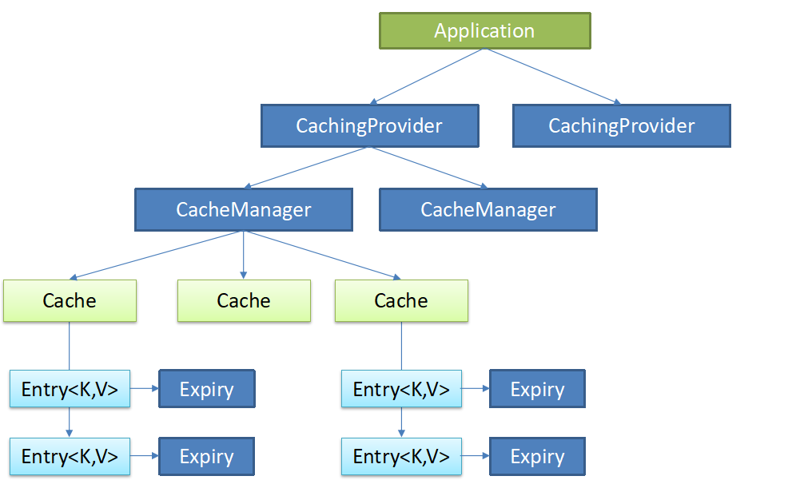

# 简介
SpringData 项目的目的是为了简化构建基于*Spring框架应用*的数据访问技术，包括非关系数据库、Map-Reduce 框架、云数据服务等等；另外也包含对关系数据库的访问支持。
## Spring Data包含的子项目
- Spring Data Commons
- Spring Data JPA
- Spring Data KeyValue
- Spring Data LDAP
- Spring Data MongoDB
- Spring Data Gemfire
- Spring Data REST
- Spring Data Redis
- Spring Data for Apache Cassandra
- Spring Data for Apache Solr
- Spring Data Couchbase (community module)
- Spring Data Elasticsearch (community module)
- Spring Data Neo4j (community module)

## SpringData特点
SpringData为我们提供使用统一的API来对数据访问层进行操作，这主要是Spring Data Commons项目来实现的。Spring Data Commons让我们在使用关系型或者非关系型数据访问技术时都基于Spring提供的统一标准，标准包含了CRUD（创建、获取、更新、删除）、查询、排序和分页的相关操作。
1. 统一的Repository接口
- Repository<T, ID extends Serializable>：统一接口
- RevisionRepository<T, ID extends Serializable, N extends Number & Comparable<N>>：基于乐观锁机制
- CrudRepository<T, ID extends Serializable> 基本CRUD操作
- PagingAndSortingRepository<T, ID extends Serializable>：基本CRUD及分页

2. 提供数据访问模板类 xxxTemplate；如：MongoTemplate、RedisTemplate等

我们可以参考下图，查看各模块之间的关系：



从图中我们不难看出：我们只需面向spring data编程就可以了，用好他提供的操作API就可以了。目前我们要理解的是JPA模块，他是处理我们关系型数据库的相关模块。

## JPA
 Java Persistence API（Java 持久层 API），是用于对象持久化的API，他是JAVAEE持久化数据的规范，使得应用程序以统一的方式访问持久层我们以前常说的Hibernate，如果需要拿她和JPA比较一下的话（从图中我们其实也可以看出他们之间的关系）：
* JPA是Hibernate的一个抽象，就像JDBC和JDBC驱动的关系
* JPA是一种ORM规范，是Hibernate功能的一个子集 (既然JPA是规范，Hibernate对JPA进行了扩展，那么说JPA是Hibernate的一个子集不为过)
* Hibernate是JPA的一个实现（从图中我们也看到了，其实现还有Toplink以及OpenJAP）

## JPA技术
1. ORM映射元数据，支持XML和JDK注解两种元数据的形式
2. JPA的API
3. 查询语言JPQL

# 整合JPA
我们接下来将JAP整合到spring boot项目中。
## 创建项目
选择框架web jpa以及mysql。

## 配置文件
先加入数据库连接信息，现在我们使用springboot2.x默认的数据源hikari。
#### application.yml
``` yml
server:
  port: 8085
spring:
  datasource:
    username: root
    password: 123456
    url: jdbc:mysql://10.21.1.47/suqing?characterEncoding=utf8
    driver-class-name: com.mysql.cj.jdbc.Driver
```
> 在此之前，记得创建一个名为suqing（素晴）的数据库，无需添加任何数据。

## 编写实体类
接下来我们编写一个entity，有点像之前写bean的过程，不过需要按照jpa标准进行注解。
#### entity/User.class
``` java
package com.zhaoyi.jpaweb.entity;

import javax.persistence.*;
import javax.xml.ws.BindingType;

@Entity
@Table(name="suqing_user")
public class User {
    @Id
    @GeneratedValue(strategy = GenerationType.IDENTITY)
    private Integer id;

    @Column(name = "name", length = 50)
    private String name;

    @Column(name="last_name")
    private String lastName;

    @Column
    private String email;

    private String noEffect;

    public Integer getId() {
        return id;
    }

    public void setId(Integer id) {
        this.id = id;
    }

    public String getName() {
        return name;
    }

    public void setName(String name) {
        this.name = name;
    }

    public String getLastName() {
        return lastName;
    }

    public void setLastName(String lastName) {
        this.lastName = lastName;
    }

    public String getEmail() {
        return email;
    }

    public void setEmail(String email) {
        this.email = email;
    }

    public String getNoEffect() {
        return noEffect;
    }

    public void setNoEffect(String noEffect) {
        this.noEffect = noEffect;
    }
}
```

其中：
* `@Entity` 告诉jpa这是一个和数据表进行映射的实体类；
* `@Table(name="suqing_user")` 表明该实体类对应的表明，如果省略（但不推荐），则实体类的类名全小写就是表名；
* `@Id`搭配`@GeneratedValue(strategy = GenerationType.IDENTITY)` 则表明该字段是自增主键；
* `@Column` 则表明该字段对应数据表的一个列，省略name则表示列名就是属性名

## 编写repository
编写一个dao接口来操作实体类对应的数据表。
#### repository/UserRepository.class
``` java
package com.zhaoyi.jpaweb.repository;

import org.springframework.data.jpa.repository.JpaRepository;
import com.zhaoyi.jpaweb.entity.User;
public interface UserRepository extends JpaRepository<User, Integer> {
}
```
注意
* 无需在添加任何代码，查看`JpaRepository`相关的源码我们可以发现，他们已经实现了包括crud在内的很多数据操作。
* `<User, Integer>` 一个指明操作数据类，一个指明主键类型；

## 配置JPA
现在回到我们的全局配置文件，配置JPA相关信息。

``` yml
server:
  port: 8085
spring:
  datasource:
    username: root
    password: 123456
    url: jdbc:mysql://10.21.1.47/suqing?characterEncoding=utf8
    driver-class-name: com.mysql.cj.jdbc.Driver
  jpa:
    hibernate:
      ddl-auto: update
    show-sql: true
```

其中:
* `ddl-auto: update` 代表更新或者创建数据表
* `show-sql: true` 打印sql查询语句日志

运行项目，我们发现，表已经自动为我们创建了。接下来我们来测试简单的增删改查。

## 编写测试crud
编写UserController.
#### controller/UserController.class
``` java
package com.zhaoyi.jpaweb.controller;

import com.zhaoyi.jpaweb.entity.User;
import com.zhaoyi.jpaweb.repository.UserRepository;
import org.springframework.beans.factory.annotation.Autowired;
import org.springframework.data.domain.Example;
import org.springframework.web.bind.annotation.PathVariable;
import org.springframework.web.bind.annotation.RequestMapping;
import org.springframework.web.bind.annotation.RestController;

import java.util.Optional;

@RestController
public class UserController {
    @Autowired
    private UserRepository userRepository;

    @RequestMapping("/user/insert")
    public User insertUser(User user){
        User save = userRepository.save(user);
        return user;
    }


    @RequestMapping("/user/delete/{id}")
    public void deleteUser(@PathVariable("id") Integer id){
        userRepository.deleteById(id);
    }

    //
    @RequestMapping("/user/select/{id}")
    public User getUser(@PathVariable("id") Integer id){
        // 这是1.x版本了
        //User user =  userRepository.findOne(id);
        User condition = new User();
        condition.setId(id);
        Example example = Example.of(condition);
        Optional<User> user =  userRepository.findOne(example);
        return  user.get();
    }

    @RequestMapping("/user/update")
    public User updateUser(User user){
        User save = userRepository.save(user);
        return user;
    }
}
```

> 2.x普遍采用了大量的java8特性，所以很多操作和spring data 1.x的不同了，这些可以在代码中看到.

> 增加和修改都是统一个save方法，取决于我们提供的id在数据库中是否能查询到数据，若有，则更新；否则，新增。

1. 访问：http://localhost:8085/user/insert?email=123456&lastName=zhaoyi&name=zhaoyi
``` json
{"id":2,"name":"zhaoyi","lastName":"zhaoyi","email":"123456","noEffect":null}
```

2. 访问: http://localhost:8085/user/select/2
``` json
{"id":2,"name":"zhaoyi","lastName":"zhaoyi","email":"123456","noEffect":null}
```

3. 访问：http://localhost:8085/user/update?id=2&email=123456&lastName=zhaoyi11&name=zhaoyi
``` json
{"id":3,"name":"zhaoyi","lastName":"zhaoyi11","email":"123456","noEffect":null}
```
> 注意此处指明的id的值，需要在数据库中找到一个对应的进行设置。

4.访问:http://localhost:8085/user/delete/2
```
(无打印信息)
```
删除id=2的数据.


在进行以上操作的过程中，可以看到控制台也打印了SQL语句信息：
```
Hibernate: select user0_.id as id1_0_, user0_.email as email2_0_, user0_.last_name as last_nam3_0_, user0_.name as name4_0_, user0_.no_effect as no_effec5_0_ from suqing_user user0_ where user0_.id=1
Hibernate: insert into suqing_user (email, last_name, name, no_effect) values (?, ?, ?, ?)
Hibernate: select user0_.id as id1_0_, user0_.email as email2_0_, user0_.last_name as last_nam3_0_, user0_.name as name4_0_, user0_.no_effect as no_effec5_0_ from suqing_user user0_ where user0_.id=2
Hibernate: insert into suqing_user (email, last_name, name, no_effect) values (?, ?, ?, ?)
Hibernate: select user0_.id as id1_0_0_, user0_.email as email2_0_0_, user0_.last_name as last_nam3_0_0_, user0_.name as name4_0_0_, user0_.no_effect as no_effec5_0_0_ from suqing_user user0_ where user0_.id=?
Hibernate: update suqing_user set email=?, last_name=?, name=?, no_effect=? where id=?
Hibernate: select user0_.id as id1_0_0_, user0_.email as email2_0_0_, user0_.last_name as last_nam3_0_0_, user0_.name as name4_0_0_, user0_.no_effect as no_effec5_0_0_ from suqing_user user0_ where user0_.id=?
Hibernate: insert into suqing_user (email, last_name, name, no_effect) values (?, ?, ?, ?)
Hibernate: select user0_.id as id1_0_0_, user0_.email as email2_0_0_, user0_.last_name as last_nam3_0_0_, user0_.name as name4_0_0_, user0_.no_effect as no_effec5_0_0_ from suqing_user user0_ where user0_.id=?
Hibernate: delete from suqing_user where id=?
...
```

至此，我们就完成了JPA的整合了，其实只是其冰山一角的使用方式，包括JSR标准的注解还有许多没有提到，更重要的是JAP体系的其他模块，以后有时间，再一一介绍了。

另外，这里提供一个SpringBoot整合各种案例的参考Github项目：[前往](https://github.com/spring-projects/spring-boot/tree/master/spring-boot-samples)
