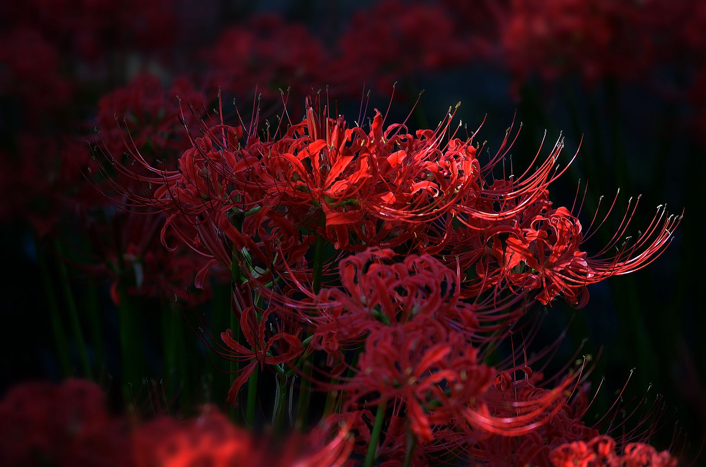
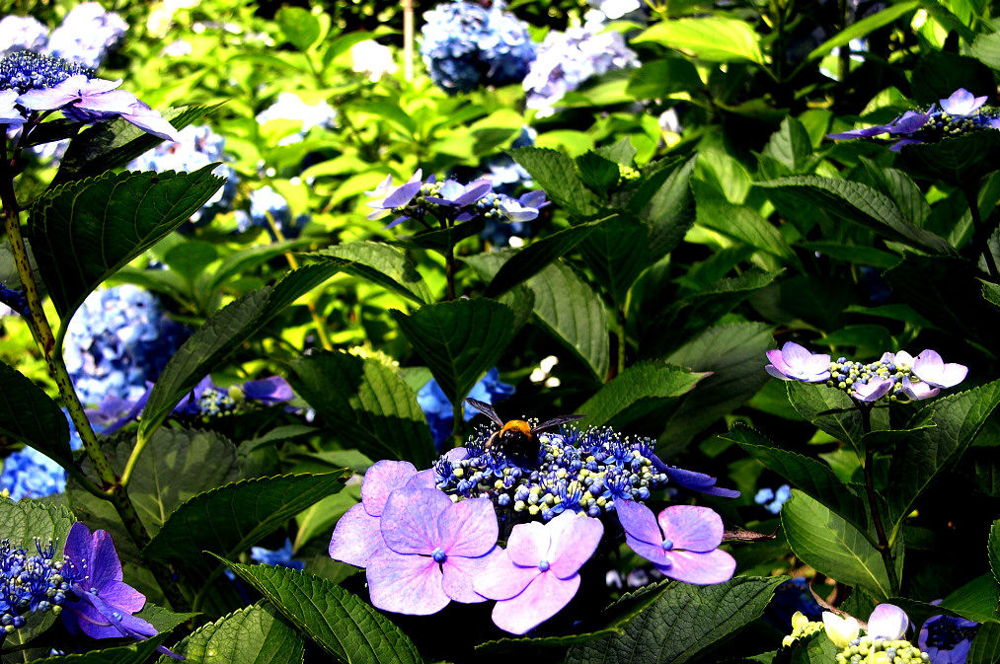

# 98、彼岸花
## 98.1、简介
中文名： 曼珠沙华、曼殊沙华、曼姝沙华 
外文名：Lycorisradiata 
颜色：红色、白色 
界： 植物界 
科：石蒜科 
别名：彼岸花，幽灵花，黄泉花，**忘川**

## 98.2、花语
日本花语：“悲伤的回忆”
朝鲜花语：“相互思念”
中国花语：“优美纯洁”

曼珠沙华的美，是妖异、灾难、死亡与分离的不祥之美，触目惊心的赤红，如火、如血。

彼岸花，
开一千年
落一千年，
花叶永不相见。
情不为因果，缘注定生死，
永远相识相知却不能相恋。
在此生无法触及的彼岸，
曼陀罗华卸下所有记忆，
花为黄泉。

彼岸花又称引魂之花。

彼岸花，恶魔的温柔。

传说中自愿投入地狱的花朵，被众魔遣回，但仍徘徊于黄泉路上，众魔不忍，遂同意让她开在此路上，给离开人界的魂们一个指引与安慰。
称为 Red Spider Lily。人称“草莫见花莫见草”。在日本被称作マンジュシャゲ，发音是曼珠沙华,花语是“分离 伤心 不吉祥”。原产地就是中国和日本，日本最多。

在民间，春分前后三天叫春彼岸，秋分前后三天叫秋彼彼岸花岸。是上坟的日子。彼岸花开在秋彼岸期间，非常准时，所以才叫彼岸花。

# 128、紫阳花
## 128.1、简介
种 名：紫阳花
学 名：Hydrangeamacrophylla(Thunb.)Seringe
英文名：LargeleafHydrangea
别 名：绣球花、斗球、草绣球、紫绣球、紫阳花、七变化、洋绣球、粉团花
科 名：虎耳草科Saxifragaceae
属 名：紫阳花属

## 128.2、花语
紫阳花的花语有许多种，不同的颜色有不一样的花语，所代表的寓意也是不一样的：
* 蓝：背叛、见异思迁、对爱情不忠贞；
* 白和粉：希望。

