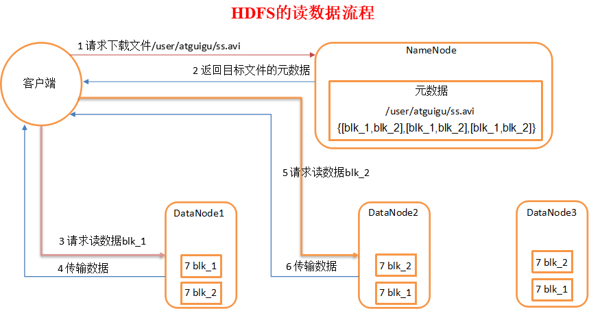
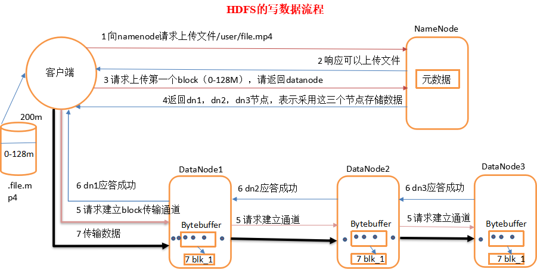

# 简介
通过本教程您可以学习到:
1. 读数据模型
2. 写数据模型
3. 一致模型


# 2、hadoop传输数据模型
为了了解客户端与之交互的HDFS、namenode以及datanode之间的数据流是什么样的，我们需要来了解一下几个模型。

## 2.1、读数据模型
当我们需要从DFS中下载一个文件时，其大概的流程如下图所示



可以看到，客户端可以直接连接DataNode进行文件下载，并且namenode在第一次交互中还会给客户端提供最佳的datanode。

这种方式的好处不言而喻，由于数据流分散在集群中的各个节点智商，所以这种设计能使HDFS扩展到大量的并发客户端。同时，NameNode只需要响应块位置的请求（这些信息是存储在内存中的，因此非常的高效），无需响应数据请求（DN处理）。否则，随着客户端数量的增长，namenode很快就会成为瓶颈。

## 2.2、写数据模型
HDFS写数据（上传）的过程很像我们传统的通信协议那样需要经过几次握手。假设我们目前具备1个NN，3个DN。请求发送一个超过128M的数据。参考下图：



1、客户端向namenode请求上传文件，namenode检查目标文件是否已存在，父目录是否存在。

2、namenode返回是否可以上传。

3、客户端请求第一个 block上传到哪几个datanode服务器上。

4、namenode返回3个datanode节点，分别为dn1、dn2、dn3。

5、客户端请求dn1上传数据，dn1收到请求会继续调用dn2，然后dn2调用dn3，将这个通信管道建立完成

6、dn1、dn2、dn3逐级应答客户端

7、客户端开始往dn1上传第一个block（先从磁盘读取数据放到一个本地内存缓存），以packet为单位，dn1收到一个packet就会传给dn2，dn2传给dn3；dn1每传一个packet会放入一个应答队列等待应答

8、当一个block传输完成之后，客户端再次请求namenode上传第二个block的服务器。（重复执行3-7步）

> hdoop实战这里引进了“副本如何存放？”的问题，接着讲述了机架感知这一问题，请前往本系列教程的10小节查看，书中提到的是12模型，可是经过测试之后发现2.7版本为21模型，待解惑。

## 2.3、一致型模型
学过数据库的同学都知道，一谈到多节点共享或者复制相同数据的时候，都会面临一个同步性问题。每一个成熟的系统都应该对同步性问题有所处理。

当我们进行数据上传的时候，系统是需要一定的时间去处理、先处理一份拷贝，在处理接下来的拷贝的，也就是说，数据不是立马就能得到同步。我们不妨做一个测试，编写一段测试代码：

``` java
  @Test
    public void testConsist() throws Exception {
        Path path = new Path("/user/consisit.txt");

        Configuration configuration = new Configuration();
        FileSystem fs = FileSystem.get(new URI(HDFS_URL),configuration,HADOOP_USER);
        System.out.println(fs.getFileStatus(path).getLen());
        // 获取输出流
        FSDataOutputStream fos = fs.create(path);
        // 写入数据
        fos.write("some intersted text".getBytes());
        System.out.println(fs.getFileStatus(path).getLen());
        // 只对当前操作的节点刷新
        fos.hflush();
        fos.close();
    }
```
通过断点测试，我们可以知道，在未调用flush方法之前，Path对应的文件长度为0，也就是数据没有即时的刷新到数据中。


HDFS提供了FSDataOutPutStream的hflush方法。当该方法执行成功之后，就会将所有的数据刷新到datanode中。

需要注意的是，该方法并不保证datanode已经写到了磁盘上，只能确保数据在datanode的内存中。因此，如果数据中心断电，数据还是会丢失。为确保数据写入到磁盘上，可以调用hsync方法。当然，有利就有弊，hsync耗损的资源要比hflush多得多。

> fos.close()隐含调用了hfluash方法。