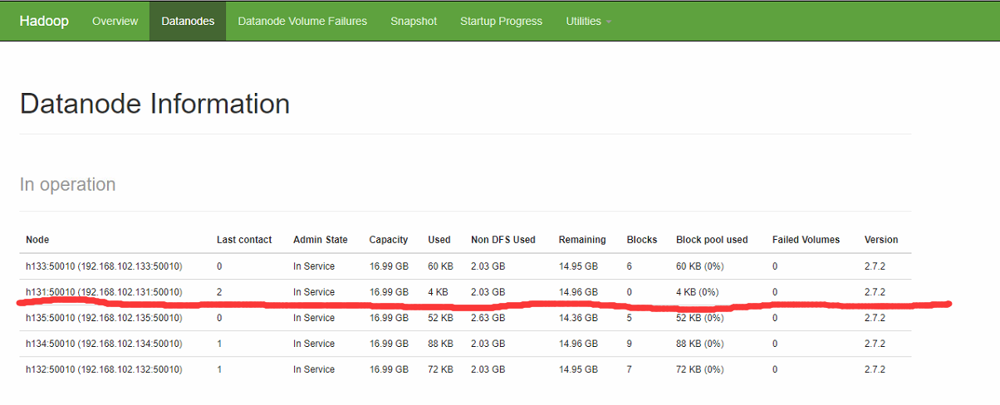

# 简介
随着公司业务的增长，数据量越来越大，原有的数据节点的容量已经不能满足存储数据的需求，需要在原有集群基础上动态添加新的数据节点。

前面我们新加入一台机器的时候，都是很暴力的删除集群的原有信息，然后重新搭建集群。这种方式在实际生产过程中并不推荐，我们只是单纯图方便而已。

这一节，我们来学习如何往集群中动态的添加一台服役节点（不停止集群的情况下）。

您可以学习到：
1. 如何在集群中增加一个服役节点；
2. 如何在集群中退役一个节点。


# 1、环境准备
准备一台服役的机器。完成如下的配置。
* 网卡配置，属于同一集群
* 配置主机名，添加主机列表
* 防火墙配置
* NN和NM与新机器之间的SSH无密码登陆
* 配置xsync、xcall脚本，兼容新机器的加入。
* 安装jdk、hadoop，配置环境变量，修改配置文件。这里可以copy集群其他机器的文件，也可以自己重新配置（如果你愿意的话）


这里我新加入节点h131，其IP为192.168.102.131。

> 前面的章节有介绍具体的过程，这里就不再阐述。

# 2、服役节点流程
1、在h133服务器，即namenode的/opt/module/hadoop-2.7.2/etc/hadoop目录下创建dfs.hosts文件。
```
[root@h133 hadoop]# pwd
/opt/module/hadoop-2.7.2/etc/hadoop
[root@h133 hadoop]# vi dfs.hosts
###添加如下主机名称（包含新服役的节点）
h131
h132
h133
h134
h135
```
2、在namenode的hdfs-site.xml配置文件中增加dfs.hosts属性，关联自定义文件
``` xml
<property>
    <name>dfs.hosts</name>
    <value>/opt/module/hadoop-2.7.2/etc/hadoop/dfs.hosts</value>
</property>
```

该选项用于定义信任的服役节点主机名列表所在的文件。我们可以查看该配置项的默认值，他位于hdfs-site.xml中:
```xml
<property>
  <name>dfs.hosts</name>
  <value></value>
  <description>Names a file that contains a list of hosts that are
  permitted to connect to the namenode. The full pathname of the file
  must be specified.  If the value is empty, all hosts are
  permitted.</description>
</property>
```
现在我们的hdfs-site.xml文件内容如下所示：
```xml
<configuration>
        <!-- 指定数据节点存储副本数，默认是3，因此可不配置-->
        <property>
                <name>dfs.replication</name>
                <value>3</value>
        </property>
        <!-- 指定SecondaryNameNode地址-->
        <property>
        <name>dfs.namenode.secondary.http-address</name>
        <value>h135:50090</value>
    </property>
<property>
    <name>dfs.hosts</name>
    <value>/opt/module/hadoop-2.7.2/etc/hadoop/dfs.hosts</value>
</property>
</configuration>
```
> 由此可以看出，dfs.hosts并不是强制命名，你也可以使用其他的文件名来表示。


3、NameNode所在节点上刷新namenode 、ResourceManager所在节点上刷新resourcemanager
```
[root@h133 hadoop]# hdfs dfsadmin -refreshNodes
Refresh nodes successful
```

```
[root@h134 ~]# yarn rmadmin -refreshNodes
19/01/05 18:38:07 INFO client.RMProxy: Connecting to ResourceManager at h134/192.168.102.134:8033
```

4、在NameNode所在节点的配置文件slaves中增加新主机的主机名，方便以后重启集群的时候加载到h131作为数据节点。
```
[root@h133 hadoop]# vi slaves 
[root@h133 hadoop]# cat slaves 
h131
h132
h133
h134
h135
```
> 即增加我们新加入的服役节点h131，无需分发到其他节点，直接在NameNode上修改完即可。

5、在新服役的节点上单独命令启动数据节点和节点管理器
```
[root@h131 hadoop]# hadoop-daemon.sh start datanode
starting datanode, logging to /opt/module/hadoop-2.7.2/logs/hadoop-root-datanode-h131.out
[root@h131 hadoop]# jps
11536 DataNode
11607 Jps
[root@h131 hadoop]# yarn-daemon.sh start nodemanager
starting nodemanager, logging to /opt/module/hadoop-2.7.2/logs/yarn-root-nodemanager-h131.out
[root@h131 hadoop]# jps
11536 DataNode
11640 NodeManager
11672 Jps
```

6、在web浏览器上检查是否ok，现在我们点击web界面的DataNodes选项卡，可以看到集群中当前的数据节点的情况：



我们观察到新加入的节点之后的集群资源使用情况。

7、如果数据不均衡，可以用命令实现集群的再平衡
```
[root@h131 hadoop]# start-balancer.sh 
starting balancer, logging to /opt/module/hadoop-2.7.2/logs/hadoop-root-balancer-h131.out
```
> `start-balancer.sh` 是位于$HADOOP_HOME/sbin下的执行脚本。

8、文件上传测试
```
[root@h131 ~]# touch newslaver.txt
[root@h131 ~]# vi newslaver.txt 
[root@h131 ~]# cat newslaver.txt 
I'm a new slaver node.
[root@h131 ~]# hadoop fs -put newslaver.txt /
```
我们在该节点上上传了一个文件，根据我们前面的理论，该文件的一个拷贝一定是在该节点上的。查看web验证


记住这张图，接下来我们退役这个节点的时候还会再来看看这里的变化。

# 3、退役节点流程
天下大事，分久必合，合久必分。有的时候，机器老化、吞吐减小等需求的出现，使我们需要腾出一两台机器的空间，这时候，我们就需要将某些节点从集群中分离出来，即退役节点。

接下来，我们练习退役节点的流程，我们将刚刚加入的服役节点h131主机踢出集群。


1、在NameNode的/opt/module/hadoop-2.7.2/etc/hadoop目录下创建dfs.hosts.exclude文件，并添加主机名称（要退役的节点h131）
```
[root@h133 hadoop]# touch dfs.hosts.exclude
[root@h133 hadoop]# vi dfs.hosts.exclude 
[root@h133 hadoop]# cat dfs.hosts.exclude 
h131
```

2、关联刚刚定义的文件：在namenode的hdfs-site.xml配置文件中增加dfs.hosts.exclude属性
```xml
<property>
<name>dfs.hosts.exclude</name>
      <value>/opt/module/hadoop-2.7.2/etc/hadoop/dfs.hosts.exclude</value>
</property>
```

3、NameNode上刷新namenode，通告集群h131将要退役。
```
[root@h133 hadoop]# hdfs dfsadmin -refreshNodes
Refresh nodes successful
```

4、ResourceManager上刷新resourcemanager
```xml
[root@h134 hadoop]# yarn rmadmin -refreshNodes
19/01/05 19:19:06 INFO client.RMProxy: Connecting to ResourceManager at h134/192.168.102.134:8033
```

5、查看web浏览器，退役节点的状态为decommission in progress（退役中），说明数据节点正在复制块到其他节点。等待退役节点状态为decommissioned（所有块已经复制完成）。


> 注意：如果集群副本数是3，服役的节点小于等于3，是不能退役成功的，需要修改副本数后（小于当前服役节点数）才能退役。

这时候我们来查看刚才上传的那个文件的副本数详情


可以看到，现在已经变为4个副本了，当前系统的标准是3个副本，因此，我们可以安全的将h131退役了。

6、确保如上图的状态之后，停止退役节点的datanode和nodemanager守护进程。
```
[root@h131 ~]# hadoop-daemon.sh stop datanode
[root@h131 ~]# yarn-daemon.sh stop nodemanager
```

7、从include文件(dfs.hosts)中删除退役节点
```
[root@h133 hadoop]# vi dfs.hosts
[root@h133 hadoop]# cat dfs.hosts
h132
h133
h134
h135
```

8、刷新namenode、刷新resourcemanager
```
[root@h133 hadoop]# hdfs dfsadmin -refreshNodes
Refresh nodes successful

[root@h134 hadoop]# yarn rmadmin -refreshNodes
19/01/05 19:29:36 INFO client.RMProxy: Connecting to ResourceManager at h134/192.168.102.134:8033
```

这时候，我们会发现，节点已经完完全全的被退役了。


9、从namenode的slave文件中删除退役节点h131，方便集群下次重启的时候不会加载到h131。
```
[root@h133 hadoop]# vi slaves 
[root@h133 hadoop]# cat slaves 
h132
h133
h134
h135
```

同样，如果数据不均衡，可以用命令实现集群的再平衡```start-balancer.sh```。

> 细心的话你会发现，新上传的文件还是留有h131这个主机存有自己一块副本的信息。


