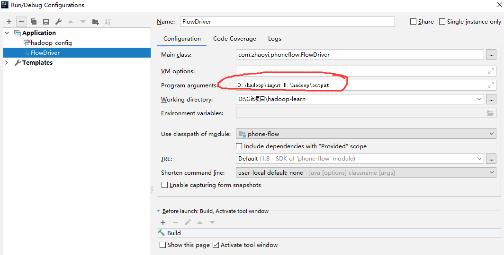

# 简介
从本章节您可以学习到：手机流量统计案例。

接下来我们有一系列的分析文件，如下构造所示:
```
1363157985066 	13726230503	00-FD-07-A4-72-B8:CMCC	120.196.100.82	i02.c.aliimg.com		24	27	2481	24681	200
1363157995052 	13826544101	5C-0E-8B-C7-F1-E0:CMCC	120.197.40.4			4	0	264	0	200
1363157991076 	13926435656	20-10-7A-28-CC-0A:CMCC	120.196.100.99			2	4	132	1512	200
...
```
需求：统计手机号耗费的总上行流量、下行流量、总流量（序列化）

> 这里没有详细的告诉我们具体一列是什么，只能凭直觉去定义了。但这并不影响我们的操作。同时需要了解到的是，现实生活中的数据甚至比这个乱的多，所以，数据挖掘又是我们钻研大数据不得不学习的另一个领域。

# 1、需求分析
很显然，我们需要的是电话号码（列2）、上行流量、下行流量数据以及将上下行流量汇总的总流量数据。

1、我们需要什么？

这时候用于序列化传输的基本类型就不能满足我们的数据传输需求了，因此，我们需要自定义bean序列化类型。

2、数据如何分割？

通过\t制表符进行分割。

3、分割之后如何获取数据？

假设分割之后总长度为n，则：1列（从0计数）为电话号码，n-3列为上行流量，n-2列为下行流量。


# 1、简单实现
## 1.1、自定义Bean类
``` java
package com.zhaoyi.phoneflow;

import org.apache.hadoop.io.Writable;

import java.io.DataInput;
import java.io.DataOutput;
import java.io.IOException;

public class FlowBean implements Writable {

    private long upFlow;// 上行流量
    private long downFlow;// 下行流量
    private long totalFlow;// 总流量

    // 无参构造
    public FlowBean() {
    }

    public FlowBean(long upFlow, long downFlow) {
        this.upFlow = upFlow;
        this.downFlow = downFlow;
        this.totalFlow = upFlow + downFlow;
    }

    // 序列化
    public void write(DataOutput out) throws IOException {
        out.writeLong(upFlow);
        out.writeLong(downFlow);
        out.writeLong(totalFlow);
    }

    // set方法，一次性设置属性
    public void set(long upFlow, long downFlow){
        this.upFlow = upFlow;
        this.downFlow = downFlow;
        this.totalFlow = upFlow + downFlow;
    }

    // 反序列化 - 顺序和序列化保持一致
    public void readFields(DataInput in) throws IOException {
        this.upFlow = in.readLong();
        this.downFlow = in.readLong();
        this.totalFlow = in.readLong();
    }

    public long getUpFlow() {
        return upFlow;
    }

    public long getDownFlow() {
        return downFlow;
    }

    public long getTotalFlow() {
        return totalFlow;
    }

    public void setUpFlow(long upFlow) {
        this.upFlow = upFlow;
    }

    public void setDownFlow(long downFlow) {
        this.downFlow = downFlow;
    }

    public void setTotalFlow(long totalFlow) {
        this.totalFlow = totalFlow;
    }

    // 使用制表符分隔
    @Override
    public String toString() {
        return "upFlow=" + upFlow +
                "\t" + downFlow +
                "\t" + totalFlow;
    }
}


```
## 1.2、Mapper类
``` java
package com.zhaoyi.phoneflow;

import org.apache.hadoop.io.LongWritable;
import org.apache.hadoop.io.Text;
import org.apache.hadoop.mapreduce.Mapper;

import java.io.IOException;

public class FlowMapper extends Mapper<LongWritable, Text, Text, FlowBean> {
    private final int PHONE_NUMBER_INDEX = 1;
    private final int UP_FLOW_BACKWARDS = 3;
    private final int DOWN_FLOW_BACKWARDS = 2;
    private Text outKey = new Text();
    private FlowBean outVal = new FlowBean();
    @Override
    protected void map(LongWritable key, Text value, Context context) throws IOException, InterruptedException {
        // 输入的key是id号，不需要处理
        // 1. 获取一行数据
        String line = value.toString();

        // 2.截取数据
        String[] strings = line.split("\t");

        // 3.获取key - 电话号码
        String phoneNumber = strings[PHONE_NUMBER_INDEX];
        outKey.set(phoneNumber);

        // 4.获取输出val - flowBean
        // （1）获取上行流量
        long upFlow = Long.parseLong(strings[strings.length - UP_FLOW_BACKWARDS]);
        // （2）获取下行流量
        long downFlow = Long.parseLong(strings[strings.length - DOWN_FLOW_BACKWARDS]);
        outVal.set(upFlow, downFlow);

        // 2.写数据
        context.write(outKey, outVal);
    }
}

```

## 1.3、Reducer类
```java
package com.zhaoyi.phoneflow;

import org.apache.hadoop.io.Text;
import org.apache.hadoop.mapreduce.Reducer;

import java.io.IOException;

public class FlowReducer extends Reducer<Text, FlowBean, Text, FlowBean> {
    private FlowBean outVal = new FlowBean();
    @Override
    protected void reduce(Text key, Iterable<FlowBean> values, Context context) throws IOException, InterruptedException {
        long upFlow = 0;
        long downFlow = 0;
        // reduce
        for (FlowBean value : values) {
            upFlow += value.getUpFlow();
            downFlow += value.getDownFlow();
        }
        // set output val.
        outVal.set(upFlow, downFlow);

        //  写出数据
        context.write(key, outVal);
    }
}

```
## 1.5、驱动类
该类负责加载Mapper、reducer执行任务。
```java
package com.zhaoyi.phoneflow;

import org.apache.hadoop.conf.Configuration;
import org.apache.hadoop.fs.Path;
import org.apache.hadoop.io.Text;
import org.apache.hadoop.mapreduce.Job;
import org.apache.hadoop.mapreduce.lib.input.FileInputFormat;
import org.apache.hadoop.mapreduce.lib.output.FileOutputFormat;

public class FlowDriver {
    public static void main(String[] args) throws Exception {
        // 0.检测参数
        if(args.length != 2){
            System.out.println("Please enter the parameter: data input and output paths...");
            System.exit(-1);
        }
        // 获取job
        Job job = Job.getInstance(new Configuration());

        // 设置jar路径
        job.setJarByClass(FlowDriver.class);

        job.setMapperClass(FlowMapper.class);
        job.setReducerClass(FlowReducer.class);

        job.setOutputKeyClass(Text.class);
        job.setOutputValueClass(FlowBean.class);

        FileInputFormat.setInputPaths(job, new Path(args[0]));
        FileOutputFormat.setOutputPath(job,new Path(args[1]));

        System.exit(job.waitForCompletion(true)? 1:0);
    }
}

```


## 1.7、测试
这一次我们从本地运行测试。在运行之前，确保你安装了hadoop的包到windows目录，并设置了环境变量，参考前面的章节。

1、点击主程序Driver类，添加运行参数



2、将我们的phone_number.txt文件放到第一个参数指定的目录中。

> 第二次参数指定结果输出目录，注意，如果该目录存在，必须手动去删除，不然hadoop运行异常，前面我们已经强调过这个问题，并解释了原因。

3、直接运行。我们就可以得到输出结果了，输出结果位于第二个参数指定的目录中，我们直接查看结果集
```
D:\hadoop\output>type part-r-00000
13480253104     180     180     360
13502468823     7335    110349  117684
13560436666     1116    954     2070
13560439658     2034    5892    7926
13602846565     1938    2910    4848
13660577991     6960    690     7650
13719199419     240     0       240
13726230503     2481    24681   27162
13726238888     2481    24681   27162
13760778710     120     120     240
13826544101     264     0       264
13922314466     3008    3720    6728
13925057413     11058   48243   59301
13926251106     240     0       240
13926435656     132     1512    1644
15013685858     3659    3538    7197
15920133257     3156    2936    6092
15989002119     1938    180     2118
18211575961     1527    2106    3633
18320173382     9531    2412    11943
84138413        4116    1432    5548
```

> 本案例的代码参见github项目phoneflow模块。


