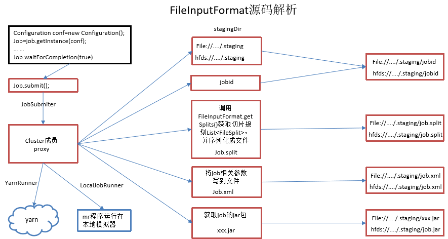
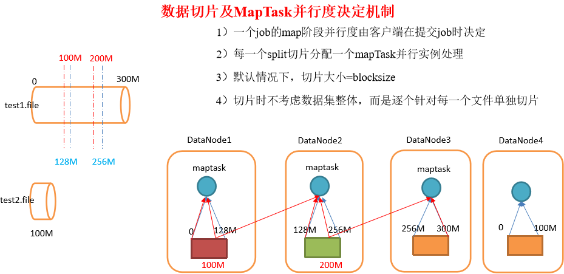
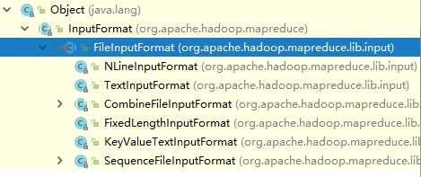

# 简介
通过本章节，您可以学习到：
1. Job的提交流程
2. InputFormat数据切片的机制

# 1、Job提交流程源码分析
``` java
1）job提交流程源码详解
waitForCompletion()
submit();
// 1建立连接
connect();	
// 1）创建提交job的代理
new Cluster(getConfiguration());
			// （1）判断是本地yarn还是远程
			initialize(jobTrackAddr, conf); 
	// 2 提交job
submitter.submitJobInternal(Job.this, cluster)
	// 1）创建给集群提交数据的Stag路径
	Path jobStagingArea = JobSubmissionFiles.getStagingDir(cluster, conf);
	// 2）获取jobid ，并创建job路径
	JobID jobId = submitClient.getNewJobID();
	// 3）拷贝jar包到集群
copyAndConfigureFiles(job, submitJobDir);	
	rUploader.uploadFiles(job, jobSubmitDir);
// 4）计算切片，生成切片规划文件
writeSplits(job, submitJobDir);
	maps = writeNewSplits(job, jobSubmitDir);
		input.getSplits(job);
// 5）向Stag路径写xml配置文件
writeConf(conf, submitJobFile);
	conf.writeXml(out);
// 6）提交job,返回提交状态
status = submitClient.submitJob(jobId, submitJobDir.toString(), job.getCredentials());
```

> 注意以上代码只是大过程的提取，并不是连续的某处的代码。要了解详细的过程，可以通过编译器打断点了解。



## 2、InputFomat数据切片机制
## 2.1、FileInputFormat图解分析



红色划分是均分方式，这种方式比较低下。

而当前采用的是蓝色方式，以一个块为一个切片。大致流程如下：
1. 找到你数据输入的目录。
2. 开始遍历处理（规划切片）目录下的每一个文件
3. 循环执行4-6步骤，直接遍历完所有输入文件。
4. 遍历第一个文件test1.file
	* 获取文件大小fs.sizeOf(ss.txt);
	* 计算切片大小computeSliteSize(Math.max(minSize,Math.max(maxSize,blocksize)))=blocksize;
	* 默认情况下，切片大小=blocksize
5. 开始切片，形成第1个切片：test1.file—0:128M;第2个切片test1.file—128:256M 第3个切片test1.file—256M:300M（每次切片时，都要判断切完剩下的部分是否大于块的1.1倍，不大于1.1倍就划分一块切片）
6. 将切片信息写到一个切片规划文件中。
   * 整个切片的核心过程在getSplit()方法中完成。需要注意的是数据切片只是在逻辑上对输入数据进行分片，并不会再磁盘上将其切分成分片进行存储。InputSplit只记录了分片的元数据信息，比如起始位置、长度以及所在的节点列表等。
7. 提交切片规划文件到yarn上，yarn上的MrAppMaster就可以根据切片规划文件计算开启maptask个数。

> block是HDFS上物理上存储的存储的数据，切片是对数据逻辑上的划分。

## 2.2、FileInputFormat中默认的切片机制
通过以下的学习，我们可以总结出以下三个结论：
* 切片过程只是简单地按照文件的内容长度进行切片
* 切片大小默认等于block大小
* 切片时不考虑数据集整体，而是逐个针对每一个文件单独切片

举个例子加入我们有以下两个文件
```
file1.txt    320M
file2.txt    10M
```
经过FileInputFormat的切片机制运算后，默认配置下形成的切片信息如下：  
```
file1.txt.split1--  0~128
file1.txt.split2--  128~256
file1.txt.split3--  256~320
file2.txt.split1--  0~10M
```

## 2.3、FileInputFormat切片大小的参数配置
通过分析源码`org.apache.hadoop.mapreduce.lib.input.FileInputFormat`，我们先来看看他的父类InputFormat
``` java
//
// Source code recreated from a .class file by IntelliJ IDEA
// (powered by Fernflower decompiler)
//

package org.apache.hadoop.mapreduce;

import java.io.IOException;
import java.util.List;
import org.apache.hadoop.classification.InterfaceAudience.Public;
import org.apache.hadoop.classification.InterfaceStability.Stable;

@Public
@Stable
public abstract class InputFormat<K, V> {
    public InputFormat() {
    }

    public abstract List<InputSplit> getSplits(JobContext var1) throws IOException, InterruptedException;

    public abstract RecordReader<K, V> createRecordReader(InputSplit var1, TaskAttemptContext var2) throws IOException, InterruptedException;
}
```
父类规定了两个抽象方法getSplits以及RecordReader。

再来看看FileInputFormat计算分片大小的相关代码：
```java

    public List<InputSplit> getSplits(JobContext job) throws IOException {
        StopWatch sw = (new StopWatch()).start();
        long minSize = Math.max(this.getFormatMinSplitSize(), getMinSplitSize(job));
        long maxSize = getMaxSplitSize(job);
        List<InputSplit> splits = new ArrayList();
        List<FileStatus> files = this.listStatus(job);
        Iterator var9 = files.iterator();

        while(true) {
            while(true) {
                while(var9.hasNext()) {
                    FileStatus file = (FileStatus)var9.next();
                    Path path = file.getPath();
                    long length = file.getLen();
                    if (length != 0L) {
                        BlockLocation[] blkLocations;
                        if (file instanceof LocatedFileStatus) {
                            blkLocations = ((LocatedFileStatus)file).getBlockLocations();
                        } else {
                            FileSystem fs = path.getFileSystem(job.getConfiguration());
                            blkLocations = fs.getFileBlockLocations(file, 0L, length);
                        }

                        if (this.isSplitable(job, path)) {
                            long blockSize = file.getBlockSize();
                            long splitSize = this.computeSplitSize(blockSize, minSize, maxSize);

                            long bytesRemaining;
                            int blkIndex;
                            for(bytesRemaining = length; (double)bytesRemaining / (double)splitSize > 1.1D; bytesRemaining -= splitSize) {
                                blkIndex = this.getBlockIndex(blkLocations, length - bytesRemaining);
                                splits.add(this.makeSplit(path, length - bytesRemaining, splitSize, blkLocations[blkIndex].getHosts(), blkLocations[blkIndex].getCachedHosts()));
                            }

                            if (bytesRemaining != 0L) {
                                blkIndex = this.getBlockIndex(blkLocations, length - bytesRemaining);
                                splits.add(this.makeSplit(path, length - bytesRemaining, bytesRemaining, blkLocations[blkIndex].getHosts(), blkLocations[blkIndex].getCachedHosts()));
                            }
                        } else {
                            splits.add(this.makeSplit(path, 0L, length, blkLocations[0].getHosts(), blkLocations[0].getCachedHosts()));
                        }
                    } else {
                        splits.add(this.makeSplit(path, 0L, length, new String[0]));
                    }
                }

                job.getConfiguration().setLong("mapreduce.input.fileinputformat.numinputfiles", (long)files.size());
                sw.stop();
                if (LOG.isDebugEnabled()) {
                    LOG.debug("Total # of splits generated by getSplits: " + splits.size() + ", TimeTaken: " + sw.now(TimeUnit.MILLISECONDS));
                }

                return splits;
            }
        }
    }
```
从中我们可以了解到，计算分片大小的逻辑为
```java
// 初始化值
long minSize = Math.max(this.getFormatMinSplitSize(), getMinSplitSize(job));
long maxSize = getMaxSplitSize(job);
...
// 计算分片大小
 long splitSize = this.computeSplitSize(blockSize, minSize, maxSize);
 ...
	protected long computeSplitSize(long blockSize, long minSize, long maxSize) {
        return Math.max(minSize, Math.min(maxSize, blockSize));
    }

...
// minSize默认值为1L
   protected long getFormatMinSplitSize() {
        return 1L;
    }
```
也就说，切片主要由这几个值来运算决定
```
mapreduce.input.fileinputformat.split.minsize=1 默认值为1
mapreduce.input.fileinputformat.split.maxsize= Long.MAXValue 默认值Long.MAXValue
```
因此，默认情况下，切片大小=blocksize。我们不难得到，要想修改分片的大小，完全可以通过配置文件的`mapreduce.input.fileinputformat.split.minsize`以及`mapreduce.input.fileinputformat.split.maxsize`进行配置：
* mapreduce.input.fileinputformat.split.maxsize（切片最大值）：参数如果调得比blocksize小，则会让切片变小。
mapreduce.input.fileinputformat.split.minsize （切片最小值）：参数调的比blockSize大，则可以让切片变得比blocksize还大。

## 2.4、继承树
FileInputFormat有多个底层实现，2.7版本的jdk具有如下的继承树



默认情况下Job任务使用的是
## 2.5、获取切片信息API
```java
// 根据文件类型获取切片信息
FileSplit inputSplit = (FileSplit) context.getInputSplit();
// 获取切片的文件名称
String name = inputSplit.getPath().getName();
```

## 3、CombineTextInputFormat切片机制
默认情况下TextInputformat对任务的切片机制是按文件规划切片，不管文件多小，都会是一个单独的切片，都会交给一个maptask，这样如果有大量小文件，就会产生大量的maptask，处理效率极其低下。最好的办法，在数据处理系统的最前端（预处理/采集），将小文件先合并成大文件，再上传到HDFS做后续分析。

如果已经是大量小文件在HDFS中了，可以使用另一种InputFormat来做切片（CombineTextInputFormat），它的切片逻辑跟TextFileInputFormat不同：它可以将多个小文件从逻辑上规划到一个切片中，这样，多个小文件就可以交给一个maptask。

优先满足最小切片大小，不超过最大切片大小
```java
CombineTextInputFormat.setMaxInputSplitSize(job, 4194304);// 4m
CombineTextInputFormat.setMinInputSplitSize(job, 2097152);// 2m
```
> 举例：0.5m+1m+0.3m+5m=2m + 4.8m=2m + 4m + 0.8m

如果不设置InputFormat,它默认用的是TextInputFormat.class，因此我们需要手动指定InputFormat类型，在执行job之前指定：
```java
job.setInputFormatClass(CombineTextInputFormat.class)
CombineTextInputFormat.setMaxInputSplitSize(job, 4194304);// 4m
CombineTextInputFormat.setMinInputSplitSize(job, 2097152);// 2m
```
通过此设置之后，分片会变得更少一些，不会像之前一样，一个文件形成一个分片（文件过小的情况尤其浪费）。


