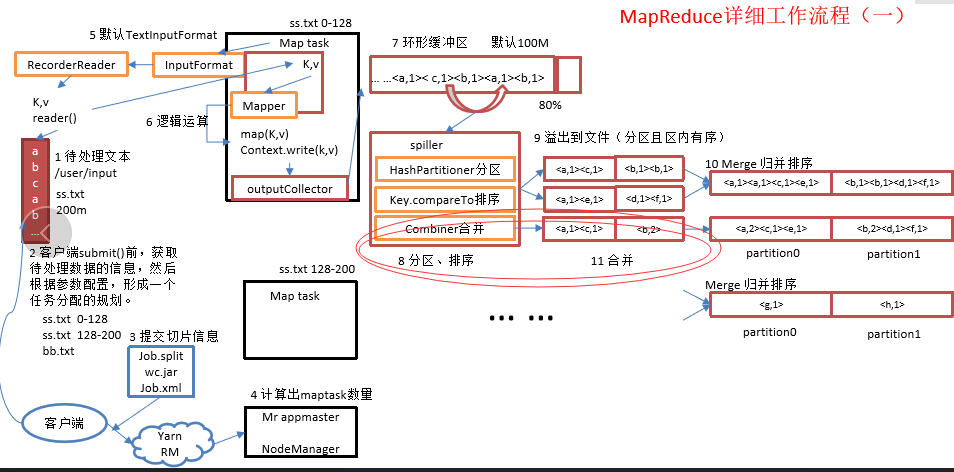

# 简介
shuffle机制中的合并（Combiner）并不是我们之前将的文件合并，他是一种依附于业务性质的调优手段。这里回顾一下我们之前的参考图



留意图中第11步的合并过程，这样做之后可以合并一些同key的k-v，节约传输的带宽。

* Combiner是MR程序中Mapper和Reducer之外的一种组件
* Combiner组件的父类就是Reducer
* Combiner和reducer的区别在于运行的位置：
    * Combiner是在每一个maptask所在的节点运行
    * Reducer是接收全局所有Mapper的输出结果；

Combiner的意义就是对每一个maptask的输出进行局部汇总，以减小网络传输量。

# 1、探究Combiner

## 1.1、自定义Combiner步骤
1. 自定义一个combiner继承Reducer，重写reduce方法即可。
2. 在驱动类中设置该Combiner。

## 1.2、优化wordcount
1、添加自定义Combiner类
```java
package com.zhaoyi.wordcount;

import org.apache.hadoop.io.IntWritable;
import org.apache.hadoop.io.Text;
import org.apache.hadoop.mapreduce.Reducer;

import java.io.IOException;

public class WordCountCombiner extends Reducer<Text, IntWritable, Text, IntWritable> {
    @Override
    protected void reduce(Text key, Iterable<IntWritable> values, Context context) throws IOException, InterruptedException {
        int count = 0;
        for (IntWritable value : values) {
            count += value.get();
        }
        // 2.输出该key的总数
        context.write(key, new IntWritable(count));
    }
}
```

> 可以看到Combiner和Reducer的业务代码一致，区别在于前者（Combiner）是运行在每一个MapTask上，而后者是运行在汇总的ReducerTask。

2、设置Combiner
```java
  job.setCombinerClass(WordCountCombiner.class);
```

3、运行，并查看日志
```
...
Map input records=5
Map output records=72
...
Combine input records=72
Combine output records=51
...
```
Combine input records为72，经过我们的合并之后变为Combine output records的值，即52行。

## 1.3、Combiner运用场景
Combiner并不是随便就可以使用的，在一些、甚至说大部分情况下是不能使用这种合并方式。

能够应用的前提是不能影响最终的业务逻辑，而且，Combiner的输出kv应该跟reducer的输入k-v类型要对应起来。

例如下面的求平均数的案例
```
Mapper
3 5 7 ->(3+5+7)/3=5 
2 6 ->(2+6)/2=4
Reducer
(3+5+7+2+6)/5=23/5    不等于    (5+4)/2=9/2
```
结果显然是不正确的。

