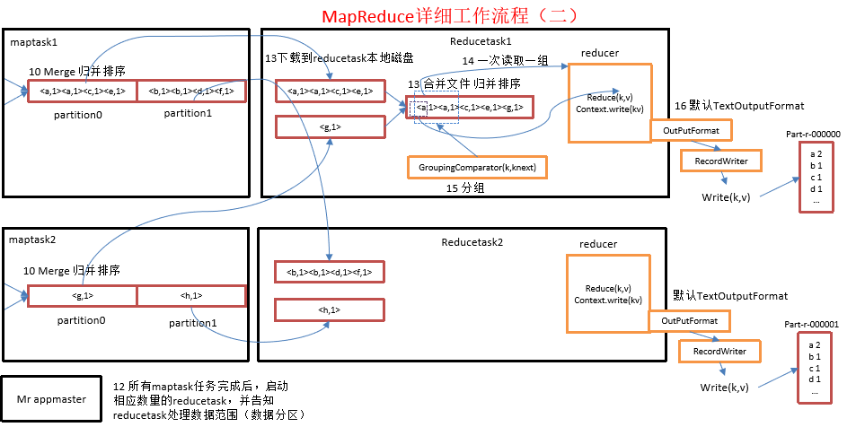
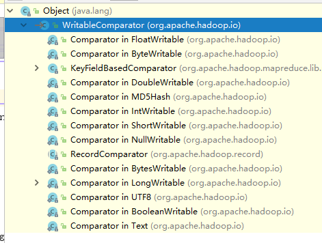

# 简介
shuffle机制中的分组排序（Group）是一个建立在Reducer阶段的处理过程。参看下图的第15步骤。通过这一步骤，我们可以修改Reducer判定key的逻辑，按照我们的思维去定义那些key应该属于同一类型的分组。

> 需要注意的是，现实开发中经常使用的分组其实就是分区功能，本节讲述的是Reducer阶段根据key分组的过程。

默认情况下MapReduce的分组阶段会根据我们提供的key进行排序，然后将排序结果相等的放到一次reducer循环中（代码上的体现）。而该排序过程，其实可以由我们去定义，也就说，将排序的结果我们需要自定义一个GroupComparator.




# 1、探究GroupComparator
我们可以通过输出日志查看当前的分组数
```
...
Reduce input groups=3
...
```
例如，上述情况下分组为3。

如果我们不特殊指定分组，那么分组数会按照key的对应WritableComparator的实现类逻辑进行排序，并按照key进行分组排序，同一组key的数据会进入reducer方法中进行处理，一组执行一次。

以wordCount举例，在不考虑自定义分区(partition)的情况下（现在是默认一个分区）。我们reducer输入的key值是Text类型，那么他的key排序逻辑就应该是Text的Comparator。参见源码：
```java
@InterfaceAudience.Public
@InterfaceStability.Stable
public class Text extends BinaryComparable
```
`BinaryComparable`，即按照字典顺序进行排序。也就是说，相同的JAVA类型的String（String对应Hadoop的序列化Text类型）Key会被划分为一个分组，我们来验证一下这个想法，例如如下的输入数据
```
about
about
areya
akuya
mywife
```
按照我们之前的理论，分组数应该是4，即两个about会被划分为一组，执行一次处理。运行，查看分组日志：
```
...
Reduce input groups=4
...
```
就是这样。

接下来，我们探讨一下如何改变分组数。其实答案显而易见，那就是定义Key类型的Comparator逻辑，实现自己的排序行为。

我们来看看Hadoop类型组件中使用的Comparator有哪些，每个类型都有自己的Comparator实现，我们可以进入源码一一查看。




为了练习分组排序，接下来我们运行一个案例。

## 1、案例：订单号分组排序
需求：获取每种订单号中消费最多的一条记录，并按订单号的字典序排序

输入数据：第一列为订单号，第二列为杂项，第三列为消费值。
```
Order_0000001	Pdt_01	222.8
Order_0000002	Pdt_05	722.4
Order_0000001	Pdt_05	25.8
Order_0000003	Pdt_01	222.8
Order_0000003	Pdt_01	33.8
Order_0000002	Pdt_03	522.8
Order_0000002	Pdt_04	122.4
Order_0000002	Pdt_04	1220.4
Order_0000002	Pdt_04	1422.4
Order_0000002	Pdt_04	1522.4
Order_0000002	Pdt_04	1622.4
Order_0000001	Pdt_04	1000.4
```

## 1.1、分析
1、首先筛选掉杂项`Pdt_01`；

2、定义订单Bean，将其作为Key并先根据id排序，再根据消费进行排序（value为空值）；

难题出现了，我们的key为订单Bean，以他作为key的话，我们无法关联到Order_0000001的第一条数据是我们想要的，怎么做？显然，我们需要将订单id相同的一组订单数据放在一起，这样我们只需要取第一条数据就可以了。

也就是要欺骗reducer，不要以Bean对象作为参考，而已bean对象的orderId作为参考。

问题迎刃而解，接下来，开始编码。

> 也可以考虑结果按订单号进行分区，实现分组效果，这是业务开发中常用的方式。同时，该问题的解决方案比较极端，还有更多优雅的处理方式可以选择，这里只是为了演示reducer的迭代逻辑，因此行此下策。

## 1.2、实现
（1） Bean
``` java
package com.zhaoyi.order;

import org.apache.hadoop.io.WritableComparable;

import java.io.DataInput;
import java.io.DataOutput;
import java.io.IOException;

public class OrderBean implements WritableComparable<OrderBean> {
    private String orderId;

    private double price;

    // second order
    public int compareTo(OrderBean o) {
        // according to order id.
        int result = this.orderId.compareTo(o.getOrderId());

        // then by price
        if(result == 0){
            result = this.getPrice() > o.getPrice()? -1:1;
        }

        return result;
    }

    public void write(DataOutput out) throws IOException {
        out.writeUTF(orderId);
        out.writeDouble(price);
    }

    public void readFields(DataInput in) throws IOException {
        this.orderId = in.readUTF();
        this.price = in.readDouble();
    }

    public OrderBean() {
    }

    public void set(String orderId, double price){
        this.orderId = orderId;
        this.price = price;
    }

    public OrderBean(String orderId, double price) {
        this.orderId = orderId;
        this.price = price;
    }

    public String getOrderId() {
        return orderId;
    }

    public void setOrderId(String orderId) {
        this.orderId = orderId;
    }

    public double getPrice() {
        return price;
    }

    public void setPrice(double price) {
        this.price = price;
    }

    @Override
    public String toString() {
        return orderId + "\t" + price ;
    }
}

```

（2）Mapper
``` java
package com.zhaoyi.order;

import org.apache.hadoop.io.LongWritable;
import org.apache.hadoop.io.NullWritable;
import org.apache.hadoop.io.Text;
import org.apache.hadoop.mapreduce.Mapper;

import java.io.IOException;

public class OrderMapper extends Mapper<LongWritable, Text, OrderBean, NullWritable> {

    OrderBean orderBean = new OrderBean();

    @Override
    protected void map(LongWritable key, Text value, Context context) throws IOException, InterruptedException {
        String line = value.toString();
        String[] strings = line.split("\t");

        orderBean.set(strings[0], Double.parseDouble(strings[2]));

        context.write(orderBean, NullWritable.get());
    }
}

```

（3）Reducer
``` java
package com.zhaoyi.order;

import org.apache.hadoop.io.NullWritable;
import org.apache.hadoop.mapreduce.Reducer;

import java.io.IOException;

public class OrderReducer extends Reducer< OrderBean, NullWritable, OrderBean, NullWritable> {
    @Override
    protected void reduce(OrderBean key, Iterable<NullWritable> values, Context context) throws IOException, InterruptedException {
        // 注意此处迭代的代码，每当我们迭代一次，
        // key的值编写切换到下一个分组的key值，是什么呢？您可以尝试一下就知道了。
        // System.out.println("------------");
        // System.out.print(key.getOrderId());
        // int count = 0;
        // for (NullWritable value:values) {
        //     count++;
        // }
        // System.out.println("拥有"+ count + "条数据.");
        context.write(key, NullWritable.get());
    }
}
```

（4）GroupComparator
```java
package com.zhaoyi.order;

import org.apache.hadoop.io.WritableComparable;
import org.apache.hadoop.io.WritableComparator;

public class OrderGroupComparator extends WritableComparator {

    public OrderGroupComparator() {
        super(OrderBean.class, true);
    }

    @Override
    public int compare(WritableComparable a, WritableComparable b) {
        OrderBean aa = (OrderBean) a;
        OrderBean bb = (OrderBean) b;
        return aa.getOrderId().compareTo(bb.getOrderId());
    }
}

```
注意构建无参的构造函数，告诉其处理的排序实体类型。

（5）驱动类，在此处指定分组排序类
```java
package com.zhaoyi.order;

import org.apache.hadoop.conf.Configuration;
import org.apache.hadoop.fs.Path;
import org.apache.hadoop.io.NullWritable;
import org.apache.hadoop.mapreduce.Job;
import org.apache.hadoop.mapreduce.lib.input.FileInputFormat;
import org.apache.hadoop.mapreduce.lib.output.FileOutputFormat;

public class OrderDriver {
    public static void main(String[] args) throws Exception{
        Job job = Job.getInstance(new Configuration());

        job.setJarByClass(OrderDriver.class);
        job.setMapperClass(OrderMapper.class);
        job.setReducerClass(OrderReducer.class);

        job.setMapOutputKeyClass(OrderBean.class);
        job.setMapOutputValueClass(NullWritable.class);
        job.setOutputKeyClass(OrderBean.class);
        job.setOutputValueClass(NullWritable.class);

        // 设置自定义分组排序类
        job.setGroupingComparatorClass(OrderGroupComparator.class);

        FileInputFormat.setInputPaths(job, new Path(args[0]));
        FileOutputFormat.setOutputPath(job, new Path(args[1]));

        System.exit(job.waitForCompletion(true)? 1:0);
    }
}

```

运行代码，返回结果：
```
Order_0000001	1000.4
Order_0000002	1622.4
Order_0000003	222.8
```

> 在reducer中如果进行迭代，会更新key值，请注意。
