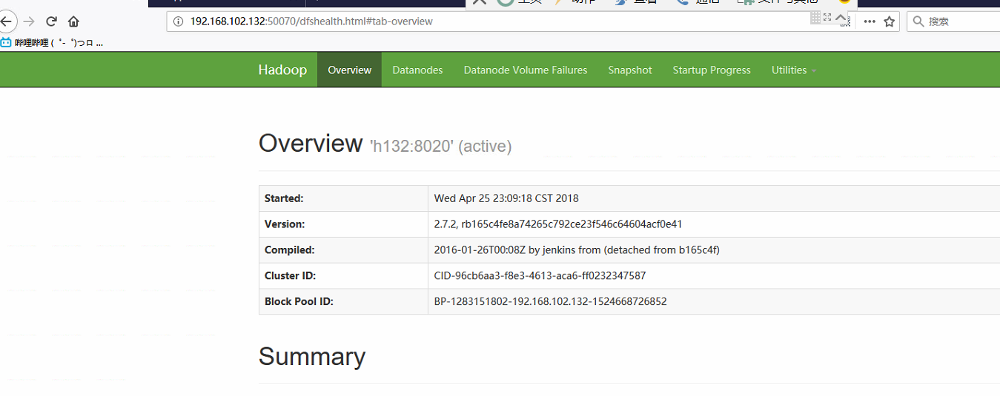
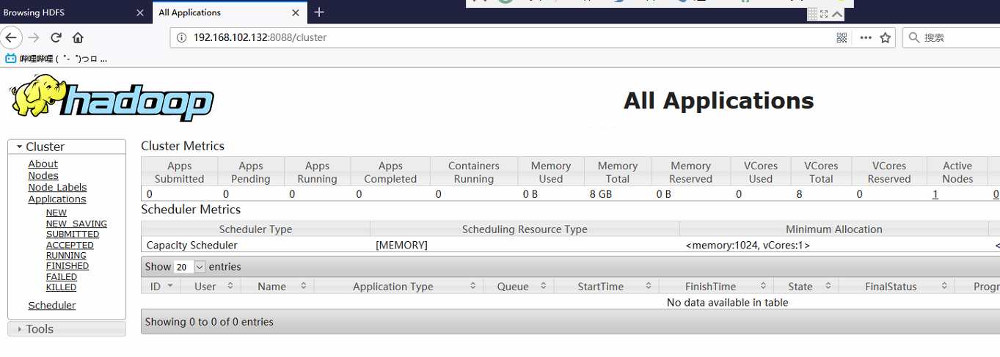
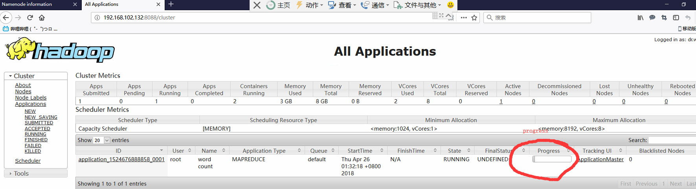
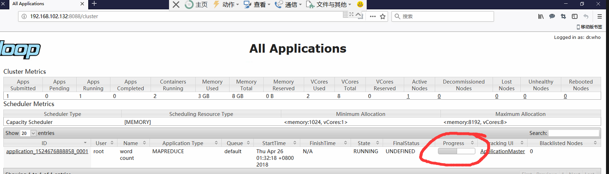
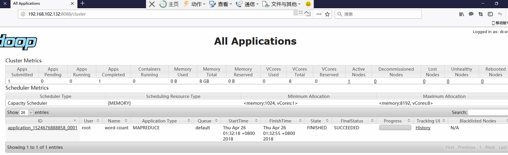

# 简介
前面我们讲到了hadoop拥有3种运行模式，搭建了最简答的本地运行模式并在其上运行了两个简单案例。本章节我们学习伪分布模式。顾名思义，该模式外在看起来像是分布式，实际上只有一个节点。

伪分布模式的有不同的搭建方式，具体取决于我们需要用到什么样的功能。前面提到过，Hadoop主要有3大模块：HDFS、YARN以及MapReduce。接下来我们通过该模式搭建hadoop不同的模块。

从本章节你可以学习到:
1. hadoop的伪分布式运行模式。
2. HDFS环境搭建
3. YARN环境搭建及本地临时文件存储目录
4. 在伪分布模式下运行wordcount案例。

# 1、搭建HDFS环境
本小节我们将搭建HDFS组件，并在其上运行一个案例。
## 1.1 基础环境搭建

安装jdk以及hadoop，安装方式参考本系列第二章节。现在我们已经准备好了和本地模式一模一样的环境，接下来开始创建DFS需要的namenode以及datanode。

注意：在此之前最好配置好自己所搭建环境的主机名关系，例如我搭建的环境共有5台机器，他们的/etc/hosts文件如下：
```
192.168.102.131 h131
192.168.102.132 h132
192.168.102.133 h133
192.168.102.134 h134
192.168.102.135 h135
```
同时主机名也最好设置一下，通过命令`hostname h131`进行设置。

> 注意，伪分布模式只需一台机器就可以，上面的列表只是为了后面的集群模式准备的，所以提前准备这样的环境也不是不行，不过本教程暂时用不到。


## 1.2 配置集群
配置文件的位置都位于/opt/module/hadoop-2.7.2/etc/hadoop下。配置内容放在`<configuration>`配置节中，其中h131是我的这台主机的主机名，记住写自己的主机名即可。

1、配置`hadoop-env.sh`，修改JAVA_HOME 路径，如果您已经参考了本系列教程的第2章内容，此处可以不做。

2、配置core-site.xml，添加配置
``` xml
<!-- 指定HDFS中NameNode的地址 -->
<property>
	<name>fs.defaultFS</name>
    <value>hdfs://h132:8020</value>
</property>
```
> fs.defaultFS使用本地文件协议，查看官方文档可知其默认值为`file:///`;

3、配置hdfs-site.xml
``` xml
    <!-- 指定HDFS副本的数量 -->
	<property>
		<name>dfs.replication</name>
		<value>1</value>
	</property>
```
> dfs.replication默认值为3。

## 1.3 启动集群

通过2我们已经完成了基本的hdfs配置。我们现在配置了数据节点的信息，同时指定了文件的副本数，接下来我们启动集群。

1、格式化namenode（第一次启动时需要格式化）
``` shell
# hdfs namenode -format
```
> hdfs位于bin下，由于我们配置了环境变量，可以在任何地方直接调用。

> 全新的HDFS都需要格式化。通过创建存储目录和初始版本的namenode持久数据结构，格式化进程将创建一个空的文件系统。由于namenode管理所有的文件系统的元数据，datanode可以动态的加入或者离开集群（服役、退役，后面我们会讲到），所以，初始的格式化进程还不会设计到datanode。同样，初始化文件系统时也无需指定大小，这是由集群中的datanode的数量决定的，在文件系统格式化之后很长时间内都可以根据需要添加。

2、启动namenode
``` shell
# hadoop-daemon.sh start namenode
```
> `hadoop-daemon.sh`位于hadoop/sbin下，由于我们同样配置的环境变量，可以直接调用。

3、启动datanode
``` shell
# hadoop-daemon.sh start datanode
```

4、查看结果：通过命令jps查看当前启动的java进行，可以看出，两个节点都已经启动。
```
9731 NameNode
9893 Jps
9822 DataNode
```

# 1.4 查看集群

前面我们成功的启动了两个节点：HDFS的namenode和datanode。接下来我们查看该集群的具体情况。

1、通过命令：查看当前启动的节点信息
``` shell
# jps
```

2、通过日志：当我们启动一个节点服务之后，在hadoop的文件夹下就会生成一个logs文件，在该文件中每一个节点都有对应的日志信息，我们可以通过该文件获取自己想要获取的信息，例如` hadoop-root-datanode-h132.log`；

3、通过可视化web：我们也可以通过namenode开放的50070查看hadoop的管理网站——IP:50070.


> 如果无法正常访问该网站，尝试关闭50070端口的防火墙限制。另外，hadoop需要开放的端口目前没有仔细统计，既然是用作自己练习，最好还是直接关闭防火墙好些。（`systemctl stop firewalld`）。到了生产环境中，这些端口的开放还是需要具体的文档规范的，现在没必要去纠结这些。

## 1.5 操作集群

接下来我们往DFS文件系统中进行文件操作并运行一个简单案例。

1、在HDFS上创建一个user/zhaoyi文件夹
``` shell
# hadoop fs -mkdir -p /user/zhaoyi
```
> 通过该命令我们在HDFS文件系统中创建了`/user/zhaoyi`

> 想要学习更多的命令，请参考官方文档。

2、查看文件夹信息
```
# hadoop fs -ls -R /
```
得到如下的输出
```
drwxr-xr-x   - root supergroup          0 2018-04-25 23:41 /user
drwxr-xr-x   - root supergroup          0 2018-04-25 23:41 /user/zhaoyi
```
即我们已经在根目录下创建了一个文件夹user以及其子文件夹zhaoyi.

> 你也可以通过前面提到的web访问进行查看，在最后一个菜单项`utilities`的下拉菜单项`Browse the file system`获取HDFS文件系统可视化信息。

3、删除文件夹 接下来我们测试一下如何删除文件夹，即将user下的zhaoyi文件夹删掉
```
# hadoop fs -rm -r /user/zhaoyi
```

## 1.6 wordcount案例

之前我们都是用本地文件来进行mapreduce的，这次我们通过HDFS文件系统来帮我们完成文件的输入与计算输出，测试案例选用wordcount。

1、在HDFS中创建一个input文件夹
```
# hadoop fs -mkdir /user/input
```

2、创建一个文件something，并往里面写入一些内容，例如
```
this is a beautiful flower?
yes, but I love FGO better.
```

3、将该文件上传到HDFS的input文件夹下
```
# hadoop fs -put something /user/input
```

> 你也可以多创建几个文件，并上传到input文件夹下面进行计算。

4、调用wordcount案例，输入为我们HDFS的input文件夹，输出也在该目录下。
```
# hadoop jar /opt/module/hadoop-2.7.2/share/hadoop/mapreduce/hadoop-mapreduce-examples-2.7.2.jar wordcount /user/input /user/output
```

> 该命令前面我们已经解释过各个参数的含义，不同的是input的output指代的路径不再是本地路径，而是HDFS协议的路径。

5、查看输出的结果
```
# hadoop fs -cat /user/output/part-r-00000
```
可以得到如下的输出:
```
FGO	1
I	1
a	1
beautiful	1
better.	1
but	1
flower?	1
is	1
love	1
this	1
yes,	1
```
> 同样，你也可以通过web管理网站查看这些文件的信息。

> 得到自己想要的结果之后，记得删除output文件夹，避免指定相同输出环境的计算用例会因为有同名文件夹而失败：`hadoop fs -rf -r /user/output`。

# 2、搭建YARN环境
前面我们提到过，YARN是Hadoop中负责资源调度的模块，1.x版本中甚至没有他的踪影，可见这是2.x新增的组件。他包含了4个模块，接下来，我们将准备在之前的基础上搭建YARN环境，创建资源管理节点（1）ResourceManager RM）以及节点管理节点（NodeManager NM）。

> 注意这是基于我们1创建的HDFS环境之上的。

## 2.1 配置集群
注：Hadoop的配置文件都是位于/opt/module/hadoop-2.7.2/etc/hadoop下。

1、配置yarn的环境配置文件:yarn-env.sh，添加JAVA_HOME的具体路径信息
```
export JAVA_HOME=/opt/module/jdk1.8.0_131
```
> `/opt/module/jdk1.8.0_131`是`echo $JAVA_HOME`输出的值，根据的您的环境进行设置。

2、配置yarn的配置文件：yarn-site.xml，添加如下内容
``` xml
<!-- reducer获取数据的方式 -->
<property>
	<name>yarn.nodemanager.aux-services</name>
	<value>mapreduce_shuffle</value>
</property>

<!-- 指定YARN的ResourceManager的地址 -->
<property>
	<name>yarn.resourcemanager.hostname</name>
	<value>h132</value>
</property>
```
> h132是我本台主机的主机名，请按您自己的主机名进行填写。同样是放在`<configuration>`配置节中。

3、配置mapreduce的环境配置文件，同样加入JAVA_HOME的具体信息
```
export JAVA_HOME=/opt/module/jdk1.8.0_131
```

4、配置mapreduce的配置文件:mapred-site.xml，你会发现这个文件不存在。其实他有一个模板文件的：mapred-site.xml.template，将其重新命名为mapred-site.xml，然后在进行配置即可:
```shell
# mv mapred-site.xml.template mapred-site.xml
```
指定mapreduce从默认的local运行变为yarn上运行，往mapred-site.xml中添加:
```xml
<!-- 指定mr运行在yarn上 -->
	<property>
		<name>mapreduce.framework.name</name>
		<value>yarn</value>
	</property>
```
查看官方文档可知mapreduce.framework.name的默认值为local，我们现在将其修改为yarn.


> 至此，我们的配置就完成了。以上步骤看起来很多，其实很简单，无非就是配置yarn以及mapreduce的相关参数。

## 2.2 启动集群
之前我们已经启动了HDFS的datanode和namenode，接下来我们启动yarn的RM(ResourceManager)以及NM(NodeManager)。

1、启动yarn的resourcemanager
``` shell
# yarn-daemon.sh start resourcemanager
```
查看是否启动成功
``` shell
# jps
9731 NameNode
10629 ResourceManager
9822 DataNode
10782 Jps
```

2、启动yarn的nodemanager
``` shell
# yarn-daemon.sh start nodemanager
```
查看是否启动成功
``` shell
# jps
9731 NameNode
10629 ResourceManager
10971 Jps
10877 NodeManager
9822 DataNode
```

## 2.3 集群查看
以上过程完成后，我们的单台机器中就已经添加了yarn组件，接下来我们查看添加yarn之后的变化，同样的，我们可以通过jps命令查看，也可以通过web可视化界面查看。

前面我们已经通过IP:50070查看HDFS的管理信息，接下来我们可以通过8088端口查看集群的监控信息，包括mapreduce执行任务的具体记录等等，都可以从这个web服务中查看到。




## 2.4 wordcount案例
接下来我们运行wordcount案例，我们和使用hdfs一样的操作方式即可。使用yarn处理的不同在于其内部的处理，我们以后会学到具体的内容，现在我们看看运行过程中的特点。

1、运行计算
``` shell
# hadoop jar /opt/module/hadoop-2.7.2/share/hadoop/mapreduce/hadoop-mapreduce-examples-2.7.2.jar wordcount /user/input /user/output
```
和之前的没有任何区别。

2、查看网站的输出结果，我们在任务开始的时候，不同的刷新网站，可以看到如下的界面


现在我们看到，任务开始了，刚执行了一段。


现在处理了一部分内容。


任务完成。

相比较之前的HDFS处理方式，这个稍微慢了些。是因为任务调度的问题，而且目前我们处理的东西也很少，当任务量大了之后，就可以得到其带来的实惠了。

另外，我们也可以通过日志查看整个执行过程，比如下面这段比较有意思
```
FO mapreduce.Job:  map 0% reduce 0%
18/04/26 01:32:45 INFO mapreduce.Job:  map 100% reduce 0%
18/04/26 01:32:56 INFO mapreduce.Job:  map 100% reduce 100%
18/04/26 01:32:56 INFO mapreduce.Job: Job job_1524676888858_0001 completed successfully
18/04/26 01:32:56 INFO mapreduce.Job: Counters: 49
```
我们可以看到mapreduce的过程。

## 2.5 修改本地文件存储目录
前面我们提到，数据节点以及名称节点的数据都是存储在/tmp/下，查看/tmp下的目录可以发现，目录为tmp/hadoop-xxx(xxx为使用者用户名)。这显然不便于管理，我们接下来学习一下如何修改此路径，将其放在我们的/opt/module/hadoop-2.7.2路径下，方便统一管理。

1、查看[官方文档](（http://hadoop.apache.org/docs/stable/hadoop-project-dist/hadoop-common/core-default.xml）)，我们可以了解到，配置存储目录的配置项位于core-site.xml中的`hadoop.tmp.dir`配置项，其默认值为`/tmp/hadoop-${user.name}`，现在我们来修改这个配置项，编辑core-site.xml，添加此配置项
``` xml
<property>
        <name>hadoop.tmp.dir</name>
        <value>/opt/module/hadoop-2.7.2/data/tmp</value>
</property>
```
可以看到，我们将临时存储目录修改为`/opt/module/hadoop-2.7.2/data/tmp`了，接下来为了使这个配置生效，我们需要重启集群，让集群重新读取配置文件。重启过程分为停止和启动两个步骤。

2、停止集群，按顺序依次停止各个节点：
```shell
# yarn-daemon.sh stop resourcemanager
# yarn-daemon.sh stop nodemanager
# hadoop-daemon.sh stop namenode
# hadoop-daemon.sh stop datanode
```
> `yarn-daemon.sh`与`hadoop-daemon.sh`shell脚本都位于/opt/module/hadoop-2.7.2/sbin目录下。

3、删除旧集群的临时目录，避免启动新集群的时候发生错误
```
# cd /tmp
# rm -rf hadoop-{your-user-name}
```
> hadoop-{your-user-name}文件夹根据当前用户名命名，如果你使用root用户操作，这个文件夹会形如hadoop-root.如果你是aqua用户，该文件夹形如hadoop-aqua.

4、格式化名称节点。然后启动集群，按顺序依次启动各个节点：
```shell
# hadoop namenode -format
# hadoop-daemon.sh start namenode
# hadoop-daemon.sh start datanode
# yarn-daemon.sh start resourcemanager
# yarn-daemon.sh start nodemanager
```
> 操作的过程中，每执行一步都不要忘了使用jps等命令查看是否达到预期的效果

现在，我们就可以看到，临时文件夹在`/opt/module/hadoop-2.7.2`下面生成了，命名方式也受我们的配置所制约。我们查看一下当前的data的目录结构
``` shell
# ls -R data
data:
tmp
data/tmp:
dfs  nm-local-dir
data/tmp/dfs:
data  name
data/tmp/dfs/data:
current  in_use.lock
data/tmp/dfs/data/current:
BP-191797622-192.168.102.132-1524740656851  VERSION
...
```
比较多默认生成的文件，让人眼花缭乱，具体每个文件的用途，随着我们学习的推进可以慢慢了解到，现在知道有这么一些文件就可以了。

接下来，我们可以测试一下创建文件夹以及上传文件等操作是否正常即可。

5、测试集群是否正常
``` shell
# hadoop fs -mkdir -p /user/zhaoyi
# touch test.txt 
# hadoop fs -put text.txt /user/zhaoyi
```
我们递归创建了/user/zhaoyi文件夹，并往其中上传了一个/user/zhaoyi文件，下面我们查看这些文件的信息即可：
```shell
# hadoop fs -ls -R /user
drwxr-xr-x   - root supergroup          0 2018-04-26 19:13 /user/zhaoyi
-rw-r--r--   1 root supergroup          0 2018-04-26 19:13 /user/zhaoyi/test.txt
```
可以看到，集群运行正常。

# 参考
1. http://hadoop.apache.org/
2. https://archive.apache.org/dist/hadoop/common/hadoop-2.7.2/
3. http://hadoop.apache.org/docs/r2.7.2/