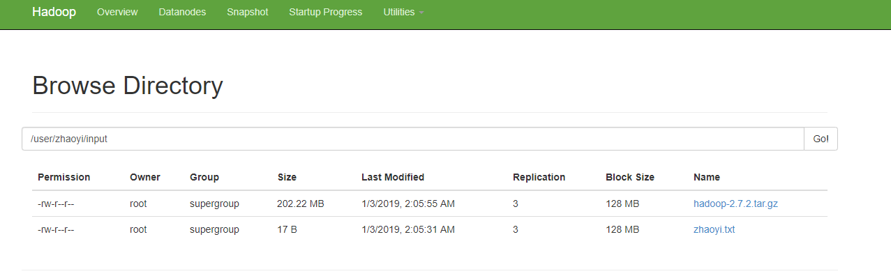
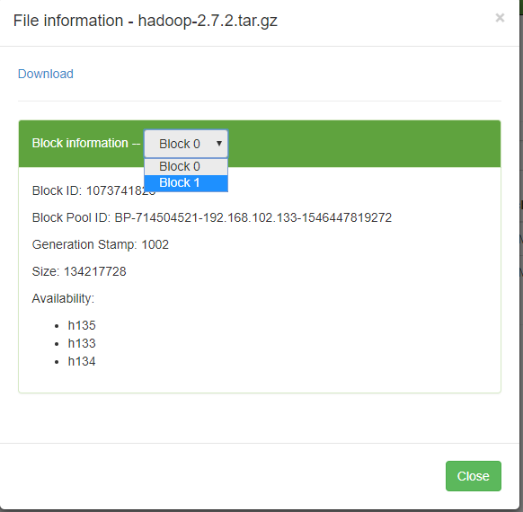

# 简介
前面我们讲到了hadoop拥有3种运行模式，搭建了最简答的本地运行模式并在其上运行了两个简单案例，之后搭建了伪分布模式，并在其上运行了wordcount案例。本章节我们学习完全分布式的模式。顾名思义，该模式使用多台机器实现分布式。

从本章节你可以学习到:
1. hadoop的完全分布式模式的搭建；
2. 在完全分布式模式下运行wordcount案例；
3. 编写脚本实现一键多台服务器文件同步；
4. 编写脚本实现一条命令多条服务器同步执行；

# 1、准备环境
我们准备3台机器（分布式最小需求），其主机文件配置如下：
```
192.168.102.133 h133
192.168.102.134 h134
192.168.102.135 h135
```
也就是说，我们准备的3台机器，主机名以h开头，133、134以及135分别是他们的v4地址的最后一段，方便区别。

> 主机配置文件位于/etc/hosts，修改主机名使用命令`hostname h133`

> 3台机器都关闭防火墙`systemctl stop firewalld`。

按本地运行模式的安装方式hadoop安装在3台机器上，请参考本教程的`2.运行环境搭建`章节。

> 如果您使用的是xshell进行各服务器的连接，最好使用`工具-发送键到所有会话`功能，一次性配置三台主机。

# 2、准备工作：配置SSH无秘钥登录
现在我们已经在3台机器上(h133、h134以及h135)。在使用scp的命令过程中，你会发现每次都要输入节点的账户密码才行，如果你安装了ssh（必装），每次输入ssh访问其他机器的时候，也需要输入密码。这不仅让我们操作起来非常麻烦，而且hadoop的一些集成脚本（如`start-dfs.sh`等）无法直接运行，需要我们配置ssh无密码登录。

1、进入用户的home目录
```shell
# cd ~
```
> `cd ~` 进入当前用户的用户目录。root用户为/root，其他用户的为/home/{$username}

2、进入`.ssh`目录，在该目录下生成秘钥对
```shell
# ssh-keygen -t rsa
```
> 输入该指令后连续3次回车，即关于秘钥对的设置都使用默认值。

3、复制秘钥对的公钥信息到各台服务器上，包括自己
```
# ssh-copy-id h133
# ssh-copy-id h134
# ssh-copy-id h135
```
> 注意不要漏掉主机本身的配置。

现在我们可以从h133上直接通过命令`'ssh hostname'`无秘钥登录到指定的主机上了。

一般情况下，我们只需针对一台机器做此配置就可以了。但是由于我们还会在另外一台机器上就行调度，因此，还需要在h134主机上做此配置。也就说，3台机器里面，我们选定两台配置无秘钥登录。h135上的操作流程同刚才的，继续执行一遍即可。

> .ssh目录下默认没有文件，当我们第一次使用远程登录命令之后会生成一个名为`known_hosts`的文件，记录访问的服务器信息；当我们执行生成秘钥对命令之后，会生成公私钥两个文件`id_rsa`和`id_rsa.pub`；当当前服务器接受了别的服务器的`ssh-copy-id`即被复制了公钥之后，会新生成文件`authorized_keys`，该文件记录认证了的主机及其秘钥对的公钥信息。

# 3、准备工作：编写集群辅助脚本
为了我们接下来方便进行一些操作，我们编写几个辅助脚本辅助操作。

## 3.1、编写xsync脚本
之前我们进行远程文件调用的时候使用的是scp命令，但要注意，scp命令顾名思义是security copy的缩写，若目标拥有相同的文件，则会覆盖更新。而rsync则代表同步的意思，若文件没有修改，则不会复制，若有修改，则会更新。从这个角度上来看rsync相对比较快速一些。具体其他的差别，可能需要具体研究。

1、安装rsync命令工具
```shell
# yum install rsync -y
```
> 最小化安装的centos一般没有配备这个工具，需要我们从镜像仓库拉取安装。

2、测试远程复制
```shell
# rsync -rvl test.txt root@h134:~ 
```
了解了rsync之后。

接下来我们编写一个脚本，内部调用rsync命令帮我们完成一个这样的操作：我们只需执行命令
```
# xsync /目录/.../文件
```
就可以将指定的路径同步到其他的服务器上，这样就省去我们打太多命令的麻烦。在`/usr/local/bin`下创建脚本文件xsync，写入如下内容:
```shell
#!/bin/bash
# 1. get param num,if 0 exit.
pcount=$#
if((pcount==0)); then
echo no args;
exit;
fi

# 2. get file name.
p1=$1
fname=`basename $p1`
echo fname=$fname

# 3. get parent dir absolute path.
pdir=`cd -P $(dirname $p1); pwd`
echo pdir=$pdir

# 4. get user name.
user=`whoami`

# 5. loop all hosts to run command 'rsync -rvl'.
for((host=133; host<=135; host++)); do
        echo $pdir/$fname $user@h$host:$pdir
        echo --------------- h$host ----------------
        rsync -rvl $pdir/$fname $user@h$host:$pdir
done
```
> 注意最后的循环部分，是用`h`加上133到135拼接目标主机名（拼接结果依次为h133 h134 h135）进行循环处理的，如果您的环境不同，请修改脚本此处的具体内容。

3、修改脚本运行权限
```
chmod 777 /usr/local/bin
```
> 777是一种很暴力的授权方式，相关授权的知识推荐书籍《Linux从入门到放弃 鸟哥版》。

4、执行脚本进行测试，在任何位置创建一个文件test.txt并写入内容，使用命令
```
xsync test.txt
```
显然，其他的两台服务器也会在相同的位置复制生成该文件。

## 3.2、编写xcall脚本
根据前面一个脚本的经验，我们不妨在编写一个脚本，可以执行

> 类似xshell这类工具其实也有提供我们多端同时输入的功能，这里的脚本比较简单，参数有关路径的必须填写绝对路径，否则出错。另外，能操作的服务器只涉及集群服务器，而不像xshell这类客户端一样可以自行配置。

1、在`/usr/local/bin`下创建xcall文件，并写入如下内容
```shell
#!/bin/bash
# 1.get parameter,no param wull be exit.
pcount=$#
if((pcount==0));then
        echo no args;
        exit;
fi

# 2.print localhost string.
echo -------------localhost----------
# 3.run command for each host.
for((host=133; host<=135; host++)); do
    echo ----------h$host---------
    ssh h$host $@
done
```
> 可以看到该脚本的执行原理是`ssh h1xx command`的方式执行的，也就是说，任何命令都是登录到目标主机之后在执行的，这就会导致目录的不一致问题，因此，我们需要提供的路径信息必须是绝对路径。

2、暴力授权：
```shell
# chmod 777 xcall
```

3、测试脚本
```shell
[root@localhost bin]# xcall ls /opt/module/
-------------localhost----------
----------h133---------
hadoop-2.7.2
jdk1.8.0_131
----------h134---------
hadoop-2.7.2
jdk1.8.0_131
----------h135---------
hadoop-2.7.2
```

# 4、集群规划及配置
接下来我们规划一下集群的节点分配以及配置文件的设置。

## 4.1、集群规划
我们按照下表所列的节点分配来规划我们的集群
||DataNode|NameNode|SecondaryNameNode|NodeManager|ResourceManager|
|:-:|:-:|:-:|:-:|:-:|:-:|
|h133|√|√||√||
|h134|√|||√|√|
|h135|√||√|√||

> 也就是说，三台机都是DataNode节点，h133用作名称节点，h135用作辅助名称节点，h133和h135用作节点管理节点，h134用作资源管理节点。

> NodeNode、SecondaryNameNode以及ResourceManager是比较耗费服务器资源的，因此我们将他们分别放在三台服务器上。

## 4.2、配置文件
选定服务器h133，在其上进行文件配置，之后我们再从h133上将配置文件推送到其他的集群服务就可以实现配置文件的同步了。
> 所有的配置文件都位于/opt/module/hadoop-2.7.2/etc/hadoop/下。以下配置是针对我的环境进行配置的，注意一些配置的值需要和你的环境保持对应。

1、`core-site.xml`:
```xml
<!-- 指定HDFS中NameNode的地址 -->
<property>
	<name>fs.defaultFS</name>
	<value>hdfs://h133:8020</value>
</property>
<!-- 指定hadoop运行时产生文件的存储目录 -->
<property>
	<name>hadoop.tmp.dir</name>
	<value>/opt/module/hadoop-2.7.2/data/tmp</value>
</property>
```

2、配置HDFS

我们先来配置HDFS组件相关的配置信息。

（1）`hadoop-env.sh`:
```
export JAVA_HOME=/opt/module/jdk1.8.0_131
```
（2）`hdfs-site.xml`:
```xml
<configuration>	
	<!-- 指定数据节点存储副本数，默认是3，因此可不配置-->
	<property>
		<name>dfs.replication</name>
		<value>3</value>
	</property>
	<!-- 指定SecondaryNameNode地址-->
	<property>
        <name>dfs.namenode.secondary.http-address</name>
        <value>h135:50090</value>
    </property>
</configuration>
```
（3）配置slaves服务节点，也就是数据节点(datanode)的主机名称，我们前面提到过，要将所有机器都作为datanode。修改`slaves`文件，加入如下内容:
```
h133
h134
h135
```
> slaves文件的默认内容为localhost，我们修改其为集群所有节点。salve文件同样位于`/opt/module/hadoop-2.7.2/etc/hadoop`下。

> 无需将该文件分发给工作节点，因为仅有运行namenode和resourcemanager上的节点的控制脚本需要使用它。

4、配置YARN

接下来我们接着配置YARN组件相关的配置信息。

（1）`yarn-env.sh`:
```
export JAVA_HOME=/opt/module/jdk1.8.0_131
```
（2）`yarn-site.xml`:
``` xml
<!-- reducer获取数据的方式 -->
<property>
	<name>yarn.nodemanager.aux-services</name>
	<value>mapreduce_shuffle</value>
</property>
<!-- 指定YARN的ResourceManager的地址 -->
<property>
	<name>yarn.resourcemanager.hostname</name>
	<value>h134</value>
</property>
```

5、配置MapReduce

最后我们配置MapReduce组件

（1）`mapred-env.sh`
```
export JAVA_HOME=/opt/module/jdk1.8.0_131
```
（2）使用mapred-site.xml.tempalte模板，修改其名字为：`mapred-site.xml`，添加如下配置：
``` xml
<!-- 指定mr运行在yarn上 -->
<property>
	<name>mapreduce.framework.name</name>
	<value>yarn</value>
</property>
```

接下来，我们的配置工作就在一台机器上完成了。这样的操作我们还需要从其他集群机器上再来一次，不过不必那么麻烦，直接使用我们前面的xsync脚本就可以了。

> 在此之前，请再一次检查你的配置文件是否有遗漏、勘误——这是个细心活。

6、分发配置文件
来到hadoop配置文件上一级，将hadoop文件夹整体分发到集群的所有节点即可完成配置文件的同步。
``` shell
# cd /opt/module/hadoop-2.7.2/etc/
# xsync hadoop
```
> 执行命令后您可以在其他服务器上查看配置文件是否成功同步。


# 5、启动集群
前面我们启动集群的时候是一个节点一个节点的启动的，现在我们使用集成脚本来启动集群。

> 格式化NameNode的时候请在namenode所在的节点上执行操作。

> 如果NameNode和ResourceManager不在同一台机器上，例如我们现在的例子。不能在NameNode上启动Yarn，应该在ResourceManager指定的服务器上启动Yarn。

1、到namenode所在服务器，即h133上格式化NameNode。
```shell
[h133]# hdfs namenode -format
```

2、h133上启动dfs组件

（1）调用dfs集成脚本启动
```shell
[h133]# start-dfs.sh
```

（2）查看节点启动情况
```shell
[h133]# xcall $JAVA_HOME/bin/jps
-------------localhost----------
----------h133---------
2227 NameNode
2347 DataNode
2575 Jps
----------h134---------
2513 DataNode
2607 Jps
----------h135---------
2168 Jps
2009 DataNode
2073 SecondaryNameNode
```
如果你的环境输出和这个不一致，例如h133上没有发现有NM DN节点，则说明有问题，请查看自己哪一步出现问题了。

4、h134上启动yarn组件

注意，启动dfs组件在h133。而现在，我们切换到h134，即ResourceManager所在的服务器上执行yarn组件的启动。

（1）调用yarn集成脚本启动组件
``` shell
[h134] start-yarn.sh
```

（2）查看启动情况
``` shell
[h134 ]# xcall $JAVA_HOME/bin/jps
-------------localhost----------
----------h133---------
2721 Jps
2227 NameNode
2615 NodeManager
2347 DataNode
----------h134---------
2656 ResourceManager
2513 DataNode
2754 NodeManager
3055 Jps
----------h135---------
2320 Jps
2211 NodeManager
2009 DataNode
2073 SecondaryNameNode
```
如果您的进程开启情况和这个一致，恭喜你，集群搭建成功了！。

> 如果中间过程出错了，要回退到初始状态，只需要停止所有的集群节点`sbin/stop-xxx.sh`，然后删除各服务器的`{HADOOP_HOME}/data` 以及 `{HADOOP_HOME}/logs`之后。盘查完问题在从头来过。

# 6、安装过程总结
## 6.1、问题排查
集群安装比较麻烦，让我想起了以前没有docker的时候安装ceph集群的恐惧。但是，任何问题只要抓住其根本就没有太大的问题，我们总结一下安装hadoop集群的经验：
1. ssh无密码登录必须要配置好，最好所有集群机器相互之间都copy一份公钥认证信息（机器过多的话推荐使用shell脚本），配置完成之后，使用`ssh host`命令测试是否畅通。
2. 第一次启动集群之前记得格式化namenode，并且要在namenode所在的服务器上执行此操作。
3. 启动ResourceManager守护进程也要在指定的服务器上执行start-yarn.sh操作。
4. 每执行一个操作之后，不要忘了通过jsp命令查看当前的守护进程开启状态是否符合预期，不符合则通过查看日志排查问题所在，如果实在是找不到根源，停止所有当前的守护进程，删掉所有节点上的logs data目录，再来一次——当然，如果还是有问题，就得看看是不是自己那个环节出了问题。下面给出一些提示：
   * 防火墙未关闭（或者对应端口未打开）
   * 主机名配置错误（/etc/hosts）
   * ssh未配置好
   * 账户系统不统一，A机器用root，B机器用其他用户等
   * 配置文件修改有问题，没有理清配置的思路

## 6.2、集群启动方式
1、各个守护进程逐一启动

（1）单独hdfs组件的各个守护进程：
```
# hadoop-daemon.sh  start|stop  namenode|datanode|secondarynamenode
```
（2）启动yarn组件的各个守护进程
```
# yarn-daemon.sh  start|stop  resourcemanager|nodemanager
```
2、各个模块分开启动（配置ssh是前提）常用
（1）整体启动/停止hdfs
```
## 在namenode所在节点使用
# start-dfs.sh
# stop-dfs.sh
```
（2）整体启动/停止yarn
```
## 在resourcemanager所在节点使用
# start-yarn.sh
# stop-yarn.sh
```
3、全部启动（官方不建议使用）
```	
start-all.sh
stop-all.sh
```

# 7、基本测试
前面我们已经完成了集群的安装，通过JPS命令也查看个守护进程启动符合预期，接下来，我们在该集群上执行基本的操作，验证集群的正确搭建。该过程在h133上完成。

1、创建一个目录
```shell
# hadoop fs -mkidr -p /user/zhaoyi/input
```

2、两个文件的上传，一个手工创建的test.txt，写入一些测试内容；另一个是比较大的文件（超过128M即可），我们选择hadoop的jar包（188M左右）。
```shell
# vi zhaoyi.txt
# hadoop fs -put zhaoyi.txt /user/zhaoyi/input
# hadoop fs -put /opt/software/hadoop-2.7.2.tar.gz /user/zhaoyi/input
```

3、操作完成之后我们通过namenode的web查看结果。访问h133IP:50070.



通过该表我们可以获取到一些有用的信息，比如文件的权限、所属的组，HDFS是分块存储的，每个块128M，大文件按128进行分割，例如我们202M的hadoop文件则分成了2个块存储(ID连续)。同时，每个文件都具有3个拷贝，分别位于三个节点上：



> 记住Block ID，我们接下来用得到。

# 8、数据存储位置及还原
## 8.1、数据存储位置
现在有一个问题，就是探究我们上传数据所在的物理路径。其实前面我们已经讲过，hadoop的HDFS会将数据存储在/tmp目录，并且在我们的集群配置中已经修改了其路径，现在，我们就去探寻一下我们的数据究竟存在什么地方，以什么样的方式存储。
```shell
[root@h133 ~]# cd /opt/module/hadoop-2.7.2/data/tmp/
[root@h133 tmp]# ll
总用量 0
drwxr-xr-x. 4 root root 30 1月   3 00:50 dfs
drwxr-xr-x. 5 root root 57 1月   3 02:21 nm-local-dir
[root@h133 ~] cd /opt/module/hadoop-2.7.2/data/tmp/dfs/data/current/BP-714504521-192.168.102.133-1546447819272/current/finalized/subdir0/subdir0
[root@h133 subdir0]# ll
总用量 208712
-rw-r--r--. 1 root root        17 1月   3 02:05 blk_1073741825
-rw-r--r--. 1 root root        11 1月   3 02:05 blk_1073741825_1001.meta
-rw-r--r--. 1 root root 134217728 1月   3 02:05 blk_1073741826
-rw-r--r--. 1 root root   1048583 1月   3 02:05 blk_1073741826_1002.meta
-rw-r--r--. 1 root root  77829046 1月   3 02:05 blk_1073741827
-rw-r--r--. 1 root root    608047 1月   3 02:05 blk_1073741827_1003.meta
```

找到了，藏得很深。

> 您的环境肯定是与我不同的block id，测试时请以自己的环境为准。

可以看到，数据总共占用了3个块，根据blk_id的形式依次存储，因此我们不难推测这三个块的数据应该是对应我们上传的2个文件的。其中blk_1073741825应该是zhaoyi.txt文件，blk_1073741826和blk_1073741827共同分割存储hadoop的tar包文件。

请看下一节，我们来验证是否符合猜想。

## 8.2、数据还原
如何验证前面的猜想？只需直接查看文件的内容或者验证这些文件是否还能还原之前的特性即可。先看blk_1073741825的内容：
```shell
root@h133 subdir0]# cat blk_1073741825
hahahahahahsdasd
```
内容和源文件完全一致。

接下来查看第二个tar文件的两个块。前面分析过，该文件被分成了两个块存储，如果我们直接查看任何一个块的内容，无疑会得到一堆乱码。因此，首要的工作应该是将两个块拼接起来。显然，用linux重定向命令将块内容重定向到临时创建的文件中。
```shell
[root@h133 subdir0]# touch hadoop 
[root@h133 subdir0]# cat blk_1073741826 >> hadoop 
[root@h133 subdir0]# cat blk_1073741827 >> hadoop
[root@h133 subdir0]# ls -al
总用量 601928
drwxr-xr-x. 2 root root       182 1月   3 02:31 .
drwxr-xr-x. 3 root root        21 1月   3 02:05 ..
-rw-r--r--. 1 root root        17 1月   3 02:05 blk_1073741825
-rw-r--r--. 1 root root        11 1月   3 02:05 blk_1073741825_1001.meta
-rw-r--r--. 1 root root 134217728 1月   3 02:05 blk_1073741826
-rw-r--r--. 1 root root   1048583 1月   3 02:05 blk_1073741826_1002.meta
-rw-r--r--. 1 root root  77829046 1月   3 02:05 blk_1073741827
-rw-r--r--. 1 root root    608047 1月   3 02:05 blk_1073741827_1003.meta
-rw-r--r--. 1 root root 212046774 1月   3 02:31 hadoop
```
212046774B，看起来和我们原始的安装包文件一模一样大，基本上符合了我们的猜想，接下来要做的，就是直接验证是否可以正确的解压此文件即可。
```shell
[root@h133 subdir0]# tar -zxvf hadoop
...
hadoop-2.7.2/share/doc/hadoop/hadoop-distcp/images/newwindow.png
hadoop-2.7.2/share/doc/hadoop/hadoop-distcp/images/apache-maven-project-2.png
hadoop-2.7.2/share/doc/hadoop/hadoop-distcp/images/icon_error_sml.gif
hadoop-2.7.2/share/doc/hadoop/hadoop-distcp/images/banner.jpg
hadoop-2.7.2/share/doc/hadoop/hadoop-distcp/images/logo_maven.jpg
hadoop-2.7.2/share/doc/hadoop/hadoop-distcp/images/icon_warning_sml.gif
hadoop-2.7.2/share/doc/hadoop/hadoop-distcp/images/icon_info_sml.gif
hadoop-2.7.2/share/doc/hadoop/hadoop-distcp/images/collapsed.gif
hadoop-2.7.2/share/doc/hadoop/hadoop-distcp/images/icon_success_sml.gif
hadoop-2.7.2/share/doc/hadoop/hadoop-distcp/images/logos/
....
```
完全没有问题。也就是说，Hadoop真正的文件存储物理位置就是在这里了，而且只是单纯的分块存储，并没有做任何修改文件内容的操作。

> 完整完成之后记得删除拼接出来的文件hadoop，这只是我们验证而已，真正应用中我们不会做这些操作，也不推荐这么做。

# 9、文件下载
就目前的我们所看见的，下载有两种方式：
* 通过namenode的web界面直接点击源文件的连接，在弹出的对话框点击download连接进行下载；
* 通过命令`hadoop fs -get hdfs_path [local_path]`进行下载，其中`local_path`可选，不指定的话，表示下载到本地目录。如果你下载的是一个目录的话，他还会为你在本地创建不存在的目录。

例如我们下载zhaoyi.txt文件
```shell
[root@h133 ~]# hadoop fs -get /user/zhaoyi/
[root@h133 ~]# ls
1  anaconda-ks.cfg  zhaoyi  zhaoyi.txt
```


# 参考
1. 官方网站：http://hadoop.apache.org/
2. 官方文档：https://archive.apache.org/dist/hadoop/common/hadoop-2.7.2/
3. 官方文档：http://hadoop.apache.org/docs/r2.7.2/
4. 书籍《hadoop权威指南 第四版》