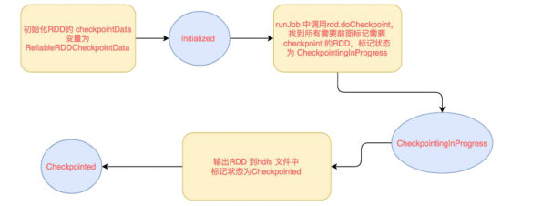

# 简介
Spark中对于数据的保存除了持久化操作之外，还提供了一种检查点的机制——检查点机制。

检查点的本质是通过将RDD写入Disk做检查点，通过lineage做容错的辅助的。

lineage过长会造成容错成本过高，这样就不如在中间阶段做检查点容错，如果之后有节点出现问题而丢失分区，从做检查点的RDD开始重做Lineage，就会减少开销。

检查点通过将数据写入到HDFS文件系统实现了RDD的检查点功能。

# 1、与缓存的对比
cache和checkpoint是有显著区别的：缓存把RDD计算出来然后放在内存中，但是RDD的依赖链（相当于数据库中的redo日志），也不能丢掉。当某个点某个executor宕了，上面cache的RDD就会丢掉，需要通过依赖链重放计算出来。而checkpoint是把 RDD保存在HDFS中，是多副本可靠存储，所以依赖链就可以丢掉了，就斩断了依赖链， 是通过复制实现的高容错。

# 2、适合检查点的情景
如果存在以下场景，则比较适合使用检查点机制:
* DAG中的Lineage过长，如果重算，则开销太大（如在PageRank中）。
* 在宽依赖上做Checkpoint获得的收益更大。

# 3、使用检查点
为当前RDD设置检查点。该函数将会创建一个二进制的文件，并存储到checkpoint目录中，通过如下的方式进行设置：
```
SparkContext.setCheckpointDir()
```
在checkpoint的过程中，该RDD的所有依赖于父RDD中的信息将全部被移出。对RDD进行checkpoint操作并不会马上被执行（懒加载），必须执行Action操作才能触发。下面我们看一个例子

```java
        SparkConf sparkConf = new SparkConf().setAppName("test").set("spark.testing.memory", "2147480000").setMaster("local");
        JavaSparkContext sc = new JavaSparkContext(sparkConf);
        // 设置检查点目录，这里使用的是本地目录，一般推荐使用hdfs文件系统目录存储
        sc.setCheckpointDir("checkDir");
        JavaRDD<String> rdd = sc.parallelize(Arrays.asList("a","b","c"));
        JavaRDD<String> noCheckRDD = rdd.map(s -> s + "_" + System.currentTimeMillis());
        // 触发
        noCheckRDD.collect();
        JavaRDD<String> checkRDD = rdd.map(s -> s + "_" + System.currentTimeMillis());
        checkRDD.checkpoint();
        checkRDD.collect();
        System.out.println("*** no checkRDD print ***");
        System.out.println("noCheckRDD 1: " + noCheckRDD.collect());
        System.out.println("noCheckRDD 2: " + noCheckRDD.collect());
        System.out.println("noCheckRDD 3: " + noCheckRDD.collect());

        System.out.println("*** checkRDD print ***");

        System.out.println("checkRDD 1: " + checkRDD.collect());
        System.out.println("checkRDD 2: " + checkRDD.collect());
        System.out.println("checkRDD 3: " +checkRDD.collect());

        sc.close();
```
最终的输出结果如下：
```
*** no checkRDD print ***
noCheckRDD 1: [a_1550135918285, b_1550135918285, c_1550135918285]
noCheckRDD 2: [a_1550135918317, b_1550135918317, c_1550135918317]
noCheckRDD 3: [a_1550135918346, b_1550135918346, c_1550135918346]

*** checkRDD print ***
checkRDD 1: [a_1550135918195, b_1550135918195, c_1550135918195]
checkRDD 2: [a_1550135918195, b_1550135918195, c_1550135918195]
checkRDD 3: [a_1550135918195, b_1550135918195, c_1550135918195]
```
可以看到，通过设置检查点，RDD将直接从检查点文件中读取数据，而不再是重新从RDD的stage过程中进行计算。


接下来我们了解一下checkpoint的具体流程：读和写流程。

# 4、checkPoint流程
## 4.1、写流程
RDD checkpoint 过程中会经过以下几个状态，
```
[ Initialized → marked for checkpointing → checkpointing in progress → checkpointed ]
```

转换流程如下：



## 4.2、读流程
当我们对一个RDD执行checkpoint操作之后checkpoint，RDD会被持久化到HDFS或本地文件夹中。

如果不被手动remove掉，文件夹是一直存在的。也就是说可以被下一个driver program使用。比如 spark streaming 挂掉了，重启后就可以使用之前checkpoint的数据进行recover，当然在同一个 driver program也可以使用。

> 具体后面的章节会演示这个过程。

如果一个RDD被checkpoint了， 如果这个RDD上有action操作或者回溯的这个RDD的时候，这个RDD进行计算的时候，里面判断如果已经checkpoint过, 对分区和依赖的处理都是使用的RDD内部的 checkpointRDD 变量，具体实现是 ReliableCheckpointRDD 类型。 这个是在 checkpoint 写流程中创建的。

依赖和获取分区方法中先判断是否已经checkpoint，如果已经checkpoint了，就斩断依赖，使用ReliableCheckpointRDD，来处理依赖和获取分区。如果没有，才往前回溯依赖。  

依赖就是没有依赖，因为已经斩断了依赖，获取分区数据就是读取checkpoint到hdfs目录中不同分区保存下来的文件。

# 总结
1. 要使用checkpoint，我们首先需要通过sc指定一个checkpoint的存储目录。该目录可以为本地文件系统，也可以是hdfs分布式文件系统。推荐后者。
```
sc.setCheckpointDir(...);
```
2. 只有触发RDD的行动操作，才会将RDD的checkpoint写入到指定的目录。整个checkpoint的读取与写入过程对用户是透明的。
