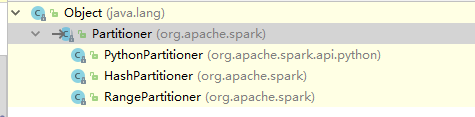

# 简介
RDD逻辑上是分区的，每个分区的数据是抽象存在的，计算的时候会通过一个compute函数得到每个分区的数据。如果RDD是通过已有的文件系统构建，则compute函数是读取指定文件系统中的数据，如果RDD是通过其他RDD转换而来，则compute函数是执行转换逻辑将其他RDD的数据进行转换。


接下来，我们看一看有关分区的概念。

# 1、键值对RDD的数据分区
Spark目前支持Hash分区和Range分区，用户也可以自定义分区。

Hash分区为当前的默认分区，Spark中分区器直接决定了RDD中分区的个数、RDD中每条数据经过Shuffle过程属于哪个分区和Reduce的个数。注意：
* 只有Key-Value类型的RDD才有分区的，非Key-Value类型的RDD分区的值是None
* 每个RDD的分区ID范围：0~numPartitions-1，该值也叫作分区的索引。

# 2、抢先试玩
我们先自以为是的玩一些有意思的，接下来的内容我们都会围绕这个例子进行说明。在java中，查看当前RDD分区的分区数据分布可以通过方法mapPartitionXX相关函数实现。如下：
```java
        JavaPairRDD<Integer,String> rdd = sc.parallelizePairs(Arrays.asList(
                new Tuple2(1, "I"),
                new Tuple2(2, "love"),
                new Tuple2(3, "you"),
                new Tuple2(4, "too")
        ), 8);

        // 未使用Hash分区之前
        System.out.println("=== The original parition info ===");
        JavaRDD javaRDD = rdd.mapPartitionsWithIndex((index, iterator) -> {
            System.out.println("index: " + index + ",partition data:" + IteratorUtils.toList(iterator));
            return iterator;
        }, false);

        javaRDD.collect();
```
这里，我们目的只是为了输出中间信息，javaRDD的collect用来触发实际的mapPartitionsWithIndex操作。输出如下：
```
=== The original parition info ===
index: 0,partition data:[]
index: 1,partition data:[(1,I)]
index: 2,partition data:[]
index: 3,partition data:[(2,love)]
index: 4,partition data:[]
index: 5,partition data:[(3,you)]
index: 6,partition data:[]
index: 7,partition data:[(4,too)]
```
可以看到，当前的RDD拥有8个分区，但是只有其中4个分区拥有数据。

接下来我们通过指定相应的hash分区器，对RDD的数据进行重新分区。
```java
// 使用Hash分区器重新分区
        final JavaPairRDD<Integer, String> rdd2 = rdd.partitionBy(new HashPartitioner(3));
        // 使用Hash分区之后
        System.out.println("=== User HashPartition info ===");
        JavaRDD<Tuple2<Integer, String>> tuple2JavaRDD = rdd2.mapPartitionsWithIndex((index, iterator) -> {
            System.out.println("index: " + index + ",partition data:" + IteratorUtils.toList(iterator));
            return iterator;
        }, false);
```
得到输出如下：
```
=== User HashPartition info ===
index: 0,partition data:[(3,you)]
index: 1,partition data:[(1,I), (4,too)]
index: 2,partition data:[(2,love)]
```
可以看到，分区被压缩为3个，并且索引号为1的分区存放了key为1，4的两个数据，这是根据我们指定的分区数3，使用`key%num_partition`得到的结果来存放的。1，4对3（我们在HashPartitioner(3)处指定的分区数）求余的结果为1，决定了其分区的索引为1，其他两个数据计算分区索引的方式也是一样的。

# 3、获取RDD的分区方式
可以通过使用RDD的getPartitioner方法来获取RDD的分区信息。它会返回一个 Optional<Partitioner>对象，通过get方法获取其中的值。
```java
        JavaPairRDD<Integer,String> rdd = sc.parallelizePairs(Arrays.asList(
                new Tuple2(1, "I"),
                new Tuple2(2, "love"),
                new Tuple2(3, "you"),
                new Tuple2(4, "too")
        ), 8);

        Optional<Partitioner> partitioner = rdd.partitioner();

        if(partitioner.isPresent()){
            System.out.println("partition info:" + partitioner.get());
        }else{
            System.out.println("Now no partitioner");
        }
        // 使用Hash分区器重新分区
        final JavaPairRDD<Integer, String> rdd2 = rdd.partitionBy(new HashPartitioner(3));

        Optional<Partitioner> partitioner1 = rdd2.partitioner();
        if(partitioner1.isPresent()){
            System.out.println("partition info:" + partitioner1.get());
        }else{
            System.out.println("Now no partitioner");
        }
```
输出如下：
```
Now no partitioner
partition info:org.apache.spark.HashPartitioner@3
```
可以看到，默认情况下，是没有分区信息的。当我们指定了使用Hash分区之后，可以获取到分区器的信息为`org.apache.spark.HashPartitioner`。这里，我们可以通过源码查看分区器有哪几种种类



首先，我们来看Hash分区器。

# 4、分区方式
## 4.1、Hash分区方式
HashPartitioner分区的原理：对于给定的key，计算其hashCode，并除于分区的个数取余，如果余数小于0，则用余数+分区的个数，最后返回的值就是这个key所属的分区ID。具体的例子就是我们抢先试玩一章节中提到的，这里不在阐述。这里贴一下该分区器比较关键的源码：
```java
...
    public int getPartition(final Object key) {
        int var2;
        if (key == null) {
            var2 = 0;
        } else {
            var2 = .MODULE$.nonNegativeMod(key.hashCode(), this.numPartitions());
        }

        return var2;
    }
    ...
```

## 4.2、Range分区方式
HashPartitioner分区弊端：可能导致每个分区中数据量的不均匀，极端情况下会导致某些分区拥有RDD的全部数据。
RangePartitioner分区优势：尽量保证每个分区中数据量的均匀，而且分区与分区之间是有序的，一个分区中的元素肯定都是比另一个分区内的元素小或者大；
但是分区内的元素是不能保证顺序的。简单的说就是将一定范围内的数映射到某一个分区内。
RangePartitioner作用：将一定范围内的数映射到某一个分区内，在实现中，分界的算法尤为重要。用到了水塘抽样算法。
```java
public int getPartition(final Object key) {
        Object k = key;
        int partition = 0;
        if (.MODULE$.array_length(this.rangeBounds()) <= 128) {
            while(partition < .MODULE$.array_length(this.rangeBounds()) && this.ordering().gt(k, .MODULE$.array_apply(this.rangeBounds(), partition))) {
                ++partition;
            }
        } else {
            partition = BoxesRunTime.unboxToInt(this.binarySearch().apply(this.rangeBounds(), key));
            if (partition < 0) {
                partition = -partition - 1;
            }

            if (partition > .MODULE$.array_length(this.rangeBounds())) {
                partition = .MODULE$.array_length(this.rangeBounds());
            }
        }

        return this.ascending() ? partition : .MODULE$.array_length(this.rangeBounds()) - partition;
    }
```

## 4.3、python分区方式
```java
...
    public int getPartition(final Object key) {
        int var2;
        if (key == null) {
            var2 = 0;
        } else if (key instanceof Long) {
            long var4 = BoxesRunTime.unboxToLong(key);
            var2 = .MODULE$.nonNegativeMod((int)var4, this.numPartitions());
        } else {
            var2 = .MODULE$.nonNegativeMod(key.hashCode(), this.numPartitions());
        }

        return var2;
    }
    ...
```

# 5、自定义分区方式
前面我们讲到了三种分区方式，在实际应用中，可能还需要自己去定义分区，以实现更加完美的分区方式。接下来我们就学习一下，如何通过自定义分区器来实现分区逻辑。

要实现自定义的分区器，需要继承`org.apache.spark.Partitioner`类，该类的源码如下所示：
```java
public abstract class Partitioner implements Serializable {
    public static Partitioner defaultPartitioner(final RDD<?> rdd, final Seq<RDD<?>> others) {
        return Partitioner$.MODULE$.defaultPartitioner(var0, var1);
    }

    public abstract int numPartitions();

    public abstract int getPartition(final Object key);

    public Partitioner() {
    }
}
```
显然，我们只需实现其中的抽象方法即可： 
* numPartitions: 返回创建出来的分区数。 
* getPartition:返回给定键的分区编号(0到numPartitions-1)。 
* equals(): 判断相等性的标准方法。Spark通过该方法判断两个RDD的分区方式是否相同。

假设需要将相同后缀的数据写入相同的文件，可以通过将相同后缀的数据导向同一个分区并保存输出来实现。下面我们编写一个自定义分区器
```java
package com.spark.com.spark.partition;

import org.apache.spark.Partitioner;

public class MyPartitioner extends Partitioner {

    // 分区数量
    private final int partitions;

    // 返回分区数
    @Override
    public int numPartitions() {
        return partitions;
    }

    @Override
    public int getPartition(Object key) {
        int index;
        if (key == null) {
            index = 0;
        } else {
            String keyString = key.toString();
            // 获取key的最后一个数字
            index = Integer.valueOf(keyString.substring(keyString.length() - 1)) % partitions;
        }
        return index;
    }

    public MyPartitioner(final int partitions) {
        this.partitions = partitions;
    }
}
```
可以看到，我们的分区逻辑是根据key的最后一个数字，转化为整形之后在对指定的分区数取余的。

> 如果不是很了解自定义分区器的逻辑，可以参考HashPartitioner的源码编写自定义分区器，这是个不错的蓝本。


那么显然，类似于a.3,b.3这样的key元素会落到同一个分区，接下来，我们编写测试程序。该程序用到了我们之前的例子作为对比。只需注意最后的一段逻辑即可。
```java
...
public class MyPartitionerTest {
    public static void main(String[] args) {
        Logger logger = LoggerFactory.getLogger(com.spark.transformation.AggregateTest.class);
        SparkConf sparkConf = new SparkConf().setAppName("test").set("spark.testing.memory", "2147480000").setMaster("local");
        JavaSparkContext sc = new JavaSparkContext(sparkConf);

        JavaPairRDD<String,String> rdd = sc.parallelizePairs(Arrays.asList(
                new Tuple2("a.1", "I"),
                new Tuple2("b.2", "love"),
                new Tuple2("c.3", "you"),
                new Tuple2("d.3", "too")
        ), 8);

        // 未使用Hash分区之前
        System.out.println("=== The original parition info ===");
        JavaRDD javaRDD = rdd.mapPartitionsWithIndex((index, iterator) -> {
            System.out.println("index: " + index + ",partition data:" + IteratorUtils.toList(iterator));
            return iterator;
        }, false);

        javaRDD.collect();

        // 使用Hash分区器重新分区
        final JavaPairRDD<String, String> rdd2 = rdd.partitionBy(new HashPartitioner(3));
        // 使用Hash分区之后
        System.out.println("=== Use HashPartition info ===");
        JavaRDD<Tuple2<String, String>> tuple2JavaRDD = rdd2.mapPartitionsWithIndex((index, iterator) -> {
            System.out.println("index: " + index + ",partition data:" + IteratorUtils.toList(iterator));
            return iterator;
        }, false);

        tuple2JavaRDD.collect();

        // 使用自定义分区器分区
        System.out.println("=== Use MyPartition info ===");
        final JavaPairRDD<String, String> rdd3 = rdd.partitionBy(new MyPartitioner(3));
        JavaRDD<Tuple2<String, String>> tuple3JavaRDD = rdd3.mapPartitionsWithIndex((index, iterator) -> {
            System.out.println("index: " + index + ",partition data:" + IteratorUtils.toList(iterator));
            return iterator;
        }, false);
        tuple3JavaRDD.collect();
        sc.close();
    }
}
```
最后可以得到输出结果：
```
=== The original parition info ===
index: 0,partition data:[]
index: 1,partition data:[(a.1,I)]
index: 2,partition data:[]
index: 3,partition data:[(b.2,love)]
index: 4,partition data:[]
index: 5,partition data:[(c.3,you)]
index: 6,partition data:[]
index: 7,partition data:[(d.3,too)]

=== Use HashPartition info ===
index: 0,partition data:[(a.1,I)]
index: 1,partition data:[(c.3,you)]
index: 2,partition data:[(b.2,love), (d.3,too)]

=== Use MyPartition info ===
index: 0,partition data:[(c.3,you), (d.3,too)]
index: 1,partition data:[(a.1,I)]
index: 2,partition data:[(b.2,love)]
```
可以看到，使用不同的分区器可以得到不同的数据分布分区结果。我们自定义的分区器，将末尾数字相同的数据分在了一个分区。


