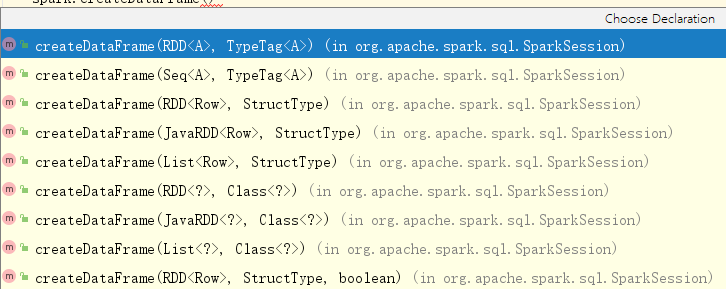
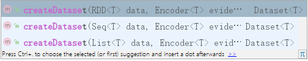

# 简介
快速开始体验Spark SQL。

# 1、编写第一个程序
在老的版本中，SparkSQL提供两种SQL查询起始点：
* SQLContext：用于Spark自己提供的SQL查询；
* HiveContext：用于连接Hive的查询。

SparkSession是Spark最新的SQL查询起始点，实质上是SQLContext和HiveContext的组合，所以在SQLContext和HiveContext上可用的API在SparkSession上同样是可以使用的。

SparkSession内部封装了sparkContext，所以计算实际上创建的过程是由sparkContext完成的。

要运用Spark SQL，几乎都需要创建一个公共的入口点，那就是SparkSesssion。我们可以使用SparkSession.builder()，即函数式方式创建SparkSession。在此之前，先导入使用Spark SQL相关的Java包。

``` xml
       <!-- https://mvnrepository.com/artifact/org.apache.spark/spark-core -->
        <dependency>
            <groupId>org.apache.spark</groupId>
            <artifactId>spark-core_2.12</artifactId>
            <version>2.4.0</version>
        </dependency>

        <!-- https://mvnrepository.com/artifact/com.thoughtworks.paranamer/paranamer -->
        <dependency>
            <groupId>com.thoughtworks.paranamer</groupId>
            <artifactId>paranamer</artifactId>
            <version>2.8</version>
        </dependency>

        <!-- https://mvnrepository.com/artifact/org.apache.spark/spark-hive -->
         <!-- spark sql -->
        <dependency>
            <groupId>org.apache.spark</groupId>
            <artifactId>spark-sql_2.12</artifactId>
            <version>2.4.0</version>
        </dependency>
```

2、创建SparkSession
```java
        SparkConf conf = new SparkConf().setAppName("sql").setMaster("local").set("spark.testing.memory", "2140000000");
        SparkSession spark = SparkSession.builder().appName("sql").config(conf).getOrCreate();
```

3、创建DataFrames

创建了SparkSession之后，我们就可以通过他从几个数据对象创建DataFrames，如:
* 已经存在的RDD
* Hive表
* Spark数据源（之前讲到的各种文件）

例如，从json文件创建
```java
    SparkConf conf = new SparkConf().setAppName("sql").setMaster("local").set("spark.testing.memory", "2140000000");
    SparkSession spark = SparkSession.builder().appName("sql").config(conf).getOrCreate();
    // load json file.
    Dataset<Row> rowDataSet = spark.read().json("user.json");

    // print original schema.
    rowDataSet.printSchema();
    rowDataSet.show();
```
json文件的内容如下：
```json
[{"id":1,"login_name":"zhaoyi","age":20},{"id":2,"login_name":"arya","age":17},{"id":1,"login_name":"joyblack","age":30},{"id":1,"login_name":"akuya","age":14}]
```
我们可以得到如下的输出
```
root
 |-- id: long (nullable = true)
 |-- name: string (nullable = true)

+---+-------+
| id|   name|
+---+-------+
|  1| zhaoyi|
|  2|hongqun|
+---+-------+
```

# 2、创建DataFrames(Dataset)
前面提到，在Spark SQL中SparkSession是创建DataFrames和执行SQL的入口。

创建DataFrames有三种方式：
* 从一个存在的RDD进行转换
* 从Hive Table进行查询返回
* 通过Spark的数据源进行创建。

> 官方文档有提到： Java API, users need to use Dataset<Row> to represent a DataFrame。也就说，在java中都是使用Dataset接收两种不同的返回类型的。

## 2.1、从Spark数据源进行创建
``` java
    // load json file.
    Dataset<Row> rowDataSet = spark.read().json("user.json");
    // load  parquet file.
    Dataset<Row> usersDF = spark.read().load("examples/src/main/resources/users.parquet");
    // csv file
    Dataset<Row> peopleDFCsv = spark.read().format("csv")
  .option("sep", ";")
  .option("inferSchema", "true")
  .option("header", "true")
  .load("examples/src/main/resources/people.csv");
```

## 2.2、从RDD进行转换

SparkSession对象提供了createDataFrame方法用于我们方便在应用程序中创建DataFrame，如下图是这些方法支持的类型重载。



在java中，Dataset和DataFrame是一回事，因此也可以使用创建Dataset的API，只不过该API需要指定编码器




这里，我们挑选
```
public Dataset<Row> createDataFrame(final JavaRDD<?> rdd, final Class<?> beanClass)
```
作为本次示例的使用方法：
```java
    JavaRDD<User> rdd = sc.parallelize(Arrays.asList(new User(1, "zhaoyi"), new User(2, "hongqun"), new User(3,"akuya")));
    Dataset<Row> userDataset = spark.createDataFrame(rdd, User.class);
    userDataset.show();
```

输出：
```
+---+-------+
| id|   name|
+---+-------+
|  1| zhaoyi|
|  2|hongqun|
|  3|  akuya|
+---+-------+
```
> 注意自己定义一个User bean，他有两个字段(id,name)。通过Dataset的print方法可以打印当前数据集的数据结构以及数据信息。

## 2.3、从Hive转换
后面谈到spark sql的数据源的时候在详细的介绍。


