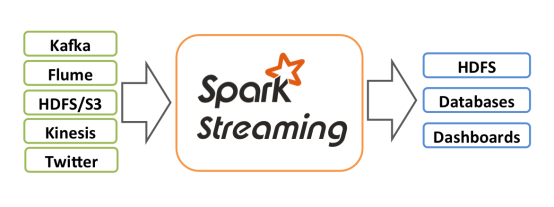
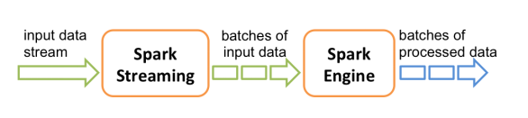
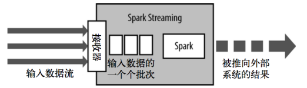
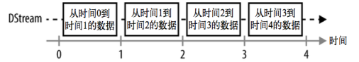
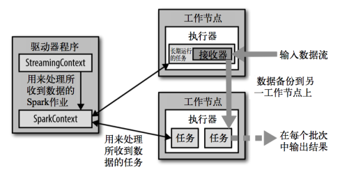
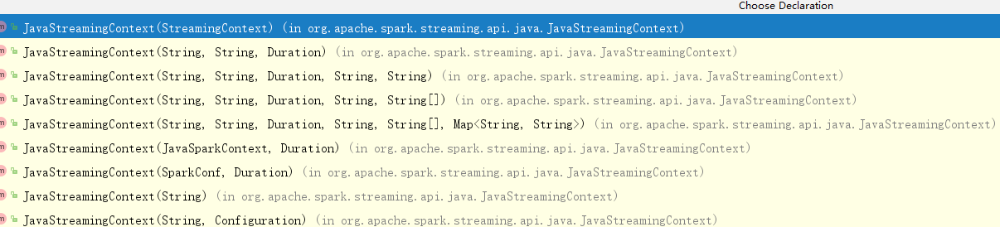
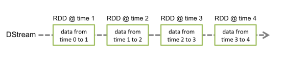
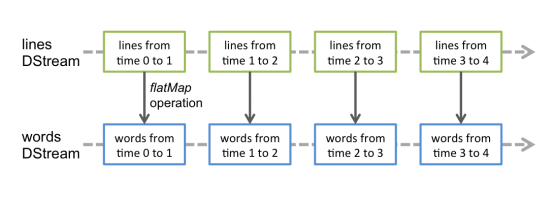

# 简介
我们之前学习的RDD、Dataset等，其实都属于批处理操作，也就是所谓的离线计算，而通过stream我们可以进行流式计算，也就是所谓的在线计算。

Spark Streaming makes it easy to build scalable（可扩展） fault-tolerant(容错) streaming applications.

# 1、Spark Stream的特点
Spark Streaming类似于Apache Storm，用于流式数据的处理。

根据其官方文档介绍，Spark Streaming有高吞吐量和容错能力强等特点。Spark Streaming支持的数据输入源很多，例如：Kafka、Flume、Twitter、ZeroMQ和简单的TCP套接字等等。

数据输入后可以用Spark的高度抽象原语如：map、reduce、join、window等进行运算。

而结果也能保存在很多地方，如HDFS，数据库等。另外Spark Streaming也能和MLlib（机器学习）以及Graphx完美融合。



> Storm也是一个很热门的流处理框架。


# 2、Spark Stream的抽象概念与架构

## 2.1、抽象概念

和Spark基于RDD的概念很相似，Spark Streaming使用离散化流(discretized stream)作为抽象表示，叫作DStream。DStream 是随时间推移而收到的数据的序列。在内部，每个时间区间收到的数据都作为 RDD 存在，而 DStream 是由这些 RDD 所组成的序列(因此得名“离散化”)。



我们可以总结一下前面学过的spark core、spark sql以及当前的spark stream的各个抽象特点
```
Spark Core   -> RDD
Spark Sql    -> DataFrame、Dataset
Spark Stream -> DStream(在java中：JavaDStream)
```
翻看源码可以了解到，底层的DStream是一个Hash格式的以时间为键，RDD为值的Hash表。为了避免溢出，spark会在指定的时间内定时的清理该Hash表内的数据。

## 2.2、架构
Spark Streaming使用“微批次”的架构，把流式计算当作一系列连续的小规模批处理来对待。

Spark Streaming从各种输入源中读取数据，并把数据分组为小的批次。




新的批次按均匀的时间间隔创建出来。在每个时间区间开始的时候，一个新的批次就创建出来，在该区间内收到的数据都会被添加到这个批次中。

在时间区间结束时，批次停止增长。时间区间的大小是由批次间隔这个参数决定的。批次间隔一般设在500毫秒到几秒之间，由应用开发者配置。每个输入批次都形成一个RDD，以 Spark 作业的方式处理并生成其他的 RDD。 处理的结果可以以批处理的方式传给外部系统。

从架构推导抽象的概念，如前面所说：Spark Streaming的编程抽象是离散化流，也就是DStream。它是一个 RDD 序列，每个RDD代表数据流中一个时间片内的数据。 



Spark Streaming在Spark的驱动器程序—工作节点的结构的执行过程如下图所示。Spark Streaming为每个输入源启动对 应的接收器。接收器以任务的形式运行在应用的执行器进程中，从输入源收集数据并保存为 RDD。它们收集到输入数据后会把数据复制到另一个执行器进程来保障容错性(默认行为)。



数据保存在执行器进程的内存中，和缓存 RDD 的方式一样。驱动器程序中的 StreamingContext 会周期性地运行 Spark 作业来处理这些数据，把数据与之前时间区间中的 RDD 进行整合。 

# 3、Spark Stream的入口
在Java中，可以通过JavaStreamingContext作为Spark Stream的入口（其他的语言是StreamingContext）。

创建JavaStreamingContext方式有很多：



不过最常用的还是如下的两种方式：

1. 通过SparkConf对象创建
```java
import org.apache.spark.*;
import org.apache.spark.streaming.api.java.*;

SparkConf conf = new SparkConf().setAppName(appName).setMaster(master);
JavaStreamingContext ssc = new JavaStreamingContext(conf, new Duration(1000));
```

2. 通过JavaSparkContext对象创建
```java
import org.apache.spark.streaming.api.java.*;

JavaSparkContext sc = ...   //existing JavaSparkContext
JavaStreamingContext ssc = new JavaStreamingContext(sc, Durations.seconds(1));
```

# 4、DStreams
Discretized Stream是Spark Streaming的基础抽象，代表持续性的数据流和经过各种Spark原语操作后的结果数据流。

在内部实现上，DStream是一系列连续的RDD来表示。每个RDD含有一段时间间隔内的数据，如下图：



对数据的操作也是按照RDD为单位来进行的：



计算过程由Spark engine来完成：


# 5、案例
接下来我们做一个案例：使用Spark Stream编程模型来统计单词频数。

添加pom依赖
```xml
    <!-- spark -->
    <dependency>
        <groupId>org.apache.spark</groupId>
        <artifactId>spark-core_2.12</artifactId>
        <version>2.4.0</version>
    </dependency>

    <!-- spark streaming -->
    <dependency>
        <groupId>org.apache.spark</groupId>
        <artifactId>spark-streaming_2.12</artifactId>
        <version>2.4.0</version>
    </dependency>
```
编写如下的程序
```java
package com.spark.stream;

import org.apache.spark.SparkConf;
import org.apache.spark.streaming.Durations;
import org.apache.spark.streaming.api.java.JavaDStream;
import org.apache.spark.streaming.api.java.JavaReceiverInputDStream;
import org.apache.spark.streaming.api.java.JavaStreamingContext;
import scala.Tuple2;

import java.util.Arrays;

public class StreamWordSplit {

    public static void main(String[] args) {
        // 1.创建SparkConf
        SparkConf sparkConf = new SparkConf().setMaster("local[*]").set("spark.testing.memory", "2140000000").setAppName("word split");

        // 2.创建JavaStreamingContext,每2秒获取一次
        JavaStreamingContext jsc = new JavaStreamingContext(sparkConf, Durations.seconds(2));

        // 3.从本机端口9999获取流数据
        JavaReceiverInputDStream<String> lines = jsc.socketTextStream("localhost", 9999);

        // 4.将每一次获取的结果进行切分
        JavaDStream<String> words = lines.flatMap(line -> Arrays.asList(line.split(" ")).iterator());

        // 5.根据输入的单词来统计各个单词出现的次数（注意这里只是每段时间内获取到的数据，因此属于我们讨论的无状态转换）
        JavaDStream<Tuple2<String,Integer>> wordPair = words.map(word -> new Tuple2<>(word, 1));

        // 6.打印结果
        wordPair.print();

        // 启动流计算
        jsc.start();

        // 等待计算终止
        try {
            jsc.awaitTermination();
        } catch (InterruptedException e) {
            e.printStackTrace();
        }
    }
}
```

刚启动的时候我们查看控制台日志：
```
-------------------------------------------
Time: 1550473502000 ms
-------------------------------------------

-------------------------------------------
Time: 1550473504000 ms
```

可以看到，当前的应用程序正在监听来自于9999端口的数据。

接下来运行一个服务端，用于写入数据
```
# nc -l -p 9999
this is a test.
haha
```
> 如果是windows用户则需要安装netcat工具包，安装地址：https://eternallybored.org/misc/netcat/。 解压之后cmd模式进入该目录执行该命令。（也可以将netcat的目录配置在path路径中，这样就无需进入该目录也可以使用nc命令了）

这时候，我们的监听程序就可以处理输入的数据了，得到如下的输出：
```
-------------------------------------------
Time: 1550474364000 ms
-------------------------------------------
(this,1)
(is,1)
(a,1)
(test,1)

-------------------------------------------
Time: 1550474366000 ms
-------------------------------------------
(haha,1)
```

需要注意的是，当我们初始化完Context之后，可以执行如下的操作：
1. 定义消息输入源来创建DStreams.
2. 定义DStreams的转化操作和输出操作。
3. 通过`streamingContext.start()`来启动消息采集和处理.
4. 等待程序终止，可以通过`streamingContext.awaitTermination()`来设置;
5. 通过streamingContext.stop()来手动终止处理程序。

> StreamingContext一旦启动，对DStreams的操作就不能修改了。在同一时间一个JVM中只有一个StreamingContext可以启动stop() 方法将同时停止SparkContext，可以传入参数stopSparkContext用于只停止StreamingContext。

# L.总结
## L.1、Spark Stream是什么？
1、Spark Stream是Spark中的一个组件，基于Spark Core进行构建，用于对流式数据进行处理，类似Storm；

2、Spark Stream能够和Spark Core、Spark SQL进行混合编程。

3、Spark Stream可以接收：kafka、flume、HDFS、Twitter等数据；

4、Spark处理数据分为两种方式：
* 无状态转换 处理的数据之间没有任何关联
* 有状态转换 处理的数据存在关系（比如累加）

## L.2、Spark Stream是如何实现的？
1、Spark Stream采用“微批次”架构

2、对于整个流式计算来说，数据流可以联想到水流。微批次架构就是将水流按照用户设定的时间间隔分割为多个水流段。一个段的水会在Spark中转化为一个RDD，所以对水流的操作也就是对这些分割后的RDD进行单独的操作。
> 每一个RDD的操作都可以认为是一个小的批处理。（离线处理）这个概念，很像**概率密度**。

## L.3、Spark Stream DStream是什么？
1、DStream是类似于RDD和DataFrame这样的针对流式计算的抽象类。在源码中DStream是通过HashMap来保存他所管理的数据流的。其中，K是RDD中数据流的时间，V是包含数据流的RDD；

2、对于DStream的操作也就是对于DStream所包含的所以以时间序列为排序的RDD的操作；

## L.4、Spark Stream如何使用
在Java中，可以通过JavaStreamingContext作为Spark Stream的入口（其他的语言是StreamingContext）。


