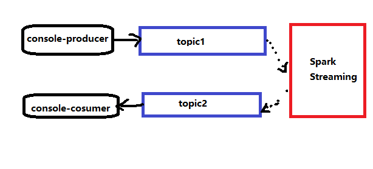
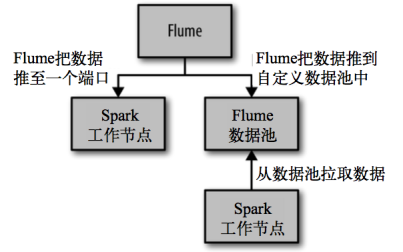

# 简介
Spark Streaming原生支持一些不同的数据源。

一些“核心”数据源已经被打包到Spark Streaming 的 Maven 工件中，而其他的一些则可以通过 spark-streaming-kafka 等附加工件获取。

每个接收器都以 Spark 执行器程序中一个长期运行的任务的形式运行，因此会占据分配给应用的 CPU 核心。此外，我们还需要有可用的 CPU 核心来处理数据。这意味着如果要运行多个接收器，就必须至少有和接收器数目相同的核心数，还要加上用来完成计算所需要的核心数。

> 例如，如果我们想要在流计算应用中运行 10 个接收器，那么至少需要为应用分配 11 个 CPU 核心。所以如果在本地模式运行，不要使用local或者local[1]。

按照工件是否已经存在Spark核心的Maven组件中，将数据源分为两类，一类是基本数据源，另一类则是需要附加的高级数据源。

## 1、基本数据源
通过端口建立Socket，从而传输数据流的方式。我们在上一章节的例子已经使用过。
## 1.1、文件数据源
指能够读取所有HDFS API兼容的文件系统文件。

可以通过fileStream方法进行读取。
```java
streamingContext.fileStream<KeyClass, ValueClass, InputFormatClass>(dataDirectory);
```
对于文本文件，则可以直接使用textFileStream
```
streamingContext.textFileStream(dataDirectory);
```
> textFileStream底层还是调用了fileStream方法，只不过将输入格式化类设置为TextInputFormat。

需要注意的是：Spark Streaming 将会监控 dataDirectory 目录并不断处理移动进来的文件。同时：
* 所有的文件需要有相同的数据格式
* 文件进入dataDirectory的方式需要通过移动或者重命名来实现。
* 一旦文件移动进目录，则不能再修改，即便修改了也不会读取新数据。

```java
package com.spark.stream;

import org.apache.spark.SparkConf;
import org.apache.spark.streaming.Durations;
import org.apache.spark.streaming.api.java.JavaDStream;
import org.apache.spark.streaming.api.java.JavaPairInputDStream;
import org.apache.spark.streaming.api.java.JavaReceiverInputDStream;
import org.apache.spark.streaming.api.java.JavaStreamingContext;
import scala.Tuple2;

import java.util.Arrays;

public class StreamDataSrouceTest {

    public static void main(String[] args) {
        // 1.创建SparkConf
        SparkConf sparkConf = new SparkConf().setMaster("local[*]").set("spark.testing.memory", "2140000000").setAppName("word split");

        // 2.创建JavaStreamingContext,每2秒获取一次
        JavaStreamingContext jsc = new JavaStreamingContext(sparkConf, Durations.seconds(2));

        JavaDStream<String> lines = jsc.textFileStream("D:\\input");

        // 4.将每一次获取的结果进行切分
        JavaDStream<String> words = lines.flatMap(line -> Arrays.asList(line.split(" ")).iterator());

        // 5.根据输入的单词来统计各个单词出现的次数（注意这里只是每段时间内获取到的数据，因此属于我们讨论的无状态转换）
        JavaDStream<Tuple2<String,Integer>> wordPair = words.map(word -> new Tuple2<>(word, 1));

        // 6.打印结果
        wordPair.print();

        // 启动流计算
        jsc.start();

        // 等待计算终止
        try {
            jsc.awaitTermination();
        } catch (InterruptedException e) {
            e.printStackTrace();
        }


    }
}
```

进入D盘的input目录，打开CMD命令行
```
# echo this is a test ssdsd333 > test3.txt
```

这时候可以得到输出结果：
```
-------------------------------------------
Time: 1550477140000 ms
-------------------------------------------
(this,1)
(is,1)
(a,1)
(test,1)
(ssdsd333,1)
```

> windows本地环境下，直接copy粘贴文件到目录中是不会触发计算的，需要通过新建文件的方式，通过命令行、程序写入等方式写入文件。不过，使用Hadoop文件系统就不会出现这种问题。

> 这种以文件的方式一般不会使用，不过应该会有其运用场景。

## 1.2、自定义数据源
一般没有合适的抓取手段的时候，都是通过自定义数据源来完成需求。

我们现在已经学习了两种数据源的处理模式
```
    // 1.从本机端口9999获取流数据获取
    JavaReceiverInputDStream<String> lines = jsc.socketTextStream("localhost", 9999);
    // 2.从指定路径的文件系统目录获取数据
    JavaDStream<String> lines = jsc.textFileStream("D:\\input");
```
参考文献：http://spark.apache.org/docs/latest/streaming-custom-receivers.html。

接下来这个案例取材自官方，他是一个模仿SocketReceiver的案例，也是基于socket的自定义数据源。

1、创建自定义的Receiver<T>类
```java
// string定义了接收数据的类型
public class JavaCustomReceiver extends Receiver<String> {

  String host = null;
  int port = -1;

  public JavaCustomReceiver(String host_ , int port_) {
    super(StorageLevel.MEMORY_AND_DISK_2());
    host = host_;
    port = port_;
  }

  @Override
  public void onStart() {
    // Start the thread that receives data over a connection
    new Thread(this::receive).start();
  }

  @Override
  public void onStop() {
    // There is nothing much to do as the thread calling receive()
    // is designed to stop by itself if isStopped() returns false
  }

  /** Create a socket connection and receive data until receiver is stopped */
  private void receive() {
    Socket socket = null;
    String userInput = null;

    try {
      // connect to the server
      socket = new Socket(host, port);

      BufferedReader reader = new BufferedReader(
        new InputStreamReader(socket.getInputStream(), StandardCharsets.UTF_8));

      // Until stopped or connection broken continue reading
      while (!isStopped() && (userInput = reader.readLine()) != null) {
        System.out.println("Received data '" + userInput + "'");
        store(userInput);
      }
      reader.close();
      socket.close();

      // Restart in an attempt to connect again when server is active again
      restart("Trying to connect again");
    } catch(ConnectException ce) {
      // restart if could not connect to server
      restart("Could not connect", ce);
    } catch(Throwable t) {
      // restart if there is any other error
      restart("Error receiving data", t);
    }
  }
}
```

2、使用自定义Receiver
```java
// Assuming ssc is the JavaStreamingContext
JavaDStream<String> customReceiverStream = ssc.receiverStream(new JavaCustomReceiver(host, port));
JavaDStream<String> words = customReceiverStream.flatMap(s -> ...);
...
```

## 1.3、RDD数据源
```
streamingContext.queueStream(queueOfRDDs)
```
这样，每一个推送到queueOfRDDs这个队列中的RDD，都会作为一个DStream被处理。

例如下面的例子：

```java
package com.spark.stream;

import org.apache.spark.SparkConf;
import org.apache.spark.api.java.JavaRDD;
import org.apache.spark.streaming.Durations;
import org.apache.spark.streaming.api.java.JavaDStream;
import org.apache.spark.streaming.api.java.JavaStreamingContext;

import java.util.ArrayList;
import java.util.List;
import java.util.Random;
import java.util.concurrent.LinkedBlockingDeque;

public class StreamDataSrouceTest {

    public static void main(String[] args) throws InterruptedException {
        // 1.创建SparkConf
        SparkConf sparkConf = new SparkConf().setMaster("local[*]").set("spark.testing.memory", "2140000000").setAppName("word split");

        // 2.创建JavaStreamingContext,每2秒获取一次
        JavaStreamingContext jsc = new JavaStreamingContext(sparkConf, Durations.seconds(1));

        // 3.从本机端口9999获取流数据

        LinkedBlockingDeque<JavaRDD<Integer>> rddQueues = new LinkedBlockingDeque<>();

        JavaDStream<Integer> ds = jsc.queueStream(rddQueues);

        JavaDStream<Integer> loveDS = ds.filter(line -> line < 5);

        System.out.println("********");
        loveDS.print();
        System.out.println("********");

        // 启动
        jsc.start();

        try {
            jsc.awaitTermination();
        } catch (InterruptedException e) {
            e.printStackTrace();
        }

        // 依次录入10次数据
        int times = 10;
        while(times >=0){
            // 随机生成1和2两个数字

            List<Integer> numbers = new ArrayList<>();
            for(int i=0;i<10;i++){
                int number = new Random().nextInt(10) ;
                numbers.add(number);
            }
            JavaRDD<Integer> nowRDD = jsc.sparkContext().parallelize(numbers);
            rddQueues.add(nowRDD);
            times --;

            Thread.sleep(2000);
        }
    }
}
```
程序并没有像意料中那样执行。

最终，在官方的Java API中针对queueStream方法有这样的说明：
```
1. Changes to the queue after the stream is created will not be recognized. 

2. Arbitrary RDDs can be added to queueStream, there is no way to recover data of those RDDs, so queueStream doesn't support checkpointing.
```

而在scala中却没有，因此，我们必须先改变queueRDD，然后在创建stream，官方案例:https://github.com/apache/spark/blob/68ed3632c56389ab3ff4ea5d73c575f224dab4f6/examples/src/main/java/org/apache/spark/examples/streaming/JavaQueueStream.java。

修改上述的例子为：
```java
package com.spark.stream;

import org.apache.spark.SparkConf;
import org.apache.spark.api.java.JavaRDD;
import org.apache.spark.streaming.Durations;
import org.apache.spark.streaming.api.java.JavaDStream;
import org.apache.spark.streaming.api.java.JavaStreamingContext;

import java.util.*;
import java.util.concurrent.LinkedBlockingDeque;

public class StreamDataSrouceTest {

    public static void main(String[] args) throws InterruptedException {
        // 1.创建SparkConf
        SparkConf sparkConf = new SparkConf().setMaster("local[*]").set("spark.testing.memory", "2140000000").setAppName("word split");

        // 2.创建JavaStreamingContext,每2秒获取一次
        JavaStreamingContext jsc = new JavaStreamingContext(sparkConf, Durations.seconds(1));

        Queue<JavaRDD<Integer>> rddQueues = new LinkedList<JavaRDD<Integer>>();

//        try {
//            jsc.awaitTermination();
//        } catch (InterruptedException e) {
//            e.printStackTrace();
//        }

        // 依次录入10次数据
        int times = 10;
        while(times >=0){
            // 随机生成1和2两个数字

            List<Integer> numbers = new ArrayList<>();
            for(int i=0;i<10;i++){
                int number = new Random().nextInt(10) ;
                numbers.add(number);
            }
            rddQueues.add(jsc.sparkContext().parallelize(numbers));
            times --;
        }

        JavaDStream<Integer> ds = jsc.queueStream(rddQueues);

        JavaDStream<Integer> loveDS = ds.filter(line -> line < 5);

        JavaDStream<Integer> reduce = loveDS.reduce((a, b) -> a + b);
        loveDS.print();
        reduce.print();
        // 启动
        jsc.start();
        jsc.awaitTermination();
    }
}

```


# 2、高级数据源
除核心数据源外，还可以用附加数据源接收器来从一些**知名数据源**获取系统中接收的数据。这些接收器都被官方作为Spark Streaming的组件进行独立打包了。

尽管如此，它们仍然是Spark的一部分。使用它们的时候，需要在构建文件中添加额外的包。

这些高级数据源包括：Twitter、Apache Kafka、Amazon Kinesis、Apache Flume，以及ZeroMQ等。可以通过添加与Spark版本匹配的 Maven工件`spark-streaming-[projectname]_version_number`来引入这些附加接收器。 

## 2.1、Apache Kafka
http://spark.apache.org/docs/latest/streaming-kafka-0-10-integration.html。

在工程中需要引入Maven工件来使用它：
```xml
<!-- https://mvnrepository.com/artifact/org.apache.spark/spark-streaming-kafka -->
<dependency>
    <groupId>org.apache.spark</groupId>
    <artifactId>spark-streaming-kafka_2.11</artifactId>
    <version>1.6.3</version>
</dependency>
```
2.11是scala的编译版本。如果你喜欢使用最新的spark相关包，经常结尾是2.12这样的包，比如core之类的。在这里如果不统一为2.11，那么会遇到一些难以想象的错误。例如Scala报类似：
```
Exception in thread "main" java.lang.NoClassDefFoundError: scala/Product$class
	at org.apache.spark.streaming.kafka010.PreferConsistent$.<init>(LocationStrategy.scala:42)
	at org.apache.spark.streaming.kafka010.PreferConsistent$.<clinit>(LocationStrategy.scala)
	at org.apache.spark.streaming.kafka010.LocationStrategies$.PreferConsistent(LocationStrategy.scala:66)
	at org.apache.spark.streaming.kafka010.LocationStrategies.PreferConsistent(LocationStrategy.scala)
	at com.spark.kafka.SparkStreamKafkaApplication.main(SparkStreamKafkaApplication.java:61)
Caused by: java.lang.ClassNotFoundException: scala.Product$class
	at java.net.URLClassLoader.findClass(URLClassLoader.java:381)
	at java.lang.ClassLoader.loadClass(ClassLoader.java:424)
	at sun.misc.Launcher$AppClassLoader.loadClass(Launcher.java:331)
	at java.lang.ClassLoader.loadClass(ClassLoader.java:357)
	... 5 more
```
这样的错误，解决的办法是统一所有的包为2.11，毕竟spark-streaming-kafka最新包的scala编译版本为2.11（看后面的数字）。

另外，kafka-clients这个包已经在spark-streaming-kafka_2.11进行传递依赖了，因此无需再次引入，避免出现版本冲突的问题。


如下是版本适配信息：在Spark 2.3开始已经不支持kafka 0.8了。

||spark-streaming-kafka-0-8|spark-streaming-kafka-0-10|
|-|-|-|
|Broker Version	|0.8.2.1 or higher	|0.10.0 or higher
|API Maturity	|Deprecated	|Stable
|Language Support	|Scala, Java, Python	|Scala, Java
|Receiver DStream	|Yes	|No
||Direct DStream	|Yes	|Yes
|SSL / TLS Support	|No	|Yes
|Offset Commit API	|No	|Yes
|Dynamic Topic Subscription|	No	|Yes


包内提供的 KafkaUtils 对象可以在 StreamingContext 和 JavaStreamingContext 中以 Kafka 消息创建出 DStream。

由于 KafkaUtils 可以订阅多个主题，因此它创建出的 DStream 由成对的主题和消息组成。

要创建出一个流数据，需要使用StreamingContext实例、一个由逗号隔开的ZooKeeper主机列表字符串、消费者组的名字(唯一名字)，以及一个从主题到针对这个主题的接收器线程数的映射表来调用 createStream() 方法。

下面我们进行一个实例，演示SparkStreaming如何从Kafka读取消息，如果通过连接池方法把消息处理完成后再写会Kafka：

### 2.1.1、kafka安装
关于kafka的安装可以参考另一篇博文：https://my.oschina.net/u/3091870/blog/3011728

现在我们已经有了三台机器组成的kafka集群。
```
192.168.102.131 h131
192.168.102.132 h132
192.168.102.133 h133
```

### 2.1.2、案例
我们做一个下图所示的案例：



即：
1. 开启一个kafka-console-producer进程，一个kafka-console-consumer进程，他们作用不同的topic。
2. kafka-console-producer输出到自己作用的topic，Spark读取该topic的消息。写入到kafka-console-consumer作用的topic，由kafka-cosole-consumer消费。

1、创建2个topic：topic1和topic2
```
*** 创建2个topic
[root@h133 kafka_2.12-2.1.0]# bin/kafka-topics.sh --create --zookeeper h131:2181,h132:2181,h133:2181 --replication-factor 2 --partitions 2 --topic topic1
Created topic "topic1".
[root@h133 kafka_2.12-2.1.0]# bin/kafka-topics.sh --create --zookeeper h131:2181,h132:2181,h133:2181 --replication-factor 2 --partitions 2 --topic topic2
Created topic "topic2".

*** 查看当前的topic列表
[root@h133 kafka_2.12-2.1.0]# bin/kafka-topics.sh --zookeeper h131 --list
__consumer_offsets
topic1
topic2
```

2、启动控制台生产者，即console-producer（目的是为了写入数据），作用topic为topic1：
```
[root@h133 kafka_2.12-2.1.0]# bin/kafka-console-producer.sh --broker-list h131:9092,h132:9092,h133:9092 --topic topic1
>
```
此时进入输入数据模式。

3、在另一台机器上启动控制台消费者，即console-consumer（目的是为了读取数据），作用topic为topic2：
```
root@h132 kafka_2.12-2.1.0]# bin/kafka-console-consumer.sh --bootstrap-server h131:9092,h132:9092,h133:9092 --topic topic2
```
毫无疑问，h133上的producter与h132上的cosumer是没有任何关联的。

接下来我们要创建一个Spark Streaming程序，他能够消费topic1的数据，同时将数据写入到topic2，这样就起到了打通h133上的producter与h132上的cosumer的作用。也就是说，当我们运行Spark Streaming程序之后，h133上输入的信息，会在h132上接收到。


### 2.1.3、Spark Streaming应用程序
1、pom文件
```xml
<?xml version="1.0" encoding="UTF-8"?>
<project xmlns="http://maven.apache.org/POM/4.0.0"
         xmlns:xsi="http://www.w3.org/2001/XMLSchema-instance"
         xsi:schemaLocation="http://maven.apache.org/POM/4.0.0 http://maven.apache.org/xsd/maven-4.0.0.xsd">
    <modelVersion>4.0.0</modelVersion>

    <groupId>com.zhaoyi</groupId>
    <artifactId>spark-kafka</artifactId>
    <version>1.0-SNAPSHOT</version>

    <dependencies>
        <dependency>
            <groupId>org.apache.spark</groupId>
            <artifactId>spark-streaming_2.11</artifactId>
            <version>2.4.0</version>
        </dependency>

        <dependency>
            <groupId>org.apache.spark</groupId>
            <artifactId>spark-streaming-kafka-0-10_2.11</artifactId>
            <version>2.4.0</version>
        </dependency>

    </dependencies>

</project>
```

> 你也可以将2.11、2.4.0提取到properties中，这样添加其他的，类似spark-sql等组件时，就可以避免版本冲突的问题了。（版本冲突排查是个很痛苦的过程）

2、编写生产者类，简单的单例模式
``` java
package com.spark.kafka;

import org.apache.kafka.clients.producer.KafkaProducer;
import org.apache.kafka.clients.producer.ProducerConfig;
import org.apache.kafka.clients.producer.ProducerRecord;
import org.apache.kafka.common.serialization.StringSerializer;

import java.io.Serializable;
import java.util.HashMap;

public class MyProducer implements Serializable {

    private String topic;

    KafkaProducer<String, String> kafkaProducer = null;

    private static MyProducer myProducer = null;

    private MyProducer(String brokers, String topic){
        HashMap<String,Object> kafkaParams = new HashMap<>();
        // bootstrap.server(notice contrary to consumer config)
        kafkaParams.put(ProducerConfig.BOOTSTRAP_SERVERS_CONFIG,brokers);
        // key.serializer
        kafkaParams.put(ProducerConfig.KEY_SERIALIZER_CLASS_CONFIG, StringSerializer.class);
        // value.serializer
        kafkaParams.put(ProducerConfig.VALUE_SERIALIZER_CLASS_CONFIG,StringSerializer.class);
        kafkaProducer = new KafkaProducer<String,String>(kafkaParams);
        this.topic = topic;
    }

    public static MyProducer getInstance(String brokers, String topic){
        if(myProducer == null){
            myProducer = new MyProducer(brokers, topic);
        }
        return myProducer;
    }

    public void send(String key, String value){
        kafkaProducer.send(new ProducerRecord<>(topic,key,value));
    }

    public void send(String value){
        kafkaProducer.send(new ProducerRecord<>(topic,value));
    }
}
```

3、编写主程序类，负责调度消费和生产
```java
package com.spark.kafka;

import org.apache.kafka.clients.consumer.ConsumerConfig;
import org.apache.kafka.clients.consumer.ConsumerRecord;
import org.apache.kafka.clients.producer.KafkaProducer;
import org.apache.kafka.common.serialization.StringDeserializer;
import org.apache.spark.SparkConf;
import org.apache.spark.streaming.Durations;
import org.apache.spark.streaming.api.java.JavaDStream;
import org.apache.spark.streaming.api.java.JavaInputDStream;
import org.apache.spark.streaming.api.java.JavaStreamingContext;
import org.apache.spark.streaming.kafka010.ConsumerStrategies;
import org.apache.spark.streaming.kafka010.KafkaUtils;
import org.apache.spark.streaming.kafka010.LocationStrategies;

import java.util.Arrays;
import java.util.HashMap;
import java.util.HashSet;
import java.util.List;

public class SparkStreamKafkaApplication {

    public static void main(String[] args) {
        // 1.Create context with a 2 seconds batch interval
        SparkConf sparkConf = new SparkConf().setMaster("local[*]")
                .set("spark.testing.memory", "2140000000")
                .setAppName("JavaDirectKafkaThrough");
        JavaStreamingContext jsc = new JavaStreamingContext(sparkConf, Durations.seconds(2));

        // kafka服务器列表
        String brokers = "192.168.102.131:9092，192.168.102.131:9092，192.168.102.131:9092";

        // 读取数据的topic
        List<String> sourceTopics = Arrays.asList("topic1");

        // 写入数据的topic
        String targetTopic = "topic2";

        // 创建消费者组
        String group="con-consumer-group";

        // 配置
        HashMap<String, Object> kafkaParams = new HashMap<>();
        kafkaParams.put(ConsumerConfig.BOOTSTRAP_SERVERS_CONFIG,brokers);
        kafkaParams.put(ConsumerConfig.GROUP_ID_CONFIG,group);
        // key序列化类
        kafkaParams.put(ConsumerConfig.KEY_DESERIALIZER_CLASS_CONFIG, StringDeserializer.class);
        kafkaParams.put(ConsumerConfig.VALUE_DESERIALIZER_CLASS_CONFIG,StringDeserializer.class);

        // 使用配置信息创建 kafka stream
        JavaInputDStream<ConsumerRecord<String, String>> messages = KafkaUtils.createDirectStream(jsc,
                LocationStrategies.PreferConsistent(),
                ConsumerStrategies.Subscribe(sourceTopics, kafkaParams)
        );

        // 将每个分区的数据读取出来处理,发往topic2队列
        messages.map(record -> record.key() + " =====> : " + record.value()).foreachRDD(rdd -> {
            rdd.foreachPartition(partitionRecords -> {
                while (partitionRecords.hasNext()){
                    String next = partitionRecords.next();
                    // 发往topic2
                    MyProducer myProducer = MyProducer.getInstance(brokers, targetTopic);
                    myProducer.send(next);
                    System.out.println("now text is:" + next);

                }
            });
        });
        System.out.println("start...");
        jsc.start();
        try {
            jsc.awaitTermination();
        } catch (InterruptedException e) {
            e.printStackTrace();
        }
        jsc.close();
    }
}
```

运行程序。

当我们在kafka生产者所在的机器上执行输入如下的信息
```
[root@h133 kafka_2.12-2.1.0]# bin/kafka-console-producer.sh --broker-list h131:9092,h132:9092,h133:9092 --topic topic1
>I LOVE YOU!
>do^H YOU LIKE ME
```

经过Spark Streaming程序的处理，可以将流推到h132监视的topic1队列。得到如下的输出：
```
[root@localhost kafka_2.12-2.1.0]# bin/kafka-console-consumer.sh --bootstrap-server h131:9092,h132:9092,h133:9092 --topic topic2
null =====> : I LOVE YOU!
null =====> : d YOU LIKE ME
```

## 2.2、Flume-ng

参考文档：http://spark.apache.org/docs/latest/streaming-flume-integration.html

Spark提供两个不同的接收器来使用Apache Flume(http://flume.apache.org/，见图10-8)。 两个接收器简介如下。 

* 推式接收器 该接收器以Avro数据池的方式工作，由Flume向其中推数据。 
* 拉式接收器 该接收器可以从自定义的中间数据池中拉数据，而其他进程可以使用 Flume 把数据推进 该中间数据池。 

两种方式都需要重新配置 Flume，并在某个节点配置的端口上运行接收器(不是已有的 Spark 或者 Flume 使用的端口)。要使用其中任何一种方法，都需要在工程中引入 Maven 工件 spark-streaming-flume_2.11。



推式接收器的方法设置起来很容易，但是它不使用事务来接收数据。

在这种方式中，接收器以Avro数据池的方式工作，我们需要配置Flume来把数据发到 Avro 数据池。

我们提供的FlumeUtils对象会把接收器配置在一个特定的工作节点的主机名及端口号 上。这些设置必须和 Flume 配置相匹配。

1、配置
```
agent.sinks = avroSink
agent.sinks.avroSink.type = avro
agent.sinks.avroSink.channel = memoryChannel
agent.sinks.avroSink.hostname = <chosen machine's hostname>
agent.sinks.avroSink.port = <chosen port on the machine>
```

2、使用
```java
 import org.apache.spark.streaming.flume.*;

 JavaReceiverInputDStream<SparkFlumeEvent> flumeStream =
 	FlumeUtils.createStream(streamingContext, [chosen machine's hostname], [chosen port]);
```


## 2.3、Kinesis
参考文档：http://spark.apache.org/docs/latest/streaming-kinesis-integration.html

1、工件
```
 groupId = org.apache.spark
 artifactId = spark-streaming-kinesis-asl_2.11
 version = 2.4.0
```

2、使用
```java
import org.apache.spark.storage.StorageLevel
import org.apache.spark.streaming.kinesis.KinesisInputDStream
import org.apache.spark.streaming.Seconds
import org.apache.spark.streaming.StreamingContext
import com.amazonaws.services.kinesis.clientlibrary.lib.worker.InitialPositionInStream

     KinesisInputDStream<byte[]> kinesisStream = KinesisInputDStream.builder
         .streamingContext(streamingContext)
         .endpointUrl([endpoint URL])
         .regionName([region name])
         .streamName([streamName])
         .initialPositionInStream([initial position])
         .checkpointAppName([Kinesis app name])
         .checkpointInterval([checkpoint interval])
         .storageLevel(StorageLevel.MEMORY_AND_DISK_2)
         .build();
```

# L、总结
本章节主要讲述了Spark Stream的输入源方式，他主要分为几类：
1、文件

2、RDD

3、高级数据源

其中高级数据源中的Kafka是企业使用的比较多的一种，我们应该熟悉他的使用方式。