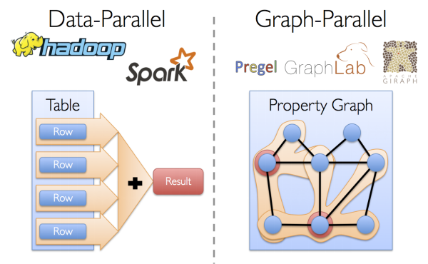
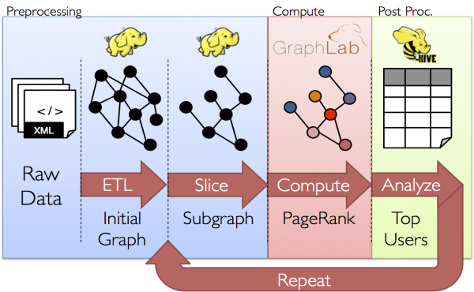
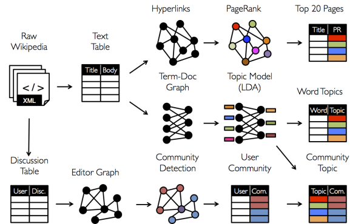
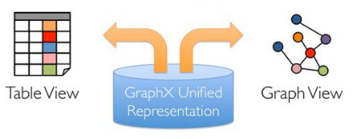

# 简介
Spark GraphX是一个分布式图处理框架，它是基于Spark平台提供对图计算和图挖掘简洁易用的而丰富的接口，极大的方便了对分布式图处理的需求。

> 要在java中运用GraphX，是在是太麻烦了。

# 1、什么是Spark GraphX
Spark GraphX是一个新的Spark API，它用于图和分布式图(graph-parallel)的计算。

GraphX通过引入弹性分布式属性图（RDPGl，Resilient Distributed Property Graph）： 顶点和边均有属性的有向多重图来扩展Spark RDD。

为了支持图计算，GraphX开发了一组基本的功能操作以及一个优化过的Pregel API。另外，GraphX也包含了一个快速增长的图算法和图builders的集合，用以简化图分析任务。

从社交网络到语言建模，不断增长的数据规模以及图形数据的重要性已经推动了许多新的分布式图系统的发展。 通过限制计算类型以及引入新的技术来切分和分配图，这些系统可以高效地执行复杂的图形算法，比一般的分布式数据计算（data-parallel，如spark、MapReduce）快很多。

# 2、分布式图与传统分布式数据的比较
分布式图（graph-parallel）计算和分布式数据（data-parallel）计算类似，分布式数据计算采用了一种record-centric（以记录为中心）的集合视图，而分布式图计算采用了一种vertex-centric（以顶点为中心）的图视图。 

分布式数据计算通过同时处理独立的数据来获得并发的目的，分布式图计算则是通过对图数据进行分区（即切分）来获得并发的目的。更准确的说，分布式图计算递归地定义特征的转换函数（这种转换函数作用于邻居特征），通过并发地执行这些转换函数来获得并发的目的。



 分布式图计算比分布式数据计算更适合图的处理，但是在典型的图处理流水线中，它并不能很好地处理所有操作。
 
 例如，虽然分布式图系统可以很好的计算PageRank等算法，但是它们不适合从不同的数据源构建图或者跨过多个图计算特征。 更准确的说，分布式图系统提供的更窄的计算视图无法处理那些构建和转换图结构以及跨越多个图的需求。分布式图系统中无法提供的这些操作需要数据在图本体之上移动并且需要一个图层面而不是单独的顶点或边层面的计算视图。例如，我们可能想限制我们的分析到几个子图上，然后比较结果。 这不仅需要改变图结构，还需要跨多个图计算。



我们如何处理数据取决于我们的目标。有时，同一原始数据可能会处理成许多不同表和图的视图，并且图和表之间经常需要能够相互移动。如下图所示：



所以我们的图流水线必须通过组合graph-parallel和data-parallel来实现。但是这种组合必然会导致大量的数据移动以及数据复制，同时这样的系统也非常复杂。 

例如，在传统的图计算流水线中，在Table View视图下，可能需要Spark或者Hadoop的支持。在Graph View这种视图下，可能需要Prege或者GraphLab的支持。也就是把图和表分在不同的系统中分别处理。不同系统之间数据的移动和通信会成为很大的负担。

GraphX项目将graph-parallel和data-parallel统一到一个系统中，并提供了一个唯一的组合API。GraphX允许用户把数据当做一个图和一个集合（RDD），而不需要数据移动或者复制。也就是说GraphX统一了Graph View和Table View，可以非常轻松的做pipeline操作。

# 3、弹性分布式属性图
GraphX的核心抽象是弹性分布式属性图。它是一个有向多重图，带有连接到每个顶点和边的用户定义的对象。有向多重图中多个并行的边共享相同的源和目的顶点。支持并行边的能力简化了建模场景，相同的顶点可能存在多种关系(例如co-worker和friend)。 每个顶点用一个唯一的64位长的标识符（VertexID）作为key。GraphX并没有对顶点标识强加任何排序。同样，边拥有相应的源和目的顶点标识符。



为此，我们来总结一下几个模块的核心抽象类型：
```
Spark Core      => RDD
Spark Sql       => DataFrame、Dataset
Spark Streaming => DStream
Spark GraphX    => RDPG
```

属性图扩展了Spark RDD的抽象，有Table和Graph两种视图，但是只需要一份物理存储。两种视图都有自己独有的操作符，从而使我们同时获得了操作的灵活性和执行的高效率。属性图以vertex(VD)和edge(ED)类型作为参数类型，这些类型分别是顶点和边相关联的对象的类型。

在某些情况下，在同样的图中，我们可能希望拥有不同属性类型的顶点。这可以通过继承完成。

和RDD一样，属性图是不可变的、分布式的、容错的。图的值或者结构的改变需要生成一个新的图来实现。

注意，原始图中不受影响的部分都可以在新图中重用，用来减少存储的成本。 执行者使用一系列顶点分区方法来对图进行分区。如RDD一样，图的每个分区可以在发生故障的情况下被重新创建在不同的机器上。
 
逻辑上,属性图对应于一对类型化的集合(RDD),这个集合包含每一个顶点和边的属性。因此，图的类中包含访问图中顶点和边的成员变量。
```scala
class Graph[VD, ED] {
  val vertices: VertexRDD[VD]
  val edges: EdgeRDD[ED]
}
```

VertexRDD[VD]和EdgeRDD[ED]类是RDD[(VertexID, VD)]和RDD[Edge[ED]]的继承和优化版本。VertexRDD[VD]和EdgeRDD[ED]都提供了额外的图计算功能并提供内部优化功能。
```scala
abstract class VertexRDD[VD](sc: SparkContext, deps: Seq[Dependency[_]]) extends RDD[(VertexId, VD)](sc, deps)

abstract class EdgeRDD[ED](sc: SparkContext, deps: Seq[Dependency[_]]) extends RDD[Edge[ED]](sc, deps)
```

# 4、GraphX的底层设计
GraphX的底层设计有以下几个关键点。 

1. 对Graph视图的所有操作，最终都会转换成其关联的Table视图的RDD操作来完成。这样对一个图的计算，最终在逻辑上，等价于一系列RDD的转换过程。因此，Graph最终具备了RDD的3个关键特性：Immutable、Distributed和Fault-Tolerant，其中最关键的是Immutable（不变性）。逻辑上，所有图的转换和操作都产生了一个新图；物理上，GraphX会有一定程度的不变顶点和边的复用优化，显然，这是对用户透明的。 

2. 两种视图底层共用的物理数据，由RDD[Vertex-Partition]和RDD[EdgePartition]这两个RDD组成。点和边实际都不是以表Collection[tuple]的形式存储的，而是由VertexPartition/EdgePartition在内部存储一个带索引结构的分片数据块，以加速不同视图下的遍历速度。不变的索引结构在RDD转换过程中是共用的，降低了计算和存储开销。 

3. 图的分布式存储采用点分割模式，而且使用partitionBy方法，由用户指定不同的划分策略（PartitionStrategy）。划分策略会将边分配到各个EdgePartition，顶点分配到各个VertexPartition，EdgePartition也会缓存本地边关联点的Ghost副本。划分策略的不同会影响到所需要缓存的Ghost副本数量，以及每个EdgePartition分配的边的均衡程度，需要根据图的结构特征选取最佳策略。目前有EdgePartition2d、EdgePartition1d、RandomVertexCut和CanonicalRandomVertexCut这四种策略。

# 5、运行第一个案例
1、引入依赖
```xml
<dependency>
      <groupId>org.apache.spark</groupId>
      <artifactId>spark-graphx_${scala.version}</artifactId>
      <version>${spark.version}</version>
  </dependency>
```

有很多方式从一个原始文件、RDD构造一个属性图。最一般的方法是利用Graph object。下面的代码从RDD集合生成一张图。
```scala
package com.spark.GraphX

import org.apache.spark.graphx.{Edge, Graph}
import org.apache.spark.{SparkConf, SparkContext}
import org.slf4j.LoggerFactory

object GraphXFirst {
  var logger = LoggerFactory.getLogger(GraphXFirst.getClass)

  def main(args: Array[String]): Unit = {
    // 创建SparkConf
    val sparkConf = new SparkConf().setAppName("graphic first")
      .setMaster("local[*]")
      .set("spark.testing.memory","2147000000")

    val sc = new SparkContext(sparkConf)

    // 创建顶点集合（名字，身份）
    val vertexes = sc.parallelize(Array((1L,("zhaoyi","jober")),
      (2L,("yuanyong","jober")),
      (3L,("akuay","cutom")),
      (4L,("huangwei","jober")),
      (5L,("huihui","cutom"))
    ))

    // 创建边集合，边的属性代表其关系 喜欢关系、同事关系
    val edges = sc.parallelize(Array(Edge(1L,3L,"love"),
      Edge(1L,5L,"love"),
      Edge(1L,2L,"colleague"),
      Edge(3L,4L,"colleague"),
      Edge(2L,4L,"colleague")
    ))

    // 创建图:以顶点和边作为参数
    val graph = Graph(vertexes,edges);
  }
}
```
在上面的例子中，我们用到了Edge样本类。

边有一个srcId和dstId分别对应于源和目标顶点的标示符。另外，Edge类有一个attr成员用来存储边属性。我们可以分别用graph.vertices和graph.edges成员将一个图解构为相应的顶点和边。

首先，我们过滤出身份为卡通角色(cutom)的顶点信息
```scala
// 筛选身份为"cutom"的角色
val cutomVertices = graph.vertices.filter{case(id,(name,identity)) => identity == "cutom"};

print("The cutom identity number is:" + cutomVertices.count());
// The cutom identity number is: 2
```

注意，graph.vertices返回一个VertexRDD[(String, String)]，它继承于 RDD[(VertexID, (String, String))]。所以我们可以用scala的case表达式解构这个元组。

# L、总结
=== Spark GraphX什么？

1、Spark GraphX是Spark的一个模块。主要用于以图、分布式图为核心的计算。

2、GraphX的底层也是RDD，他和RDD共用一种存储形态。在展示形态上以数据集、图的形式来表示。

=== Spark GraphX有哪些抽象？

1、顶点： 顶点用`RDD[(VertexId,VD)]`表示。(VertexId,VD)元组用来具体表示一个顶点，其中，VertextId表示顶点的ID(Long类型)；VD是顶点的属性，可以使用任何类型。

2、边：边用RDD[Edge[ED]]表示。Edge用来具体表示一条边，Edge里面包含一个ED类型参数，一个源顶点ID以及一个目标顶点的ID；

3、三元组：三元组用`RDD[EdgeTriplet[VD,ED]]`来表示。EdgeTriplet[VD,ED]来表示一个三元组，三元组包含了一条边、边的属性、目标顶点ID、源顶点ID、目标顶点属性以及源顶点的属性。VD表示顶点的属性，ED表示边的属性。

4、图：图用`Graph`来表示，通过顶点和边以及三元组的集合来构建。