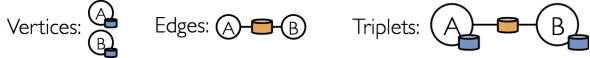

# 简介
本章介绍图中最核心的三个组件：vertices(顶点)、edges（边）以及triplets（三元组）。

vertices、edges以及triplets是GraphX中三个非常重要的概念。我们在前文GraphX介绍中对这三个概念已经有了初步的了解。


 
# 1、vertices
 在GraphX中，vertices对应着名称为VertexRDD的RDD。这个RDD有顶点id和顶点属性两个成员变量。它的源码如下所示：
```scala
abstract class VertexRDD[VD](sc: SparkContext, deps: Seq[Dependency[_]]) extends RDD[(VertexId, VD)](sc, deps)
```
VertexRDD继承自RDD[(VertexId, VD)]，这里VertexId表示顶点id，VD表示顶点所带的属性(任意类型)。

这从另一个角度也说明VertexRDD拥有顶点id和顶点属性。

# 2、edges

在GraphX中，edges对应着EdgeRDD。这个RDD拥有三个成员变量，分别是源顶点id、目标顶点id以及边属性。它的源码如下所示：
```scala
abstract class EdgeRDD[ED](sc: SparkContext, deps: Seq[Dependency[_]]) extends RDD[Edge[ED]](sc, deps)
```
EdgeRDD继承自RDD[Edge[ED]]，即类型为Edge[ED]的RDD。 

# 3、triplets
在GraphX中，triplets对应着EdgeTriplet。它是一个三元组视图，这个视图逻辑上将顶点和边的属性保存为一个RDD[EdgeTriplet[VD, ED]]。可以通过下面的Sql表达式表示这个三元视图的含义:
```sql
SELECT
	src.id ,
	dst.id ,
	src.attr ,
	e.attr ,
	dst.attr
FROM
	edges AS e
LEFT JOIN vertices AS src ,
 vertices AS dst ON e.srcId = src.Id
AND e.dstId = dst.Id
```

EdgeTriplet的源代码如下所示：
```scala
class EdgeTriplet[VD, ED] extends Edge[ED] {
  //源顶点属性
  var srcAttr: VD = _ // nullValue[VD]
  //目标顶点属性
  var dstAttr: VD = _ // nullValue[VD]
  protected[spark] def set(other: Edge[ED]): EdgeTriplet[VD, ED] = {
    srcId = other.srcId
    dstId = other.dstId
    attr = other.attr
    this
  }
} 
```

EdgeTriplet类继承自Edge类：
```scala
case class Edge[@specialized(Char, Int, Boolean, Byte, Long, Float, Double) ED] (var srcId: VertexId = 0, var dstId: VertexId = 0, var attr: ED = null.asInstanceOf[ED]) extends Serializable
```

Edge类中包含源顶点id，目标顶点id以及边的属性。所以从源代码中我们可以知道，triplets既包含了边属性也包含了源顶点的id和属性、目标顶点的id和属性。

