# 简介
线性回归是利用被称为**线性回归方程**的**最小平方函数**对一个或者多个自变量和因变量之间关系进行建模的一种回归分析。

这种函数是一个或者多个被称为回归系数的模型参数的线性组合。

## 1、数学模型
在统计学中，线性回归(Linear Regression)是利用称为线性回归方程的最小平方函数对一个或多个自变量和因变量之间关系进行建模的一种回归分析。这种函数是一个或多个称为回归系数的模型参数的线性组合。

回归分析中，只包括一个自变量和一个因变量，且二者的关系可用一条直线近似表示，这种回归分析称为一元线性回归分析。

如果回归分析中包括两个或两个以上的自变量，且因变量和自变量之间是线性关系，则称为多元线性回归分析。

下面我们来举例何为一元线性回归分析，下图为某地区的房屋面积(feet)与价的一个数据集。

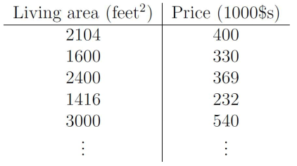

在该数据集中，只有一个自变量面积(feet)，和一个因变量价格($)，所以我们可以将数据集呈现在二维空间上，如下图所示。

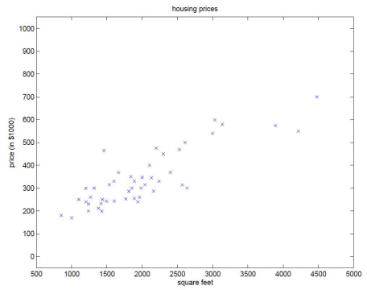

利用该数据集，我们的目的是训练一个线性方程，无限逼近所有数据点，然后利用该方程与给定的某一自变量（本例中为面积），可以预测因变量（本例中为房价）。本例中，训练所得的线性方程如下图所示。

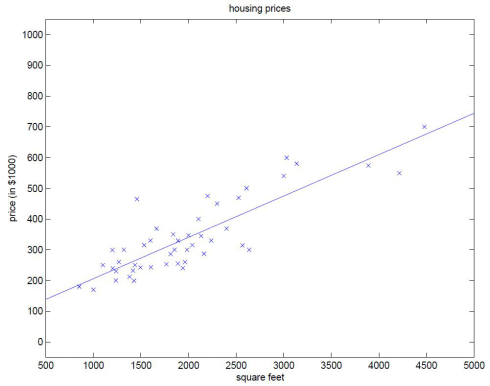

同时，分析得到的线性方程为：
$$
h_{\theta}(x)=\theta_{0}+\theta_{1}x
$$

接下来还是该案例，举一个多元线性回归的例子。如果增添了一个自变量：房间数，那么数据集可以如下所示：

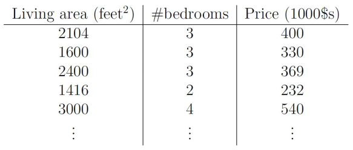

经过分析之后，可以得到的线性方程如下所示：

$$
h_{\theta}(x)=\theta_{0}+\theta_{1}x_{1} + \theta_{2}x_{2}
$$

我们将参数继续增加，可以得到一个推导公式：无论是一元线性方程还是多元线性方程，可统一写成如下的格式：
$$
h_{x} = \sum_{i=0}^n\theta_{i}x_{i}=\theta^Tx 
$$

上式中，求线性方程则演变成了求方程的参数$\theta^T$。

线性回归假设特征和结果满足线性关系。其实线性关系的表达能力非常强大，每个特征对结果的影响强弱可以有前面的参数体现，而且每个特征变量可以首先映射到一个函数，然后再参与线性计算，这样就可以表达特征与结果之间的非线性关系。

# 2、损失函数
上面的公式的参数向量$\theta$是n+1维的，每个参数的取值是实数集合，也就是说参数向量θ在n+1维实数空间中取值结果有无穷种可能。

那么，如何利用一个规则或机制帮助我们评估求得的参数θ，并且使得线性模型效果最佳呢？

直观地认为，如果求得参数θ线性求和后，得到的结果$h_{\theta}(x)$与真实值y之间的误差越小越好。

这时我们需要映入一个函数来衡量$h_{\theta}(x)$表示真实值y好坏的程度，该函数称为损失函数（loss function，也称为错误函数）。数学表示如下
$$
J(\theta) = \frac{1}{2}\sum_{i=1}^n ((h_{\theta}(x^i) - y^{(i)}))^2
$$
这个损失函数用的是$x^{(i)}$的预测值与真实值$y^{(i)}$之差的平方和。如果不考虑诸如过拟合等其他问题，这就是我们需要优化的目标函数。

# 3、目标函数的概率解释
一般地，机器学习中不同的模型会有相应的目标函数。而回归模型（尤其是线性回归类）的目标函数通常用平方损失函数来作为优化的目标函数（即真实值与预测值之差的平方和）。

为什么要选用误差平方和作为目标函数呢？答案可以从概率论中的中心极限定理、高斯分布等知识中找到。

## 3.1、中心极限定理
目标函数的概率解释需要用到中心极限定理。中心极限定理本身就是研究独立随机变量和的极限分布为正态分布的问题。

中心极限定理的公式表示为：设n个随机变量X1,X2,···,Xn相互独立，均具有相同的数学期望与方差，即
$$
E(X_{i})=u
$$
$$
D(X_{i})=\sigma^{2}
$$
令$Y_{n}$为随机变量之和，有$Y_{n}=X_{1}+X_{2}+...+X_{n}$，设
$$
Z_{n}=\frac{Y_{n}-E(Y_{n})}{\sqrt{D(Y_{n})}}=\frac{Y_{n}-n\mu}{\sqrt{n}\sigma} \to N(0,1)
$$

称随机变量$Z_{n}$为n个随机变量$X1,X2,···,Xn$的规范和。它的定义为：设从均值为μ、方差为σ2（有限）的任意一个总体中抽取样本量为n的样本，当n充分大时，样本均值的抽样分布近似服从于均值为μ、方差为σ2的正态分布。

## 3.2、正态（高斯）分布
假设给定一个输入样例$x^{i}$，根据公式得到预测值$\theta^Tx^{(i)}$与真实值$y^{(i)}$之间存在误差，即为$\epsilon^{(i)}$。那么，它们之间的关系表示如下：
$$
y^{(i)}=\theta^T x^{(i)} + \epsilon^{(i)} 
$$

这里假设误差服从标准高斯分布是合理的。理由如下：

回归模型的最终目标是通过函数表达式建立自变量x与结果y之间的关系，希望通过x能较为准确地表示结果y。而在实际的应用场合中，**很难甚至不可能**把导致y的所有变量（特征）都找出来，并放到回归模型中。那么模型中存在的x通常认为是影响结果y最主要的变量集合（又称为因子，在ML中称为特征集）。根据中心极限定理，把那些对结果影响比较小的变量（假设独立同分布）之和认为服从正态分布是合理的。

可以用一个示例来说明误差服从高斯分布是合理的：

在例子中，根据训练数据建立房屋的面积x与房屋的售价y之间的函数表达。它的数据集把房屋面积作为最为主要的变量。除此之外我们还知道房屋所在的地段（地铁、学区、城区、郊区），周边交通状况，当地房价、楼层、采光、绿化面积等等诸多因素会影响房价。

实际上，因数据收集问题可能拿不到所有影响房屋售价的变量，可以假设多个因素变量**相互独立**。根据中心极限定理，认为变量之和服从高斯分布。即：
$$
\epsilon^{(i)}=y^{(i)}-\theta^{T}x^{(i)}
$$

那么x和y的条件概率可表示为：
$$
p(y^{(i)}|x^{(i)};\theta)=\frac{1}{\sqrt{2\pi}\sigma} \exp(-\frac{((y^{i}-\theta^{T}x^{(i)}}{2\sigma^2})^{2})
$$

## 3.3、极大似然估计与损失函数极小化等价
根据上述公式估计得到一条样本的结果概率，模型的最终目标是希望在全部样本上预测最准，也就是概率积最大，这个概率积就是**似然函数**。优化的目标函数即为似然函数，表示如下：
$$
\max_{\theta}L(\theta) = \prod_{i=1}^m \frac{1}{\sqrt{2\pi}\sigma}\exp(-\frac{((y^{i}-\theta^{T}x^{(i)}}{2\sigma^2})^{2})
$$
对L(x)取对数，可得对数似然函数：
$$
\max_{\theta}l(\theta) = -m\log{\sqrt{2\pi}\sigma} - \frac{1}{2\sigma^2}\sum_{i=1}^m(y^{(i)}-\theta^{T}x^{(i)})^2
$$
由于$m,\sigma$都是常数，因此上式等价于
$$
\min_{\theta}=\frac{1}{2}\sum_{i=1}^m(y^{(i)}-\theta^{T}x^{(i)})^2
$$
可以发现，经过最大似然估计推导出来的待优化的目标函数与平方损失函数是等价的。

因此可以得出结论：**线性回归误差平方损失极小化与极大似然估计等价**。

> 其实在概率模型中，目标函数的原函数（或对偶函数）极小化（或极大化）与极大似然估计等价，这是一个带有普遍性的结论。例如在最大熵模型中，有对偶函数极大化与极大似然估计等价的结论。

那上面为什么是条件概率p(y|x;θ)呢？因为我们希望预测值与真实值更接近，这就意味着希望求出来的参数θ，在给定输入x的情况下，得到的预测值等于真实值得可能性越大越好。而θ，x均为前提条件，因此用条件概率p(y|x;θ) 表示。即p(y|x;θ) 越大，越能说明估计的越准确。

> 当然也不能一味地只有该条件函数，还要考虑拟合过度以及模型的泛化能力问题。

# 4、求解$\theta$的方法
要求参数$\theta$的最优解，使得所有点到这条线的误差最小。同理，也是使损失函数的值最小的解。

最常用的两种算法：最小二乘法以及梯度算法（下山算法）。

## 4.1、最小二乘法
通过观察或者求二阶导数可知，$j(\theta)$是一个下凸函数。如下图所示：

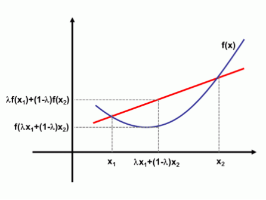

> 注意国内和国外对于凸函数的定义刚好相反。

将m个n维样本组成矩阵X：

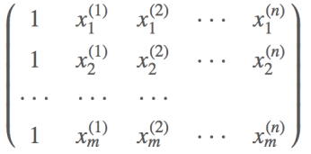

则目标函数的矩阵形式为

$$
J(\theta) = \frac{1}{2}\sum_{i=1}^{n}(h_{\theta}(x^{(i)} - y^{(i)}))^2 = \frac{1}{2}(X\theta - y)^T (X\theta - y)
$$

凸函数有最小值，即导数为0的时候：

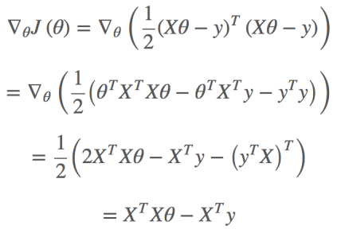

令其为零，求得驻点：
$$
\theta = (X^TX)^{-1}X^Ty
$$

这样就可以求得参数结果了，但是这种推到方式由两个需求：
1. XTX可逆；
2. XTX阶不能过高；

如果其中一个不满足，则最小二乘法是不推荐使用的

## 4.2、梯度下降法
我们可以将函数最小值求解想象成下山操作。一个在山顶的人的下山逻辑：
1. 找到下山最快的坡度
2. 沿着这个坡度走一段距离a。
3. 重复1、2步骤，直到到山底

如下图所示：

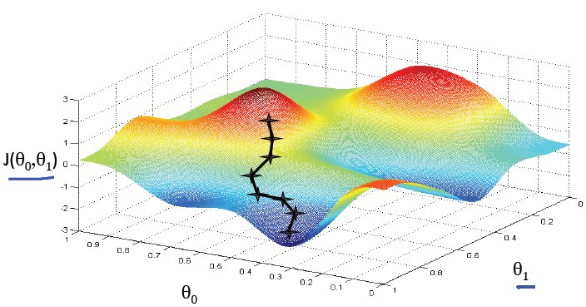

梯度下降一般分为批量梯度下降算法和随机梯度下降算法。不同点在于重新选择梯度方向的时候，是否计算所有的样本集。

梯度下降算法的描述如下：
* 初始化θ（随机初始化）
* 迭代，新的θ能够使得J(θ)更小
* 如果J(θ)能够继续减少不收敛，返回迭代步骤

收敛（结束）条件：$J(θ)$不再变化、或者变化小于某个阈值。

参数θ的值每更新一次都要遍历样本集中的所有的样本，得到新的$\theta_{j}$，看是否满足阈值要求：
* 若满足，则迭代结束，根据此值就可以得到；
* 否则继续迭代。

需要注意到的是，虽然梯度下降法易受到极小值的影响，但是一般的线性规划问题只有一个极小值，所以梯度下降法一般可以收敛到全局的最小值。

例如，J是二次凸函数，则梯度下降法的示意图为

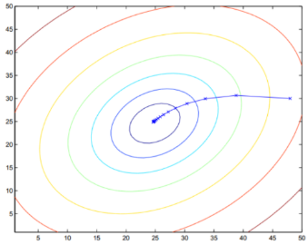

图中，一圈上表示目标函数的函数值类似于地理上的等高线，从外圈开始逐渐迭代，最终收敛全局最小值。


在这个算法中，我们每次更新只用到一个训练样本，若根据当前严格不能进行迭代得到一个，此时会得到一个，有新样本进来之后，在此基础上继续迭代，又得到一组新的和，以此类推。

批量梯度下降法，每更新一次，需要用到样本集中的所有样本；随机梯度下降法，每更新一次，只用到训练集中的一个训练样本，所以一般来说，随机梯度下降法能更快地使目标函数达到最小值（新样本的加入，随机梯度下降法有可能会使目标函数突然变大，迭代过程中在变小。所以是在全局最小值附近徘徊，但对于实际应用俩说，误差完全能满足要求）。

另外，对于批量梯度下降法，如果样本集增加了一些训练样本，就要重新开始迭代。由于以上原因，当训练样本集较大时，一般使用随机梯度下降法。

下降的梯度即为导数的负数：

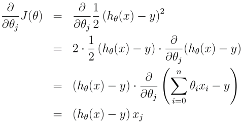

梯度是有方向的，对于一个向量θ，每一维分量$\theta_{i}$都可以求出一个梯度的方向，我们就可以找到一个整体的方向，在变化的时候，我们就朝着下降最多的方向进行变化就可以达到一个最小点，不管他是全局的还是局部的。

在对目标函数$J(θ)$求偏导时，可以用更简单的数学语言（倒三角表示梯度）

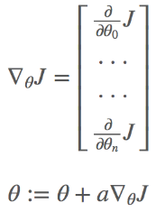


# 5、Spark MLlib实现
以下是训练数据集的部分内容：
```
-0.4307829,-1.63735562648104 -2.00621178480549 -1.86242597251066 -1.02470580167082 -0.522940888712441 -0.863171185425945 -1.04215728919298 -0.864466507337306
-0.1625189,-1.98898046126935 -0.722008756122123 -0.787896192088153 -1.02470580167082 -0.522940888712441 -0.863171185425945 -1.04215728919298 -0.864466507337306
...
```
该数据可以分为两个部分，第一部分是逗号前面的数据，是我们的预测结果，这一列的数据也叫表前列。而逗号之后的第二部分，是按空格分隔的各个特征值，各个特征值对应的列也叫特征列，这一列的数据构成特征向量。

我们使用如下的代码拟合数据
```java
package com.zhaoyi;

import org.apache.spark.SparkConf;
import org.apache.spark.api.java.JavaSparkContext;

// $example on$
import scala.Tuple2;

import org.apache.spark.api.java.JavaPairRDD;
import org.apache.spark.api.java.JavaRDD;
import org.apache.spark.mllib.linalg.Vectors;
import org.apache.spark.mllib.regression.LabeledPoint;
import org.apache.spark.mllib.regression.LinearRegressionModel;
import org.apache.spark.mllib.regression.LinearRegressionWithSGD;
// $example off$

/**
 * Example for LinearRegressionWithSGD.
 */
public class JavaLinearRegressionWithSGDExample {
    public static void main(String[] args) {
        SparkConf conf = new SparkConf().setMaster("local[*]").set("spark.testing.memory","2140000000")
                .setAppName("JavaLinearRegressionWithSGDExample");
        JavaSparkContext sc = new JavaSparkContext(conf);

        // Load and parse the data
        String path = "data/ridge-data/lpsa.data";
        JavaRDD<String> data = sc.textFile(path);
        JavaRDD<LabeledPoint> parsedData = data.map(line -> {
            String[] parts = line.split(",");
            String[] features = parts[1].split(" ");
            double[] v = new double[features.length];
            for (int i = 0; i < features.length - 1; i++) {
                v[i] = Double.parseDouble(features[i]);
            }
            return new LabeledPoint(Double.parseDouble(parts[0]), Vectors.dense(v));
        });
        parsedData.cache();

        // Building the model
        // 迭代次数
        int numIterations = 100;
        // 步长
        double stepSize = 0.00000001;
        // 使用梯度下降算法进行拟合
        LinearRegressionModel model =
                LinearRegressionWithSGD.train(JavaRDD.toRDD(parsedData), numIterations, stepSize);

        // Evaluate model on training examples and compute training error
        JavaPairRDD<Double, Double> valuesAndPreds = parsedData.mapToPair(point ->
                new Tuple2<>(model.predict(point.features()), point.label()));

        double MSE = valuesAndPreds.mapToDouble(pair -> {
            System.out.println("=== 预测值:" + pair._1 + ",真实值:" + pair._2);
            double diff = pair._1() - pair._2();
            return diff * diff;
        }).mean();
        System.out.println("(均方误差)training Mean Squared Error = " + MSE);

        // 存储模型
        model.save(sc.sc(), "target/tmp/javaLinearRegressionWithSGDModel");
        LinearRegressionModel sameModel = LinearRegressionModel.load(sc.sc(),
                "target/tmp/javaLinearRegressionWithSGDModel");
        sc.stop();
    }
}

```

最终结果：
```
...
=== 预测值:1.572453503544832E-8,真实值:4.029806
=== 预测值:-1.6302326533842853E-8,真实值:2.5533438
=== 预测值:3.323987121672296E-8,真实值:4.1295508
=== 预测值:1.0971549998522714E-7,真实值:2.5687881
=== 预测值:5.9543741021448853E-8,真实值:4.3851468
=== 预测值:4.658591752797323E-8,真实值:4.6844434
=== 预测值:6.837395087543201E-8,真实值:5.477509
(均方误差)training Mean Squared Error = 7.451032827699876
```

