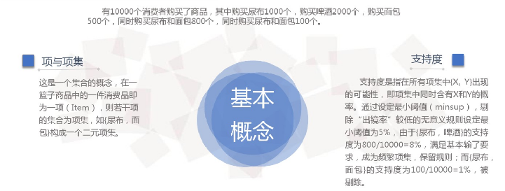
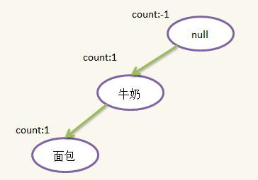
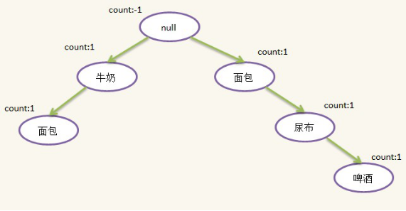
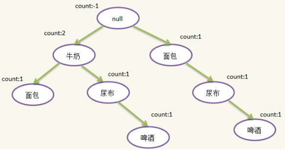
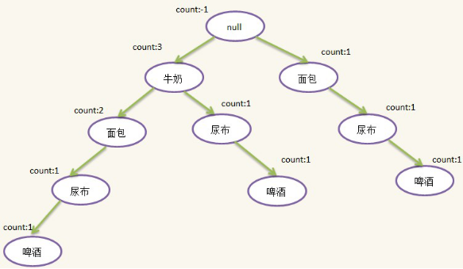
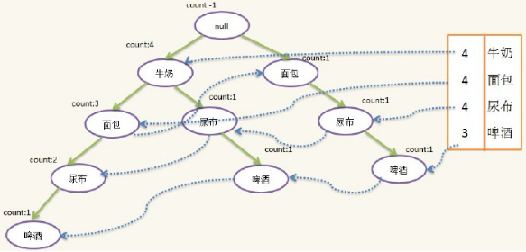
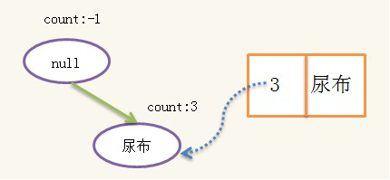
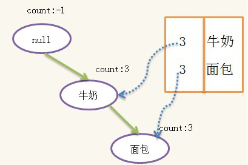

# 简介
FP-Growth算法是韩嘉炜等人在2000年提出的关联分析算法，它采取如下分治策略：将提供频繁项集的数据库压缩到一棵频繁模式树（FP-tree），但仍保留项集关联信息。

在算法中使用了一种称为频繁模式树（Frequent Pattern Tree）的数据结构。FP-tree是一种特殊的前缀树，由频繁项头表和项前缀树构成。FP-Growth算法基于以上的结构加快整个挖掘过程。

众所周知，Apriori算法在产生频繁模式完全集前需要对数据库进行多次扫描，同时产生大量的候选频繁集，这就使Apriori算法时间和空间复杂度较大。但是Apriori算法中有一个很重要的性质：频繁项集的所有非空子集都必须也是频繁的。但是Apriori算法在挖掘额长频繁模式的时候性能往往低下，Jiawei Han提出了FP-Growth算法。

**FP-Tree**：将事务数据表中的各个事务数据项按照支持度排序后，把每个事务中的数据项按降序依次插入到一棵以 NULL为根结点的树中，同时在每个结点处记录该结点出现的支持度。

# 1、FPGrowth使用场景
FPGrowth关联规则算法主要用于发现频繁项集。如：沃尔玛啤酒加尿布。

# 2、FPGrowth基本概念
FPGrowth算法通过构造一个FPTree树结构来压缩数据记录，使得挖掘频繁项集只需要扫描两次数据记录，而且该算法不需要生成候选集合，所以效率会比较高。

那么，如何从购物篮里面发现**尿布+啤酒**这样的最佳组合呢？

我们以以下数据集为例，假设有如下的一张购物清单表，每条记录代表一次购物记录：
|TID|Items|
|-|-|
|T1|{ 面包 ， 牛奶 }|
|T2|{ 面包 , 尿布 , 啤酒 , 鸡蛋 }|
|T3|{ 牛奶 , 尿布 , 啤酒 , 可乐 }|
|T4|{ 面包 , 牛奶 , 尿布 , 啤酒 }|
|T5|{ 面包 , 牛奶 , 尿布 , 可乐 }|


其中：
* 牛奶、面包叫做**项**；
* { 牛奶、面包}叫做**项集**；
* 项集出现的次数叫做**支持度**。
* **T\*** 表示用户每次的购物清单。




# 3、算法思想
该算法的核心就是生成一棵FPTree。前面提到过，FPTree是一种树结构。

构建的过程需要将表中的数据以及关系进行保存，我们先来看构建过程：

假设我们的最小支持度是3，这相当于是一个阈值。接下来我们开始按如下的步骤处理数据。

## 3.1、step1
扫描数据记录，生成一级频繁项集，并按出现次数由多到少排序，如下所示：
```
Item	Count
牛奶	4
面包	4
尿布	4
啤酒	3
可乐	2（小于3,删除）
鸡蛋	1（小于3,删除）
```

可以看到，鸡蛋和可乐在上表中要删除，因为可乐只出现2次，鸡蛋只出现1次，小于最小支持度，因此不是**频繁项集**，非频繁项集的超集一定不是频繁项集，所以可乐和鸡蛋不需要再考虑。

## 3.2、step2
再次扫描数据记录，对每条记录中出现在Step 1产生的表中的项，按表中的顺序排序。初始时，新建一个根结点，标记为null。然后依次扫描每条记录，构建FPTree。

1、第一条记录：{面包，牛奶}需要根据Step1中结果转换成：{牛奶,面包}，新建一个结点，name为{牛奶}，将其插入到根节点下，并设置count为1，然后新建一个{面包}结点，插入到{牛奶}结点下面，插入后如下所示：



2、第二条记录：{面包,尿布,啤酒,鸡蛋}，过滤并排序后为：{面包,尿布,啤酒}，发现根结点没有包含{面包}的儿子（有一个{面包}孙子但不是儿子），因此新建一个{面包}结点，插在根结点下面，这样根结点就有了两个孩子，随后新建{尿布}结点插在{面包}结点下面，新建{啤酒}结点插在{尿布}下面，插入后如下所示：



3、第三条记录：{牛奶,尿布,啤酒,可乐}，过滤并排序后为：{牛奶,尿布,啤酒}，这时候发现根结点有儿子{牛奶}，因此不需要新建结点，只需将原来的{牛奶}结点的count加1即可，往下发现{牛奶}结点有一个儿子{尿布}，于是新建{尿布}结点，并插入到{牛奶}结点下面，随后新建{啤酒}结点插入到{尿布}结点后面。插入后如下图所示：



4、第四条记录：{面包,牛奶,尿布,啤酒}，过滤并排序后为：{牛奶，面包,尿布,啤酒}，这时候发现根结点有儿子{牛奶}，因此不需要新建结点，只需将原来的{牛奶}结点的count加1即可，往下发现{牛奶}结点有一个儿子{面包}，于是也不需要新建{面包}结点，只需将原来{面包}结点的count加1，由于这个{面包}结点没有儿子，此时需新建{尿布}结点，插在{面包}结点下面，随后新建{啤酒}结点，插在{尿布}结点下面，插入后如下图所示：



5、按照1-4这样的方式迭代所有的记录，最终会生成一棵树，即FPTree。按上表中生成的最终的FPTree如下图所示：



树中每个路径代表一个项集，因为许多项集有公共项，而且出现次数越多的项越可能是公共项，因此按出现次数由多到少的顺序排序可以节省空间，实现压缩存储。

另外我们需要一个表头和对每一个name相同的结点做一个线索，方便后面使用，线索的构造也是在建树过程形成的（下图虚线）。

至此，整个FpTree就构造好了。

# 4、利用FPTree挖掘频繁项集
FPTree建好后，就可以进行频繁项集的挖掘，挖掘算法称为FPGrowth（Frequent Pattern Growth）算法，挖掘从表头header的最后一个项开始。

此处即从{啤酒}开始，根据{啤酒}的线索链找到所有{啤酒}结点，然后找出每个{啤酒}结点的分支：{牛奶，面包，尿布，啤酒：1}，{牛奶，尿布，啤酒:1}，{面包，尿布，啤酒:1}，其中的“1”表示出现1次。

注意，虽然{牛奶}出现4次，但{牛奶，面包，尿布，啤酒}只同时出现1次，因此**分支的count是由后缀结点{啤酒}的count决定的**，除去{啤酒}，我们得到对应的前缀路径{牛奶，面包，尿布：1}，{牛奶，尿布:1}，{面包，尿布:1}，根据前缀路径我们可以生成一棵条件FPTree，构造方式跟之前一样，此处的数据记录变为：
```
T1	{牛奶，面包，尿布 ： 1}
T2	{牛奶，尿布： 1}
T3	{面包，尿布： 1}
```
绝对支持度依然是3，我们发现此时，牛奶的支持度为2、面包的支持度为2、尿布的支持度为3，由于我们的支持度为3，所以删除牛奶和面包。按照相同的算法构造得到的FPTree为：



构造好条件树后，对条件树进行递归挖掘，当条件树只有一条路径时，路径的所有组合即为条件频繁集，假设{啤酒}的条件频繁集为{S1,S2}，则{啤酒}的频繁集为`{S1+{啤酒},S2+{啤酒},S1+S2+{啤酒}}`，即{啤酒}的频繁集一定有相同的后缀{啤酒}，此处的条件频繁集为：`{{}，{尿布}}`，于是{啤酒}的频繁集为`{{啤酒}{尿布，啤酒}}`。


接下来找header表头的倒数第二个项{尿布}的频繁集，同上可以得到{尿布}的前缀路径为：{面包：1}，{牛奶：1}，{牛奶，面包：2}，条件FPTree的数据集为：
```
T1	{面包 ：1 }
T2	{牛奶 ：1}
T3	{牛奶，面包 ：2}
```
构造的条件FpTree为：



这颗条件树路径上的所有组合即为条件频繁集：
```
{{}，{牛奶}，{面包}，{牛奶，面包}}
```
加上{尿布}后，又得到一组频繁项集
```
{{尿布}，{牛奶，尿布}，{面包，尿布}，{牛奶，面包，尿布}}
```
同样，这组频繁项集一定包含一个相同的后缀：{尿布}，也就是我们一开始分析的对象，并且不包含{啤酒}，因此这一组频繁项集与上一组不会重复。

重复以上步骤，对header表头的每个项进行挖掘，即可得到整个频繁项集，频繁项集即不重复也不遗漏。

最终，我们可以得到多个集合列表，每一个集合代表一个频繁项集。

总结下来，FPTree的开发流程为2个：

1、生成树过程

2、挖掘树过程：挖掘树的过程也是一个生成树的过程，每次挖掘一个节点的目的，都是为了发现该节点的频繁项集，将最终生成的结果取所有子集然后将每一项与挖掘的节点组合，作为我们最后得到的结果。

# 5、Spark Mlib实现
训练集如下：
```
面包 牛奶
面包 尿布 啤酒 鸡蛋
牛奶 尿布 啤酒 可乐
面包 牛奶 尿布 啤酒
面包 牛奶 尿布 可乐
```
存储在路径`data/sample_fpgrowth.txt`中。

接下来调用FPGrouwth算法训练数据集。
```java
package com.zhaoyi;// $example on$
import java.util.Arrays;
import java.util.List;

import org.apache.spark.api.java.JavaRDD;
import org.apache.spark.api.java.JavaSparkContext;
import org.apache.spark.mllib.fpm.AssociationRules;
import org.apache.spark.mllib.fpm.FPGrowth;
import org.apache.spark.mllib.fpm.FPGrowthModel;
// $example off$

import org.apache.spark.SparkConf;

public class JavaSimpleFPGrowth {

  public static void main(String[] args) {
    SparkConf conf = new SparkConf().setMaster("local[*]").set("spark.testing.memory","2140000000")
            .setAppName("JavaLinearRegressionWithSGDExample");
    JavaSparkContext sc = new JavaSparkContext(conf);

    JavaRDD<String> data = sc.textFile("data/sample_fpgrowth.txt");

    JavaRDD<List<String>> transactions = data.map(line -> Arrays.asList(line.split(" ")));

    // 最小支持度为0.5
    FPGrowth fpg = new FPGrowth()
      .setMinSupport(0.5)
      .setNumPartitions(10);
    FPGrowthModel<String> model = fpg.run(transactions);

    for (FPGrowth.FreqItemset<String> itemset: model.freqItemsets().toJavaRDD().collect()) {
      System.out.println("[" + itemset.javaItems() + "], " + itemset.freq());
    }

    double minConfidence = 0.8;
    for (AssociationRules.Rule<String> rule
      : model.generateAssociationRules(minConfidence).toJavaRDD().collect()) {
      System.out.println(
        rule.javaAntecedent() + " => " + rule.javaConsequent() + ", " + rule.confidence());
    }
    // $example off$

    sc.stop();
  }
}
```
输入文件为：
```
面包 牛奶
面包 尿布 啤酒 鸡蛋
牛奶 尿布 啤酒 可乐
面包 牛奶 尿布 啤酒
面包 牛奶 尿布 可乐
```

可以看到，我们设置的最小支持度为0.5，也就是说，过滤过程中，会将低于出现次数小于3（3/5>0.5>2/5次）的项踢除，显然可乐（出现一次，支持度为2/5=0.4）以及鸡蛋（出现1次，支持度为1/5=0.2）都不会纳入频繁项集之中，在step1中就会被踢除。


最终的输出结果
```
[[尿布]], 4
[[牛奶]], 4
[[牛奶, 尿布]], 3
[[面包]], 4
[[面包, 牛奶]], 3
[[面包, 尿布]], 3
[[啤酒]], 3
[[啤酒, 尿布]], 3

[啤酒] => [尿布], 1.0
```
可以看到，该输出结果完美的实现了牛奶尿布实例中的预测结果。即{啤酒，尿布}这样的组合频繁项集。

那么，我们可以考虑将这两种商品摆放到一起，从而起到一定的增加销售业绩的作用（事实上沃尔玛的确这么做了）。