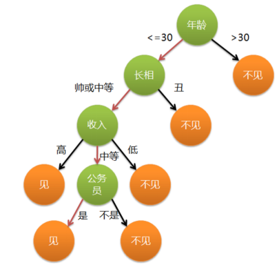
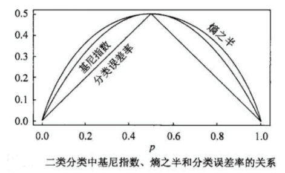
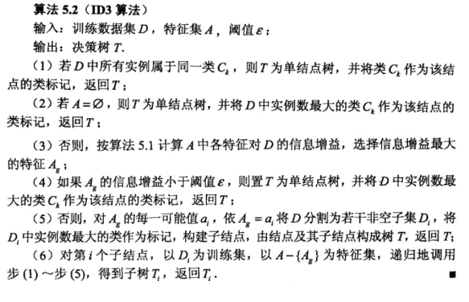
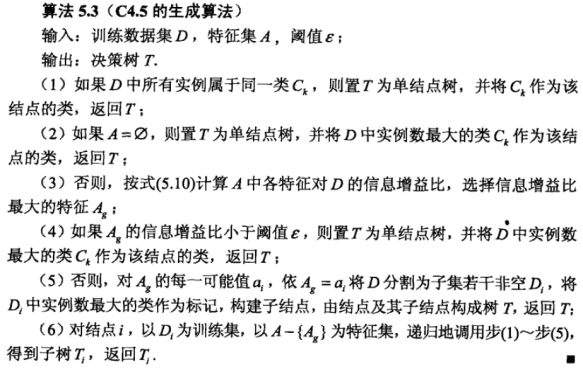
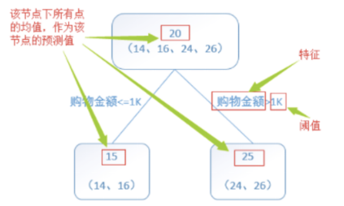

# 简介
决策树（Decision Tree）是一种基本的分类与回归方法。决策树模型呈树形结构，在分类问题中，表示基于特征对实例进行分类的过程。它可以认为是if-then规则的集合，也可以认为是定义在特征空间与类空间上的条件概率分布。相比朴素贝叶斯分类，决策树的优势在于构造过程不需要任何领域知识或参数设置，因此在实际应用中，对于探测式的知识发现，决策树更加适用。

分类决策树模型是一种描述对实例进行分类的树形结构。决策树由结点和有向边组成。结点有两种类型：内部节点和叶节点，内部节点表示一个特征或属性，叶节点表示一个类。 

分类的时候，从根节点开始，对实例的某一个特征进行测试，根据测试结果，将实例分配到其子结点；此时，每一个子结点对应着该特征的一个取值。如此递归向下移动，直至达到叶结点，最后将实例分配到叶结点的类中。举一个通俗的例子，各位立志于脱单的单身男女在找对象的时候就已经完完全全使用了决策树的思想。假设一位母亲在给女儿介绍对象时，有这么一段对话：
```
母亲：给你介绍个对象。
女儿：年纪多大了？
母亲：26。
女儿：长的帅不帅？
母亲：挺帅的。
女儿：收入高不？
母亲：不算很高，中等情况。
女儿：是公务员不？
母亲：是，在税务局上班呢。
女儿：那好，我去见见。
```
这个女生的决策过程就是典型的分类决策树。相当于对年龄、外貌、收入和是否公务员等特征将男人分为两个类别：见或者不见。假设这个女生的决策逻辑如下：



上图完整表达了这个女孩决定是否见一个约会对象的策略，其中绿色结点（内部结点）表示判断条件，橙色结点（叶结点）表示决策结果，箭头表示在一个判断条件。

在不同情况下的决策路径，图中红色箭头表示了上面例子中女孩的决策过程。 这幅图基本可以算是一棵决策树，说它“基本可以算”是因为图中的判定条件没有**量化**，如收入高中低等等，还不能算是严格意义上的决策树，如果将所有条件量化，则就变成真正的决策树了。

# 2、决策树模型的两种解释
分类决策树模型是一种描述对实例进行分类的树形结构。

决策树由结点和有向边组成。结点有两种类型：内部结点和叶节点。内部结点表示一个特征或属性，叶节点表示一个类。

# 3、决策树与if-then规则
可以将决策树看成一个if-then规则的集合。即由决策树的根结点到叶节点的每一条路径构建一条规则；路径上内部结点的特征对应着规则的条件，而叶结点的类对应着规则的结论。

决策树的路径或其对应的if-then规则集合的重要性质：互斥且完备（每一个实例都被一条路径或一条规则所覆盖，且只被一条路径或一条规则所覆盖，这里的覆盖是指实例的特征与路径上的特征一致或实例满足规则的条件）。

# 4、决策树与条件概率分布
决策树还表示给定特征条件下类的条件概率分布，它定义在特征空间的一个划分。

将特征空间划分为互不相交的单元，并在每个单元定义一个类的概率分布就构成了一个条件概率分布。决策树的每一条路径对应于划分中的一个单元。

假设X为表示特征的随机变量，Y为表示类的随机变量，那么这个条件概率分布可以表示为
$$
P(X|Y)
$$

各叶结点上的条件概率往往偏向于某一个类，即属于某一类的概率越大。决策树分类时将该结点的实例强行分到**条件概率**大的那一类去。

# 7、特征选择
知道了什么是决策树，那么如果构造决策树呢？为什么拿年龄作为第一个分类？那么就涉及到特征选择的问题。

特征选择中用的最多的方法是通过熵和基尼进行对比。

特征选择的标准是找出局部最优的特征，判断一个特征对于当前数据集的分类效果，也就是按照这个特征进行分类后，不同分类的数据是否能够被**尽量**分开。

因此，我们先来了解几个概念。
# 8、信息论相关
## 8.1、信息量
**信息量**由这个事件发生的概率所决定。

经常发生的事件是没有什么信息量的，只有小概率的事件才有信息量，所以信息量的定义为：
$$
I_{e} = - \log_{2}P_{i}
$$

例如：英语有26个字母，假如每个字母在文章中出现的次数是平均数，那每个字母的信息量是：
$$
I_{e} = - log_{2} \frac{1}{26} = 4.7
$$

## 8.2、熵
**熵**，就是信息量的期望，熵表示随机变量不确定性的度量。

熵越大，随机变量的不确定性就越大。信息熵的公式为：
$$
H(x) = E(I(x)) = \sum p(x_{i})I(x_{i}) = - \sum p(x_{i})\log_{b}p(x_{i})
$$

**条件熵**表示在已知随机变量Y的条件下随机变量X的不确定性，公式为：
$$
H(x|y) = - \sum p(x_{i}|y)\log_{b}p(x_{i}|y)
$$

**经验熵**和**经验条件熵**：当熵和条件熵中的概率由数据估计（特别是极大似然估计）得到时，所对应的熵与条件熵分别称为经验熵和条件经验熵。

其中，计算数据集D的经验熵的公式为
$$
H(D) = - \sum_{i=1}^k \frac{|C_{k}|}{|D|} log_{2} \frac{|C_{k}|}{|D|}
$$

计算特征A对数据集D的经验条件熵
$$
H(D|A) = \sum_{i=1}^n \frac{|D_{i}|}{|D|} H(D_{i}) = \sum_{i=1}^n \frac{|D_{i}|}{|D|} \sum_{k=1}^K \frac{|D_{ik}|}{|D_{i}|}log_{2}\frac{|D_{ik}|}{|D_{i}|} 
$$

## 8.3、信息增益
**信息增益**表示得知特征X的信息而使得类Y的信息的不确定性减少的程度。

特征A对训练数据集D的信息增益g(D,A)，定义为集合D的经验熵H(D)与特征A给定条件下D的经验条件熵H(D|A)之差，即
$$
g(D,A) = H(D) - H(D|A)
$$
这个差又称为**互信息**。

信息增益大的特征具有更强的分类能力。 

根据信息增益准则的特征选择方法是：对训练数据集（或子集）计算其每个特征的信息增益，选择信息增益最大的特征。 

计算信息增益的算法如下： 
* 输入：训练数据集D和特征A； 
* 输出：特征A对训练数据集D的信息增益$g(D,A)$. 

## 8.4、信息增益比
单纯的信息增益只是个相对值，因为这依赖于H(D)的大小，所以信息增益比更能客观地反映信息增益。

特征A对训练数据集D的信息增益比$g_{R}(D,A)$定义为其信息增益$g(D,A)$与训练数据集D关于特征A的值的熵$H_{A}(D)$之比，即
$$
g_{R}(D,A) =\frac{g(D,A)}{H_{A}(D)} 
$$
其中
$$
H_{A}(D) = - \sum_{i=1}^n \frac{|D_{i}|}{|D|} \log_{2}\frac{|D_{i}|}{|D|}
$$
n是特征值A取值的个数。

# 9、基尼系数
分类问题中，假设有K个类，样本点属于第K类的概率为$p_{k}$，则概率分布的基尼系数定义为
$$
Gini(p) = \sum_{k=1}^K p_{k}(1-p_{k}) = 1 - \sum_{k=1}^K p_{k}^2
$$

若样本集合D根据特征A是否取某一可能值a被分割成$D_{1}、D_{2}$两部分，即
$$
D_{1} = \{(x,y)\in D |A(x) = 0\}, D = D_{1} + D_{2}
$$

则在特征A的条件下，集合D的基尼系数定义为：
$$
Gini(D,A) = \frac{|D_{1}|}{|D|}Gini(D_{1}) + \frac{|D_{2}|}{|D|}Gini(D_{2})
$$

从下图可以看出基尼系数和熵之半的曲线很相近，都可以近似的代表分类误差率。




# 10、决策树的生成算法
了解了信息论的一些概念以及基尼系数之后我们来讨论决策树的生成。

## 10.1、ID3算法
ID3算法由Ross Quinlan发明，建立在“奥卡姆剃刀”的基础上：越是小型的决策树越优于大的决策树（Be Simple简单理论）。

ID3算法中根据信息增益评估和选择特征，每次选择信息增益最大的特征作为判断模块建立子结点。

ID3算法可用于划分**标称型数据集**，没有**剪枝**的过程，为了去除过度数据匹配的问题，可通过裁剪合并相邻的无法产生大量信息增益的叶子节点（例如设置信息增益阀值）。

使用信息增益的话其实是有一个缺点，那就是它偏向于具有**大量值**的属性。就是说在训练集中，某个属性所取的不同值的个数越多，那么越有可能拿它来作为分裂属性，而这样做有时候是没有意义的，另外ID3不能处理**连续分布**的数据特征，于是就有了C4.5算法。CART算法也支持连续分布的数据特征。 

算法步骤如下（ID3）： 




## 10.2、C4.5算法
C4.5算法用**信息增益**比来选择属性，继承了ID3算法的优点。并在以下几方面对ID3算法进行了改进：
* 克服了用信息增益选择属性时偏向选择取值多的属性的不足；
* 在树构造过程中进行剪枝；
* 能够完成对连续属性的离散化处理；
* 能够对不完整数据进行处理。

C4.5算法产生的分类规则易于理解、准确率较高；但效率低，因树构造过程中，需要对数据集进行**多次**的顺序扫描和排序。

也是因为必须多次数据集扫描，C4.5只适合于能够**驻留于内存的数据集**。在实现过程中，C4.5算法在结构与递归上与ID3完全相同，区别只在于选取决决策特征时的决策依据不同，二者都有贪心性质：即通过局部最优构造全局最优。以下是算法步骤：



## 10.3、CART
分类树与回归树（classification and regression tree，CART）模型（Breiman）由：
* 特征选择
* 树生成
* 剪枝
三部分组成，既可用于分类也可用于回归。

CART是在给定输入随机变量X条件下输出变量Y的条件概率分布的学习方法。它假定决策树是二叉树，内部取值为“是”（左分支）和“否”（右分支）。它的基本步骤为：
1. 决策树生成：基于训练数据集生成决策树，生成的决策树要尽量大。
2. 决策树剪枝：用验证数据集对已生成的树进行剪枝并选择最优子树，这是用损失函数最小作为剪枝的标准。

### 10.3.1、分类树
对分类树用基尼系数（Gini index）最小化准则，进行特征选择，生成二叉树。具体算法步骤如下：
1. 设结点的训练数据集为D，计算现有特征对该数据集的基尼指数。此时，对每一个特征A，对其可能取的每个值aa，根据样本点对A=aA=a的测试为”是”或者“否”将D分割为D1D1和D2D2两部分，计算其基尼系数。
2. 在所有可能的特征A以及他们所有可能的切分点aa中，选择基尼系数最小的特征及其对应的切分点作为最优特征与最优切分点。依最优特征与最优切分点，从现结点生成两个子结点，将训练数据集依特征分配到两个子结点中去。
3. 对两个子结点递归地调用上述两个步骤，直至满足停止条件。
4. 生成CART决策树

### 10.3.2、回归树
首先看一个简单的回归树生成实例：



接下来具体说说回归树是如何进行特征选择生成二叉回归树的。

假设X与Y分别为输入和输出变量，并且Y是连续变量，给定训练数据集
$$
D = {(x_{1},y_{1}),{x_{2},y_{2}},...,(x_{n},y_{n})}
$$
我们利用最小二乘回归树生成算法来生成回归树$f(x)$，即在训练数据集所在的输入空间中，递归地将每个区域分为两个子区域并决定每个子区域上的输出值，构建二叉决策树，步骤如下：
1. 选择最优切分变量j与切分点s，求解
$$
\min_{js}[\min_{c_{1}}\sum_{x\in R_{1}(j,s)}(y_{i}-c_{1})^2 + \min_{c_{2}} \sum_{x\in R_{2}(j,s)}(y_{i} - c_{2})^2]
$$

遍历变量j，对固定的切分变量j扫描切分点s，选择使上式达到最小值得对j,s；

2. 用选定的对(j,s)划分区域并决定相应的输出值：
$$
\min_{js}[\min_{c_{1}}\sum_{x\in R_{1}(j,s)}(y_{i}-c_{1})^2 + \min_{c_{2}} \sum_{x\in R_{2}(j,s)}(y_{i} - c_{2})^2]
$$

3. 继续对两个子区域调用步骤1和步骤2，直至满足停止条件。

4. 将输入空间划分为M个区域$R_{1},R_{2},···,R_{M}$，在每个单元$R_{m}$上有一个固定的输出值$c_{m}$，生成决策树：
$$
f(x) = \sum_{m=1}^M c_{m}I(x\in R_{m})
$$

## 10.4、决策树剪枝
决策树生成算法对于训练集是很准确的，也就是生成的树枝很详细，但这样会过拟合，需要通过剪枝操作来提高泛化能力。思路很简单，就是在决策树对训练集数据的预测误差和树复杂度之间找一个平衡。

预测误差就是所有叶子节点的**经验熵的和**，其中表示该叶节点的样本点个数，而表示该叶子节点的经验熵：
$$
C(T) = - \sum_{t=1}^{|T|} \sum_{k=1}^K N_{tk}\log \frac{N_{tk}}{N_{t}}
$$

树的复杂度由叶子节点的个数来表示：T。所以，剪枝的标准就是极小化损失函数：
$$
C_{a}(T) = C(T) + \alpha|T|
$$

其中，$\alpha$是调节参数。其越大表示选择越简单的树，而越小表示选择越复杂的树，对训练集拟合度高的树。

树的剪枝算法就是从叶子节点往上回溯，比较剪掉该叶子节点前后的损失函数的值。如果剪掉该叶子节点后，损失函数更小就剪掉，具体流程如下：
* 输入：生成算法产生的整个树T，参数$\alpha$。
* 输出：修剪后的子树$T_{\alpha}$

1.计算每个节点的经验熵。
2. 递归地从树的节点向上回溯：设一组叶子节点回溯到其父节点之前与之后的整体树分别为$T_{B}$和$T_{A}$，其对应的损失函数值分别是$C_{\alpha}(T_{A})$和$C_{\alpha}(T_B)$。如果$C_{\alpha}(T_{A})$小于等于$C_{\alpha}(T_B)$，则进行剪枝，即将父节点变为新的叶子节点。
3. 返回2，直到不能继续为止，最终得到损失函数最小的子树$T_{\alpha}$。

## 10.5、CART剪枝
CART剪枝算法从“完全生长”的决策树的低端减去一些子树，使决策树变小，从而能够对未知数据欧更准确的预测。

## 11、Spark MLlib案例实现
