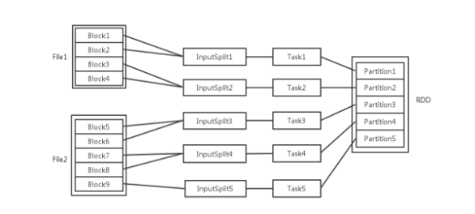

# 简介
RDD(Resilent Distributed Dataset)是属于Spark Core的内容。RDD(Resilent Distributed Dataset)，顾名思义，弹性分布式数据集，他是Spark计算的基石，为用户屏蔽了底层对数据的复杂抽象和处理，提供了一组方便的数据转换与求值方法。

# 1、RDD的特性
1、不可变性

一个RDD确定之后，不能再做修改，只能转换为其他的RDD；

2、可分区

RDD里面的具体数据是分布在多台机器上的Executor里面的（堆内内存、堆外内存以及磁盘）。

3、弹性：主要体现在如下几个方面
* 存储的弹性：内存与磁盘自动切换。Spark会根据用户的配置或者当前是应用运行情况去自动将RDD的数据缓存到内存或者磁盘，这个过程对用户不可见的。
* 容错的弹性：当RDD被删除或者丢失的时候，可以通过血统、检查点等机制自动恢复；
* 计算的弹性：计算出错重试机制。计算是分层的，由**应用->Job->Stage->TaskSet->Task**。其中的每一层都有赌赢的计算保障机制和重复机制，保证计算不会由于一些突发因素而终止；
* 分片弹性：根据需要重新分片，可以根据需求或者一些算子来重新调整RDD中的数据分布。

# 2、RDD的处理流程
Spark Core的主要功能，其实就是一个对RDD进行操作的过程。他主要包括如下几个步骤。

1、创建

2、转换

3、缓存

4、行动

5、输出

联系一下wordcount程序，对应各个流程。接下来我们就针对每个过程，进行更进一步的学习。

# 3、向RDD操作传递函数注意
Spark的大部分转化操作和一部分行动操作，都需要依赖用户传递的函数来计算。 在 Scala 中，我们可以把定义的内联函数、方法的引用或静态方法传递给 Spark，就像 Scala 的其他函数式 API 一样。我们还要考虑其他一些细节，比如所传递的函数及其引用 的数据需要是可序列化的(实现了 Java 的 Serializable 接口)。 传递一个对象的方法或者字段时，会包含对整个对象的引用。 

如果在 Scala 中出现了 NotSerializableException，通常问题就在于我们传递了一个不可序列 化的类中的函数或字段。

# 4、RDD相关概念关系

输入可能以多个文件的形式存储在HDFS上，每个File都包含了很多块，称为**Block**。

当Spark读取这些文件作为输入时，会根据具体数据格式对应的InputFormat进行解析，一般是将若干个Block合并成一个输入分片，称为InputSplit，注意InputSplit不能跨越文件。

随后将为这些输入分片生成具体的**Task**。InputSplit与Task是一一对应的关系。

随后这些具体的Task每个都会被分配到集群上的某个节点的某个Executor去执行:
1. 每个节点可以起一个或多个Executor。
2. 每个Executor由若干core组成，每个Executor的每个core一次只能执行一个Task。
3. 每个Task执行的结果就是生成了目标RDD的一个partiton。
> 注意: 这里的core是虚拟的core而不是机器的物理CPU核，可以理解为就是Executor的一个工作线程。

而Task被执行的并发度 = Executor数目 * 每个Executor核数。

至于partition的数目：
1. 对于数据读入阶段，例如sc.textFile，输入文件被划分为多少InputSplit就会需要多少初始Task。
2. 在Map阶段partition数目保持不变。
3. 在Reduce阶段，RDD的聚合会触发shuffle操作，聚合后的RDD的partition数目跟具体操作有关，例如repartition操作会聚合成指定分区数，还有一些算子是可配置的。

RDD在计算的时候，每个分区都会起一个task，所以rdd的分区数目决定了总的的task数目。

申请的计算节点（Executor）数目和每个计算节点核数，决定了你同一时刻可以并行执行的task。

比如的RDD有100个分区，那么计算的时候就会生成100个task，你的资源配置为10个计算节点，每个2个核，同一时刻可以并行的task数目为20，计算这个RDD就需要5个轮次。

如果计算资源不变，你有101个task的话，就需要6个轮次，在最后一轮中，只有一个task在执行，其余核都在空转。

如果资源不变，你的RDD只有2个分区，那么同一时刻只有2个task运行，其余18个核空转，造成资源浪费。这就是在spark调优中，增大RDD分区数目，增大任务并行度的做法。

RDD官方文档：http://spark.apache.org/docs/latest/rdd-programming-guide.html#accumulators

