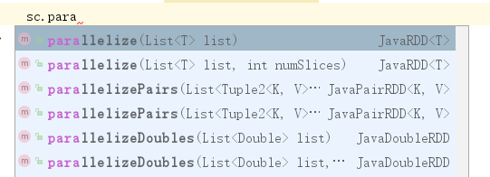

# 简介
本章节主要讲述了RDD的创建，需要注意的是都是简单的列举。但是需要明白的是，创建RDD的核心内容就是这样，不管多么复杂的数据创建方式都是遵循这几个特色的核心。
1. 在驱动器程序中对一个集合进行并行化；
2. 读取外部的数据集；
3. 从一个RDD转换而来；

# 1、从集合中创建
这种方式即从当前内存中的数组或者集合中创建RDD。通常使用如下方法都可以：


```java
public class RDDCreateTest {
    public static void main(String[] args) {
        SparkConf sparkConf = new SparkConf().setAppName("wordCount").set("spark.testing.memory", "2147480000").setMaster("local");
        JavaSparkContext sc = new JavaSparkContext(sparkConf);
        JavaRDD<Integer> myRDD = sc.parallelize(Arrays.asList(1, 2, 3));
        myRDD.foreach(s -> System.out.println(s));
    }
}
```
得到如下的输出：
```
1
2
3
```

需要指明的是，这种理想情况只存在于测试中，现实情况下RDD的数据来源都是从外部文件导入的，毕竟上述这种方式需要把整个数据集先放在一台机器的内存中。

# 2、从外部数据创建
外部创建数据的方式有很多，最简单的方式就可以使用textFile方法读取文本文件：
``` java
JavaRDD<String> myRDD2 = sc.textFile("create_rdd.txt");
myRDD2.foreach(s -> System.out.println(s));
```
输出如下：
```
this is outer data from a outer file.
```

# 3、从另一个RDD转换
转换操作包含很多种，这里只是简单的演示一下RDD的创建即生成也是可以通过另一个RDD转换的。例如使用map和flatMap转换算子将上一节中的语句分割为单词的RDD：
```java
JavaRDD<String> myRDD2 = sc.textFile("create_rdd.txt");
        JavaRDD<String> myRDD3 = myRDD2.map(line -> line.split(" ")).flatMap(s -> Arrays.asList(s).iterator());
        myRDD3.foreach(s -> System.out.println(s));
```
输出如下：
```
this
is
outer
data
from
a
outer
file.
```

