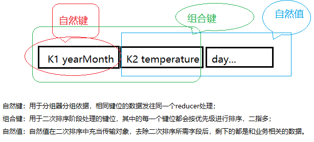

# 简介
> 本算法教程系列建立在您已经有了spark以及Hadoop的开发基础，如果没有的话，请观看本博客的hadoop相关教程或者自行学习，代码会在博客文档写到一定程度统一放到github下。

二次排序是指在reducer阶段对与某个键关联的值进行排序，也叫作值转换。

MapReduce框架会自动对映射器生成的键进行排序。这说明，在reducer阶段准备执行之前，他获得的数据必然是按键有序的（而不是值）。传入各个reducer的值并不是有序的，他们的顺序我们无法确定（取决于资源调配过程的处理顺序）。我们的实际需求中，对值的排序情况是很常见的。为了解决这种问题，我们需要用到二次排序的设计模式。

二次排序问题是指在reducer阶段对与某个键关联的值进行排序，也叫作值转换。为了理解方便，我们定义一般的MapReduce处理过程的公式如下：
$$
map(key_{1},value_{1}) => list(key_{2}, value_{2})
$$
$$
reduce(key_{2},list(value_{2})) => list(key_{3},value_{3})
$$

我们对这两个公式进行说明：首先，map函数接受一个k1-v1，然后他会输出任何数量的k2-v2对。接下来，reduce函数接收另一个k-list(v)作为输入，然后将其进行处理，输出另一个k-v。

显然reduce函数的输入list(value_{2})中的{v1,v2,vn....}是一个无序的，二次排序的目的就是让他们变得有序！因此，我们可以根据上面的公式的模式来定义二次排序的公式，如下所示：
$$
map(key_{1},value_{1}) => list(key_{2}, value_{2})
$$
$$
sort(V_{1},V_{2}....V_{n}) => ({S_{1},S{2}}...S_{n})
$$
V代表无序变量，S代表有序变量。

和之前一样，学以致用。既然理解了二次排序的概念，我们就来通过一些能够举一反三的用例来掌握二次排序的设计模式。
## 1、案例
## 1.1、需求
假定我们有如下的温控数据。
```
2018,01,01,10
2018,01,02,5
2018,01,03,3
2018,01,04,12
2016,11,05,20
2016,11,15,30
2016,03,25,11
2016,04,22,19
2015,06,11,22
2015,06,10,33
2015,07,08,21
2015,02,06,5
2017,11,05,5
2017,11,04,0
2017,02,02,3
2017,02,03,9
2014,06,11,22
2014,06,10,33
2014,07,08,21
2014,07,06,5
```
该数据是按逗号分隔的每一行，分别代表年、月、日以及当天的温度。用公式表现为
$$
L_{0}=Year,L_{1}=Month,L_{2}=Day,L_{3}=Temperature,S=','
$$
其中L代表列的意思，下标代表列所以（从0计数），S代表分隔符号，这里的分隔符是英文逗号，整个文件以UTF-8编码（若数据不含中文可以不必在意）。

现在我们要求处理这段数据，按年月排序倒叙输出的同时（忽略天气），统计各个月之内温度的变化趋势，同样按温度的降序排列，输出在同一行，下面是输出范例：
```
2018-01	12,10,5,3
2017-11	5,0
2017-02	9,3
2016-11	30,20
...
...
```
需求公式如下：
$$
V(List(dateAndTemperature)) => S(List(date, S(Listtemparature))) 
$$
其中date删除了日期。


# 2、项目解决
## 2.1、Mapper的输出key
第一步，确定Map阶段生成的key，显然，我们得将其定义为包含年月以及温度的WritableBean。
```java
package com.zhaoyi.book.algro.bean;

import org.apache.hadoop.io.Writable;
import org.apache.hadoop.io.WritableComparable;

import java.io.DataInput;
import java.io.DataOutput;
import java.io.IOException;
import java.util.Date;

public class DateTemperature implements Writable {
    // year month
    private String yearMonth;
    // day
    private String day;
    // temperature
    private Integer temperature;

    // reflect must be need.
    public DateTemperature() {
    }

    public DateTemperature(String yearMonth, String day, Integer temperature) {
        this.yearMonth = yearMonth;
        this.day = day;
        this.temperature = temperature;
    }

    public String getYearMonth() {
        return yearMonth;
    }

    public void setYearMonth(String yearMonth) {
        this.yearMonth = yearMonth;
    }

    public String getDay() {
        return day;
    }

    public void setDay(String day) {
        this.day = day;
    }

    public Integer getTemperature() {
        return temperature;
    }

    public void setTemperature(Integer temperature) {
        this.temperature = temperature;
    }

    // 序列化接口
    public void write(DataOutput out) throws IOException {
        out.writeUTF(yearMonth);
        out.writeUTF(day);
        out.writeInt(temperature);
    }

    public void readFields(DataInput in) throws IOException {
        yearMonth = in.readUTF();
        day = in.readUTF();
        temperature = in.readInt();
    }

    @Override
    public String toString() {
        return yearMonth + ","+ temperature;
    }
}
```
由于我们要将DateTemperature定义为Mapper的输出key，因此，我们还需要定制其排序逻辑，让mapper阶段的shuffle为我们自动排序。

按照需求，应该优先按年月进行排序，再然后考虑温度，即所谓的thenby方式。注意与二次排序的设计模式区分开。
```java
public class DateTemperature implements Writable, WritableComparable<DateTemperature> {
    ...
        // 排序
    public int compareTo(DateTemperature o) {
        int result = this.getYearMonth().compareTo(o.getYearMonth());
        if(result == 0){
            result = this.getTemperature().compareTo(o.getTemperature());
        }
        // 降序排序。若要升序排序，直接返回result.
        return  -1 * result;
    }

}
```
## 2.2、Mapper
确定了Bean之后，我们就可以来定制Mapper的逻辑了。代码如下：
``` java
package com.zhaoyi.book.algro.bean;

import org.apache.hadoop.io.IntWritable;
import org.apache.hadoop.io.LongWritable;
import org.apache.hadoop.io.NullWritable;
import org.apache.hadoop.io.Text;
import org.apache.hadoop.mapreduce.Mapper;

import java.io.IOException;

public class TemperatureMapper extends Mapper<LongWritable, Text, DateTemperature, IntWritable> {
    @Override
    protected void map(LongWritable key, Text value, Context context) throws IOException, InterruptedException {
        String line = value.toString();
        String[] tokens = line.split(",");
        String yearMonth = tokens[0] + "-" + tokens[1];
        // tokens[2] is Day, it isn't necessary.
        String day = tokens[2];
        Integer temperature = Integer.valueOf(tokens[3]);
        // k->bean v-temperature
        context.write(new DateTemperature(yearMonth,tokens[2], temperature),new IntWritable(temperature));

    }
}
```
可以看到，Mapper输出的是（Bean-温度）的键值对。如果我们不对输出的key做任何处理，显然reduce任务会根据key对象的hash值确定处理次数（分组）。在这种情况下，我们需要将年月相同的记录汇集到一个reducer进行处理。

要实现该功能，就需要使用自定义的分组比较器。

## 2.3、GroupComparator
```java
package com.zhaoyi.book.algro.bean;

import org.apache.hadoop.io.WritableComparable;
import org.apache.hadoop.io.WritableComparator;

public class TemperatureGroupComparator extends WritableComparator {

    public TemperatureGroupComparator(){
        super(DateTemperature.class,true);
    }

    @Override
    public int compare(WritableComparable a, WritableComparable b) {
        return ((DateTemperature) a).getYearMonth().compareTo(((DateTemperature)b).getYearMonth());
    }
}
```
该分组比较器取代mapreduce的默认分组比较行为（按key的hash），修改为按key中的年月字典序进行比较，这样，就可以将他们汇集在一起，统一由一个reducer处理了。

## 2.4、Reducer
```java
package com.zhaoyi.book.algro.bean;

import org.apache.hadoop.io.IntWritable;
import org.apache.hadoop.io.NullWritable;
import org.apache.hadoop.io.Text;
import org.apache.hadoop.mapreduce.Reducer;

import java.io.IOException;

public class TemperatureReducer extends Reducer<DateTemperature, IntWritable,Text, Text> {
    @Override
    protected void reduce(DateTemperature key, Iterable<IntWritable> temperatures, Context context) throws IOException, InterruptedException {
        StringBuilder values = new StringBuilder();
        for (IntWritable temperature : temperatures) {
            values.append(temperature);
            values.append(",");
        }
        // delete the last symbol
        values.deleteCharAt(values.length() - 1);
        // output like 2018-01 22,23...
        context.write(new Text(key.getYearMonth()), new Text(values.toString()));
    }
}

```
reducer的逻辑比较简单，将发送到自己的数据进行汇总，按需求的格式进行输出。注意此处的temperatures，已经是排好序的了。

最后，我们编写Driver类，编写常规的mapreduce模板代码。
## 2.5、Driver驱动类
```java
package com.zhaoyi.book.algro.bean;

import org.apache.hadoop.conf.Configuration;
import org.apache.hadoop.fs.Path;

import org.apache.hadoop.io.IntWritable;
import org.apache.hadoop.io.NullWritable;
import org.apache.hadoop.io.Text;
import org.apache.hadoop.mapreduce.Job;
import org.apache.hadoop.mapreduce.lib.input.FileInputFormat;
import org.apache.hadoop.mapreduce.lib.output.FileOutputFormat;

import java.io.IOException;
import java.util.UUID;

public class TemperatureDriver {
    public static void main(String[] args) throws Exception {
        Job job = Job.getInstance(new Configuration());

        job.setJarByClass(TemperatureDriver.class);
        job.setMapperClass(TemperatureMapper.class);
        job.setReducerClass(TemperatureReducer.class);

        job.setMapOutputKeyClass(DateTemperature.class);
        job.setMapOutputValueClass(IntWritable.class);

        //job.setPartitionerClass(TemperaturePartition.class);
        //job.setNumReduceTasks(2);

        // add your group comparator class.
        job.setGroupingComparatorClass(TemperatureGroupComparator.class);

        job.setOutputValueClass(Text.class);
        job.setOutputKeyClass(Text.class);

        FileInputFormat.setInputPaths(job,new Path("temperature.txt"));
        FileOutputFormat.setOutputPath(job,new Path("output_" + UUID.randomUUID()) );
        System.exit(job.waitForCompletion(true)? 1:0);

    }
}
```
最后编写千篇一律的驱动类，别忘了使用`job.setGroupingComparatorClass(TemperatureGroupComparator.class);`往任务中注册我们的自定义分组比较器，最后执行代码，可以获得一个输出文件，输出结果如下所示：
```
2018-01	12,10,5,3
2017-11	5,0
2017-02	9,3
2016-11	30,20
2016-04	19
2016-03	11
2015-07	21
2015-06	33,22
2015-02	5
2014-07	21,5
2014-06	33,22
```

# 3、项目分析
第二节我们快速的搭建了一个解决方案，有一些细节需要特别的分析一下。在这里，我们需要对Map输出的中间键——DateTemperature进行分析。

为了实现二次排序，我们就需要控制DateTemperature的排序、以及reducer处理键的顺序。我们将需要作用的日期以及温度组合了起来，形成了一个组合键，他们之间的关系如下图所示：



> 自然值也可以理解为键值对去除自然键之后的剩余部分。

二次排序的关键问题在于，如何找出自然键、组合键，以及确定自然值。

# 4、优化
本节没有使用分区功能，所有的数据都发往同一个reducer任务上，比如下面的日志：
```
2019-01-14 11:54:08,395 INFO [org.apache.hadoop.mapred.LocalJobRunner] - reduce > reduce
2019-01-14 11:54:08,395 INFO [org.apache.hadoop.mapred.Task] - Task 'attempt_local1691658871_0001_r_000000_0' done.
2019-01-14 11:54:08,395 INFO [org.apache.hadoop.mapred.LocalJobRunner] - Finishing task: attempt_local1691658871_0001_r_000000_0
2019-01-14 11:54:08,395 INFO [org.apache.hadoop.mapred.LocalJobRunner] - reduce task executor complete.
```
都由任务编号为attempt_local1691658871_0001_r_000000_0的reducer task处理了。

接下来我们指定多个分区，在每个分区中，后台线程按键进行排序，最后，最终发往不同的reducer进行处理，这很大程度的减轻了单台机器（如果是集群）的负担。

## 4.1、定义分区器
```java
package com.zhaoyi.book.algro.bean;

import org.apache.hadoop.io.IntWritable;
import org.apache.hadoop.io.NullWritable;
import org.apache.hadoop.io.Text;
import org.apache.hadoop.mapreduce.Partitioner;

public class TemperaturePartition extends Partitioner<DateTemperature, IntWritable> {
    @Override
    public int getPartition(DateTemperature dateTemperature, IntWritable temperature, int numPartitions) {
        return Math.abs(dateTemperature.getYearMonth().hashCode() % numPartitions);
    }
}
```
我们按自然键对reducer任务数取余的结果（绝对值保证不为负）作为分区的编号。

## 4.2、驱动器注册分区器并设置分区数
```java
job.setNumReduceTasks(2);
```
这样，就可以进行一步优化了，最后汇总的文件会有两份，分别对应不同的分区结果，请留意。


# 6、总结
二次排序是一个控制reducer对值进行排序的设计模式。当我们需要排序的数据不止一列以上，或者需要对值进行排序，那么可以考虑这种模式。设计模式如下：
* 确定组合键，将组合键作为多次排序的标准
* 确定自然键，通过分组比较器控制自然键相同的数据汇集到同一个reducer进行处理；
* 自然值的处理放在reducer中按业务需求确定，总体来说，和二次排序的关键逻辑并无多大关系。
