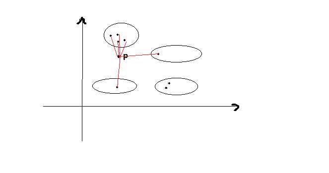

# 简介
K-近邻（K-Nearest Neighbors, KNN）是一个非常简单的机器学习算法，很多机器学习算法书籍都喜欢将该算法作为入门的算法作为介绍。

KNN分类问题是找出一个数据集中与给定查询数据点最近的K个数据点。这个操作也成为KNN连接(KNN-join)。可以定义为：给定两个数据集R合S，对R中的每一个对象，我们希望从S中找出K个最近的相邻对象。

在数据挖掘中，R和S分别称为查询和训练(traning)数据集。训练数据集S表示已经分类的数据，而查询数据集R表示利用S中的分类来进行分类的数据。

KNN是一个比较重要的**聚类算法**，在数据挖掘（图像识别）、生物信息（如乳腺癌诊断）、天气数据生成模型和商品推荐系统中有很多应用。

缺点：开销大。特别是有一个庞大的训练集时。正是这个原因，使用MapReduce运行该算法显得非常的有用。

# 1、KNN算法

## 1.1、KNN分类
KNN的中心思想是建立一个分类方法，使得对于将y（响应变量）与x（预测变量）关联的平滑函数f的形式映射。假设：
$$
x = (x_{1},x_{2},...,x_{n})
$$

$$
y = f(x)
$$

函数f是非参数化的，因为它不涉及任何形式的参数估计。在KNN中，给定一个新的点$p=(p_{1},p_{2},...,p_{n})$，要动态的识别训练集数据集中与p相似的K个观察（k个近邻）。近邻由一个距离或相似度来定义。可以根据独立变量计算不同观察之间的距离，我们采用欧氏距离进行计算：
$$
\sqrt{(x_{1} - p_{1})^2 + (x_{2} - p_{2})^2 + ... + (x_{n}-p_{n})^2}
$$

> 关于距离的算法以及种类有很多，本章节我们采用欧氏距离，即坐标系距离计算方法。

那么如何找出k个近邻呢？

我们先计算出欧氏距离的集合，然后将这个查询对象分配到k个最近训练数据中大多数对象所在的类。

## 1.2、距离函数
假设有两个n维对象：
$$
X = (X_{1},X_{2},...,X_{n})
$$

$$
Y = (Y_{1},Y_{2},...,Y_{n})
$$

$distance(X,Y)$可以定义如下：
$$
distance(X,Y) = \sqrt{\sum_{i=1}^{n}(x_{i}-y_{i})^2}
$$

> 注意欧氏距离只适用于连续性数值类型：double。如果是其他类型，则可以考虑关联业务情况下设置距离函数，将其转化为double类型。

> 关于所有的有关各种距离的介绍，参考博文：

## 1.3、KNN解析
KNN算法是一种对未分类数据进行分类的直观方法，他会根据未分类数据与训练数据集中的数据的相似度或距离完成分类。在下面的例子中，我们有4个分类$C_{1} - C_{4}$：



可以看到，我们的K=6，因此选取了6个近邻，在这6个近邻中，出现在上方的那个类中有4个属于它的点，因此，我们将P点归为上方圆圈包含的这一类型中。

## 1.4、算法描述
KNN算法可以总结为以下的步骤：

1. 确定K
2. 计算新输入与所有训练集之间的距离
3. 对距离排序，并根据第k个最小距离确定k个近邻
4. 手机这些近邻所属的类别
5. 根据多数投票确定类别

算法复杂度:$O(N^2)$

# 2、Spark实现
## 2.1、形式化描述
设R和S是d维数据集，我们想找出其kNN(RS)。进一步假设所有训练数据（S）已经分类到$C={C_{1},C_{2},...,C_{n}}$,这里$C$表示所有可能的分类。R、S和C的定义如下：
$$
R = \{R_{1},R_{2},...,R_{n}\} 
$$

$$
S = \{S_{1},S_{2},...,S_{n}\}
$$

$$
C = \{C_{1},C_{2},...,C_{n}\}
$$

在这里：
1. $R_{i} = (r_{i},a_{1},a_{2},...,a_{n})$，其中$r_{i}$是当前记录的ID，$a_{1},...,a_{n}$是$R_{i}$的属性；
2. $S_{j} = \{r_{j},b_{1},b_{2},...,b_{n}\}$同上。
3. $C_{j}$是$S_{j}$的分类标识符。

我们的目标是找出$KNN(R,S)$。

## 2.2、数据集
S数据集如下所示：
```
100;c1;1.0,1.0
101;c1;1.1,1.2
102;c1;1.2,1.0
103;c1;1.6,1.5
104;c1;1.3,1.7
105;c1;2.0,2.1
106;c1;2.0,2.2
107;c1;2.3,2.3
208;c2;9.0,9.0
209;c2;9.1,9.2
210;c2;9.2,9.0
211;c2;10.6,10.5
212;c2;10.3,10.7
213;c2;9.6,9.1
214;c2;9.4,10.4
215;c2;10.3,10.3
300;c3;10.0,1.0
301;c3;10.1,1.2
302;c3;10.2,1.0
303;c3;10.6,1.5
304;c3;10.3,1.7
305;c3;1.0,2.1
306;c3;10.0,2.2
307;c3;10.3,2.3
```
其中，第一列为每条记录的唯一ID，第二列为该条记录的所属类别，之后的都为维度信息；

R数据集的信息如下：
```
1000;3.0,3.0
1001;10.1,3.2
1003;2.7,2.7
1004;5.0,5.0
1005;13.1,2.2
1006;12.7,12.7
```
其中，第一列为每条记录的唯一ID，之后的都为维度信息；

接下来我们使用KNN算法，来计算R数据集中每个记录所属的类别。

## 2.3、Spark实现
``` java

package com.sunrun.movieshow.autils.knn;

import com.google.common.base.Splitter;
import org.apache.spark.SparkConf;
import org.apache.spark.api.java.JavaPairRDD;
import org.apache.spark.api.java.JavaRDD;
import org.apache.spark.api.java.JavaSparkContext;
import org.apache.spark.api.java.function.Function;
import org.apache.spark.broadcast.Broadcast;
import scala.Tuple2;

import java.util.*;

public class KNNTester {
    /**
     * 1. 获取Spark 上下文对象
     * @return
     */
    public static JavaSparkContext getSparkContext(String appName){
        SparkConf sparkConf = new SparkConf()
                .setAppName(appName)
                //.setSparkHome(sparkHome)
                .setMaster("local[*]")
                // 串行化器
                .set("spark.serializer","org.apache.spark.serializer.KryoSerializer")
                .set("spark.testing.memory", "2147480000");

        return new JavaSparkContext(sparkConf);
    }

    /**
     * 2. 将数字字符串转换为Double数组
     * @param str 数字字符串: "1,2,3,4,5"
     * @param delimiter 数字之间的分隔符：","
     * @return Double数组
     */
    public static List<Double> transferToDoubleList(String str, String delimiter){
        // 使用Google Splitter切割字符串
        Splitter splitter = Splitter.on(delimiter).trimResults();
        Iterable<String> tokens = splitter.split(str);
        if(tokens == null){
            return null;
        }
        List<Double> list = new ArrayList<>();
        for (String token : tokens) {
            list.add(Double.parseDouble(token));
        }
        return list;
    }

    /**
     * 计算距离
     * @param rRecord R数据集的一条记录
     * @param sRecord S数据集的一条记录
     * @param d 记录的维度
     * @return 两条记录的欧氏距离
     */
    public static double calculateDistance(String rRecord, String sRecord, int d){
        double distance = 0D;
        List<Double> r = transferToDoubleList(rRecord,",");
        List<Double> s = transferToDoubleList(sRecord,",");
        // 若维度不一致，说明数据存在问题，返回NAN
        if(r.size() != d || s.size() != d){
            distance =  Double.NaN;
        } else{
            // 保证维度一致之后，计算欧氏距离
            double sum = 0D;
            for (int i = 0; i < s.size(); i++) {
                double diff = s.get(i) - r.get(i);
                sum += diff * diff;
            }
            distance = Math.sqrt(sum);
        }
        return distance;
    }

    /**
     * 根据（距离，类别），找出距离最低的K个近邻
     * @param neighbors 当前求出的近邻数量
     * @param k 寻找多少个近邻
     * @return K个近邻组成的SortedMap
     */
    public static SortedMap<Double, String>findNearestK(Iterable<Tuple2<Double,String>> neighbors, int k){
        TreeMap<Double, String> kNeighbors = new TreeMap<>();
        for (Tuple2<Double, String> neighbor : neighbors) {
            // 距离
            Double distance = neighbor._1;
            // 类别
            String classify = neighbor._2;
            kNeighbors.put(distance, classify);
            // 如果当前已经写入K个元素，那么删除掉距离最远的一个元素（位于末端）
            if(kNeighbors.size() > k){
                kNeighbors.remove(kNeighbors.lastKey());
            }
        }
        return kNeighbors;
    }

    /**
     * 计算对每个类别的投票次数
     * @param kNeighbors 选取的K个最近的点
     * @return 对每个类别的投票结果
     */
    public static Map<String, Integer> buildClassifyCount(Map<Double, String> kNeighbors){
        HashMap<String, Integer> majority = new HashMap<>();
        for (Map.Entry<Double, String> entry : kNeighbors.entrySet()) {
            String classify = entry.getValue();
            Integer count = majority.get(classify);
            // 当前没有出现过，设置为1，否则+1
            if(count == null){
                majority.put(classify,1);
            }else{
                majority.put(classify,count + 1);
            }
        }
        return  majority;
    }

    /**
     * 根据投票结果，选取最终的类别
     * @param majority 投票结果
     * @return 最终的类别
     */
    public static String classifyByMajority(Map<String, Integer> majority){
        String selectedClassify = null;
        int maxVotes = 0;
        // 从投票结果中选取票数最多的一类作为最终选举结果
        for (Map.Entry<String, Integer> entry : majority.entrySet()) {
            if(selectedClassify == null){
                selectedClassify = entry.getKey();
                maxVotes = entry.getValue();
            }else{
                int nowVotes = entry.getValue();
                if(nowVotes > maxVotes){
                    selectedClassify = entry.getKey();
                    maxVotes = nowVotes;
                }
            }
        }
        return selectedClassify;
    }


    public static void main(String[] args) {
        // === 1.创建SparkContext
        JavaSparkContext sc = getSparkContext("KNN");

        // === 2.KNN算法相关参数：广播共享对象
        String HDFSUrl = "hdfs://10.21.1.24:9000/output/";
        // k（K）
        Broadcast<Integer> broadcastK = sc.broadcast(6);
        // d（维度）
        Broadcast<Integer> broadcastD = sc.broadcast(2);

        // === 3.为查询和训练数据集创建RDD
        // R and S
        String RPath = "data/knn/R.txt";
        String SPath = "data/knn/S.txt";
        JavaRDD<String> R = sc.textFile(RPath);
        JavaRDD<String> S = sc.textFile(SPath);
//        // === 将R和S的数据存储到hdfs
//        R.saveAsTextFile(HDFSUrl + "S");
//        S.saveAsTextFile(HDFSUrl + "R");

        // === 5.计算R&S的笛卡尔积
        JavaPairRDD<String, String> cart = R.cartesian(S);
        /**
         * (1000;3.0,3.0,100;c1;1.0,1.0)
         * (1000;3.0,3.0,101;c1;1.1,1.2)
         */

        // === 6.计算R中每个点与S各个点之间的距离:(rid,(distance,classify))
        // (1000;3.0,3.0,100;c1;1.0,1.0) => 1000 is rId, 100 is sId, c1 is classify.
        JavaPairRDD<String, Tuple2<Double, String>> knnPair = cart.mapToPair(t -> {
            String rRecord = t._1;
            String sRecord = t._2;

            // 1000;3.0,3.0
            String[] splitR = rRecord.split(";");
            String rId = splitR[0]; // 1000
            String r = splitR[1];// "3.0,3.0"

            // 100;c1;1.0,1.0
            String[] splitS = sRecord.split(";");
            // sId对于当前算法没有多大意义，我们只需要获取类别细信息，即第二个字段的信息即可
            String sId = splitS[0]; // 100
            String classify = splitS[1]; // c1
            String s = splitS[2];// "3.0,3.0"

            // 获取广播变量中的维度信息
            Integer d = broadcastD.value();
            // 计算当前两个点的距离
            double distance = calculateDistance(r, s, d);
            Tuple2<Double, String> V = new Tuple2<>(distance, classify);
            // (Rid,(distance,classify))
            return new Tuple2<>(rId, V);
        });
        /**
         * (1005,(2.801785145224379,c3))
         * (1006,(4.75078940808788,c2))
         * (1006,(4.0224370722237515,c2))
         * (1006,(3.3941125496954263,c2))
         * (1006,(12.0074976577137,c3))
         * (1006,(11.79025020938911,c3)
         */


        // === 7. 按R中的r根据每个记录进行分组
        JavaPairRDD<String, Iterable<Tuple2<Double, String>>> knnGrouped = knnPair.groupByKey();
        // (1005,[(12.159358535712318,c1),....,(7.3171032519706865,c3), (7.610519036176179,c3)]),
        // (1000,[(2.8284271247461903,c1), (2.6172504656604803,c1), (2.690724....])

        // === 8.找出每个R节点的k个近邻
        JavaPairRDD<String, String> knnOutput = knnGrouped.mapValues(t -> {
            // K
            Integer k = broadcastK.value();
            SortedMap<Double, String> nearestK = findNearestK(t, k);
            // {2.596150997149434=c3, 2.801785145224379=c3, 2.8442925306655775=c3, 3.0999999999999996=c3, 3.1384709652950433=c3, 3.1622776601683795=c3}

            // 统计每个类别的投票次数
            Map<String, Integer> majority = buildClassifyCount(nearestK);
            // {c3=1, c1=5}

            // 按多数优先原则选择最终分类
            String selectedClassify = classifyByMajority(majority);
            return selectedClassify;
        });

        // 存储最终结果
        knnOutput.saveAsTextFile(HDFSUrl + "/result");
        /**
         * [root@h24 hadoop]# hadoop fs -cat /output/result/p*
         * (1005,c3)
         * (1001,c3)
         * (1006,c2)
         * (1003,c1)
         * (1000,c1)
         * (1004,c1)
         */
    }
}
````
步骤7和8也可以通过reduceByKey或者CombineByKey进行一步到位。先来看看我们的转换过程:
```
RDD:
—— knnPair: JavaPairRDD<String, Tuple2<Double, String>>
—— knnGrouped: JavaPairRDD<String, Iterable<Tuple2<Double, String>>>
—— knnOutput：JavaPairRDD<String, String>
```

变换过程：
```
knnPair    => groupBy   => knnGrouped
knnGrouped => mapValues => knnOutput
```
显然，我们无法使用reduceByKey，因此他要求输出类型等同于输入类型。聚集的返回类型不同于聚集值的类型时就要使用combineByKey变换。因此，我们将使用combineByKey把步骤7和8合并到一起。这个合并步骤如下：

RDD:
```
—— knnPair: JavaPairRDD<String, Tuple2<Double, String>>
—— knnOutput: JavaPairRDD<String, String>
```
变换过程：
```
—— knnPair => combineByKey => knnOutput
```


