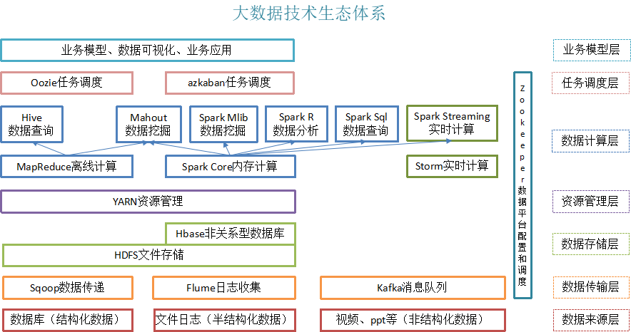

# 简介
通过本教程您可以学习到
1. hadoop是什么？
2. hadoop能解决什么问题？
3. hadoop的生态环境如何？

# 1、hadoop是什么
1）Hadoop是一个由Apache基金会所开发的分布式系统基础架构

2）主要解决，海量数据的存储和海量数据的分析计算问题。

3）广义上来说，HADOOP通常是指一个更广泛的概念——HADOOP生态圈

# 2、Hadoop发展历史
1）Lucene--Doug Cutting开创的开源软件，用java书写代码，实现与Google类似的全文搜索功能，它提供了全文检索引擎的架构，包括完整的查询引擎和索引引擎 

2）2001年年底成为apache基金会的一个子项目

3）对于大数量的场景，Lucene面对与Google同样的困难

4）学习和模仿Google解决这些问题的办法 ：微型版Nutch

5）可以说Google是hadoop的思想之源(Google在大数据方面的三篇论文)
	GFS --->HDFS
	Map-Reduce --->MR
	BigTable --->Hbase

6）2003-2004年，Google公开了部分GFS和Mapreduce思想的细节，以此为基础Doug Cutting等人用了2年业余时间实现了DFS和Mapreduce机制，使Nutch性能飙升 

7）2005 年Hadoop 作为 Lucene的子项目 Nutch的一部分正式引入Apache基金会。2006 年 3 月份，Map-Reduce和Nutch Distributed File System (NDFS) 分别被纳入称为 Hadoop 的项目中 

8）名字来源于Doug Cutting儿子的玩具大象

9）Hadoop就此诞生并迅速发展，标志这云计算时代来临

# 3、Hadoop三大发行版本
1）Apache版本: 最原始（最基础）的版本，对于入门学习最好。

2）Cloudera在大型互联网企业中用的较多。

3）Hortonworks文档较好。

# 1.4 Hadoop的优势

1）高可靠性：因为Hadoop假设计算元素和存储会出现故障，因为它维护多个工作数据副本，在出现故障时可以对失败的节点重新分布处理。

2）高扩展性：在集群间分配任务数据，可方便的扩展数以千计的节点。

3）高效性：在MapReduce的思想下，Hadoop是并行工作的，以加快任务处理速度。

4）高容错性：自动保存多份副本数据，并且能够自动将失败的任务重新分配。

# 2、Hadoop组成
1）Hadoop HDFS：一个高可靠、高吞吐量的分布式文件系统。

2）Hadoop MapReduce：一个分布式的离线并行计算框架。

3）Hadoop YARN：作业调度与集群资源管理的框架。

4）Hadoop Common：支持其他模块的工具模块。

## 2.1 HDFS架构概述
1）NameNode（nn）：存储文件的元数据，如文件名，文件目录结构，文件属性（生成时间、副本数、文件权限），以及每个文件的块列表和块所在的DataNode等。

2）DataNode(dn)：在本地文件系统存储文件块数据，以及块数据的校验和。

3）Secondary NameNode(2nn)：用来监控HDFS状态的辅助后台程序，每隔一段时间获取HDFS元数据的快照。

## 2.2 YARN架构概述
1）ResourceManager(rm)：处理客户端请求、启动/监控ApplicationMaster、监控NodeManager、资源分配与调度；

2）NodeManager(nm)：单个节点上的资源管理、处理来自ResourceManager的命令、处理来自ApplicationMaster的命令；

3）ApplicationMaster：数据切分、为应用程序申请资源，并分配给内部任务、任务监控与容错。

4）Container：对任务运行环境的抽象，封装了CPU、内存等多维资源以及环境变量、启动命令等任务运行相关的信息。

## 2.3 MapReduce架构概述
MapReduce将计算过程分为两个阶段：Map和Reduce
* Map阶段并行处理输入数据
* Reduce阶段对Map结果进行汇总

# 3. 两个体系图
## 3.1 大数据生态体系图

## 3.2 大数据推荐系统框架图

# 参考
本系列的文章参考资料来源有3个地方：
1. 尚硅谷官方大数据教学视频。
2. 书籍《hadoop权威指南 第四版》
3. 书籍《Spark快速大数据分析》
4. 书籍《数据算法——H/Spark大数据处理技巧》
5. 官方文档。

如果有些章节忘记填写请原谅。第3和第4相关的内容可能在本系列牵涉不多，期待后期自己不懒，多多分享。

相关软件包下载地址: 链接: https://pan.baidu.com/s/1cQG9I2OhIwglXG3FufCq3w 提取码: d8gx 