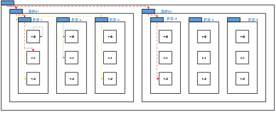
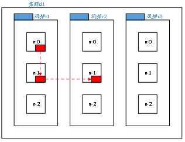
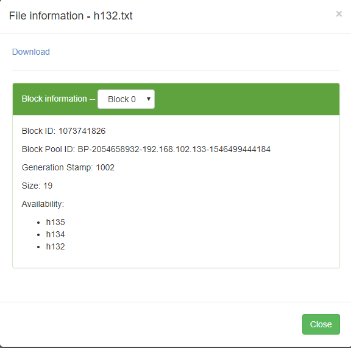
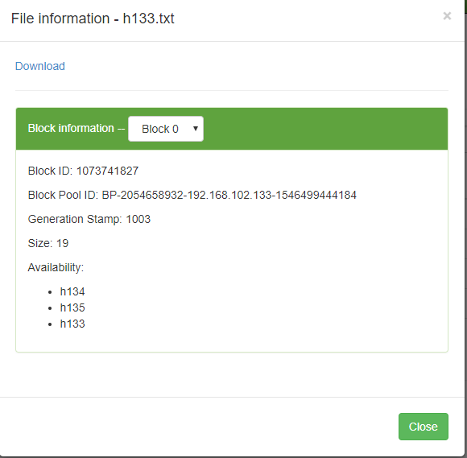
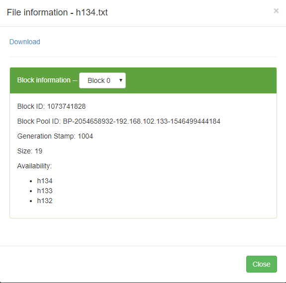
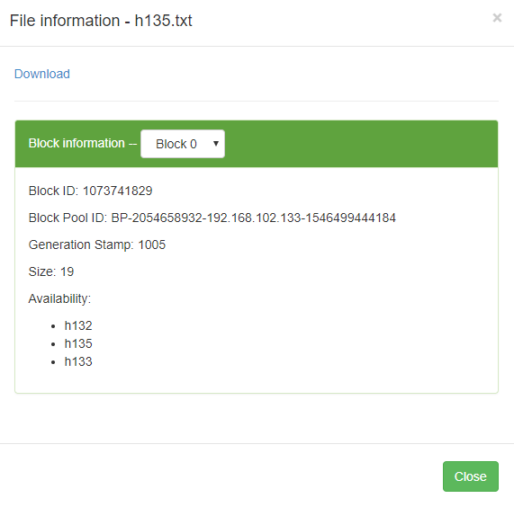

# 简介
通过本教程您可以学习到:
1. 网络拓扑的概念
2. 节点距离的计算
3. 机架感知
4. 如何修改默认的机架设置策略
5. 验证机架感知

# 1、网络相关知识
## 1.1、网络拓扑
为了接下来对一些内部机制有所了解，我们先来了解一下网络拓扑的概念。

在本地网络中，两个节点被称为“彼此近邻”是什么意思？

在海量数据处理中，主要限制因素是节点之间数据的传输速率——带宽很稀缺。这里的想法是将两个节点间的带宽作为距离的衡量标准。

我们来了解一个概念：节点距离——两个节点到达最近的共同祖先的距离总和。这个概念，是否也可以理解为拓扑网络中两个节点的最短路径呢（只不过每条边的边长都为1）？（想起了大学时OJ题目中各种最短路径的算法题。）

例如，假设有数据中心d1机架r1中的节点n1。该节点可以表示为/d1/r1/n1。利用这种标记，这里给出四种距离描述。
Distance(/d1/r1/n1, /d1/r1/n1)=0（同一节点上的进程）
Distance(/d1/r1/n1, /d1/r1/n2)=2（同一机架上的不同节点）
Distance(/d1/r1/n1, /d1/r3/n2)=4（同一数据中心不同机架上的节点）
Distance(/d1/r1/n1, /d2/r4/n2)=6（不同数据中心的节点）



## 1.2、机架感知（副本节点选择）
当我们节点的数目比较多，而副本数比较少的情况下。例如多个DN，3个relication。集群对于选择节点存储的策略是什么样的呢？

1、参考文档
* 参考文档官方1：[链接1](http://hadoop.apache.org/docs/r2.7.3/hadoop-project-dist/hadoop-common/RackAwareness.html)
* 参考文档官方2：[链接2](http://hadoop.apache.org/docs/r2.7.3/hadoop-project-dist/hadoop-hdfs/HdfsDesign.html#Data_Replication)


2、低版本Hadoop副本节点选择
* 第一个副本在client所处的节点上。如果客户端在集群外，随机选一个。
* 第二个副本和第一个副本位于不相同机架的随机节点上。
* 第三个副本和第二个副本位于相同机架，节点随机。


我们可以看到，这样做的目的就是为了使各个副本之间的节点距离尽可能的短。

3、Hadoop2.7.2副本节点选择
* 第一个副本在client所处的节点上。如果客户端在集群外，随机选一个。
* 第二个副本和第一个副本位于相同机架，随机节点。
* 第三个副本位于不同机架，随机节点。



我们可以看到，2.7版本在旧版本的基础上，再一次缩短了第一个副本和第二个副本节点之间的距离。而第三个副本存储在其他的机架上则是为了保证高可用，避免同个机架坏了导致文件不可用（不然都往一个机架里面存储）。

# 2. 集群调整
为了接下来读机架感知策略进行验证，我们需要在原来3台机器的基础上，添加新的节点，也就是4个节点的集群。
```
192.168.102.132 h132
192.168.102.133 h133
192.168.102.134 h134
192.168.102.135 h135
```
在原来的基础上添加一台h132节点即可。

1、关闭所有服务
```
[root@h133 ~]# stop-dfs.sh 

[root@h134 ~]# stop-yarn.sh 

[root@h133 ~]# xcall $JAVA_HOME/bin/jps
-------------localhost----------
----------h133---------
6253 Jps
----------h134---------
4233 Jps
----------h135---------
5140 Jps

```
> h134执行`stop-yarn.sh`，h133上执行`stop-dfs.sh`.

2、修改主机名、主机名文件、h133和h134到h132的ssh无密码登录。
```
[root@h132 ~]# hostname h132

[root@h133 ~]# ssh-copy-id h132

[root@h134 ~]# ssh-copy-id h132

```

3、将h133、h134以及h135的之前的集群信息全部删除。
```
xcall rm -rf /opt/module/hadoop-2.7.2/data /opt/module/hadoop-2.7.2/logs/
```
> 这是很暴力的做法，以后我们会讲到如何增加服役节点，那种才是最合理的增加集群节点的方式——暴力方式只推荐测试使用。

4、将xcall以及xsync脚本复制到h132，使用xshell同步编辑所有机器，一次性编辑所有文档，使其兼容h132主机的存在。（修改循环的下限而已）

5、将h133的/opt/module/hadoop-2.7.3.tar.gz复制到h132节点的相同位置，这样所有的配置文件就保持一致了。
```

```
5、xshell全部会话工具设置服役节点配置文件{hadoop_home}/etc/hadoop/slaves，增加h132。
```
h132
h133
h134
h135
```
这样，所有的准备工作就完成了。

6、在namenode所在节点h133上格式化namenode:
```
[root@h133 hadoop]# hdfs namenode -format
19/01/03 15:00:18 INFO namenode.NameNode: STARTUP_MSG: 
...
```
> hadoop namenode -format已经被标注为要过时了。

7、在namenode所在节点h133上启动dfs相关守护进程
```shell
[root@h133 hadoop]# start-dfs.sh 
Starting namenodes on [h133]
h133: starting namenode, logging to /opt/module/hadoop-2.7.2/logs/hadoop-root-namenode-h133.out
h134: starting datanode, logging to /opt/module/hadoop-2.7.2/logs/hadoop-root-datanode-h134.out
h132: starting datanode, logging to /opt/module/hadoop-2.7.2/logs/hadoop-root-datanode-h132.out
h135: starting datanode, logging to /opt/module/hadoop-2.7.2/logs/hadoop-root-datanode-h135.out
h133: starting datanode, logging to /opt/module/hadoop-2.7.2/logs/hadoop-root-datanode-h133.out
Starting secondary namenodes [h135]
h135: starting secondarynamenode, logging to /opt/module/hadoop-2.7.2/logs/hadoop-root-secondarynamenode-h135.out

[root@h133 hadoop]# xcall $JAVA_HOME/bin/jps
-------------localhost----------
----------h132---------
14979 Jps
14905 DataNode
----------h133---------
8130 NameNode
8457 Jps
8252 DataNode
----------h134---------
4786 Jps
4712 DataNode
----------h135---------
5730 DataNode
5864 Jps
5820 SecondaryNameNode

```
可以看到，我们已经拥有4个数据节点了。


8、在resourceManager所在节点h134上启动yarn相关守护进程
```
root@h134 hadoop]# start-yarn.sh 
starting yarn daemons
starting resourcemanager, logging to /opt/module/hadoop-2.7.2/logs/yarn-root-resourcemanager-h134.out
h132: starting nodemanager, logging to /opt/module/hadoop-2.7.2/logs/yarn-root-nodemanager-h132.out
h133: starting nodemanager, logging to /opt/module/hadoop-2.7.2/logs/yarn-root-nodemanager-h133.out
h135: starting nodemanager, logging to /opt/module/hadoop-2.7.2/logs/yarn-root-nodemanager-h135.out
h134: starting nodemanager, logging to /opt/module/hadoop-2.7.2/logs/yarn-root-nodemanager-h134.out

[root@h134 hadoop]# xcall $JAVA_HOME/bin/jps
-------------localhost----------
----------h132---------
14905 DataNode
15017 NodeManager
15116 Jps
----------h133---------
8496 NodeManager
8130 NameNode
8597 Jps
8252 DataNode
----------h134---------
4835 ResourceManager
4934 NodeManager
4712 DataNode
5215 Jps
----------h135---------
5730 DataNode
6007 Jps
5820 SecondaryNameNode
5903 NodeManager
```

9、测试一下集群是否稳定。
```
[root@h133 hadoop]# hadoop fs -mkdir -p /user/zhaoyi/input
[root@h133 hadoop]# hadoop fs -ls -R /user
drwxr-xr-x   - root supergroup          0 2019-01-03 15:14 /user/zhaoyi
drwxr-xr-x   - root supergroup          0 2019-01-03 15:14 /user/zhaoyi/input
```

OK，我们开始测试。

# 3、自定义机架感知jar包

## 3.1、编写jar包
在之前的项目下，创建如下的类，实现接口DNSToSwitchMapping：
```java
package com.zhaoyi;

import org.apache.hadoop.net.DNSToSwitchMapping;

import java.util.ArrayList;
import java.util.List;

public class MyRockMapping implements DNSToSwitchMapping {

    public List<String> resolve(List<String> names) {
        // rack list
        List<String> racks = new ArrayList<String>();
        int ipNum = 0;// will be 132,133,134,135
        // 获取机架IP
        if(names != null && names.size() > 0){

            for (String name: names) {
                if(name.startsWith("h")){//host name
                    ipNum = Integer.parseInt(name.substring(1));
                }else{// ipv4
                    ipNum = Integer.parseInt(name.substring(1 + name.lastIndexOf(".")));
                }
            }

            if(ipNum <= 133){//132,133
                racks.add("/dd/rack1" );
            }else{//134,135
                racks.add("/dd/rack2");
            }

        }
        return racks;
    }

    public void reloadCachedMappings() {

    }

    public void reloadCachedMappings(List<String> names) {

    }
}
```
我们实现resolve方法，该方法的输入参数为集群中各台主机名（或者IP，我们要做兼容），输出则为我们自定义的机架名称数组，以此来覆盖Hadoop集群默认`org.apache.hadoop.net.ScriptBasedMapping`进行机架设置行为。可以看到，我们将132和133归为rack1，134和135归为rack2。


使用maven打包:
```
mvn package
```
将生成的jar包（我这里名为`firsthadoop-1.0-SNAPSHOT.jar`（和项目名一致），没多大影响）拷贝到集群所有机器的/opt/module/hadoop-2.7.2/share/hadoop/common/lib下。

## 3.2、配置并重启集群

1、修改配置文件core-site.xml（/opt/module/hadoop-2.7.2/etc/hadoop/core-site.xml），使HDFS使用我们的Mapping。
```xml
<!-- Topology Configuration -->
<property>
  <name>net.topology.node.switch.mapping.impl</name>
  <value>com.zhaoyi.MyRockMapping</value>
</property>
```
> com.zhaoyi.MyRockMappin是我们实现类的namespace+classname，请注意和你的保持一致

> net.topology.node.switch.mapping.impl的默认值为`org.apache.hadoop.net.ScriptBasedMapping`.

2、重启集群
```
#### 停止集群
[root@h134 hadoop]# stop-yarn.sh

[root@h133 lib]# stop-dfs.sh 

[root@h133 hadoop]# xcall $JAVA_HOME/bin/jps
-------------localhost----------
----------h132---------
15652 Jps
----------h133---------
10277 Jps
----------h134---------
6283 Jps
----------h135---------
6807 Jps

#### 启动集群
[root@h133 lib]# start-dfs.sh

[root@h134 hadoop]# start-yarn.sh

[root@h133 lib]# xcall $JAVA_HOME/bin/jps
-------------localhost----------
----------h132---------
15794 NodeManager
15690 DataNode
15917 Jps
----------h133---------
10392 NameNode
10520 DataNode
10684 NodeManager
10878 Jps
----------h134---------
6322 DataNode
6437 ResourceManager
6854 Jps
6542 NodeManager
----------h135---------
7010 NodeManager
7139 Jps
6845 DataNode
6943 SecondaryNameNode

```
> 注意停止、启动顺序，以及在不同的机器上运行命令（注意我的copy代码前面对应的主机名）

3、查看机架信息
```shell
[root@h133 lib]# hdfs dfsadmin -printTopology
Rack: /dd/rack1
   192.168.102.132:50010 (h132)
   192.168.102.133:50010 (h133)

Rack: /dd/rack2
   192.168.102.134:50010 (h134)
   192.168.102.135:50010 (h135)
```
很明显，我们的机架已经将分组成功的划分了。接下来，我们开始测试上传文件。

## 3.3、验证理论
目前，我们将132和133归为rack1，134和135归为rack2。

根据我们前面的分析，根据上传节点的不同：
* 若我们从h133上上传，则由于h132和h133位于同一机架。因此文件有两份副本肯定分别存储在h132和133上，剩下的一份随即在h134和135上；

* 如果我们在h134上上传文件，则其中2份在h134和h135上，剩下的一份随机存在h132或者h133上。


通过web界面点击上传的文件可以了解到上传文件副本所在的节点信息，你也可以通过查看namenode的日志查询文件上传过程中的相关信息。
```
[root@h13xxxx ~]hadoop fs -put h13xxx.txt /user
```

1、在h132上传文件h132.txt，从web查看h132.txt文件的分组信息



2、在h133上传文件h133.txt，从web查看h133.txt文件的分组信息



3、在h134上传文件h134.txt，从web查看h134.txt文件的分组信息



4、在h135上传文件h135.txt，从web查看h135.txt文件的分组信息




完全相反的结论，也就是说，2.7.2表现的结果是我们以上的理论中，低版本的表现形式。

总结下来，我们2.7.2目前的表现形式为:
* 第一个副本在client所处的节点上。如果客户端在集群外，随机选一个。
* 第二个副本和第一个副本位于不相同机架的随机节点上。
* 第三个副本和第二个副本位于相同机架，节点随机。


这个问题，以后我们回头再看看看是那里有问题。至少目前我们懂得了一些很有意思的东西，比如说机架、比如说HDFS文件处理的部分原理。

# 参考
1. 官方网站：http://hadoop.apache.org/
2. 官方文档：https://archive.apache.org/dist/hadoop/common/hadoop-2.7.2/
3. 官方文档：http://hadoop.apache.org/docs/r2.7.2/
4. 书籍《hadoop权威指南 第四版》

