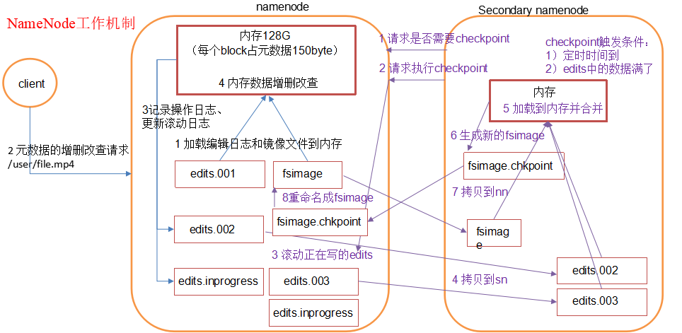

# 简介
通过本教程您可以学习到：
1. NameNode&Secondary NameNode工作机制；
2. 镜像文件和编辑日志文件是什么；
3. 滚动编辑日志是什么；
4. namenode版本号;
5. SecondaryNameNode目录结构；
6. namenode安全模式；

# 1、NameNode & Secondary NameNode工作机制
NN以及2NN的工作机制如下图所示



其中chkpoint检查时间参数设置
* 通常情况下，SecondaryNameNode每隔一小时执行一次。
``` xml
  [hdfs-default.xml]
<property>
  <name>dfs.namenode.checkpoint.period</name>
  <value>3600</value>
</property>
```
* 一分钟检查一次操作次数，当操作次数达到1百万时，SecondaryNameNode执行一次。

1、namenode工作

* 第一次启动namenode格式化后，创建fsimage和edits文件。如果不是第一次启动，直接加载编辑日志和镜像文件到内存。
* 客户端对元数据进行增删改的请求
* namenode记录操作日志，更新滚动日志。
* namenode在内存中对数据进行增删改查

2、Secondary NameNode工作
* Secondary NameNode询问namenode是否需要checkpoint。直接带回namenode是否检查结果。
* Secondary NameNode请求执行checkpoint。
* namenode滚动正在写的edits日志
* 将滚动前的编辑日志和镜像文件拷贝到Secondary NameNode
* Secondary NameNode加载编辑日志和镜像文件到内存，并合并。
* 生成新的镜像文件fsimage.chkpoint
* 拷贝fsimage.chkpoint到namenode
* namenode将fsimage.chkpoint重新命名成fsimage

# 2、NameNode中的重要文件
前面我们提到NN处理过程中的两类关键文件，一个是编辑日志，另一个则是镜像文件，我们来看看他们到底是什么。

位于/opt/module/hadoop-2.7.2/data/tmp/dfs/name/current目录中产生的文件。他们产生于namenode被格式化之后，将产生如下文件
```
edits_0000000000000000000
fsimage_0000000000000000000.md5
seen_txid
VERSION
```
其中：
* seen_txid文件保存的是一个数字，就是最后一个edits_的数字
* Fsimage文件：HDFS文件系统元数据的一个永久性的检查点，其中包含HDFS文件系统的所有目录和文件idnode的序列化信息。 
* Edits文件：存放HDFS文件系统的所有更新操作的路径，文件系统客户端执行的所有写操作首先会被记录到edits文件中。 
* 每次Namenode启动的时候都会将fsimage文件读入内存，并从00001开始到seen_txid中记录的数字依次执行每个edits里面的更新操作，保证内存中的元数据信息是最新的、同步的，可以看成Namenode启动的时候就将fsimage和edits文件进行了合并。

```
[root@h133 current]# pwd
/opt/module/hadoop-2.7.2/data/tmp/dfs/name/current
[root@h133 current]# ll
总用量 3204
...
-rw-r--r--. 1 root root      42 1月   4 10:47 edits_0000000000000000086-0000000000000000087
-rw-r--r--. 1 root root      42 1月   4 11:42 edits_0000000000000000088-0000000000000000089
-rw-r--r--. 1 root root      42 1月   4 12:37 edits_0000000000000000090-0000000000000000091
-rw-r--r--. 1 root root    3406 1月   4 13:32 edits_0000000000000000092-0000000000000000134
-rw-r--r--. 1 root root      42 1月   4 14:28 edits_0000000000000000135-0000000000000000136
-rw-r--r--. 1 root root 1048576 1月   4 14:28 edits_inprogress_0000000000000000137
-rw-r--r--. 1 root root    1027 1月   4 13:33 fsimage_0000000000000000134
-rw-r--r--. 1 root root      62 1月   4 13:33 fsimage_0000000000000000134.md5
-rw-r--r--. 1 root root    1027 1月   4 14:28 fsimage_0000000000000000136
-rw-r--r--. 1 root root      62 1月   4 14:28 fsimage_0000000000000000136.md5
-rw-r--r--. 1 root root       4 1月   4 14:28 seen_txid
-rw-r--r--. 1 root root     208 1月   3 15:10 VERSION
```

# 2.1、seen_txid文件
seen_txid的内容比较简单，单纯的一个数字，代表最后一个edits_的序号，我们可以直接通过cat命令进行查看:
```
[root@h133 current]# cat seen_txid 
137
```
137，刚好对应的edits_inprogress当前的下标。

## 2.2、镜像文件
镜像文件，即fsimage文件，前面提到，他的内容已经是序列化字节码，因此我们直接查看的话，会出现乱码。官方提供了命令方便我们查看内容：
```
hdfs oiv -p 解码进程 -i 输入——镜像文件 -o 输出——转换后文件输出路径
```
解码进程一般使用XML，或者使用默认的Ls。

接下来我们使用XML解码进程将文件转化为一个xml文件，然后在自己的机器上使用比较好的编译器查看XML内容
```
hdfs oiv -p XML -i fsimage_0000000000000000136 -o myfsimage.xml
```
> 我甚至以为支持json格式，尝试了一下不行，希望以后的版本支持输出json格式。json & yml，这两个一个是数据传输、一个是文件配置的最佳选择。

查看文件内容如下：
``` xml
<?xml version="1.0"?>
<fsimage>
    <NameSection>
        <genstampV1>1000</genstampV1>
        <genstampV2>1014</genstampV2>
        <genstampV1Limit>0</genstampV1Limit>
        <lastAllocatedBlockId>1073741838</lastAllocatedBlockId>
        <txid>136</txid>
    </NameSection>
    <INodeSection>
        <lastInodeId>16403</lastInodeId>
        <inode>
            <id>16385</id>
            <type>DIRECTORY</type>
            <name></name>
            <mtime>1546499650677</mtime>
            <permission>root:supergroup:rwxr-xr-x</permission>
            <nsquota>9223372036854775807</nsquota>
            <dsquota>-1</dsquota>
        </inode>
        <inode>
            <id>16386</id>
            <type>DIRECTORY</type>
            <name>user</name>
            <mtime>1546579469553</mtime>
            <permission>root:supergroup:rwxr-xr-x</permission>
            <nsquota>-1</nsquota>
            <dsquota>-1</dsquota>
        </inode>
        <inode>
            <id>16387</id>
            <type>DIRECTORY</type>
            <name>zhaoyi</name>
            <mtime>1546502296962</mtime>
            <permission>root:supergroup:rwxr-xr-x</permission>
            <nsquota>-1</nsquota>
            <dsquota>-1</dsquota>
        </inode>
        ....
```
不难看出，该文件记录了我们HDFS文件目录结构以及一些inode信息。

## 2.3、编辑日志
接下来我们转化编辑日志文件(edits_xxxx)为XML格式。他使用另一个命令操作：
```
hdfs oev -p 文件类型 -i 编辑日志 -o 转换后文件输出路径 
```
在执行此操作之前，我们就直接转换，发现最新的edits文件中并没有任何数据，说明已经进行过一次合并（参见图示）。接下来我们上传一个文件，然后在进行转换
```
dfs oev -p XML -i edits_inprogress_0000000000000000139 -o edits.xml
```
得到如下的XML文件内容：
``` xml
<?xml version="1.0" encoding="UTF-8"?>
<EDITS>
  <EDITS_VERSION>-63</EDITS_VERSION>
  <RECORD>
    <OPCODE>OP_START_LOG_SEGMENT</OPCODE>
    <DATA>
      <TXID>139</TXID>
    </DATA>
  </RECORD>
  <RECORD>
    <OPCODE>OP_ADD</OPCODE>
    <DATA>
      <TXID>140</TXID>
      <LENGTH>0</LENGTH>
      <INODEID>16404</INODEID>
      <PATH>/seen_txid._COPYING_</PATH>
      <REPLICATION>3</REPLICATION>
      <MTIME>1546588237534</MTIME>
      <ATIME>1546588237534</ATIME>
      <BLOCKSIZE>134217728</BLOCKSIZE>
      <CLIENT_NAME>DFSClient_NONMAPREDUCE_302138823_1</CLIENT_NAME>
      <CLIENT_MACHINE>192.168.102.133</CLIENT_MACHINE>
      <OVERWRITE>true</OVERWRITE>
      <PERMISSION_STATUS>
        <USERNAME>root</USERNAME>
        <GROUPNAME>supergroup</GROUPNAME>
        <MODE>420</MODE>
      </PERMISSION_STATUS>
      <RPC_CLIENTID>d56baf74-71a1-4e2e-a64c-9b6ba88d5552</RPC_CLIENTID>
      <RPC_CALLID>3</RPC_CALLID>
    </DATA>
  </RECORD>
  <RECORD>
    <OPCODE>OP_ALLOCATE_BLOCK_ID</OPCODE>
    <DATA>
      <TXID>141</TXID>
      <BLOCK_ID>1073741839</BLOCK_ID>
    </DATA>
  </RECORD>
  <RECORD>
    <OPCODE>OP_SET_GENSTAMP_V2</OPCODE>
    <DATA>
      <TXID>142</TXID>
      <GENSTAMPV2>1015</GENSTAMPV2>
    </DATA>
  </RECORD>
  <RECORD>
    <OPCODE>OP_ADD_BLOCK</OPCODE>
    <DATA>
      <TXID>143</TXID>
      <PATH>/seen_txid._COPYING_</PATH>
      <BLOCK>
        <BLOCK_ID>1073741839</BLOCK_ID>
        <NUM_BYTES>0</NUM_BYTES>
        <GENSTAMP>1015</GENSTAMP>
      </BLOCK>
      <RPC_CLIENTID></RPC_CLIENTID>
      <RPC_CALLID>-2</RPC_CALLID>
    </DATA>
  </RECORD>
  <RECORD>
    <OPCODE>OP_CLOSE</OPCODE>
    <DATA>
      <TXID>144</TXID>
      <LENGTH>0</LENGTH>
      <INODEID>0</INODEID>
      <PATH>/seen_txid._COPYING_</PATH>
      <REPLICATION>3</REPLICATION>
      <MTIME>1546588238055</MTIME>
      <ATIME>1546588237534</ATIME>
      <BLOCKSIZE>134217728</BLOCKSIZE>
      <CLIENT_NAME></CLIENT_NAME>
      <CLIENT_MACHINE></CLIENT_MACHINE>
      <OVERWRITE>false</OVERWRITE>
      <BLOCK>
        <BLOCK_ID>1073741839</BLOCK_ID>
        <NUM_BYTES>4</NUM_BYTES>
        <GENSTAMP>1015</GENSTAMP>
      </BLOCK>
      <PERMISSION_STATUS>
        <USERNAME>root</USERNAME>
        <GROUPNAME>supergroup</GROUPNAME>
        <MODE>420</MODE>
      </PERMISSION_STATUS>
    </DATA>
  </RECORD>
  <RECORD>
    <OPCODE>OP_RENAME_OLD</OPCODE>
    <DATA>
      <TXID>145</TXID>
      <LENGTH>0</LENGTH>
      <SRC>/seen_txid._COPYING_</SRC>
      <DST>/seen_txid</DST>
      <TIMESTAMP>1546588238066</TIMESTAMP>
      <RPC_CLIENTID>d56baf74-71a1-4e2e-a64c-9b6ba88d5552</RPC_CLIENTID>
      <RPC_CALLID>8</RPC_CALLID>
    </DATA>
  </RECORD>
</EDITS>

```
从中可以了解到我们往根路径下上传了一个seen.txid文件之后的编辑日志的记录信息。很多情况下，该文件可能会具有很多的历史数据。这对于我们想单独调试某个操作的时候，无法定位准备的日志，这就需要我们“清空”最新的edits文件的历史数据。

这就需要我们滚动当前的日志了。

如何滚动？调用命令
```
hdfs dfsadmin -rollEdtis
```

例如：
```
[root@h133 current]# hdfs dfsadmin -rollEdits
Successfully rolled edit logs.
New segment starts at txid 147
```
可以看到，新的分片id变成了147，我们也可以查看当前最新的分片日志文件为edits_inprogress_0000000000000000147：
```
[root@h133 current]# ll edits*
-rw-r--r--. 1 root root      42 1月   3 15:12 edits_0000000000000000001-0000000000000000002
....
-rw-r--r--. 1 root root      42 1月   4 15:23 edits_0000000000000000137-0000000000000000138
-rw-r--r--. 1 root root     527 1月   4 15:59 edits_0000000000000000139-0000000000000000146
-rw-r--r--. 1 root root 1048576 1月   4 15:59 edits_inprogress_0000000000000000147

```
转化XML的日志进行查看，文件内容就比较干净了，方便我们进行一些调试：
``` shell
[root@h133 current]# hdfs oev -p XML -i edits_inprogress_0000000000000000147 -o edits.xml 
[root@h133 current]# cat edits.xml 
<?xml version="1.0" encoding="UTF-8"?>
<EDITS>
  <EDITS_VERSION>-63</EDITS_VERSION>
  <RECORD>
    <OPCODE>OP_START_LOG_SEGMENT</OPCODE>
    <DATA>
      <TXID>147</TXID>
    </DATA>
  </RECORD>
</EDITS>
```

## 2.4、版本文件VERSION
该文件namenode中一些版本号的信息。
```
root@h133 current]# cat VERSION 
#Thu Jan 03 15:10:44 CST 2019
namespaceID=1140718114
clusterID=CID-5b84c9ed-504a-4885-9e26-b9e99eefaf21
cTime=0
storageType=NAME_NODE
blockpoolID=BP-2054658932-192.168.102.133-1546499444184
layoutVersion=-63
```
* namespaceID在HDFS上，会有多个Namenode，所以不同Namenode的namespaceID是不同的，分别管理一组blockpoolID。
* clusterID集群id，全局唯一
* cTime属性标记了namenode存储系统的创建时间，对于刚刚格式化的存储系统，这个属性为0；但是在文件系统升级之后，该值会更新到新的时间戳。
* storageType属性说明该存储目录包含的是namenode的数据结构。
* blockpoolID：一个block pool id标识一个block pool，并且是跨集群的全局唯一。当一个新的Namespace被创建的时候(format过程的一部分)会创建并持久化一个唯一ID。在创建过程构建全局唯一的BlockPoolID比人为的配置更可靠一些。NN将BlockPoolID持久化到磁盘中，在后续的启动过程中，会再次load并使用。
* layoutVersion是一个负整数。通常只有HDFS增加新特性时才会更新这个版本号。

其中，最主要的就是namespaceID，他是当前NN的唯一标识；

另外一个则是clusterID，我们查看其它节点的该文件可以发现，大家同属一个集群，那么clusterID则都相等；

再有，就是storageType字段，不同类型的节点对应的不同，例如当前这个文件是NN的，则其值就为namenode。查看其它节点的不同类型storageType值，DN的则为DATA_NODE，而2NN的则和NN一样，都为NAME_NODE（毕竟帮NN做namenode最苦的活，是该得到相同的名分。）

# 3、SecondaryNameNode目录结构
Secondary NameNode用来监控HDFS状态的辅助后台程序，每隔一段时间获取HDFS元数据的快照。

在/opt/module/hadoop-2.7.2/data/tmp/dfs/namesecondary/current这个目录中查看SecondaryNameNode目录结构。
```
[root@h135 current]# pwd
/opt/module/hadoop-2.7.2/data/tmp/dfs/namesecondary/current
[root@h135 current]# ll
总用量 2280
-rw-r--r--. 1 root root      42 1月   3 23:58 edits_0000000000000000001-0000000000000000002
...
-rw-r--r--. 1 root root      42 1月   6 01:16 edits_0000000000000000191-0000000000000000192
-rw-r--r--. 1 root root      42 1月   6 02:16 edits_0000000000000000193-0000000000000000194
-rw-r--r--. 1 root root    1095 1月   6 01:16 fsimage_0000000000000000192
-rw-r--r--. 1 root root      62 1月   6 01:16 fsimage_0000000000000000192.md5
-rw-r--r--. 1 root root    1095 1月   6 02:16 fsimage_0000000000000000194
-rw-r--r--. 1 root root      62 1月   6 02:16 fsimage_0000000000000000194.md5
-rw-r--r--. 1 root root     208 1月   6 02:16 VERSION
```
显然，SecondaryNameNode的namesecondary/current目录和主namenode的current目录的布局相同。这样的好处在于：当主namenode发生故障时（假设没有及时备份数据），可以从SecondaryNameNode恢复数据。
* 方法一：将SecondaryNameNode中数据拷贝到namenode存储数据的目录；
* 方法二：使用-importCheckpoint选项启动namenode守护进程，从而将SecondaryNameNode用作新的主namenode。

## 3.1、拷贝恢复
我们来实操一下方法一的结果。

1、在h133(NN)上杀死namenode守护进程，同时删除掉name目录，模拟比较彻底的集群故障。
```
[root@h133 dfs]# kill -9 10392
[root@h133 dfs]# jps
14550 Jps
10520 DataNode
10684 NodeManager
[root@h133 dfs]# pwd
/opt/module/hadoop-2.7.2/data/tmp/dfs
[root@h133 dfs]# rm -rf name/*
```
这时候我们无法访问web，也无法执行任何业务操作（上传、文件）了。

2、接下来来到h135(2NN)上，执行拷贝操作：
```
[root@h135 dfs]# scp -r namesecondary/* root@h133:/opt/module/hadoop-2.7.2/data/tmp/dfs/name
```

3、在h133上单独启动namenode守护进程
```
root@h133 dfs]# hadoop-daemon.sh start namenode
```

等待namenode恢复状态，一切恢复如初。

## 3.2、2NN替换NN修复
模拟namenode故障，并采用方法二，恢复namenode数据

（1）修改hdfs-site.xml中的
```xml
<!-- 配置检查点的检查频率 -->
<property>
  <name>dfs.namenode.checkpoint.period</name>
  <value>120</value>
</property>

<!-- 配置namenode的文件目录 -->
<property>
  <name>dfs.namenode.name.dir</name>
  <value>/opt/module/hadoop-2.7.2/data/tmp/dfs/name</value>
</property>
```
（2）kill -9 namenode进程
```
kill -9  xxxxx
```

（3）删除namenode存储的数据（/opt/module/hadoop-2.7.2/data/tmp/dfs/name）
```
rm -rf /opt/module/hadoop-2.7.2/data/tmp/dfs/name/*
```

（4）如果SecondaryNameNode不和Namenode在一个主机节点上，需要将SecondaryNameNode存储数据的目录拷贝到Namenode存储数据的平级目录。
```
pwd
/opt/module/hadoop-2.7.2/data/tmp/dfs
ls
data  name  namesecondary
```

（5）导入检查点数据（等待一会ctrl+c结束掉）
```
bin/hdfs namenode -importCheckpoint
```

（6）启动namenode
```
sbin/hadoop-daemon.sh start namenode
```

（7）如果提示文件锁了，可以删除in_use.lock 
```
rm -rf /opt/module/hadoop-2.7.2/data/tmp/dfs/namesecondary/in_use.lock
```

# 4、安全模式
Namenode启动时，首先将映像文件（fsimage）载入内存，并执行编辑日志（edits）中的各项操作。一旦在内存中成功建立文件系统元数据的映像，则创建一个新的fsimage文件和一个空的编辑日志。此时，namenode开始监听datanode请求。为了不受到外部请求的干扰，namenode会运行在安全模式下，最直接的表现为：文件系统对于客户端来说是只读的。

系统中的数据块的位置并不是由namenode维护的，而是以块列表的形式存储在datanode中。在系统的正常操作期间，namenode会在内存中保留所有块位置的映射信息。在安全模式下，各个datanode会向namenode发送最新的块列表信息，namenode了解到足够多的块位置信息之后，即可高效运行文件系统。

如果满足“最小副本条件”，namenode会在30秒钟之后就退出安全模式。在启动一个刚刚格式化的HDFS集群时，因为系统中还没有任何块，所以namenode不会进入安全模式。但是如果是集群重启、故障恢复等从一个原有状态开始启动集群状态，则会启动安全模式，相信前面在模拟namenode故障时，您也有遇到安全模式。

> 最小副本条件：整个文件系统中99.9%的块满足最小副本级别（默认值：dfs.replication.min=1）。

集群处于安全模式，不能执行重要操作（写操作）。集群启动完成后，自动退出安全模式。关于安全模式的相关命令有：
```
（1）bin/hdfs dfsadmin -safemode get		（功能描述：查看安全模式状态）
（2）bin/hdfs dfsadmin -safemode enter  	（功能描述：进入安全模式状态）
（3）bin/hdfs dfsadmin -safemode leave	（功能描述：离开安全模式状态）
（4）bin/hdfs dfsadmin -safemode wait	（功能描述：等待安全模式状态）
```

1、查看安全模式状态
```shell
[root@h134 ~]# hdfs dfsadmin -safemode get
Safe mode is OFF
[root@h134 ~]# hadoop fs -put h134.txt 
put: `.': No such file or directory
[root@h134 ~]# hadoop fs -put h134.txt /
[root@h134 ~]# hadoop fs -cat /h134.txt
this is h134 file.
```
当前状态为OFF，我们可以正常的文件上传操作。

2、进入安全模式
```shell
[root@h134 ~]# hdfs dfsadmin -safemode enter
Safe mode is ON
[root@h134 ~]# hdfs dfsadmin -safemode get
Safe mode is ON
[root@h134 ~]# hadoop fs -put h134.txt /
put: `/h134.txt': File exists
[root@h134 ~]# hadoop fs -cat /h134.txt
this is h134 file.
```
可以看到，进入安全模式之后，HDFS文件系统不支持我们的写入操作，但支持读取操作。

3、离开安全模式
```
[root@h134 ~]# hdfs dfsadmin -safemode leave
Safe mode is OFF
```

4、等待安全模式

这个模式，有点类似于消息队列的原理。当我们执行一个任务时，可以等待队列有了充分的准备之后才执行我们的任务。这里表现为：指定一个任务，安全模式关闭之后立即执行。

现在我们编写一个shell脚本，简单的定义个上传文件的任务，在安全模式开启的情况下让其等待。要完成该需求，就可以使用等待安全模式的命令。

```
[root@h134 ~]# vi wait_safe.sh
#!/bin/bash
echo "waiting for safe mode off..."
hdfs dfsadmin -safemode wait
echo "safe mode off, start upload file..."
hadoop fs -put ~/h134.txt /user
echo "upload done..."
```

接下来我们使用xshell重新建立一个会话，用2个窗口来演示这个过程。

（1）会话一先开启集群的安全模式：
```
[root@h134 ~]# clear
[root@h134 ~]# hdfs dfsadmin -safemode enter
Safe mode is ON
```

（2）会话二执行任务脚本:
```
[root@h134 ~]# sh wait_safe.sh 
waiting for safe mode off...
```
可以看到，当前脚本阻塞在命令`hdfs dfsadmin -safemode wait`上，正是我们想要的效果。

（3）会话一离开安全模式
```
[root@h134 ~]# hdfs dfsadmin -safemode leave
Safe mode is OFF
```

（4）立马切换到会话二的窗口:
```
[root@h134 ~]# sh wait_safe.sh 
waiting for safe mode off...
Safe mode is OFF
safe mode off, start upload file...
upload done...
```

这样，就能在安全模式关闭的第一时间完成我们的上传任务了。


