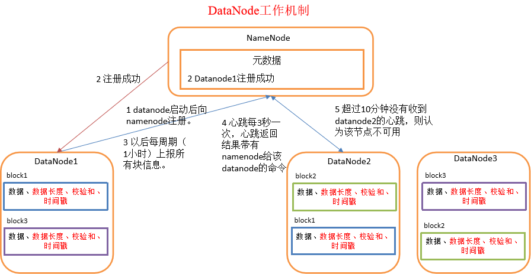

# 简介
通过本教程您可以学习到：
1. DataNode的工作机制；
2. 超时配置；
3. 数据完整性验证流程；
4. DataNode的目录结构；

# 1、DataNode的工作机制
前面我们学习了namenode的工作机制，接下来我们看看工作节点datanode的工作机制，如下图所示：




（1）一个数据块在datanode上以文件形式存储在磁盘上，包括两个文件，一个是数据本身，一个是元数据包括数据块的长度，块数据的校验和，以及时间戳。

（2）DataNode启动后向namenode注册，通过后，周期性（1小时）的向namenode上报所有的块信息。

（3）心跳是每3秒一次，心跳返回结果带有namenode给该datanode的命令如复制块数据到另一台机器，或删除某个数据块。如果超过10分钟没有收到某个datanode的心跳，则认为该节点不可用。


（4）集群运行中可以安全加入和退出一些机器。


# 2、时限参数设置
datanode进程死亡或者网络故障造成datanode无法与namenode通信，namenode不会立即把该节点判定为死亡，要经过一段时间，这段时间暂称作超时时长。

HDFS默认的超时时长为10分钟+30秒。如果定义超时时间为timeout，则超时时长的计算公式为：
```
timeout  = 2 * dfs.namenode.heartbeat.recheck-interval + 10 * dfs.heartbeat.interval。
```
默认的dfs.namenode.heartbeat.recheck-interval大小为5分钟，dfs.heartbeat.interval默认为3秒。我们可以查看其默认配置:
``` xml
<property>
  <name>dfs.namenode.heartbeat.recheck-interval</name>
  <value>300000</value>
  <description>
    This time decides the interval to check for expired datanodes.
    With this value and dfs.heartbeat.interval, the interval of
    deciding the datanode is stale or not is also calculated.
    The unit of this configuration is millisecond.
  </description>
</property>

<property>
  <name>dfs.heartbeat.interval</name>
  <value>3</value>
  <description>Determines datanode heartbeat interval in seconds.</description>
</property>

```
> 需要注意的是hdfs-site.xml 配置文件中的heartbeat.recheck.interval的单位为毫秒，dfs.heartbeat.interval的单位为秒。

# 3、数据完整性
* 当DataNode读取block的时候，它会计算checksum
* 如果计算后的checksum，与block创建时值不一样，说明block已经损坏。client转而读取其他DataNode上的block.
* datanode在其文件创建后周期验证checksum

> 关于数据校验的相关知识，可以参考一些其他的资料，这是一门很值得学习的学科。

# 4、DataNode的目录结构
和namenode不同的是，datanode的存储目录是初始阶段自动创建的，不需要额外格式化。

1、在/opt/module/hadoop-2.7.2/data/tmp/dfs/data/current这个目录下查看版本号
```
[root@h135 current]# pwd
/opt/module/hadoop-2.7.2/data/tmp/dfs/data/current
[root@h135 current]# cat VERSION 
#Sun Jan 06 03:09:44 CST 2019
storageID=DS-dac42eb2-3c51-4489-9d89-b88f3a70a604
clusterID=CID-5b84c9ed-504a-4885-9e26-b9e99eefaf21
cTime=0
datanodeUuid=c36a1e36-33fd-4074-b13a-ba1e632762bd
storageType=DATA_NODE
layoutVersion=-56
```
* storageID：存储id号
* clusterID集群id，全局唯一
* cTime属性标记了datanode存储系统的创建时间，对于刚刚格式化的存储系统，这个属性为0；但是在文件系统升级之后，该值会更新到新的时间戳。
* datanodeUuid：datanode的唯一识别码
* storageType：存储类型
* layoutVersion是一个负整数。通常只有HDFS增加新特性时才会更新这个版本号。

2、在这里深层次进入，还有一个current，这个目录下查看该数据块的版本号
```
[root@h135 current]# pwd
/opt/module/hadoop-2.7.2/data/tmp/dfs/data/current/BP-2054658932-192.168.102.133-1546499444184/current
[root@h135 current]# cat VERSION 
#Sun Jan 06 03:09:44 CST 2019
namespaceID=1140718114
cTime=0
blockpoolID=BP-2054658932-192.168.102.133-1546499444184
layoutVersion=-56
```
* namespaceID：是datanode首次访问namenode的时候从namenode处获取的。storageID对每个datanode来说是唯一的（但对于单个datanode中所有存储目录来说则是相同的），namenode可用这个属性来区分不同datanode。
* cTime属性标记了datanode存储系统的创建时间，对于刚刚格式化的存储系统，这个属性为0；但是在文件系统升级之后，该值会更新到新的时间戳。
* blockpoolID：一个block pool id标识一个block pool，并且是跨集群的全局唯一。当一个新的Namespace被创建的时候(format过程的一部分)会创建并持久化一个唯一ID。在创建过程构建全局唯一的BlockPoolID比人为的配置更可靠一些。NN将BlockPoolID持久化到磁盘中，在后续的启动过程中，会再次load并使用。
* layoutVersion是一个负整数。通常只有HDFS增加新特性时才会更新这个版本号。


