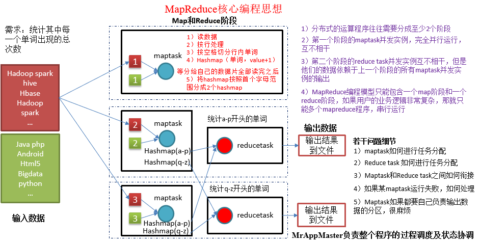
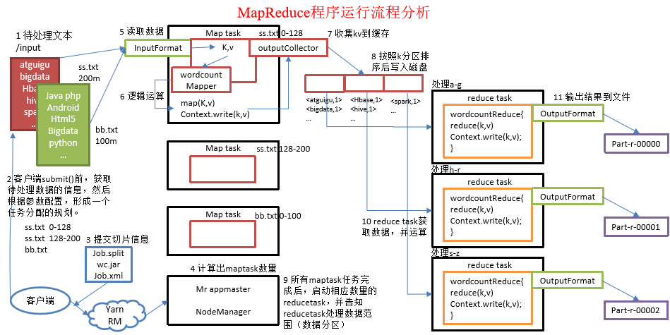

# 简介
本章节我们先来了解一些关于MapReduce的理论知识。从本章节您可以学习到：MapReduce的相关知识。

# 1、概念
Mapreduce是一个**分布式**运算程序的编程框架，是用户开发“基于hadoop的数据分析应用”的核心框架；

Mapreduce核心功能是将用户编写的**业务逻辑代码**和**自带默认组件**整合成一个完整的**分布式运算程序**，并发运行在一个hadoop集群上。

> 注意几个关键词即可：分布式、业务逻辑以及自带默认组件。

## 1.1、为什么选择MapReduce
海量数据在单机上处理因为硬件资源限制，无法胜任而一旦将单机版程序扩展到集群来分布式运行，将极大增加程序的复杂度和开发难度。引入mapreduce框架后，开发人员可以将绝大部分工作集中在业务逻辑的开发上，而将分布式计算中的复杂性交由框架来处理。

## 1.2 mapreduce分布式方案考虑的问题
mapreduce作为一个分布式解决方案，使用时至少需要考虑以下问题：
* 运算逻辑要不要先分后合？ 
* 程序如何分配运算任务（切片）？
* 两阶段的程序如何启动？如何协调？
* 整个程序运行过程中的监控？容错？重试？

分布式方案需要考虑很多问题，但是我们可以将分布式程序中的公共功能封装成框架，让开发人员将精力集中于业务逻辑上。

而mapreduce就是这样一个分布式程序的通用框架。

## 1.3、MapReduce核心思想

> mapreduce让我想起了java8新概念——流。

我们来看一下官方提供的统计单词的案例的MapReduce示意图，从中了解mapreduce的思想。

分布式的运算程序往往需要分成至少2个阶段
* 第一个阶段的maptask并发实例，完全并行运行，互不相干
* 第二个阶段的reduce task并发实例互不相干，但是他们的数据依赖于上一个阶段的所有maptask并发实例的输出。

MapReduce编程模型只能包含一个map阶段和一个reduce阶段，如果用户的业务逻辑非常复杂，那就只能多个mapreduce程序，串行运行。

一个完整的mapreduce程序在分布式运行时有三类实例进程：
* MrAppMaster：负责整个程序的过程调度及状态协调
* MapTask：负责map阶段的整个数据处理流程
* ReduceTask：负责reduce阶段的整个数据处理流程

同时留意我们示意图中提出的几个问题，一旦我们知道了答案，就差不多学会了MapReduce的使用了，接下来就是探索这些问题的答案的过程。

## 1.4、MapReduce编程规范
用户编写的MapReduce程序分成三个部分：Mapper，Reducer，Driver(提交运行MapReduce程序的客户端)。
1. Mapper阶段
   * 用户自定义的Mapper要继承自己的父类
   * Mapper的输入数据是KV对的形式（KV的类型可自定义）
   * Mapper中的业务逻辑写在map()方法中
   * Mapper的输出数据是KV对的形式（KV的类型可自定义）
   * map()方法（maptask进程）对每一个<K,V>调用一次
2. Reducer阶段
   * 用户自定义的Reducer要继承自己的父类
   * Reducer的输入数据类型对应Mapper的输出数据类型，也是KV
   * Reducer的业务逻辑写在reduce()方法中
   * Reducetask进程对每一组相同k的`<k,v>`组调用一次reduce()方法
3. Driver阶段 整个程序需要一个Drvier来进行提交，提交的是一个描述了各种必要信息的job对象。

在学习1.5节之前，推荐进入下一节编写一个简单案例:*【hadoop】17.MapReduce-wordcount案例简单实现*

## 1.5、MapReduce运行流程分析
以wordCount案例为基础，大致运行流程如下：

1. 在MapReduce程序读取文件的输入目录上存放相应的文件。
2. 客户端程序在submit()方法执行前，获取待处理的数据信息，然后根据集群中参数的配置形成一个任务分配规划。
3. 客户端提交job.split、jar包、job.xml等文件给yarn，yarn中的resourcemanager启动MRAppMaster。
4. MRAppMaster启动后根据本次job的描述信息，计算出需要的maptask实例数量，然后向集群申请机器启动相应数量的maptask进程。
5. maptask利用客户指定的inputformat来读取数据，形成输入KV对。
6. maptask将输入KV对传递给客户定义的map()方法，做逻辑运算
7. map()运算完毕后将KV对收集到maptask缓存。
8. maptask缓存中的KV对按照K分区排序后不断写到磁盘文件
9. MRAppMaster监控到所有maptask进程任务完成之后，会根据客户指定的参数启动相应数量的reducetask进程，并告知reducetask进程要处理的数据分区。
10. Reducetask进程启动之后，根据MRAppMaster告知的待处理数据所在位置，从若干台maptask运行所在机器上获取到若干个maptask输出结果文件，并在本地进行重新归并排序，然后按照相同key的KV为一个组，调用客户定义的reduce()方法进行逻辑运算。
11. Reducetask运算完毕后，调用客户指定的outputformat将结果数据输出到外部存储。