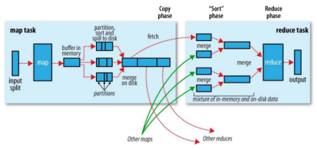
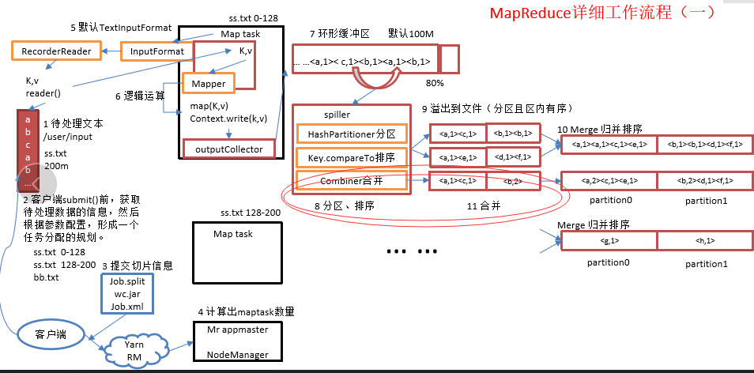
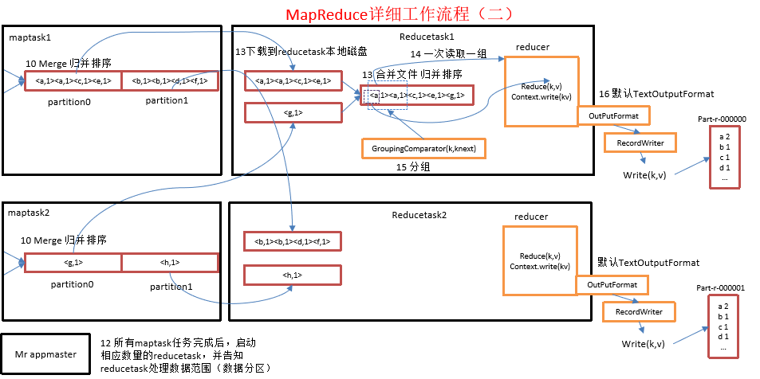

# 简介
hadoop的核心思想是MapReduce，但shuffle又是MapReduce的核心。shuffle的主要工作是从Map结束到Reduce开始之间的过程。首先看下这张图，就能了解shuffle所处的位置。图中的partitions、copy phase、sort phase所代表的就是shuffle的不同阶段。

shuffle阶段又可以分为Map端的shuffle和Reduce端的shuffle。

需要注意的是，shuffer是Hadoop框架不断改进的核心，因此，很可能本文的有些细节已经在不同的版本中进行了大改，但不论如何，我们只要了解其工作原理即可。

# 1、shuffer解析
下面的流程是整个mapreduce最全工作流程，但是shuffle过程只是从第7步开始到第16步结束，而其中的黄色外框部分均是我们可以操作的部分。

具体shuffle过程详解，如下：
* maptask收集我们的map()方法输出的kv对，放到内存缓冲区中
* 从内存缓冲区不断溢出本地磁盘文件，可能会溢出多个文件
* 多个溢出文件会被合并成大的溢出文件
* 在溢出过程中，及合并的过程中，都要调用partitoner进行分组和针对key进行排序
* reducetask根据自己的分区号，去各个maptask机器上取相应的结果分区数据
* reducetask会取到同一个分区的来自不同maptask的结果文件，reducetask会将这些文件再进行合并（归并排序）

合并成大文件后，shuffle的过程也就结束了，后面进入reducetask的逻辑运算过程（从文件中取出一个一个的键值对group，调用用户自定义的reduce()方法）。

需要注意的是，Shuffle中的缓冲区大小会影响到mapreduce程序的执行效率，原则上说，缓冲区越大，磁盘io的次数越少，执行速度就越快。
缓冲区的大小可以通过参数调整，参数：io.sort.mb  默认100M。

## 1.1、Map端的shuffle
　Map端会处理输入数据并产生中间结果，这个中间结果会写到本地磁盘，而不是HDFS。写磁盘的过程并不是简单的直接写，而是每个Map的输出会先写到内存缓冲区中，当写入的数据达到设定的阈值时，系统才会启动一个线程将缓冲区的数据写到磁盘，这个过程叫做spill。

> spill —— 溢出;泼出;涌出;蜂拥而出。

在spill写入之前，会先进行二次排序，首先根据数据所属的partition进行排序，然后每个partition中的数据再按key来排序。partition的目是将记录划分到不同的Reducer上去，以期望能够达到负载均衡，以后的Reducer就会根据partition来读取自己对应的数据（我们接下来会练习这些过程）。

接下来运行combiner(如果设置了的话)，combiner的本质也是一个Reducer，其目的是对将要写入到磁盘上的文件先进行一次处理，这样，写入到磁盘的数据量就会减少。

紧接着将数据写到本地磁盘产生spill文件(spill文件保存在{mapred.local.dir}指定的目录中，Map任务结束后就会被删除)。

最后，每个Map任务可能产生多个spill文件，在每个Map任务完成前，会通过多路归并算法将这些spill文件归并成一个文件。至此，Map的shuffle过程就结束了。
## 1.2、reduce端的shuffle
Reduce端的shuffle主要包括三个阶段:
* copy
* sort(merge)
* reduce

首先要将Map端产生的输出文件拷贝到Reduce端，但每个Reducer如何知道自己应该处理哪些数据呢？因为Map端进行partition的时候，实际上就相当于指定了每个Reducer要处理的数据(partition就对应了Reducer)，所以Reducer在拷贝数据的时候只需拷贝与自己对应的partition中的数据即可。

每个Reducer会处理一个或者多个partition，但需要先将自己对应的partition中的数据从每个Map的输出结果中拷贝过来。

接下来就是sort阶段，也称为merge阶段。因为这个阶段的主要工作是执行了归并排序。从Map端拷贝到Reduce端的数据都是有序的，所以很适合归并排序。最终在Reduce端生成一个较大的文件作为Reduce的输入。

最后就是Reduce过程了，在这个过程中产生了最终的输出结果，并将其写到指定文件系统中。

解析来我们针对具体的流程进行分析。

