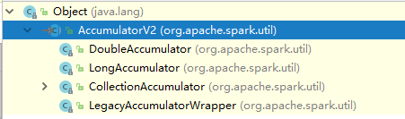

# 简介
# 1、共享变量
通常情况下，当在远程集群节点上执行传递给Spark操作（例如mapor reduce）的函数时，它将在函数中使用的所有变量的单独副本上工作。

这些变量会被复制到每台计算机上，并且远程计算机上的变量的更新不会传播回驱动程序。为了支持跨任务的通用，读写共享变量变得效率低下。

为了解决效率低下的问题，Spark提供了两种类型的共享变量：广播变量和累加器。

## 1.1、累加器
累加器用来对信息进行聚合，通常在向Spark传递函数时，比如使用map()函数或者用filter()传条件时，可以使用驱动器程序中定义的变量。集群中运行的每个任务都会得到这些变量的一份新的副本，更新这些副本的值也不会影响驱动器中的对应变量。 

如果我们想实现所有分片处理时更新共享变量的功能，那么累加器可以实现我们想要的效果。

查看源码我们可以发现，Spark框架提供了4个内置的累加器实现。



接下来我们运行一个实例，用于统计一组数据中，值大于100的数字个数。

```java
public class AccumulatorTest {
    public static void main(String[] args) {
        Logger logger = LoggerFactory.getLogger(com.spark.transformation.AggregateTest.class);
        SparkConf sparkConf = new SparkConf().setAppName("test").set("spark.testing.memory", "2147480000").setMaster("local");
        JavaSparkContext sc = new JavaSparkContext(sparkConf);
        LongAccumulator myAccumulator = sc.sc().longAccumulator("than100CountAccm");

        sc.parallelize(Arrays.asList(1, 2, 3, 200, 300)).foreach(num -> {
            if(num > 100){
                myAccumulator.add(1);
            }
        });
        System.out.println(myAccumulator.value());
    }
}
```
输出结果：
```
2
```
需要注意的是：工作节点上的任务不能访问累加器的值。从这些任务的角度来看，累加器是一个只写变量。对于要在行动操作中使用的累加器，Spark只会把每个任务对各累加器的修改应用一次。因此，如果想要一个无论在失败还是重复计算时都绝对可靠的累加器，我们必须把它放在 foreach() 这样的行动操作中。

转化操作中累加器可能会发生不止一次更新。

当我们需要更多的需求的时候，还可以自定义累加器，自定义累加器比较麻烦。官方文档说道，需要实现AccumulatorV2的大部分方法。其实官方提供的几个内置累加器已经完全可以满足要求了，但是我们可以自定义一个累加器用作联系。该累加器可以处理字符串数据类型的输入，同时输出字符串数组类型：
```java
package com.spark.higher;

import org.apache.spark.util.AccumulatorV2;

import java.util.ArrayList;
import java.util.List;

// IN String
// OUT List<String>
public class MyAccumulator extends AccumulatorV2<String,List<String>> {
    // 创建输出结果类型，对应OUT
    List<String> list = new ArrayList<String>();

    public MyAccumulator() {
        super();
    }

    // 判断当前内存数据是否为空的依据
    @Override
    public boolean isZero() {
        return list.isEmpty();
    }

    // 提供spark调用，实现产生一个新的累加器实例
    @Override
    public AccumulatorV2<String, List<String>> copy() {
        MyAccumulator tmp = new MyAccumulator();
        tmp.list.addAll(list);
        return tmp;
    }

    // 重置数据
    @Override
    public void reset() {
        list.clear();
    }

    // 添加数据
    @Override
    public void add(String v) {
        list.add(v);
    }

    // 合并多个分区的累加器实例
    @Override
    public void merge(AccumulatorV2<String,List<String>> other) {
        list.addAll(other.value());
    }

    // 通过value获取累加器的最终结果
    @Override
    public List<String> value() {
        return list;
    }
}
```
请注意，如果同样不知道该怎么写，可以参考其他的AccumulatorV2的具体实现，例如`LongAccumulator`的实现:
```
public class LongAccumulator extends AccumulatorV2<Long, Long> {
    ...
```
接下来，我们来测试使用自定义的累加器，该应用过滤名词数组，如果名词是颜色的话，那么将其加入到我们的累加器中。聪明的你应该看出来了，我们的累加器的最终输出，就是一个字符串数组。在这个用例中，他将会将所有的颜色累加起来：

```java
public static void main(String[] args) {
        Logger logger = LoggerFactory.getLogger(com.spark.transformation.AggregateTest.class);
        SparkConf sparkConf = new SparkConf().setAppName("test").set("spark.testing.memory", "2147480000").setMaster("local");
        JavaSparkContext sc = new JavaSparkContext(sparkConf);

        MyAccumulator myAccumulator = new MyAccumulator();
        // 注册到sc中
        sc.sc().register(myAccumulator,"myAccumulator");


        sc.parallelize(Arrays.asList("red", "blue", "photo", "father", "mother")).foreach(noun -> {
            if(isColor(noun)){
                myAccumulator.add(noun);
            }
        });
        System.out.println(myAccumulator.value());
    }

    public static boolean isColor(String noun){
        List<String> colors = Arrays.asList("red", "blue");
        if(colors.contains(noun)){
            return true;
        }
        return false;
    }
```
可以看到，其中比较关键的代码在于：
```
 MyAccumulator myAccumulator = new MyAccumulator();
        // 注册到sc中
sc.sc().register(myAccumulator,"myAccumulator");
```
即通过 `sc().register` 注册自定义累加器，最后，其使用方式和之前的内置累加器就没有区别了。

> 累加器操作最好都放在action中，不要在transfer操作中执行，歧义性太大，官方也强调了这一点，在transfer中执行没有太大的意义：For accumulator updates performed inside actions only, Spark guarantees that each task’s update to the accumulator will only be applied once, i.e. restarted tasks will not update the value. In transformations, users should be aware of that each task’s update may be applied more than once if tasks or job stages are re-executed.

还需要强调的一点，累加器也是符合惰性模型的，因此在转换操作中如果用到了累加器，那么还需要注意必须使用行动操作触发血统关系关联着的RDD之后才会触发累加器的逻辑。

说了那么多，还是那句话，尽量不要在transfer操作中使用累加器。

## 1.2、广播变量
广播变量用来高效分发较大的对象，向所有工作节点发送一个较大的只读值，以供一个或多个Spark操作使用。

比如，如果应用需要向所有节点发送一个较大的只读查询表，甚至是机器学习算法中的一个很大的特征向量，这时候，将其定义为广播变量无疑是一个不错的选择。 

一般情况下，Spark会自动把应用程序中所有引用到的变量分发到工作节点上。虽然这很方便，但也很低效：
* 默认的任务发射机制是专门为小任务进行优化的；
* 通常可能会在多个并行操作中使用同一个变量，但是Spark会为每个任务分别发送该变量。 

```java
Broadcast<int[]> broadcastVar = sc.broadcast(new int[] {1, 2, 3});
broadcastVar.value();
```

创建广播变量后，应该使用它来代替群集上运行的任何函数中用到V的地方，这样V就不会多次传送的传输到各个节点。

此外，在V广播之后不应修改对象，以确保所有节点获得相同的广播变量值。


# 总结
1、累加器的使用过程中，一般不推荐在转换操作使用累加器，只推荐在行动操作中去使用。创建内置的累加器实例可以通过`sc.sc()`方法得到，目前拥有4个内置的累加器以供使用。
```java
JavaSparkContext sc = new JavaSparkContext(sparkConf);
sc.sc().longAccumulator("accumName")
```

2、Driver可以通过读取累加器的值并输出。

3、自定义累加器可以通过继承AccumulatorV2来实现，同时在sc中注册该累加器就可以和内置累加器一样使用了。

4、累加器最好在action操作中使用。

5、 广播变量是为了解决只读大对象的分发问题。一般情况下，使用的变量会分发到系统的每一个分区，因此效率会比较低。

