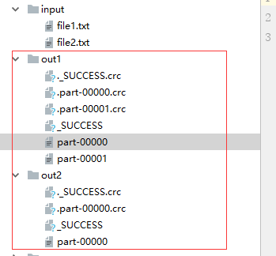
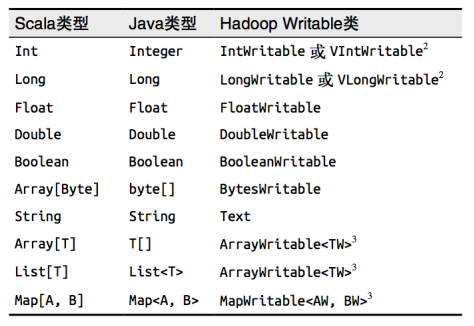

# 简介
# 1、文本文件的输入与输出
当我们将一个文本文件读取为RDD时，输入的每一行都会成为RDD的一个元素。也可以将多个完整的文本文件一次性读取为一个pair RDD，其中键是文件名，值是文件内容。

如果传递目录，则将目录下的所有文件读取作为RDD。

> 文件路径支持通配符。

通过textFiles()按行读取文件内容；

通过wholeTextFiles()对于大量的小文件读取效率比较高，大文件效果没有那么高。

例如，我们在input目录下放置了两个文件file1.txt，以及file2.txt，接下来，我们分别按行读取，以及按文件读取：
``` java
    // 1.加载文件，按行读取
    JavaRDD<String> rdd1 = sc.textFile("input");
    
    // 2.加载文件,行文件读取
    JavaPairRDD<String, String> rdd2 = sc.wholeTextFiles("input");

    System.out.println("=== Use textFile ===");
    rdd1.collect().forEach(System.out::println);

    System.out.println("=== Use wholeTextFiles ===");
    rdd2.collect().forEach(System.out::println);
```
输出结果如下：
```
=== Use textFile ===
this is file1 line1.
this is file1 line2.
this is file2 line1.
this is file2 line2.

=== Use wholeTextFiles ===
(file:/C:/Users/10160/eclipse-workspace/spark-vlearn/input/file1.txt,this is file1 line1.
this is file1 line2.)
(file:/C:/Users/10160/eclipse-workspace/spark-vlearn/input/file2.txt,this is file2 line1.
this is file2 line2.)
```

Spark通过saveAsTextFile() 进行文本文件的输出，该方法接收一个路径，并将 RDD 中的内容都输入到路径对应的文件中。Spark 将传入的路径作为目录对待，会在那个目录下输出多个文件。这样，Spark 就可以从多个节点上并行输出了。 例如，我们将上述的rdd的的数据分别保存到本地目录：
```java
    // 存储
    rdd1.saveAsTextFile("out1");
    rdd2.saveAsTextFile("out2");
```
最后的存储结果如下：



需要注意的是，存储的内容是rdd的元素的toString方法所转化，这和我们学习hadoop的时候定制Format的时候是一致的。

# 2、Json文件的输入与输出
如果JSON文件中每一行就是一个JSON记录，那么可以通过将JSON文件当做文本文件来读取，然后利用相关的JSON库对每一条数据进行JSON解析。

如果JSON数据是跨行的，那么只能读入整个文件，然后对每个文件进行解析。

> 需要注意的是，对于JSON文件的处理，spark core是没有提供内置方法的，但是在外围的应用上。spark提供了解决方案，当然，这属于Spark SQL的范畴，以后我们会讲到。因此，这里就不再过多的讲述了，我们可以通过当前使用的开发语言支持的JSON解析包在应用中支持我们解析JSON文件。

在java中，可以通过安装fastjson包来完成JSON文件的解析。

> fastjson官方文档：https://github.com/alibaba/fastjson/wiki/Quick-Start-CN.

pom文件中加入该依赖。
```xml
<dependency>
        <groupId>com.alibaba</groupId>
        <artifactId>fastjson</artifactId>
        <version>1.2.56</version>
    </dependency>
```

我们需要解析的json文件
```json
{"id":1,"name":"zhaoyi"}
{"id":2,"name":"hongqun"}
```
定义一个用户的bean
```java
package com.spark.input;

public class User implements Serializable{
    private Integer id;
    private String name;

    public User(Integer id, String name) {
        this.id = id;
        this.name = name;
    }

    public User() {
    }

    public Integer getId() {
        return id;
    }

    public void setId(Integer id) {
        this.id = id;
    }

    public String getName() {
        return name;
    }

    public void setName(String name) {
        this.name = name;
    }

    @Override
    public String toString() {
        return "User{" +
                "id=" + id +
                ", name='" + name + '\'' +
                '}';
    }
}
```
接下来，我们就可以通过fastjson转化JSON文件以供使用了
```java
    JavaSparkContext sc = new JavaSparkContext(sparkConf);

    JavaRDD<String> jsonRDD = sc.textFile("user.json");

    JavaRDD<User> result = jsonRDD.map(line -> JSON.parseObject(line, User.class));

    System.out.println(result.collect());
```
最终输出结果
```
[User{id=1, name='zhaoyi'}, User{id=2, name='hongqun'}]
```

JSON数据的输出主要是通过在输出之前将由结构化数据组成的RDD转为字符串RDD，然后使用Spark的文本文件API写出去。 

也就说，最终还是以文本文件的形式保存。

# 3、CSV文件的输入与输出
其原理和JSON文件也是一样的，这里推荐一个处理库，即
```xml
<dependency>
    <groupId>com.univocity</groupId>
    <artifactId>univocity-parsers</artifactId>
    <version>2.8.1</version>
</dependency>
```
该库也可以用来处理TSV文件。

# 4、SequenceFile文件输入输出
 SequenceFile文件是Hadoop用来存储二进制形式的key-value对而设计的一种平面文件(Flat File)。

 Spark提供了用来读取SequenceFile的接口。在SparkContext中，可以调用 `sequenceFile[ keyClass, valueClass](path)`。 但是Java包中没有提供直接的使用方法，但是我们可以通过ObjectFile实现相同的功能。接下来我们直接学习ObjectFile的输入与输出。

 # 5、ObjectFile文件输入输出
对象文件是将对象序列化后保存的文件，采用Java的序列化机制。

可以通过objectFile[k,v](path) 函数接收一个路径，读取对象文件，返回对应的 RDD，也可以通过调用saveAsObjectFile() 实现对对象文件的输出。

因为是序列化所以要指定解析的类型。例如下面的例子：
```
    JavaRDD<String> rdd = sc.parallelize(Arrays.asList("a", "b"));
    rdd.saveAsObjectFile("out");
    JavaRDD<Object> out = sc.objectFile("out");
    out.foreach(s -> System.out.println(s));
```
输出结果如下：
```
a
b
```
可以指定解析的对象类型
```java
    JavaRDD<User> rdd = sc.parallelize(Arrays.asList(new User(1,"zhaoyi"),new User(2,"hongqun")));
    rdd.saveAsObjectFile("out_user");
    JavaRDD<User> out = sc.objectFile("out_user");
    out.foreach(s -> System.out.println(s));
```
输出结果如下:
```
User{id=1, name='zhaoyi'}
User{id=2, name='hongqun'}
```
> 你会发现其实最终存储的文件也是sequence file类型，只不过写入的数据(K-V)已经经过了一层序列化操作，我们无法直接解析而已。

# 6、HadoopAPI输入输出
Spark的整个生态系统与Hadoop是完全兼容的。

因此对于Hadoop所支持的文件类型或者数据库类型，Spark也同样支持。

另外，由于Hadoop的API有新旧两个版本，所以Spark为了能够兼容Hadoop所有的版本，也提供了两套创建操作接口。

对于外部存储创建操作而言，hadoopRDD和newHadoopRDD是最为抽象的两个函数接口,主要包含以下四个参数：
* 输入格式(InputFormat): 制定数据输入的类型,如TextInputFormat等,新旧两个版本所引用的版本分别是org.apache.hadoop.mapred.InputFormat和org.apache.hadoop.mapreduce.InputFormat(NewInputFormat)
* 键类型: 指定[K,V]键值对中K的类型
* 值类型: 指定[K,V]键值对中V的类型
* 分区值: 指定由外部存储生成的RDD的partition数量的最小值,如果没有指定,系统会使用默认值defaultMinSplits

其他创建操作的API接口都是为了方便最终的Spark程序开发者而设置的，是这两个接口的高效实现版本.例如,对于textFile而言,只有path这个指定文件路径的参数,其他参数在系统内部指定了默认值。

对于RDD最后的归宿除了返回为集合和标量，也可以将RDD存储到外部文件系统或者数据库中。

Spark系统与Hadoop是完全兼容的，所以MapReduce所支持的读写文件或者数据库类型，Spark也同样支持。

另外,由于Hadoop的API有新旧两个版本。因此Spark为了能够兼容Hadoop所有的版本，也提供了两套API。

将RDD保存到HDFS中在通常情况下需要关注或者设置五个参数：
* 文件保存的路径
* key值的class类型
* Value值的class类型
* RDD的输出格式(OutputFormat,如TextOutputFormat、SequenceFileOutputFormat)
* codec(这个参数表示压缩存储的压缩形式,如DefaultCodec,Gzip,Codec等等)

查看读取写入比较常用的HadoopAPI的源码可以了解到参数情况：
```java
  /**
   * Get an RDD for a given Hadoop file with an arbitrary new API InputFormat
   * and extra configuration options to pass to the input format.
   *
   * @note Because Hadoop's RecordReader class re-uses the same Writable object for each
   * record, directly caching the returned RDD will create many references to the same object.
   * If you plan to directly cache Hadoop writable objects, you should first copy them using
   * a `map` function.
   */
  def newAPIHadoopFile[K, V, F <: NewInputFormat[K, V]](
    path: String,
    fClass: Class[F],
    kClass: Class[K],
    vClass: Class[V],
    conf: Configuration): JavaPairRDD[K, V] = {
    implicit val ctagK: ClassTag[K] = ClassTag(kClass)
    implicit val ctagV: ClassTag[V] = ClassTag(vClass)
    val rdd = sc.newAPIHadoopFile(path, fClass, kClass, vClass, conf)
    new JavaNewHadoopRDD(rdd.asInstanceOf[NewHadoopRDD[K, V]])
  }
  ...

  /** Output the RDD to any Hadoop-supported file system. */
  def saveAsNewAPIHadoopFile[F <: NewOutputFormat[_, _]](
      path: String,
      keyClass: Class[_],
      valueClass: Class[_],
      outputFormatClass: Class[F]) {
    rdd.saveAsNewAPIHadoopFile(path, keyClass, valueClass, outputFormatClass)
  }


```
以下是Java类型和Hadoop序列化类型的对比图




接下来我们看一个用例
```java
package com.spark.input;

import org.apache.hadoop.conf.Configuration;
import org.apache.hadoop.io.IntWritable;
import org.apache.hadoop.io.LongWritable;
import org.apache.hadoop.io.Text;
import org.apache.hadoop.mapreduce.lib.input.TextInputFormat;
import org.apache.hadoop.mapreduce.lib.output.TextOutputFormat;
import org.apache.spark.SparkConf;
import org.apache.spark.api.java.JavaPairRDD;
import org.apache.spark.api.java.JavaSparkContext;
import org.slf4j.Logger;
import org.slf4j.LoggerFactory;
import scala.Tuple2;
import java.util.Arrays;
public class HadoopAPITest {
    public static void main(String[] args) {
        Logger logger = LoggerFactory.getLogger(com.spark.transformation.AggregateTest.class);
        SparkConf sparkConf = new SparkConf().setAppName("test").set("spark.testing.memory", "2147480000").setMaster("local");
        JavaSparkContext sc = new JavaSparkContext(sparkConf);
        JavaPairRDD<Integer, String> pairRDD = sc.parallelizePairs(Arrays.asList(new Tuple2<>(1, "zhaoyi"), new Tuple2<>(2, "hongqun")));
        // 写入本地文件系统
        pairRDD.saveAsNewAPIHadoopFile("out_h",
                IntWritable.class,
                Text.class,
                TextOutputFormat.class
        );

        // 读出
        JavaPairRDD<LongWritable, Text> readRDD = sc.newAPIHadoopFile("out_h", TextInputFormat.class,
                LongWritable.class,
                Text.class,
                new Configuration()
        );
        readRDD.foreach(s -> System.out.println(s._2));
        sc.close();
    }
}
```
可以看到，我们首先将一个pairRDD数据存储在了本地文件系统中，并且指定了存储的格式。输出如下：
```
1	zhaoyi
2	hongqun
```
为了便于理解，将引入的包都打印了进来。需要注意的是：
1. 在Hadoop中以压缩形式存储的数据，不需要指定解压方式就能够进行读取。这是因为Hadoop本身有一个解压器会根据压缩文件的后缀推断解压算法进行解压。
2. 如果学过mapreduce编程的话，就可以很好理解为什么要这样设置参数了。例如读取时候的LongWritable参数，他指的是读取文件的行号，而Text则是每一行的数据；
3. 要用好HadoopAPI，最好还是了解MapReduce的过程。因为这个API其实就是对Mapreduce的过程的再封装，只有了解整个过程及原理，才能处理的更加得心应手。

# 7、数据库的输入输出
数据库主要分为关系型和非关系型数据库，关系型数据库比较常见的是mysql数据，支持通过Java JDBC访问关系型数据库。需要通过JdbcRDD进行，源码如下：
```java

// TODO: Expose a jdbcRDD function in SparkContext and mark this as semi-private
/**
 * An RDD that executes a SQL query on a JDBC connection and reads results.
 * For usage example, see test case JdbcRDDSuite.
 *
 * @param getConnection a function that returns an open Connection.
 *   The RDD takes care of closing the connection.
 * @param sql the text of the query.
 *   The query must contain two ? placeholders for parameters used to partition the results.
 *   For example,
 *   {{{
 *   select title, author from books where ? <= id and id <= ?
 *   }}}
 * @param lowerBound the minimum value of the first placeholder
 * @param upperBound the maximum value of the second placeholder
 *   The lower and upper bounds are inclusive.
 * @param numPartitions the number of partitions.
 *   Given a lowerBound of 1, an upperBound of 20, and a numPartitions of 2,
 *   the query would be executed twice, once with (1, 10) and once with (11, 20)
 * @param mapRow a function from a ResultSet to a single row of the desired result type(s).
 *   This should only call getInt, getString, etc; the RDD takes care of calling next.
 *   The default maps a ResultSet to an array of Object.
 */
class JdbcRDD[T: ClassTag](
    sc: SparkContext,
    getConnection: () => Connection,
    sql: String,
    lowerBound: Long,
    upperBound: Long,
    numPartitions: Int,
    mapRow: (ResultSet) => T = JdbcRDD.resultSetToObjectArray _)
```

JdbcRDD 接收这样几个参数。 
* 首先，要提供一个用于对数据库创建连接的函数。这个函数让每个节点在连接必要的配置后创建自己读取数据的连接。 
* 接下来，要提供一个可以读取一定范围内数据的查询，以及查询参数中lowerBound和 upperBound的值。这些参数可以让 Spark 在不同机器上查询不同范围的数据，这样就不会因尝试在一个节点上读取所有数据而遭遇性能瓶颈。
* 这个函数的最后一个参数是一个可以将输出结果从转为对操作数据有用的格式的函数。如果这个参数空缺，Spark会自动将每行结果转为一个对象数组。 

# 总结
1、文本文件

主要通过textFile一级saveAsTextFile实现。需要注意的是，在写出text文件的时候，每一个partition会单独写出，在读取text文件的时候，需要指定到具体的数据文件。读取的文件支持文件系统支持所有和hadoop操作的文件系统。

2、带格式文件（json和csv） 

spark core并没有内置对这类文件的解析与反解析功能，这个解析功能需要应用程序自己去定义。注意：Json文件的读取如果需要多个partition来读取，那么json文件需要一行设置一条数据，如果json文件是跨行的，那么需要一次性读取所有整个文件一次性解析。

3、SequenceFile 

* 主要是通过HadoopFile的API来进行。
* 文件的读取操作需要采用sequenceFile来进行，在读取的时候需要设定具体的K-V类型。具体的类型对照参考上述图表。
* 通过SaveAsSquenceFile方法将数据存储为SequeceFile类型(java没有直接提供)。
* 读取HDFS中的文件，一个block会读取为一个RDD中的partition，一个partition会被一个task去处理。如果HDFS中的文件block数为1，那么spark设定的最小的读取的partition数为2.

4、对象文件输入输出
* objectFile的读取和保存是使用了sequenceFile的api，最终也是调用了hadoop的API；
* objectFile的读取使用objectFile进行读取，object的输出直接使用saveAsObjectFile即可。
* 在读取objectFile的时候，需要指定对象的类型。

5、HadoopAPI输入和输出
* 通过源码可以发现，所有的输入输出类型其实都是在该类型上面的封装。
* spark core提供了对应于新旧版本的两个Hadoop API的支持：对于新版本的hadoop API提供了new开头的方法，newHadoopFile和NewHadoopRDD两个方法，最终都是调用newHadoopRDD实现；
* 数据的输出提供了saveAsNewApiHadoopFile和saveAsNewApiHadoopDataset两个方法，最终都是调用saveAsNewApiHadoopDataset实现的。
* 旧版本的API则相对少用。
* 这些API都是比较底层的，因此需要指定对应的InputFormat和OutputFormat，这就需要参考mapreduce相关的程序API了。
  
7、文件系统的输入输出

8、数据库的输入输出
1、对于关系型数据库的读取使用jdbcRDD来进行，他需要依次传入sparkContext、获取JDBCConnection的无参方法、查询数据的SQL语句、id的上界、下界、分区数、提供解析ResultSet的函数。

对于关系型数据库的输出，直接采用jdbc的insert语句或者update语句实现。


