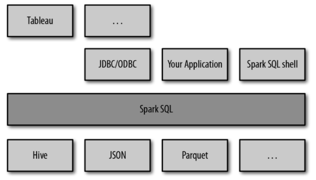
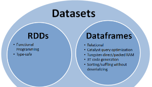
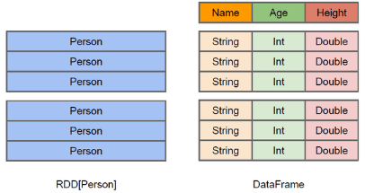

# 简介
Spark SQL是Spark用来处理结构化数据的一个模块，它提供了一个编程抽象叫做DataFrame并且作为分布式SQL查询引擎的作用。
我们已经学习了Hive，它是将Hive SQL转换成MapReduce然后提交到集群上执行，大大简化了编写MapReduce的程序的复杂性。

由于MapReduce这种计算模型执行效率比较慢，所以Spark SQL的应运而生。它是将Spark SQL转换成RDD，然后提交到集群执行，执行效率非常快。

# 1、spark sql的特点
1、容易整和

2、统一的数据访问方式

3、兼容Hive

4、标准的数据连接

SparkSQL可以看做是一个转换层，向下对接各种不同的结构化数据源，向上提供不同的数据访问方式。




# 2、RDD和DataFrames以及DataSet的比较

在SparkSQL中Spark为我们提供了两个新的抽象，分别是DataFrame和DataSet。他们和RDD有什么区别呢？首先从版本的产生上来看：
```
RDD (Spark1.0) —> Dataframe(Spark1.3) —> Dataset(Spark1.6)
```

从组成关系来看



如果同样的数据都给到这三个数据结构，他们分别计算之后，都会给出相同的结果。不同是的他们的执行效率和执行方式。

在后期的Spark版本中，DataSet会逐步取代RDD和DataFrame成为唯一的API接口。

## 2.1、RDD
RDD具有如下特点：
* RDD是一个懒执行的不可变的可以支持Lambda表达式的并行数据集合。
* RDD的最大好处就是简单，API的人性化程度很高。
* RDD的劣势是性能限制，它是一个JVM驻内存对象，这也就决定了存在GC的限制和数据增加时Java序列化成本的升高。

我们前面的章节都是讲述RDD的编程，这里不再阐述。

## 2.2、Dataframe
与RDD类似，DataFrame也是一个分布式数据容器。然而DataFrame更像传统数据库的二维表格，除了数据以外，还记录数据的结构信息，即schema。

同时，与Hive类似，DataFrame也支持嵌套数据类型（struct、array和map）。

从API易用性的角度上看，DataFrame API提供的是一套高层的关系操作，比函数式的RDD API要更加友好，门槛更低。由于与R和Pandas的DataFrame类似，Spark DataFrame很好地继承了传统单机数据分析的开发体验。

下图直观地体现了DataFrame和RDD的区别。



左侧的RDD `Person`虽然以Person为类型参数，但Spark框架本身不了解Person类的内部结构。而右侧的DataFrame却提供了详细的结构信息，使得Spark SQL可以清楚地知道该数据集中包含哪些列，每列的名称和类型各是什么。

DataFrame多了数据的结构信息，即schema。

RDD是分布式的Java对象的集合，而DataFrame是分布式的Row对象的集合。

DataFrame除了提供了比RDD更丰富的算子以外，更重要的特点是提升执行效率、减少数据读取以及执行计划的优化，比如filter下推、裁剪等（查询计划通过Spark catalyst optimiser进行优化.）。

对于普通开发者而言，查询优化器的意义在于，即便是经验并不丰富的程序员写出的次优的查询，也可以被尽量转换为高效的形式予以执行。

DataFrame是为数据提供了Schema的视图。可以把它当做数据库中的一张表来对待。同时，他也是懒执行的。其性能上比RDD要高，主要有两方面原因： 
1. 定制化内存管理
2. 数据以二进制的方式存在于非堆内存，节省了大量空间之外，还摆脱了GC的限制。


Dataframe的劣势在于在编译期缺少类型安全检查，导致运行时出错。

## 2.3、Dataset
Dataset具有如下特点：
1. 他是Dataframe API的一个扩展，是Spark最新的数据抽象
2. 用户友好的API风格，既具有类型安全检查也具有Dataframe的查询优化特性。
3. Dataset支持编解码器，当需要访问非堆上的数据时可以避免反序列化整个对象，提高了效率。
4. 样例类被用来在Dataset中定义数据的结构信息，样例类中每个属性的名称直接映射到DataSet中的字段名称。
5. Dataframe是Dataset的特列，DataFrame=Dataset[Row] ，所以可以通过as方法将Dataframe转换为Dataset。Row是一个类型，跟Car、Person这些的类型一样，所有的表结构信息我都用Row来表示。
6. DataSet是强类型的。比如可以有Dataset[Car]，Dataset[Person].

DataFrame只是了解字段信息，但是不知道字段的类型，所以在执行这些操作的时候是没办法在编译的时候检查是否类型失败的。例如可以对一个String进行算数操作，这在编译时是没有问题的，但是在执行的时候会报错。而DataSet不仅仅知道字段，而且知道字段类型，所以有更严格的编译时错误检查。

RDD让我们能够决定怎么做，而DataFrame和DataSet让我们决定做什么，控制的粒度不一样。

## 2.4、总结三者的异同
1、相同点
* 都是spark平台下的分布式弹性数据集，为处理超大型数据提供便利；
* 都有惰性机制，在进行创建、转换，如map方法时，不会立即执行，只有在遇到Action如foreach时，三者才会开始遍历运算。极端情况下，如果代码里面有创建、转换，但是后面没有在Action中使用该数据集，那么该数据集的相关操作会被直接跳过；
* 都会根据spark的内存情况自动缓存运算，这样即使数据量很大，也不用担心会内存溢出；
* 都有partition的概念；
* 都有许多共同的函数，如filter，排序等；

2、同点
1. RDD:
    * RDD一般和spark mlib同时使用
    * RDD不支持sparksql操作

2. DataFrame
    * 与RDD和Dataset不同，DataFrame每一行的类型固定为Row，只有通过解析才能获取各个字段的值，每一列的值没法直接访问；
    * DataFrame与Dataset一般与spark ml同时使用（Apache Spark ML 是机器学习库在 Apache Spark 上运行的模块。）
    * DataFrame与Dataset均支持sparksql的操作，比如select，groupby之类，还能注册临时表/视窗，进行sql语句操作；
    * DataFrame与Dataset支持一些特别方便的保存方式，比如保存成csv，可以带上表头，这样每一列的字段名一目了然，利用这样的保存方式，可以方便的获得字段名和列的对应，而且分隔符（delimiter）可以自由指定；

3. Dataset

Dataset和DataFrame拥有完全相同的成员函数，区别只是每一行的数据类型不同。

DataFrame也可以叫Dataset[Row],每一行的类型是Row，不解析，每一行究竟有哪些字段，各个字段又是什么类型都无从得知，只能用上面提到的getAS方法或者模式匹配获取特定字段。而Dataset中，每一行是什么类型是不一定的，在类型指定之后可以很自由的获得每一行的信息。

可以看出，Dataset在需要访问列中的某个字段时是非常方便的，然而，如果要写一些适配性很强的函数时，如果使用Dataset，行的类型又不确定，可能是各种case class，无法实现适配，这时候用DataFrame即Dataset[Row]就能比较好的解决问题。


