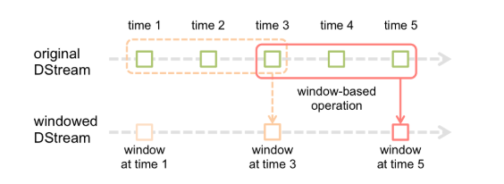

# 简介
前一章节，我们学习了DStream的输入，本章节我们来学习，DStream的转换。

DStream上的原语与RDD的类似，分为Transformations（转换）和Output Operations（输出）两种。

转换操作中还有一些比较特殊的概念，如：updateStateByKey()、transform()操作以及各种Window相关的特殊概念。

官方参考文档：http://spark.apache.org/docs/latest/streaming-programming-guide.html#transformations-on-dstreams

# 1、DStream的常用操作

|转换操作	|说明|
|-|-|
|map(func)	|将源DStream中的每个元素通过一个函数func从而得到新的DStream。|
|flatMap(func)	|和map类似，但是每个输入的项可以被映射为0或更多项（压平）。|
|filter(func)	|选择源DStream中函数func判为true的记录形成新的DStream.|
|repartition(numPartitions)	|通过创建更多或者更少的partition来改变此DStream的并行级别|
|union(otherStream)	|联合源DStreams和其他DStreams来得到新DStream|
|count()|统计源DStreams中每个RDD所含元素的个数得到单元素RDD的新DStreams|
|reduce(func)|通过函数func(T,T=>T)来整合源DStreams中每个RDD元素得到单元素RDD的DStream。这个函数需要关联从而可以被并行计算。|
|countByValue()|对于DStreams中元素类型为K调用此函数，得到包含(K,Long)对的新DStream，其中Long值表明相应的K在源DStream中每个RDD出现的频率。|
|reduceByKey(func, [numTasks])|对(K,V)对的DStream调用此函数，返回同样（K,V)对最为新的DStream，但是新DStream中的对应V为使用reduce函数整合而来。注意：默认情况下，这个操作使用Spark默认数量的并行任务（本地模式为2，集群模式中的数量取决于配置参数spark.default.parallelism）。也可以通过传入可选的参数numTaska来设置不同数量的任务。|
|join(otherStream, [numTasks])|两DStream分别为(K,V)和(K,W)对，返回(K,(V,W))对的新DStream。 |
|cogroup(otherStream, [numTasks])|两DStream分别为(K,V)和(K,W)对，返回(K,(Seq[V],Seq[W])对新DStreams |
|transform(func)|将RDD到RDD映射的函数func作用于源DStream中每个RDD上得到新DStream。可以通过这个方法来在DStream的RDD上做任意操作。|
|updateStateByKey(func)|得到“状态”DStream，其中每个key状态的更新是通过将给定函数用于此key的上一个状态和新值而得到。这个可用于保存每个key值的任意状态数据。|

> arbitrary  任意的。

DStream的转化操作可以分为无状态(stateless)和有状态(stateful)两种。 
* 在无状态转化操作中，每个批次的处理不依赖于之前批次的数据。常见的 RDD 转化操作，例如 map()、filter()、reduceByKey() 等，都是无状态转化操作。 
* 相对地，有状态转化操作需要使用**之前**批次的数据或者是中间结果来计算当前批次的数据。有状态转化操作包括基于滑动窗口（Window）的转化操作和追踪状态（state）变化的转化操作。 

# 1、无状态转换操作
无状态转化操作就是把简单的RDD转化操作应用到每个批次上，也就是转化DStream中的每一个RDD。

常见的，例如map、flatMap、filter、repartition、reduceByKey以及groupByKey等。

尽管这些函数看起来像作用在整个流上一样，但事实上每个DStream在内部是由许多RDD(微批次)组成，且无状态转化操作是分别应用到每个RDD上的。例如，reduceByKey() 会归约每个时间区间中的数据，但不会归约不同区间之间的数据。 

> 在之前的wordcount程序中，我们只会统计1秒内接收到的数据的单词个数，而不会累加。 

无状态转化操作也能在多个DStream间整合数据，不过也是在各个时间区间内。例如，键值对DStream拥有和RDD一样的与连接相关的转化操作，也就是 cogroup()、join()、 leftOuterJoin() 等。我们可以在 DStream 上使用这些操作，这样就对每个批次分别执行了对应的 RDD 操作。

我们还可以像在常规的Spark中一样使用DStream的union()操作将它和另一个DStream的内容合并起来，也可以使用StreamingContext.union()来合并多个流。 

# 2、有状态转换操作
有状态的转换操作是一种比较特殊的转换操作类型。但是其涉及的知识点并不多，我们可以一个一个的进行分析。


## 2.1、UpdateStateByKey
首先是第一个：追踪状态变化UpdateStateByKey。他的功能是用于记录历史记录。

有时，我们需要在DStream中跨批次维护状态(例如流计算中累加单词的数量)。针对这种情况，updateStateByKey()为我们提供了对一个状态变量的访问，用于键值对形式的DStream。

给定一个由(键，事件)对构成的DStream，并传递一个指定如何根据新的事件更新每个键对应状态的函数。它可以构建出一个新的DStream，其内部数据为(键，状态) 对。updateStateByKey()的结果会是一个新的DStream，其内部的RDD序列由每个时间区间对应的(键，状态)对组成。

```java
def updateStateByKey[S: ClassTag]( updateFunc: (Seq[V], Option[S]) => Option[S] ): DStream[(K, S)]
```
* S是需要保存的状态的类型。
* updateFunc 是定义了每一批次RDD如何来更新的状态值。 Seq[V] 是当前批次相同key的值的集合。 
* Option[S] 是框架自动提供的，上一次保存的状态的值。
* updateStateByKey会返回一个新的DStream，该DStream中保存了（Key,State）的序列。

updateStateByKey操作使得我们可以在用新信息进行更新时保持任意的状态。为了使用他，需要做下面的两步操作： 
1. 定义状态：状态可以是一个任意的数据类型；
2. 定义状态更新函数：用此函数阐明如何使用之前的状态和来自输入流的新值对状态进行更新。


使用updateStateByKey需要对检查点目录进行配置，会使用检查点来保存状态。接下来我们改善之前的统计单词的案例，使得可以对前后的所有输入进行统计：
``` java
package com.spark.stream;

import org.apache.spark.SparkConf;
import org.apache.spark.api.java.Optional;
import org.apache.spark.api.java.function.*;
import org.apache.spark.streaming.State;
import org.apache.spark.streaming.Durations;
import org.apache.spark.streaming.StateSpec;
import org.apache.spark.streaming.api.java.*;
import scala.Tuple2;
import java.util.Arrays;
import java.util.List;

public class StreamWordCount {

    public static void main(String[] args) {
        // 6.更新累加状态函数的值
        Function3<String, Optional<Integer>, State<Integer>, Tuple2<String, Integer>> mappingFunc =
                (word, one, state) -> {
                    int sum = one.orElse(0) + (state.exists() ? state.get() : 0);
                    Tuple2<String, Integer> output = new Tuple2<>(word, sum);
                    state.update(sum);
                    return output;
                };

        // Initial state RDD input to mapWithState
        @SuppressWarnings("unchecked")
        List<Tuple2<String, Integer>> tuples =
                Arrays.asList(new Tuple2<>("hello", 1), new Tuple2<>("world", 1));

        // 1.创建SparkConf
        SparkConf sparkConf = new SparkConf().setMaster("local[*]").set("spark.testing.memory", "2140000000").setAppName("word split");

        // 2.创建JavaStreamingContext,每2秒获取一次
        JavaStreamingContext jsc = new JavaStreamingContext(sparkConf, Durations.seconds(2));
        // 定义检查点
        jsc.checkpoint(".");

        // 3.从本机端口9999获取流数据
        JavaReceiverInputDStream<String> lines = jsc.socketTextStream("localhost", 9999);

        // 4.将每一次获取的结果进行切分
        JavaDStream<String> words = lines.flatMap(line -> Arrays.asList(line.split(" ")).iterator());

        // 5.根据输入的单词来统计各个单词出现的次数（注意这里只是每段时间内获取到的数据，因此属于我们讨论的无状态转换）
        JavaPairDStream<String,Integer> wordPairStream = words.mapToPair(word -> new Tuple2<>(word, 1));

        // 6.应用到mapWithState
        JavaMapWithStateDStream<String, Integer, Integer, Tuple2<String, Integer>> stateDStream  =
                wordPairStream.mapWithState(StateSpec.function(mappingFunc));

        // 6.打印结果
        stateDStream.print();

        // 启动流计算
        jsc.start();
        // 等待计算终止
        try {
            jsc.awaitTermination();
        } catch (InterruptedException e) {
            e.printStackTrace();
        }
    }
}

```

```
*** socket写入：
C:\Users\10160\Desktop\netcat-1.11>nc -l -p 9999
this is a test
test will be
ahah
be intersting

*** idea控制台输出
-------------------------------------------
Time: 1550579528000 ms
-------------------------------------------
(a,1)
(this,1)
(is,1)
(test,1)
....

Time: 1550579536000 ms
-------------------------------------------
(test,2)
(will,1)
(be,1)

-----
(ahah,1)

-------------------------------------------
Time: 1550579546000 ms
-------------------------------------------
(intersting,1)
(be,2)
```
可以看到，我们已经可以成功的获取整体的单词统计结果了。

## 2.2、Window操作
Window操作有点类似于Storm中的State，可以设置窗口的大小和滑动窗口的间隔来动态的获取当前Steaming的允许状态。

基于窗口的操作会在一个比StreamingContext的批次间隔更长的时间范围内，通过整合多个批次的结果，计算出整个窗口的结果。



所有基于窗口的操作都需要两个参数:
* 窗口时长(windowDuration): 窗口的宽度。在程序中，可以理解为窗口容纳多少时间内产生的数据。
* 滑动步长(slideDuration): 经过多久窗口滑动一次。在程序中，每次滑动窗口都会触发一次计算，因此，也可以将此时间理解为窗口数据的计算频度。

两者都必须是StreamContext的批次间隔的整数倍。窗口时长控制每次计算最近的多少个批次的数据，其实就是最近的 windowDuration/batchInterval 个批次。

例如如果有一个以10秒为批次间隔的源DStream，要创建一个最近30秒的时间窗口(即最近3个批次)，就应当把 windowDuration设为30 秒。而滑动步长的默认值与批次间隔相等，用来控制对新的 DStream 进行计算的间隔。

如果源 DStream 批次间隔为10秒，并且我们只希望每两个批次计算一次窗口结果，就应该把滑动步长设置为20秒。 

假设，你想拓展之前的word count。我们需要计算窗口长度为20秒数据的(word,1)，每隔10秒计算一次（即滑动时间为10S）。

对DStream上应用reduceByKey来计算这10秒之内的单词频数。可以使用操作reduceByKeyAndWindow来实现。

> 若窗口长度和滑动的长度一致，那么类似于每次计算自己批量的数据。

```java
package com.spark.stream;

import org.apache.spark.SparkConf;
import org.apache.spark.streaming.Durations;
import org.apache.spark.streaming.api.java.JavaDStream;
import org.apache.spark.streaming.api.java.JavaPairDStream;
import org.apache.spark.streaming.api.java.JavaReceiverInputDStream;
import org.apache.spark.streaming.api.java.JavaStreamingContext;
import scala.Tuple2;

import java.util.Arrays;

public class StreamWordCountWindow {

    public static void main(String[] args) {
        // 1.创建SparkConf
        SparkConf sparkConf = new SparkConf().setMaster("local[*]").set("spark.testing.memory", "2140000000").setAppName("word split");

        // 2.创建JavaStreamingContext,每2秒获取一次
        JavaStreamingContext jsc = new JavaStreamingContext(sparkConf, Durations.seconds(2));

        // 3.从本机端口9999获取流数据
        JavaReceiverInputDStream<String> lines = jsc.socketTextStream("localhost", 9999);

        // 4.将每一次获取的结果进行切分
        JavaDStream<String> words = lines.flatMap(line -> Arrays.asList(line.split(" ")).iterator());

        // 5.根据输入的单词来统计各个单词出现的次数（注意这里只是每段时间内获取到的数据，因此属于我们讨论的无状态转换）
        JavaPairDStream<String, Integer> wordPair = words.mapToPair(word -> new Tuple2<>(word, 1));

        // 6.打印结果
        System.out.println("every data words count(2s):");
        wordPair.print();

        // 计算批次： 20/2 = 10，每隔10秒计算一次
        JavaPairDStream<String, Integer> windowPair = wordPair.reduceByKeyAndWindow((c1, c2) -> c1 + c2, Durations.seconds(20), Durations.seconds(10));
        System.out.println("window data words count(10s):");
        windowPair.print();

        // 启动流计算
        jsc.start();

        // 等待计算终止
        try {
            jsc.awaitTermination();
        } catch (InterruptedException e) {
            e.printStackTrace();
        }
    }
}
```

window操作在都属于JavaPairDStream的方法中，因此，我们都必须基于JavaPairDStream类型的DStream进行计算。

下面是常用的window相关操作：

|操作方法|说明|
|-|-|
|window(windowLength, slideInterval)|基于对源DStream窗化的批次进行计算，返回一个新的DStream|
|countByWindow(windowLength, slideInterval)|返回一个滑动窗口计数流中的元素。|
|reduceByWindow(func, windowLength, slideInterval)|通过使用自定义函数整合滑动区间流元素来创建一个新的单元素流。|
|reduceByKeyAndWindow(func, windowLength, slideInterval, [numTasks])|当在一个(K,V)对的DStream上调用此函数，会返回一个新(K,V)对的DStream，此处通过对滑动窗口中批次数据使用reduce函数来整合每个key的value值。默认情况下，这个操作使用Spark的默认数量并行任务(本地是2)，在集群模式中依据配置属性(spark.default.parallelism)来做grouping。也可以通过设置可选参数numTasks来设置不同数量的tasks。 |
|reduceByKeyAndWindow(func, invFunc, windowLength, slideInterval, [numTasks])|上个函数的更高效版本，每个窗口的reduce值都是通过用前一个窗的reduce值来进行增量计算。通过reduce进入到滑动窗口数据并”反向reduce”离开窗口的旧数据来实现这个操作：随着窗口滑动对keys的“加”“减”计数。通过前边介绍可以想到，这个函数只适用于”可逆的reduce函数”，也就是这些reduce函数有相应的”反reduce”函数(以参数invFunc形式传入)。如前述函数，reduce任务的数量通过可选参数来配置。注意：为了使用这个操作，检查点必须可用。 |
|countByValueAndWindow(windowLength,slideInterval, [numTasks])|对(K,V)对的DStream调用，返回(K,Long)对的新DStream，其中每个key的值是其在滑动窗口中频率。和reduceByKeyAndWindow函数一样，可配置reduce任务数量。|


# L、总结
1、Spark Stream的转换方法源码位置：

* DStream的类定义中，主要是提供对于值类型DStream的操作；
* PairDStreamFunction中，主要是提供对于K-V形式的DStream的操作；

2、转换方式包括两种：
* 无状态转换 包括map在内的许多基础转换方法。
* 有状态转换 updateStateByKey、window相关函数：
    * `def window(windowDuration: Duration, slideDuration: Duration): DStream[T]` 基于对源DStream窗化的批次进行计算返回一个新的DStream，windowDuration是窗口大小，slideDuration滑动步长。
    * `def countByWindow( windowDuration: Duration, slideDuration: Duration): DStream[Long]`  注意，返回的是window中记录的条数。
    * `def reduceByWindow( reduceFunc: (T, T) => T, windowDuration: Duration, slideDuration: Duration): DStream[T] `  通过使用自定义函数整合滑动区间流元素来创建一个新的单元素流。
    * `def reduceByKeyAndWindow(reduceFunc: (V, V) => V,windowDuration: Duration， slideDuration: Duration): DStream[(K, V)]`   通过给定的窗口大小以滑动步长来应用reduceFunc函数，返回DStream[(K, V)], K就是DStream中相应的K，V是window应用了reduce之后产生的最终值。

3、检查点
* StreamingContext是能够从检查点中恢复数据的，可以通过StreamingContext.getOrCreate(checkPointDir)来创建。
* Streaming中的累加器和广播变量是不能够从检查点中恢复。

# 3、其他的重要操作
接下来，我们看一些针对DStream的在日常应用中经常使用的操作。例如join等重要操作，他们几乎是一个Spark Streaming应用中必然会用到的操作。

## 3.1、transform
transform方法允许在DStream上执行任意的RDD-to-RDD函数。即使这些函数并没有在DStream的API中暴露出来，通过该函数可以方便的扩展Spark API。

> 该函数每一批次调度一次。

比如下面的例子，在进行单词统计的时候，想要过滤掉spam的信息。
其实也就是对DStream中的RDD应用转换。
```java
import org.apache.spark.streaming.api.java.*;
// RDD containing spam information
JavaPairRDD<String, Double> spamInfoRDD = jssc.sparkContext().newAPIHadoopRDD(...);

JavaPairDStream<String, Integer> cleanedDStream = wordCounts.transform(rdd -> {
  rdd.join(spamInfoRDD).filter(...); // join data stream with spam information to do data cleaning
  ...
});
```


## 3.2、join
连接操作join（包括leftOuterJoin, rightOuterJoin, fullOuterJoin），支持Stream to Stream，windows-stream to windows-stream、stream to dataset的连接。

```java
// Stream-stream joins
JavaPairDStream<String, String> stream1 = ...
JavaPairDStream<String, String> stream2 = ...
JavaPairDStream<String, Tuple2<String, String>> joinedStream = stream1.join(stream2);

// windowStream - windowStream
JavaPairDStream<String, String> windowedStream1 = stream1.window(Durations.seconds(20));
JavaPairDStream<String, String> windowedStream2 = stream2.window(Durations.minutes(1));
JavaPairDStream<String, Tuple2<String, String>> joinedStream = windowedStream1.join(windowedStream2);

// stream - dataset
JavaPairRDD<String, String> dataset = ...
JavaPairDStream<String, String> windowedStream = stream.window(Durations.seconds(20));
JavaPairDStream<String, String> joinedStream = windowedStream.transform(rdd -> rdd.join(dataset));
```


