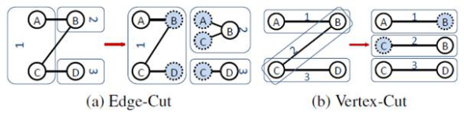
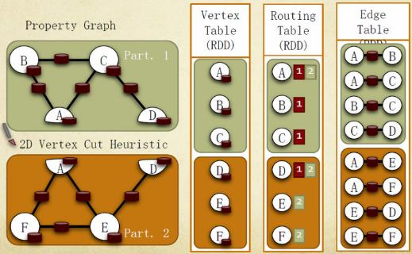

# 简介
本章节分析Spark GraphX中对图的存储。

# 1、图的存储模式
巨型图的存储总体上有边分割和点分割两种存储方式。
1. 边分割（Edge-Cut）：每个顶点都存储一次，但有的边会被打断分到两台机器上。这样做的好处是节省存储空间；坏处是对图进行基于边的计算时，对于一条两个顶点被分到不同机器上的边来说，要跨机器通信传输数据，内网通信流量大。
2. 点分割（Vertex-Cut）：每条边只存储一次，都只会出现在一台机器上。邻居多的点会被复制到多台机器上，增加了存储开销，同时会引发数据同步问题。好处是可以大幅减少内网通信量。



虽然两种方法互有利弊，但现在是点分割占上风。各种分布式图计算框架都将自己底层的存储形式变成了点分割。主要原因有以下两个。
1. 磁盘价格下降，存储空间不再是问题，而内网的通信资源没有突破性进展，集群计算时内网带宽是宝贵的，时间比磁盘更珍贵。这点就类似于常见的空间换时间的策略。
2. 在当前的应用场景中，绝大多数网络都是“无尺度网络”，遵循**幂律分布**，不同点的邻居数量相差非常悬殊。而边分割会使那些多邻居的点所相连的边大多数被分到不同的机器上，这样的数据分布会使得内网带宽更加捉襟见肘，于是边分割存储方式被渐渐抛弃了。

# 2、Spark GraphX存储模式
Spark Graphx借鉴PowerGraph，使用的是Vertex-Cut( 点分割 ) 方式存储图，用三个RDD存储图数据信息：
* VertexTable(id, data)：id为顶点id， data为顶点属性；
* EdgeTable(pid, src, dst, data)：pid 为分区id ，src为源顶点id ，dst为目的顶点id，data为边属性；
* RoutingTable(id, pid)：id 为顶点id ，pid 为分区id点。

分割存储实现如下图所示：



GraphX在进行图分割时，有几种不同的分区(partition)策略，它通过PartitionStrategy专门定义这些策略。在PartitionStrategy中，总共定义了EdgePartition2D、EdgePartition1D、RandomVertexCut以及 CanonicalRandomVertexCut这四种不同的分区策略。下面分别介绍这几种策略。

## 2.1、RandomVertexCut
```scala
case object RandomVertexCut extends PartitionStrategy {
  override def getPartition(src: VertexId, dst: VertexId, numParts: PartitionID): PartitionID = {
    math.abs((src, dst).hashCode()) % numParts
  }
}
```
这个方法比较简单，通过取源顶点和目标顶点id的哈希值来将边分配到不同的分区。这个方法会产生一个随机的边分割，两个顶点之间相同方向的边会分配到同一个分区。

## 2.2 CanonicalRandomVertexCut
```scala
case object CanonicalRandomVertexCut extends PartitionStrategy {
  override def getPartition(src: VertexId, dst: VertexId, numParts: PartitionID): PartitionID = {
    if (src < dst) {
      math.abs((src, dst).hashCode()) % numParts
    } else {
      math.abs((dst, src).hashCode()) % numParts
    }
  }
}
```
这种分割方法和前一种方法没有本质的不同。不同的是，哈希值的产生带有确定的方向（即两个顶点中较小id的顶点在前）。两个顶点之间所有的边都会分配到同一个分区，而不管方向如何。

## 2.3、EdgePartition1D
```scala
case object EdgePartition1D extends PartitionStrategy {
  override def getPartition(src: VertexId, dst: VertexId, numParts: PartitionID): PartitionID = {
    val mixingPrime: VertexId = 1125899906842597L
    (math.abs(src * mixingPrime) % numParts).toInt
  }
}
```
这种方法仅仅根据源顶点id来将边分配到不同的分区。有相同源顶点的边会分配到同一分区。

## 2.4、EdgePartition2D
```scala
case object EdgePartition2D extends PartitionStrategy {
  override def getPartition(src: VertexId, dst: VertexId, numParts: PartitionID): PartitionID = {
    val ceilSqrtNumParts: PartitionID = math.ceil(math.sqrt(numParts)).toInt
    val mixingPrime: VertexId = 1125899906842597L
    if (numParts == ceilSqrtNumParts * ceilSqrtNumParts) {
      // Use old method for perfect squared to ensure we get same results
      val col: PartitionID = (math.abs(src * mixingPrime) % ceilSqrtNumParts).toInt
      val row: PartitionID = (math.abs(dst * mixingPrime) % ceilSqrtNumParts).toInt
      (col * ceilSqrtNumParts + row) % numParts
    } else {
      // Otherwise use new method
      val cols = ceilSqrtNumParts
      val rows = (numParts + cols - 1) / cols
      val lastColRows = numParts - rows * (cols - 1)
      val col = (math.abs(src * mixingPrime) % numParts / rows).toInt
      val row = (math.abs(dst * mixingPrime) % (if (col < cols - 1) rows else lastColRows)).toInt
      col * rows + row
    }
  }
}
```
这种分割方法同时使用到了源顶点id和目的顶点id。它使用稀疏边连接矩阵的2维区分来将边分配到不同的分区，从而保证顶点的备份数不大于2 * sqrt(numParts)的限制。这里numParts表示分区数。 这个方法的实现分两种情况，即分区数能完全开方和不能完全开方两种情况。当分区数能完全开方时，采用下面的方法：
```scala
val col: PartitionID = (math.abs(src * mixingPrime) % ceilSqrtNumParts).toInt
val row: PartitionID = (math.abs(dst * mixingPrime) % ceilSqrtNumParts).toInt
(col * ceilSqrtNumParts + row) % numParts
```

当分区数不能完全开方时，采用下面的方法。这个方法的最后一列允许拥有不同的行数。
```scaka
val cols = ceilSqrtNumParts
val rows = (numParts + cols - 1) / cols
//最后一列允许不同的行数
val lastColRows = numParts - rows * (cols - 1)
val col = (math.abs(src * mixingPrime) % numParts / rows).toInt
val row = (math.abs(dst * mixingPrime) % (if (col < cols - 1) rows else lastColRows)).toInt
col * rows + row
```
假设我们有一个拥有12个顶点的图，要把它切分到9台机器。我们可以用下面的稀疏矩阵来表示:
```
         __________________________________
     v0   | P0 *     | P1       | P2    *  |
     v1   |  ****    |  *       |          |
     v2   |  ******* |      **  |  ****    |
     v3   |  *****   |  *  *    |       *  |
          ----------------------------------
     v4   | P3 *     | P4 ***   | P5 **  * |
     v5   |  *  *    |  *       |          |
     v6   |       *  |      **  |  ****    |
     v7   |  * * *   |  *  *    |       *  |
          ----------------------------------
     v8   | P6   *   | P7    *  | P8  *   *|
     v9   |     *    |  *    *  |          |
     v10  |       *  |      **  |  *  *    |
     v11  | * <-E    |  ***     |       ** |
          ----------------------------------
```

上面的例子中*表示分配到处理器上的边。E表示连接顶点v11和v1的边，它被分配到了处理器P6上。

为了获得边所在的处理器，我们将矩阵切分为sqrt(numParts) * sqrt(numParts)块。 

注意，上图中与顶点v11相连接的边只出现在第一列的块(P0,P3,P6)或者最后一行的块(P6,P7,P8)中，这保证了V11的副本数不会超过2 * sqrt(numParts)份，在上例中即副本不能超过6份。
 
在上面的例子中，P0里面存在很多边，这会造成工作的不均衡。为了提高均衡，我们首先用顶点id乘以一个大的素数，然后再shuffle顶点的位置。乘以一个大的素数本质上不能解决不平衡的问题，只是减少了不平衡的情况发生。