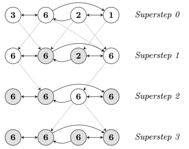
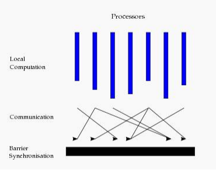
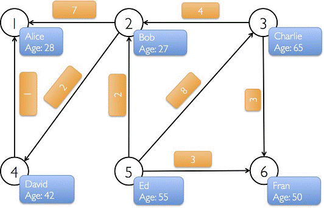

# 简介
本章节讨论关于图的计算，包括计算模式的概念、基本信息操作、转换操作、结构操作、顶点操作、聚合操作以及缓存操作。

# 1、BSP计算模式
目前基于图的并行计算框架已经有很多，比如来自Google的Pregel、来自Apache开源的图计算框架Giraph/HAMA，以及最为著名的GraphLab。

其中Pregel、HAMA和Giraph都是非常类似的，都是基于BSP（Bulk Synchronous Parallell）模式。 Bulk Synchronous Parallell，即整体同步并行。

在BSP中，一次计算过程由一系列全局超步组成，每一个超步由并发计算、通信和同步三个步骤组成。同步完成，标志着这个超步的完成及下一个超步的开始。 BSP模式的准则是批量同步(bulk synchrony)，其独特之处在于超步(superstep)概念的引入。一个BSP程序同时具有水平和垂直两个方面的结构。

从垂直上看,一个BSP程序由一系列串行的超步(superstep)组成,如图所示:



而从水平上看，在一个超步中，所有的进程并行执行局部计算。一个超步可分为三个阶段，如图所示:



* 本地计算阶段，每个处理器只对存储在本地内存中的数据进行本地计算。
* 全局通信阶段，对任何非本地数据进行操作。
* 栅栏同步阶段，等待所有通信行为的结束。

BSP模型有如下几个特点：
1. 将计算划分为一个一个的超步(superstep)，有效避免死锁;
2. 将处理器和路由器分开，强调了计算任务和通信任务的分开，而路由器仅仅完成点到点的消息传递，不提供组合、复制和广播等功能，这样做既掩盖具体的互连网络拓扑，又简化了通信协议；
3. 采用障碍同步的方式、以硬件实现的全局同步是可控的粗粒度级，提供了执行紧耦合同步式并行算法的有效方式

# 2、图操作一览
正如RDDs有基本的操作map, filter和reduceByKey一样，属性图也有基本的集合操作。

这些操作采用用户自定义的函数并产生包含转换特征和结构的新图。定义在Graph中的核心操作是经过优化的实现。表示为核心操作的组合的便捷操作定义在GraphOps中。

然而，因为有Scala的隐式转换，定义在GraphOps中的操作可以作为Graph的成员自动使用。例如，我们可以通过下面的方式计算每个顶点(定义在GraphOps中)的入度。

```scala
val graph: Graph[(String, String), String]
// Use the implicit GraphOps.inDegrees operator
val inDegrees: VertexRDD[Int] = graph.inDegrees
```
命令行下使用：
```shell
scala> graph.numEdges
res4: Long = 4
```

区分核心图操作和GraphOps的原因是为了在将来支持不同的图表示。每个图表示都必须提供核心操作的实现并重用很多定义在GraphOps中的有用操作。

下面是定义在GraphOps以及Graph中的所有操作的清单：
```scala
/** Summary of the functionality in the property graph */
class Graph[VD, ED] {
  // Information about the Graph ===================================================================
  val numEdges: Long
  val numVertices: Long
  val inDegrees: VertexRDD[Int]
  val outDegrees: VertexRDD[Int]
  val degrees: VertexRDD[Int]
  // Views of the graph as collections =============================================================
  val vertices: VertexRDD[VD]
  val edges: EdgeRDD[ED]
  val triplets: RDD[EdgeTriplet[VD, ED]]
  // Functions for caching graphs ==================================================================
  def persist(newLevel: StorageLevel = StorageLevel.MEMORY_ONLY): Graph[VD, ED]
  def cache(): Graph[VD, ED]
  def unpersistVertices(blocking: Boolean = true): Graph[VD, ED]
  // Change the partitioning heuristic  ============================================================
  def partitionBy(partitionStrategy: PartitionStrategy): Graph[VD, ED]
  // Transform vertex and edge attributes ==========================================================
  def mapVertices[VD2](map: (VertexId, VD) => VD2): Graph[VD2, ED]
  def mapEdges[ED2](map: Edge[ED] => ED2): Graph[VD, ED2]
  def mapEdges[ED2](map: (PartitionID, Iterator[Edge[ED]]) => Iterator[ED2]): Graph[VD, ED2]
  def mapTriplets[ED2](map: EdgeTriplet[VD, ED] => ED2): Graph[VD, ED2]
  def mapTriplets[ED2](map: (PartitionID, Iterator[EdgeTriplet[VD, ED]]) => Iterator[ED2])
    : Graph[VD, ED2]
  // Modify the graph structure ====================================================================
  def reverse: Graph[VD, ED]
  def subgraph(
      epred: EdgeTriplet[VD,ED] => Boolean = (x => true),
      vpred: (VertexId, VD) => Boolean = ((v, d) => true))
    : Graph[VD, ED]
  def mask[VD2, ED2](other: Graph[VD2, ED2]): Graph[VD, ED]
  def groupEdges(merge: (ED, ED) => ED): Graph[VD, ED]
  // Join RDDs with the graph ======================================================================
  def joinVertices[U](table: RDD[(VertexId, U)])(mapFunc: (VertexId, VD, U) => VD): Graph[VD, ED]
  def outerJoinVertices[U, VD2](other: RDD[(VertexId, U)])
      (mapFunc: (VertexId, VD, Option[U]) => VD2)
    : Graph[VD2, ED]
  // Aggregate information about adjacent triplets =================================================
  def collectNeighborIds(edgeDirection: EdgeDirection): VertexRDD[Array[VertexId]]
  def collectNeighbors(edgeDirection: EdgeDirection): VertexRDD[Array[(VertexId, VD)]]
  def aggregateMessages[Msg: ClassTag](
      sendMsg: EdgeContext[VD, ED, Msg] => Unit,
      mergeMsg: (Msg, Msg) => Msg,
      tripletFields: TripletFields = TripletFields.All)
    : VertexRDD[A]
  // Iterative graph-parallel computation ==========================================================
  def pregel[A](initialMsg: A, maxIterations: Int, activeDirection: EdgeDirection)(
      vprog: (VertexId, VD, A) => VD,
      sendMsg: EdgeTriplet[VD, ED] => Iterator[(VertexId,A)],
      mergeMsg: (A, A) => A)
    : Graph[VD, ED]
  // Basic graph algorithms ========================================================================
  def pageRank(tol: Double, resetProb: Double = 0.15): Graph[Double, Double]
  def connectedComponents(): Graph[VertexId, ED]
  def triangleCount(): Graph[Int, ED]
  def stronglyConnectedComponents(numIter: Int): Graph[VertexId, ED]
}
```

# 3、转换操作
raphX中的转换操作主要有mapVertices,mapEdges和mapTriplets三个。
```scala
class Graph[VD, ED] {
  def mapVertices[VD2](map: (VertexId, VD) => VD2): Graph[VD2, ED]
  def mapEdges[ED2](map: Edge[ED] => ED2): Graph[VD, ED2]
  def mapTriplets[ED2](map: EdgeTriplet[VD, ED] => ED2): Graph[VD, ED2]
}
```
## 3.1、mapVertices
mapVertices用来更新顶点属性。如果我们想通过map方法来构建新图，则需要如下两个步骤：
```scala
val newVertices = graph.vertices.map { case (id, attr) => (id, mapUdf(id, attr)) }
val newGraph = Graph(newVertices, graph.edges)
```
相反，如果使用mapVertices方法，则可以：
```scala
val newGraph = graph.mapVertices((id, attr) => mapUdf(id, attr))
```
这些运算材质通常用于为特定的计算：初始化图形或处理掉不必要的属性。

## 3.2、mapEdges
mapEdges用来更新边属性。根据方法func生成新的EdgeRDD,然后再初始化。

```scala
graph.mapEdges(edge=>"name:"+edge.attr).edges.collect
res16: Array[org.apache.spark.graphx.Edge[String]] = Array(Edge(3,7,name:collab), Edge(5,3,name:advisor), Edge(2,5,name:colleague), Edge(5,7,name:pi))
```

## 3.3、mapTriplets
mapTriplets用来更新边属性。
```scala
graph.mapTriplets(tri=>"name:"+tri.attr).triplets.collect
res19: Array[org.apache.spark.graphx.EdgeTriplet[(String, String),String]] = Array(((3,(rxin,student)),(7,(jgonzal,postdoc)),name:collab), ((5,(franklin,prof)),(3,(rxin,student)),name:advisor), ((2,(istoica,prof)),(5,(franklin,prof)),name:colleague), ((5,(franklin,prof)),(7,(jgonzal,postdoc)),name:pi))
```

# 4、结构操作
当前的GraphX仅仅支持一组简单的常用结构性操作。下面是基本的结构性操作列表。
```scala
class Graph[VD, ED] {
  def reverse: Graph[VD, ED]
  def subgraph(epred: EdgeTriplet[VD,ED] => Boolean,
               vpred: (VertexId, VD) => Boolean): Graph[VD, ED]
  def mask[VD2, ED2](other: Graph[VD2, ED2]): Graph[VD, ED]
  def groupEdges(merge: (ED, ED) => ED): Graph[VD,ED]
}
```
## 4.1、reverse
reverse操作返回一个新的图，这个图的边的方向都是反转的。

例如，这个操作可以用来计算反转的PageRank。因为反转操作没有修改顶点或者边的属性或者改变边的数量，所以我们可以在不移动或者复制数据的情况下有效地实现它。

## 4.2、mask
mask操作构造一个子图，类似于交集，这个子图包含输入图中包含的顶点和边。

它的实现很简单，顶点和边均做inner join操作即可。这个操作可以和subgraph操作相结合，基于另外一个相关图的特征去约束一个图。
```scala
// Run Connected Components
val ccGraph = graph.connectedComponents() // No longer contains missing field
// Remove missing vertices as well as the edges to connected to them
val validGraph = graph.subgraph(vpred = (id, attr) => attr._2 != "Missing")
// Restrict the answer to the valid subgraph
val validCCGraph = ccGraph.mask(validGraph)
```

## 4.3、subgraph
subgraph操作利用顶点和边的判断式（predicates），返回的图仅仅包含满足顶点判断式的顶点、满足边判断式的边以及满足顶点判断式的triple。

subgraph操作可以用于很多场景，如获取感兴趣的顶点和边组成的图或者获取清除断开连接后的图。

## 4.4、groupEdges
groupEdges操作合并多重图中的并行边(如顶点对之间重复的边)，并传入一个函数来合并两个边的属性。

在大量的应用程序中，并行的边可以合并（它们的权重合并）为一条边从而降低图的大小。

在图构建那章我们说明过，存储的边按照源顶点id排过序，groupEdges操作可以通过一次迭代完成对所有相同边的处理。

```scala
// Create an RDD for the vertices
val users: RDD[(VertexId, (String, String))] =
  sc.parallelize(Array((3L, ("rxin", "student")), (7L, ("jgonzal", "postdoc")),
    (5L, ("franklin", "prof")), (2L, ("istoica", "prof")),
    (4L, ("peter", "student"))))
// Create an RDD for edges
val relationships: RDD[Edge[String]] =
  sc.parallelize(Array(Edge(3L, 7L, "collab"),    Edge(5L, 3L, "advisor"),
    Edge(2L, 5L, "colleague"), Edge(5L, 7L, "pi"),
    Edge(4L, 0L, "student"),   Edge(5L, 0L, "colleague")))
// Define a default user in case there are relationship with missing user
val defaultUser = ("John Doe", "Missing")
// Build the initial Graph
val graph = Graph(users, relationships, defaultUser)
// Notice that there is a user 0 (for which we have no information) connected to users
// 4 (peter) and 5 (franklin).
graph.triplets.map(
  triplet => triplet.srcAttr._1 + " is the " + triplet.attr + " of " + triplet.dstAttr._1
).collect.foreach(println(_))
// Remove missing vertices as well as the edges to connected to them
val validGraph = graph.subgraph(vpred = (id, attr) => attr._2 != "Missing")
// The valid subgraph will disconnect users 4 and 5 by removing user 0
validGraph.vertices.collect.foreach(println(_))
validGraph.triplets.map(
  triplet => triplet.srcAttr._1 + " is the " + triplet.attr + " of " + triplet.dstAttr._1
).collect.foreach(println(_))

/ Run Connected Components
val ccGraph = graph.connectedComponents() // No longer contains missing field
// Remove missing vertices as well as the edges to connected to them
val validGraph = graph.subgraph(vpred = (id, attr) => attr._2 != "Missing")
// Restrict the answer to the valid subgraph
val validCCGraph = ccGraph.mask(validGraph)
```

# 5、顶点关联操作
在许多情况下，有必要将外部数据加入到图中。例如，我们可能有额外的用户属性需要合并到已有的图中、或者我们可能想从一个图中取出顶点特征加入到另外一个图中。

这些任务可以用join操作完成。 主要的join操作如下所示。
```scala
class Graph[VD, ED] {
  def joinVertices[U](table: RDD[(VertexId, U)])(map: (VertexId, VD, U) => VD)
  : Graph[VD, ED]
  def outerJoinVertices[U, VD2](table: RDD[(VertexId, U)])(map: (VertexId, VD, Option[U]) => VD2)
  : Graph[VD2, ED]
}
```
joinVertices操作join输入RDD和顶点，返回一个新的带有顶点特征的图。这些特征是通过在连接顶点的结果上使用用户定义的map函数获得的。没有匹配的顶点保留其原始值。 下面详细地来分析这两个函数。

## 5.1、joinVertices
joinVertices来连接相同ID的顶点数据。

我们从源码中可以看到，joinVertices的实现是通过outerJoinVertices来实现的。这是因为join本来就是outer join的一种特例。
```scala
scala> val join = sc.parallelize(Array((3L, "123")))
join: org.apache.spark.rdd.RDD[(Long, String)] = ParallelCollectionRDD[137] at parallelize at <console>:31

scala> graph.joinVertices(join)((VertexId, VD, U) => (VD._1,VD._2 + U))
res33: org.apache.spark.graphx.Graph[(String, String),String] = org.apache.spark.graphx.impl.GraphImpl@4e5b8728

scala> res33.vertices.collect.foreach(println _)
(7,(jgonzal,postdoc))
(2,(istoica,prof))
(3,(rxin,student123))
(5,(franklin,prof))
```
## 5.2、outerJoinVertices
跟JOIN类似，只不过table中没有的顶点默认值为None。
```scala
scala> graph.outerJoinVertices(join)((VertexId, VD, U) => (VD._1,VD._2 + U))
res35: org.apache.spark.graphx.Graph[(String, String),String] = org.apache.spark.graphx.impl.GraphImpl@7c542a14

scala> res35.vertices.collect.foreach(println _)
(7,(jgonzal,postdocNone))
(2,(istoica,profNone))
(3,(rxin,studentSome(123)))
(5,(franklin,profNone))
```

# 6、聚合操作
GraphX中提供的聚合操作有aggregateMessages、collectNeighborIds和collectNeighbors三个，其中aggregateMessages在GraphImpl中实现，collectNeighborIds和collectNeighbors在GraphOps中实现。下面分别介绍这几个方法。

## 6.1、aggregateMessages
aggregateMessages是GraphX最重要的API，用于替换mapReduceTriplets。目前mapReduceTriplets最终也是通过aggregateMessages来实现的。它主要功能是向邻边发消息，合并邻边收到的消息，返回messageRDD。 

下面的例子计算比用户年龄大的追随者（即followers）的平均年龄。
```scala
// Import random graph generation library
import org.apache.spark.graphx.util.GraphGenerators
// Create a graph with "age" as the vertex property.  Here we use a random graph for simplicity.
val graph: Graph[Double, Int] =
  GraphGenerators.logNormalGraph(sc, numVertices = 100).mapVertices( (id, _) => id.toDouble )
// Compute the number of older followers and their total age
val olderFollowers: VertexRDD[(Int, Double)] = graph.aggregateMessages[(Int, Double)](
  triplet => { // Map Function
    if (triplet.srcAttr > triplet.dstAttr) {
      // Send message to destination vertex containing counter and age
      triplet.sendToDst(1, triplet.srcAttr)
    }
  },
  // Add counter and age
  (a, b) => (a._1 + b._1, a._2 + b._2) // Reduce Function
)
// Divide total age by number of older followers to get average age of older followers
val avgAgeOfOlderFollowers: VertexRDD[Double] =
  olderFollowers.mapValues( (id, value) => value match { case (count, totalAge) => totalAge / count } )
// Display the results
avgAgeOfOlderFollowers.collect.foreach(println(_))
```

## 6.2、collectNeighbors
collectNeighbors的作用是收集每个顶点的邻居顶点的顶点id和顶点属性。需要指定方向。
```scala
def collectNeighbors(edgeDirection: EdgeDirection): VertexRDD[Array[(VertexId, VD)]] 
```
如下面的使用例子
```scala
// Define a reduce operation to compute the highest degree vertex
def max(a: (VertexId, Int), b: (VertexId, Int)): (VertexId, Int) = {
  if (a._2 > b._2) a else b
}
// Compute the max degrees
val maxInDegree: (VertexId, Int)  = graph.inDegrees.reduce(max)
val maxOutDegree: (VertexId, Int) = graph.outDegrees.reduce(max)
val maxDegrees: (VertexId, Int)   = graph.degrees.reduce(max)
```

## 6.3、collectNeighborIds
该方法的作用是收集每个顶点的邻居顶点的顶点id。它的实现和collectNeighbors非常相同。需要指定方向。
```scala
class GraphOps[VD, ED] {
  def collectNeighborIds(edgeDirection: EdgeDirection): VertexRDD[Array[VertexId]]
  def collectNeighbors(edgeDirection: EdgeDirection): VertexRDD[ Array[(VertexId, VD)] ]
}
```

# 7、缓存操作
同RDD一样，GraphX也支持缓存操作。当利用到图多次时，确保首先使用Graph.cache()方法。为了避免重新计算，在多次使用他们时最好显示的缓存他们。

 
在迭代计算中，为了获得最佳的性能，没必要执行缓存。默认情况下，缓存的RDD和图会一直保留在内存中直到因为内存压力迫使它们以LRU的顺序删除。

对于迭代计算，先前的迭代的中间结果将填充到缓存中。虽然它们最终会被删除，但是保存在内存中的不需要的数据将会减慢垃圾回收。

对于迭代计算，我们建议使用Pregel API，它可以选择最优的策略，不持久化中间结果。

GraphX中的缓存操作有cache,persist,unpersist和unpersistVertices。
```scala
def persist(newLevel: StorageLevel = StorageLevel.MEMORY_ONLY): Graph[VD, ED]
def cache(): Graph[VD, ED]
def unpersist(blocking: Boolean = true): Graph[VD, ED]
def unpersistVertices(blocking: Boolean = true): Graph[VD, ED]
```

# 8、Pregel API
参考文档：http://spark.apache.org/docs/latest/graphx-programming-guide.html#pregel-api

# 9、综合案例
接下来我们综合一下知识点，构造一张如下图所示的图：下图中有6个人，每个人有名字和年龄，这些人根据社会关系形成8条边，每条边有其属性。在以下例子演示中将构建顶点、边和图，打印图的属性、转换操作、结构操作、连接操作、聚合操作，并结合实际要求进行演示。 



```scala
package com.spark.GraphX
import org.apache.log4j.{Level, Logger}
import org.apache.spark.{SparkContext, SparkConf}
import org.apache.spark.graphx._
import org.apache.spark.rdd.RDD

object GraphXExample {
  def main(args: Array[String]) {
    //屏蔽日志
    Logger.getLogger("org.apache.spark").setLevel(Level.WARN)

    //设置运行环境
    val conf = new SparkConf().setAppName("SimpleGraphX").setMaster("local")
    val sc = new SparkContext(conf)

    //设置顶点和边，注意顶点和边都是用元组定义的Array
    //顶点的数据类型是VD:(String,Int)
    val vertexArray = Array(
      (1L, ("Alice", 28)),
      (2L, ("Bob", 27)),
      (3L, ("Charlie", 65)),
      (4L, ("David", 42)),
      (5L, ("Ed", 55)),
      (6L, ("Fran", 50))
    )
    //边的数据类型ED:Int
    val edgeArray = Array(
      Edge(2L, 1L, 7),
      Edge(2L, 4L, 2),
      Edge(3L, 2L, 4),
      Edge(3L, 6L, 3),
      Edge(4L, 1L, 1),
      Edge(5L, 2L, 2),
      Edge(5L, 3L, 8),
      Edge(5L, 6L, 3)
    )

    //构造vertexRDD和edgeRDD
    val vertexRDD: RDD[(Long, (String, Int))] = sc.parallelize(vertexArray)
    val edgeRDD: RDD[Edge[Int]] = sc.parallelize(edgeArray)

    //构造图Graph[VD,ED]
    val graph: Graph[(String, Int), Int] = Graph(vertexRDD, edgeRDD)

    //***********************************************************************************
    //***************************  图的属性    ****************************************
    //**********************************************************************************    println("***********************************************")
    println("属性演示")
    println("**********************************************************")
    println("找出图中年龄大于30的顶点：")
    graph.vertices.filter { case (id, (name, age)) => age > 30}.collect.foreach {
      case (id, (name, age)) => println(s"$name is $age")
    }

    //边操作：找出图中属性大于5的边
    println("找出图中属性大于5的边：")
    graph.edges.filter(e => e.attr > 5).collect.foreach(e => println(s"${e.srcId} to ${e.dstId} att ${e.attr}"))
    println

    //triplets操作，((srcId, srcAttr), (dstId, dstAttr), attr)
    println("列出边属性>5的tripltes：")
    for (triplet <- graph.triplets.filter(t => t.attr > 5).collect) {
      println(s"${triplet.srcAttr._1} likes ${triplet.dstAttr._1}")
    }
    println

    //Degrees操作
    println("找出图中最大的出度、入度、度数：")
    def max(a: (VertexId, Int), b: (VertexId, Int)): (VertexId, Int) = {
      if (a._2 > b._2) a else b
    }
    println("max of outDegrees:" + graph.outDegrees.reduce(max) + " max of inDegrees:" + graph.inDegrees.reduce(max) + " max of Degrees:" + graph.degrees.reduce(max))
    println

    //***********************************************************************************
    //***************************  转换操作    ****************************************
    //**********************************************************************************   
    println("**********************************************************")
    println("转换操作")
    println("**********************************************************")
    println("顶点的转换操作，顶点age + 10：")
    graph.mapVertices{ case (id, (name, age)) => (id, (name, age+10))}.vertices.collect.foreach(v => println(s"${v._2._1} is ${v._2._2}"))
    println
    println("边的转换操作，边的属性*2：")
    graph.mapEdges(e=>e.attr*2).edges.collect.foreach(e => println(s"${e.srcId} to ${e.dstId} att ${e.attr}"))
    println

    //***********************************************************************************
    //***************************  结构操作    ****************************************
    //**********************************************************************************  
    println("**********************************************************")
    println("结构操作")
    println("**********************************************************")
    println("顶点年纪>30的子图：")
    val subGraph = graph.subgraph(vpred = (id, vd) => vd._2 >= 30)
    println("子图所有顶点：")
    subGraph.vertices.collect.foreach(v => println(s"${v._2._1} is ${v._2._2}"))
    println
    println("子图所有边：")
    subGraph.edges.collect.foreach(e => println(s"${e.srcId} to ${e.dstId} att ${e.attr}"))
    println


    //***********************************************************************************
    //***************************  连接操作    ****************************************
    //**********************************************************************************  
    println("**********************************************************")
    println("连接操作")
    println("**********************************************************")
    val inDegrees: VertexRDD[Int] = graph.inDegrees
    case class User(name: String, age: Int, inDeg: Int, outDeg: Int)

    //创建一个新图，顶点VD的数据类型为User，并从graph做类型转换
    val initialUserGraph: Graph[User, Int] = graph.mapVertices { case (id, (name, age)) => User(name, age, 0, 0)}

    //initialUserGraph与inDegrees、outDegrees（RDD）进行连接，并修改initialUserGraph中inDeg值、outDeg值
    val userGraph = initialUserGraph.outerJoinVertices(initialUserGraph.inDegrees) {
      case (id, u, inDegOpt) => User(u.name, u.age, inDegOpt.getOrElse(0), u.outDeg)
    }.outerJoinVertices(initialUserGraph.outDegrees) {
      case (id, u, outDegOpt) => User(u.name, u.age, u.inDeg,outDegOpt.getOrElse(0))
    }

    println("连接图的属性：")
    userGraph.vertices.collect.foreach(v => println(s"${v._2.name} inDeg: ${v._2.inDeg}  outDeg: ${v._2.outDeg}"))
    println

    println("出度和入读相同的人员：")
    userGraph.vertices.filter {
      case (id, u) => u.inDeg == u.outDeg
    }.collect.foreach {
      case (id, property) => println(property.name)
    }
    println


    //***********************************************************************************
    //***************************  实用操作    ****************************************
    //**********************************************************************************
    println("**********************************************************")
    println("聚合操作")
    println("**********************************************************")
    println("找出5到各顶点的最短：")
    val sourceId: VertexId = 5L // 定义源点
    val initialGraph = graph.mapVertices((id, _) => if (id == sourceId) 0.0 else Double.PositiveInfinity)
    val sssp = initialGraph.pregel(Double.PositiveInfinity)(
      (id, dist, newDist) => math.min(dist, newDist),
      triplet => {  // 计算权重
        if (triplet.srcAttr + triplet.attr < triplet.dstAttr) {
          Iterator((triplet.dstId, triplet.srcAttr + triplet.attr))
        } else {
          Iterator.empty
        }
      },
      (a,b) => math.min(a,b) // 最短距离
    )
    println(sssp.vertices.collect.mkString("\n"))

    sc.stop()
  }
}
```
输出结果
```
属性演示
**********************************************************
找出图中年龄大于30的顶点：
David is 42
Ed is 55
Fran is 50
Charlie is 65
找出图中属性大于5的边：
2 to 1 att 7
5 to 3 att 8

列出边属性>5的tripltes：
Bob likes Alice
Ed likes Charlie

找出图中最大的出度、入度、度数：
max of outDegrees:(5,3) max of inDegrees:(2,2) max of Degrees:(2,4)

**********************************************************
转换操作
**********************************************************
顶点的转换操作，顶点age + 10：
4 is (David,52)
1 is (Alice,38)
5 is (Ed,65)
6 is (Fran,60)
2 is (Bob,37)
3 is (Charlie,75)

边的转换操作，边的属性*2：
2 to 1 att 14
2 to 4 att 4
3 to 2 att 8
3 to 6 att 6
4 to 1 att 2
5 to 2 att 4
5 to 3 att 16
5 to 6 att 6

**********************************************************
结构操作
**********************************************************
顶点年纪>30的子图：
子图所有顶点：
David is 42
Ed is 55
Fran is 50
Charlie is 65

子图所有边：
3 to 6 att 3
5 to 3 att 8
5 to 6 att 3

**********************************************************
连接操作
**********************************************************
连接图的属性：
David inDeg: 1  outDeg: 1
Alice inDeg: 2  outDeg: 0
Ed inDeg: 0  outDeg: 3
Fran inDeg: 2  outDeg: 0
Bob inDeg: 2  outDeg: 2
Charlie inDeg: 1  outDeg: 2

出度和入读相同的人员：
David
Bob

**********************************************************
聚合操作
**********************************************************
找出5到各顶点的最短：
(4,4.0)
(1,5.0)
(5,0.0)
(6,3.0)
(2,2.0)
(3,8.0)
```
# L、总结
=== Spark GraphX的基本信息操作 ===
1、numEdges 返回当前图的边的数量，返回类型为Long；

2、graph.numVertices 返回当前图的顶点的数量，返回类型为Long；

3、graph.inDegrees 返回当前图的顶点的入度，返回类型为VertexRDD[Int]；

4、graph.outDegrees 返回当前图每个顶点的出度，返回类型为VertextRDD[Int]；

5、graph.Degrees 返回当前图中每个顶点的出入度的和，返回类型为VertextRDD[Int]；

