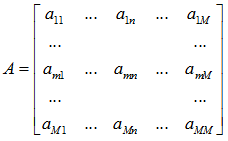
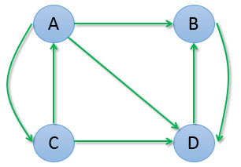
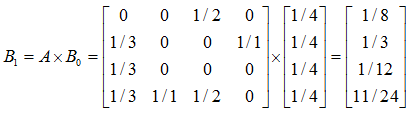
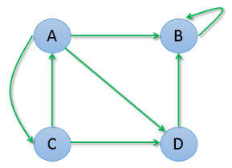
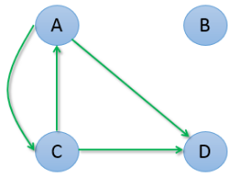
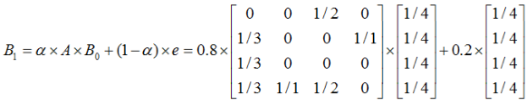
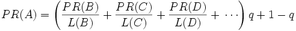
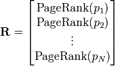

# 简介
本章节探讨有关图的一些比较有名的算法。

http://www.cnblogs.com/rubinorth/p/5799848.html

# 1、PageRank排名算法
PageRank,即网页排名，又称网页级别、Google左侧排名或佩奇排名。是Google创始人拉里·佩奇和谢尔盖·布林于1997年构建早期的搜索系统原型时提出的链接分析算法，在揉合了诸如Title标识和Keywords标识等所有其它因素之后，Google通过PageRank来调整结果，使那些更具“等级/重要性”的网页在搜索结果中另网站排名获得提升，从而提高搜索结果的相关性和质量。

PageRank的计算基于以下两个基本假设： 
* 数量假设：在Web图模型中，如果一个页面节点接收到的其他网页指向的入链数量越多，那么这个页面越重要。
* 质量假设：指向页面A的入链质量不同，质量高的页面会通过链接向其他页面传递更多的权重。所以越是质量高的页面指向页面A，则页面A越重要。

利用以上两个假设，PageRank算法刚开始赋予每个网页相同的重要性得分，通过迭代递归计算来更新每个页面节点的PageRank得分，直到得分稳定为止。 PageRank计算得出的结果是网页的重要性评价，这和用户输入的查询是没有任何关系的，即算法是主题无关的。 

## 1.1、算法原理
PageRank的计算充分利用了两个假设：数量假设和质量假设。步骤如下：

在初始阶段，网页通过链接关系构建起Web图，每个页面设置相同的PageRank值，通过若干轮的计算，会得到每个页面所获得的最终PageRank值。随着每一轮的计算进行，网页当前的PageRank值会不断得到更新。

在一轮中更新页面PageRank得分的计算方法：在一轮更新页面PageRank得分的计算中，每个页面将其当前的PageRank值平均分配到本页面包含的出链上，这样每个链接即获得了相应的权值。而每个页面将所有指向本页面的入链所传入的权值求和，即可得到新的PageRank得分。当每个页面都获得了更新后的PageRank值，就完成了一轮PageRank计算。 

## 1.2、具体思想
如果网页T存在一个指向网页A的连接，则表明T的所有者认为A比较重要，从而把T的一部分重要性得分赋予A。这个重要性得分值为：
$$
PR(T)/L(T)
$$
其中，$PR（T）$为T的PageRank值，$L(T)$为T的出链数。

**A的PageRank值为一系列类似于T的页面重要性得分值的累加**。即一个页面的得票数由所有链向它的页面的重要性来决定，到一个页面的超链接相当于对该页投一票。一个页面的PageRank是由所有链向它的页面（链入页面）的重要性经过递归算法得到的。

一个有较多链入的页面会有较高的等级，相反如果一个页面没有任何链入页面，那么它没有等级。

我们设向量B为第一、第二…第N个网页的网页排名：
$$
B=(b_{1},b_{2},...,b_{n})^T
$$
矩阵A代表网页之间的权重输出关系，其中$a_{mn}$代表第 m个网页向第n个网页的输出权重。



输出权重计算较为简单：假设 m 一共有10个出链，指向 n 的一共有2个，那么 m 向 n 输出的**权重**就为2/10=5。

现在问题变为：A 是已知的，我们要通过计算得到B。假设Bi是第 i 次迭代的结果，那么
$$
B_{i} = A \times B_{i-1}
$$
初始假设所有网页的排名都是 1/N （N为网页总数量），即
$$
B_{0} = (\frac{1}{N},\frac{1}{N},...,\frac{1}{N})^T
$$
通过迭代计算，最终$B_{i}$会收敛，即$B_{i}$无限接近于B。即：
$$
B = A \times B_{i},i \to \infty
$$

## 1.3、算法实现
假设有如下的图



计算$B_{1}$如下：



> 观察矩阵A，其中的$a_{13}$的值即为A向C的输出边数除以A的出度，即1/2。

> m*s矩阵乘以s*n矩阵生成的是m*n的矩阵。

不断迭代，计算结果如下：
```
第 1次迭代: 0.125, 0.333, 0.083, 0.458 
第 2次迭代: 0.042, 0.500, 0.042, 0.417 
第 3次迭代: 0.021, 0.431, 0.014, 0.535 
第 4次迭代: 0.007, 0.542, 0.007, 0.444 
第 5次迭代: 0.003, 0.447, 0.002, 0.547 
第 6次迭代: 0.001, 0.549, 0.001, 0.449 
第 7次迭代: 0.001, 0.449, 0.000, 0.550 
第 8次迭代: 0.000, 0.550, 0.000, 0.450 
第 9次迭代: 0.000, 0.450, 0.000, 0.550 
第10次迭代: 0.000, 0.550, 0.000, 0.450 
... ...
```
我们可以发现，A 和 C 的权重变为0，而 B 和 D 的权重也趋于在 0.5 附近摆动。从图中也可以观察出：A 和 C 之间有互相链接，但它们又把权重输出给了 B 和 D，而 B 和 D之间互相链接，并不向 A 或 C 输出任何权重，所以久而久之权重就都转移到 B 和 D 了。

## 1.4、PageRank的改进
上面是最简单正常的情况，考虑一下两种特殊情况：





第一种情况是，B 存在导向自己的链接，迭代计算过程是：

```
第 1次迭代: 0.125, 0.583, 0.083, 0.208 
第 2次迭代: 0.042, 0.833, 0.042, 0.083 
第 3次迭代: 0.021, 0.931, 0.014, 0.035 
第 4次迭代: 0.007, 0.972, 0.007, 0.014 
第 5次迭代: 0.003, 0.988, 0.002, 0.006 
第 6次迭代: 0.001, 0.995, 0.001, 0.002 
第 7次迭代: 0.001, 0.998, 0.000, 0.001 
第 8次迭代: 0.000, 0.999, 0.000, 0.000 
第 9次迭代: 0.000, 1.000, 0.000, 0.000 
第10次迭代: 0.000, 1.000, 0.000, 0.000 
... ...
```
我们发现最终 B 权重变为1，其它所有网页的权重都变为了0。

第二种情况是 B 是孤立于其它网页的，既没有入链也没有出链，迭代计算过程是：
```
第 1次迭代: 0.125, 0.000, 0.125, 0.250 
第 2次迭代: 0.063, 0.000, 0.063, 0.125 
第 3次迭代: 0.031, 0.000, 0.031, 0.063 
第 4次迭代: 0.016, 0.000, 0.016, 0.031 
第 5次迭代: 0.008, 0.000, 0.008, 0.016 
第 6次迭代: 0.004, 0.000, 0.004, 0.008 
第 7次迭代: 0.002, 0.000, 0.002, 0.004 
第 8次迭代: 0.001, 0.000, 0.001, 0.002 
第 9次迭代: 0.000, 0.000, 0.000, 0.001 
第10次迭代: 0.000, 0.000, 0.000, 0.000 
... ...
```
最终，所有网页权重都变为了0。

出现这种情况是因为上面的数学模型出现了问题，该模型认为上网者从一个网页浏览下一个网页都是通过页面的超链接，即每个网页都至少有一个入度。想象一下正常的上网情景，其实我们在看完一个网页后，可能直接在浏览器输入一个网址，而不通过上一个页面的超链接，这种情况下构建的数学模型，该直接跳转的网页入度就为0。

我们假设每个网页被用户通过直接访问方式的概率是相等的，即 1/N，N 为网页总数，设矩阵 e 如下：
$$
e = (\frac{1}{N},\frac{1}{N},...,\frac{1}{N})^T
$$
设用户通过页面超链接浏览下一网页的概率为$\alpha$，则直接访问的方式浏览下一个网页的概率为 $1-\alpha$，改进上一节的迭代公式为：
$$
B_{i} = p \times A \times B_{i-1} + (1-p) \times e
$$
通常情况下设 α 为0.8，上一节”具体示例”的计算变为如下：



迭代过程如下：
```
第 1次迭代: 0.150, 0.317, 0.117, 0.417 
第 2次迭代: 0.097, 0.423, 0.090, 0.390 
第 3次迭代: 0.086, 0.388, 0.076, 0.450 
第 4次迭代: 0.080, 0.433, 0.073, 0.413 
第 5次迭代: 0.079, 0.402, 0.071, 0.447 
第 6次迭代: 0.079, 0.429, 0.071, 0.421 
第 7次迭代: 0.078, 0.408, 0.071, 0.443 
第 8次迭代: 0.078, 0.425, 0.071, 0.426 
第 9次迭代: 0.078, 0.412, 0.071, 0.439 
第10次迭代: 0.078, 0.422, 0.071, 0.428 
第11次迭代: 0.078, 0.414, 0.071, 0.437 
第12次迭代: 0.078, 0.421, 0.071, 0.430 
第13次迭代: 0.078, 0.415, 0.071, 0.436 
第14次迭代: 0.078, 0.419, 0.071, 0.431 
第15次迭代: 0.078, 0.416, 0.071, 0.435 
第16次迭代: 0.078, 0.419, 0.071, 0.432 
第17次迭代: 0.078, 0.416, 0.071, 0.434 
第18次迭代: 0.078, 0.418, 0.071, 0.432 
第19次迭代: 0.078, 0.417, 0.071, 0.434 
第20次迭代: 0.078, 0.418, 0.071, 0.433 
... ...
```

## 1.5、修正PageRank计算公式
以上的改正算法的方式其实应该可以处理大部分应用了。

但是在实际生活中，由于存在一些出链为0，也就是那些不链接任何其他网页的网页，也称为孤立网页，使得很多网页能被访问到。因此需要对PageRank公式进行修正，即在简单公式的基础上增加了阻尼系数（damping factor）q， q一般取值q=0.85。

其意义是，在任意时刻，用户到达某页面后并继续向后浏览的概率。 
$$
1- q= 0.15
$$
就是用户停止点击的概率。
 
最后，即所有这些被换算为一个百分比再乘上一个系数q。由于下面的算法，没有页面的PageRank会是0。所以，Google通过数学系统给了每个页面一个最小值。



这个公式就是.S Brin 和 L. Page 在《The Anatomy of a Large- scale Hypertextual Web Search Engine Computer Networks and ISDN Systems 》定义的公式。

所以一个页面的PageRank是由其他页面的PageRank计算得到的。Google不断的重复计算每个页面的PageRank。如果给每个页面一个随机PageRank值（非0），那么经过不断的重复计算，这些页面的PR值会趋向于正常和稳定。这就是搜索引擎使用它的原因。

Arvind Arasu 在《Junghoo Cho Hector Garcia - Molina, Andreas Paepcke, Sriram Raghavan. Searching the Web》 更加准确的表达为：
$$
PageRank(p_{i}) = \frac{1-q}{N} + q\sum_{p_{j} \in M(p_{i})}\frac{PageRank(p_{j})}{L(p_{j})}
$$
其中，$p_{1},p_{2},...,p_{n}$是被研究的页面，$M(p_{i})$是$p_{i}$链入页面的数量，$L(p_{j})$是$p_{j}$链出页面的数量。而N是所有页面的数量。

PageRank值是一个特殊矩阵中的特征向量。这个特征向量为：



## 1.6、Spark GraphX中的PageRank实现
```scala
package com.spark.GraphX

import org.apache.spark.graphx.GraphLoader
import org.apache.spark.{SparkConf, SparkContext}

class PageRankTest {
  def main(args: Array[String]): Unit = {
    // 创建SparkConf
    val sparkConf = new SparkConf().setAppName("graphic first")
      .setMaster("local[*]")
      .set("spark.testing.memory","2147000000")

    val sc = new SparkContext(sparkConf)

    // Load the edges as a graph
    val graph = GraphLoader.edgeListFile(sc, "data/graphx/followers.txt")
    // Run PageRank
    val ranks = graph.pageRank(0.0001).vertices
    // Join the ranks with the usernames
    val users = sc.textFile("data/graphx/users.txt").map { line =>
      val fields = line.split(",")
      (fields(0).toLong, fields(1))
    }
    val ranksByUsername = users.join(ranks).map {
      case (id, (username, rank)) => (username, rank)
    }
    // Print the result
    println(ranksByUsername.collect().mkString("\n"))
  }

}
```

## 2、广度优先遍历
```scala
val graph = GraphLoader.edgeListFile(sc, "graphx/data/test_graph.txt")

val root: VertexId = 1
val initialGraph = graph.mapVertices((id, _) => if (id == root) 0.0 else
  Double.PositiveInfinity)

val vprog = { (id: VertexId, attr: Double, msg: Double) => math.min(attr,msg) }

val sendMessage = { (triplet: EdgeTriplet[Double, Int]) =>
  var iter:Iterator[(VertexId, Double)] = Iterator.empty
  val isSrcMarked = triplet.srcAttr != Double.PositiveInfinity
  val isDstMarked = triplet.dstAttr != Double.PositiveInfinity
  if(!(isSrcMarked && isDstMarked)){
    if(isSrcMarked){
      iter = Iterator((triplet.dstId,triplet.srcAttr+1))
    }else{
      iter = Iterator((triplet.srcId,triplet.dstAttr+1))
    }
  }
  iter
}

val reduceMessage = { (a: Double, b: Double) => math.min(a,b) }

val bfs = initialGraph.pregel(Double.PositiveInfinity, 20)(vprog, sendMessage, reduceMessage)

println(bfs.vertices.collect.mkString("\n"))
```

# 3、单源最短路径
```scala
import scala.reflect.ClassTag

import org.apache.spark.graphx._

/**
  * Computes shortest paths to the given set of landmark vertices, returning a graph where each
  * vertex attribute is a map containing the shortest-path distance to each reachable landmark.
  */
object ShortestPaths {
  /** Stores a map from the vertex id of a landmark to the distance to that landmark. */
  type SPMap = Map[VertexId, Int]

  private def makeMap(x: (VertexId, Int)*) = Map(x: _*)

  private def incrementMap(spmap: SPMap): SPMap = spmap.map { case (v, d) => v -> (d + 1) }

  private def addMaps(spmap1: SPMap, spmap2: SPMap): SPMap =
    (spmap1.keySet ++ spmap2.keySet).map {
      k => k -> math.min(spmap1.getOrElse(k, Int.MaxValue), spmap2.getOrElse(k, Int.MaxValue))
    }.toMap

  /**
    * Computes shortest paths to the given set of landmark vertices.
    *
    * @tparam ED the edge attribute type (not used in the computation)
    *
    * @param graph the graph for which to compute the shortest paths
    * @param landmarks the list of landmark vertex ids. Shortest paths will be computed to each
    * landmark.
    *
    * @return a graph where each vertex attribute is a map containing the shortest-path distance to
    * each reachable landmark vertex.
    */
  def run[VD, ED: ClassTag](graph: Graph[VD, ED], landmarks: Seq[VertexId]): Graph[SPMap, ED] = {
    val spGraph = graph.mapVertices { (vid, attr) =>
      if (landmarks.contains(vid)) makeMap(vid -> 0) else makeMap()
    }

    val initialMessage = makeMap()

    def vertexProgram(id: VertexId, attr: SPMap, msg: SPMap): SPMap = {
      addMaps(attr, msg)
    }

    def sendMessage(edge: EdgeTriplet[SPMap, _]): Iterator[(VertexId, SPMap)] = {
      val newAttr = incrementMap(edge.dstAttr)
      if (edge.srcAttr != addMaps(newAttr, edge.srcAttr)) Iterator((edge.srcId, newAttr))
      else Iterator.empty
    }

    Pregel(spGraph, initialMessage)(vertexProgram, sendMessage, addMaps)
  }
}
```

# 4、连通图
```scala
import scala.reflect.ClassTag

import org.apache.spark.graphx._

/** Connected components algorithm. */
object ConnectedComponents {
  /**
    * Compute the connected component membership of each vertex and return a graph with the vertex
    * value containing the lowest vertex id in the connected component containing that vertex.
    *
    * @tparam VD the vertex attribute type (discarded in the computation)
    * @tparam ED the edge attribute type (preserved in the computation)
    * @param graph the graph for which to compute the connected components
    * @param maxIterations the maximum number of iterations to run for
    * @return a graph with vertex attributes containing the smallest vertex in each
    *         connected component
    */
  def run[VD: ClassTag, ED: ClassTag](graph: Graph[VD, ED],
                                      maxIterations: Int): Graph[VertexId, ED] = {
    require(maxIterations > 0, s"Maximum of iterations must be greater than 0," +
      s" but got ${maxIterations}")

    val ccGraph = graph.mapVertices { case (vid, _) => vid }
    def sendMessage(edge: EdgeTriplet[VertexId, ED]): Iterator[(VertexId, VertexId)] = {
      if (edge.srcAttr < edge.dstAttr) {
        Iterator((edge.dstId, edge.srcAttr))
      } else if (edge.srcAttr > edge.dstAttr) {
        Iterator((edge.srcId, edge.dstAttr))
      } else {
        Iterator.empty
      }
    }
    val initialMessage = Long.MaxValue
    val pregelGraph = Pregel(ccGraph, initialMessage,
      maxIterations, EdgeDirection.Either)(
      vprog = (id, attr, msg) => math.min(attr, msg),
      sendMsg = sendMessage,
      mergeMsg = (a, b) => math.min(a, b))
    ccGraph.unpersist()
    pregelGraph
  } // end of connectedComponents

  /**
    * Compute the connected component membership of each vertex and return a graph with the vertex
    * value containing the lowest vertex id in the connected component containing that vertex.
    *
    * @tparam VD the vertex attribute type (discarded in the computation)
    * @tparam ED the edge attribute type (preserved in the computation)
    * @param graph the graph for which to compute the connected components
    * @return a graph with vertex attributes containing the smallest vertex in each
    *         connected component
    */
  def run[VD: ClassTag, ED: ClassTag](graph: Graph[VD, ED]): Graph[VertexId, ED] = {
    run(graph, Int.MaxValue)
  }
}
```

# 5、三角函数
```scala
import scala.reflect.ClassTag

import org.apache.spark.graphx._

/**
  * Compute the number of triangles passing through each vertex.
  *
  * The algorithm is relatively straightforward and can be computed in three steps:
  *
  * <ul>
  * <li> Compute the set of neighbors for each vertex</li>
  * <li> For each edge compute the intersection of the sets and send the count to both vertices.</li>
  * <li> Compute the sum at each vertex and divide by two since each triangle is counted twice.</li>
  * </ul>
  *
  * There are two implementations.  The default `TriangleCount.run` implementation first removes
  * self cycles and canonicalizes the graph to ensure that the following conditions hold:
  * <ul>
  * <li> There are no self edges</li>
  * <li> All edges are oriented src > dst</li>
  * <li> There are no duplicate edges</li>
  * </ul>
  * However, the canonicalization procedure is costly as it requires repartitioning the graph.
  * If the input data is already in "canonical form" with self cycles removed then the
  * `TriangleCount.runPreCanonicalized` should be used instead.
  *
  * {{{
  * val canonicalGraph = graph.mapEdges(e => 1).removeSelfEdges().canonicalizeEdges()
  * val counts = TriangleCount.runPreCanonicalized(canonicalGraph).vertices
  * }}}
  *
  */
object TriangleCount {

  def run[VD: ClassTag, ED: ClassTag](graph: Graph[VD, ED]): Graph[Int, ED] = {
    // Transform the edge data something cheap to shuffle and then canonicalize
    val canonicalGraph = graph.mapEdges(e => true).removeSelfEdges().convertToCanonicalEdges()
    // Get the triangle counts
    val counters = runPreCanonicalized(canonicalGraph).vertices
    // Join them bath with the original graph
    graph.outerJoinVertices(counters) { (vid, _, optCounter: Option[Int]) =>
      optCounter.getOrElse(0)
    }
  }


  def runPreCanonicalized[VD: ClassTag, ED: ClassTag](graph: Graph[VD, ED]): Graph[Int, ED] = {
    // Construct set representations of the neighborhoods
    val nbrSets: VertexRDD[VertexSet] =
      graph.collectNeighborIds(EdgeDirection.Either).mapValues { (vid, nbrs) =>
        val set = new VertexSet(nbrs.length)
        var i = 0
        while (i < nbrs.length) {
          // prevent self cycle
          if (nbrs(i) != vid) {
            set.add(nbrs(i))
          }
          i += 1
        }
        set
      }

    // join the sets with the graph
    val setGraph: Graph[VertexSet, ED] = graph.outerJoinVertices(nbrSets) {
      (vid, _, optSet) => optSet.getOrElse(null)
    }

    // Edge function computes intersection of smaller vertex with larger vertex
    def edgeFunc(ctx: EdgeContext[VertexSet, ED, Int]) {
      val (smallSet, largeSet) = if (ctx.srcAttr.size < ctx.dstAttr.size) {
        (ctx.srcAttr, ctx.dstAttr)
      } else {
        (ctx.dstAttr, ctx.srcAttr)
      }
      val iter = smallSet.iterator
      var counter: Int = 0
      while (iter.hasNext) {
        val vid = iter.next()
        if (vid != ctx.srcId && vid != ctx.dstId && largeSet.contains(vid)) {
          counter += 1
        }
      }
      ctx.sendToSrc(counter)
      ctx.sendToDst(counter)
    }

    // compute the intersection along edges
    val counters: VertexRDD[Int] = setGraph.aggregateMessages(edgeFunc, _ + _)
    // Merge counters with the graph and divide by two since each triangle is counted twice
    graph.outerJoinVertices(counters) { (_, _, optCounter: Option[Int]) =>
      val dblCount = optCounter.getOrElse(0)
      // This algorithm double counts each triangle so the final count should be even
      require(dblCount % 2 == 0, "Triangle count resulted in an invalid number of triangles.")
      dblCount / 2
    }
  }
}
```
