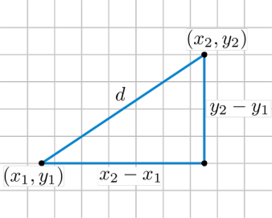
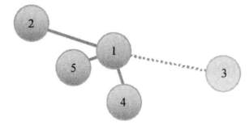
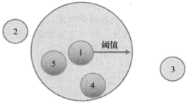
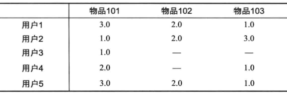

# 简介
比如你想看一个电影，但是不知道具体看哪一部，你会怎么做？有两种办法，一种是问问周围兴趣相似的朋友，看看他们最近有什么好的电影推荐。另外一种是看看电影的相似程度，比如都喜欢看僵尸片，那就会找电影名带有僵尸、丧尸之类的电影。

协同过滤算法就是基于上面的思想，主要包含基于用户的协同过滤推荐算法以及基于物品的协同过滤推荐算法。

实现协同过滤，一般需要几个步骤：
1. 收集用户偏好；
2. 找到相似的用户或者物品；
3. 计算推荐。

# 1、推荐数据准备
要进行推荐我们需要的数据如下
* 用户ID: userId
* 物品ID: itemId
* 偏好值: rating

偏好值就是用户对物品的喜爱程度，推荐系统所做的事就是根据这些数据为用户推荐他还没有见过的物品，并且猜测这个物品用户喜欢的概率比较大。

用户ID和物品ID一般通过系统的业务数据库就可以获得，偏好值的采集一般会有很多办法，比如评分、投票、转发、保存书签、页面停留时间等等。然后系统根据用户的这些行为流水，采取减噪、归一化、加权等方法综合给出偏好值。一般不同的业务系统给出偏好值的计算方法不一样。

# 2、相似性度量
基于用户的推荐和基于物品的推荐都需要找相似，即需要找相似用户以及相似物品。

比如一个男生和一个女生是朋友，不能讲该女生穿的衣服推荐给男生。要找相似。那么衡量的指标有哪些？
* 皮尔逊相关系数
* 欧式距离
* 同现相似度
* Cosine相似度
* Tanimoto系数等。

## 2.1、皮尔逊相关系数
皮尔逊相关系数是介于1到-1之间的数，他衡量两个一一对应的序列之间的线性相关性。也就是两个序列一起增大或者一起减小的可能性。

**两个序列正相关值就趋近1，否者趋近于0**。数学公式如下：
$$
R = \frac{\sum_{i=1}^{n} (X_{i}-\overline{X})(Y_{i}-\overline{Y})}{\sqrt{\sum_{i=1}^n(X_{i}-\overline{X})^2} \sqrt{\sum_{i=1}^n(Y_{i}-\overline{Y})^2}}
$$

数学含义：两个序列的协方差与二者方差的乘积。

如果比较两个人的相似度，那么他们所有共同评价过的物品可以看做两个人的**特征序列**，这两个特征序列的相似度就可以用皮尔逊相关系数去衡量。物品的相似度比较也是如此。

> 皮尔逊对于稀疏矩阵表现不好，可以通过引入权重进行优化。

## 2.2、欧氏距离
同理可以将两个人所有共同评价过的物品看做这个人的特征，将这些特征看做是空间中的点，计算两点之间的距离。



## 2.3、同现相似度
物品i和物品j的同相似度公式定义：
$$
w_{ij} = \frac{N(i)\cap N(j)}{|N(i)|}
$$
其中，分母是喜欢物品i的用户数，而分子则是同时喜欢物品i和物品j的用户数。

因此，上述公式可用理解为喜欢物品i的用户有多少比例的用户也喜欢j(和关联规则类似)

但上述的公式存在一个问题，如果物品j是热门物品，有很多人都喜欢，则会导致Wij很大，接近于1。因此会造成任何物品都和热门物品交有很大的相似度。为此我们用如下公式进行修正：
$$
w_{ij} = \frac{N(i)\cap N(j)}{|N(i)||N(j)|}
$$
这个公式对物品j的权重进行了惩罚，因此减轻了热门物品和很多物品相似的可能性。(也归一化了[i,j]和[j,i])

## 2.4、其他的相似度算法
后续再次逐步添加。

# 3、邻域大小
有了相似度的比较，那么比较多少个用户或者物品为好呢？

一般会有基于固定大小的邻域以及基于阈值的邻域。具体的数值一般是通过对模型的评比分数进行调整优化。





# 5、基于用户的CF
模型核心算法伪代码表示：
```
for 每个其他用户w
  计算用户u和用户w的相似度s
  按相似度排序后，将位置靠前的用户作为邻域n

for (n中用户有偏好，而u中用户无偏好的) 每个物品i
  for (n中用户对i有偏好的) 每个其他用户v
  计算用户u和用户v的相似度s
  按权重s将v对i的偏好并入平均值
```
基于该核心算法，完成用户商品矩阵：



预测用户对于未评分的物品的分值，然后按照降序排序，进行推荐。

# 6、基于物品的CF
先计算出物品-物品的相似矩阵：
```
for 每个物品i
  for 每个其他的物品j
    for 对i和j均有偏好的每个用户u
      将物品对(i,j)间的偏好值差异加入u的偏好
```

基于上面的结果
```
for 用户u未表达过偏好的每个物品i
  for 用户u表达过偏好的每个物品j
    找到i与j之间的平均偏好值差异
    添加该差异值到u对j的偏好值
    添加其至平均值

return 值最高的物品（按平均差异排序）
```
给用户推送预测偏好值n个最高的物品。

# 7、Spark MLib算法实现
假设有如下的数据集文件
```
0::2::3::1424380312
0::3::1::1424380312
0::5::2::1424380312
...(省略大部分)
```

采用ALS算法进行推荐预测，并给出相应的需求结果：
```java
package com.zhaoyi;

import org.apache.spark.SparkConf;
import org.apache.spark.api.java.JavaRDD;
import org.apache.spark.api.java.JavaSparkContext;
import org.apache.spark.api.java.function.Function;

import org.apache.spark.ml.evaluation.RegressionEvaluator;
import org.apache.spark.ml.recommendation.ALS;
import org.apache.spark.ml.recommendation.ALSModel;
import org.apache.spark.mllib.recommendation.MatrixFactorizationModel;

import java.util.Arrays;
import java.util.regex.Pattern;

import org.apache.spark.sql.Dataset;
import org.apache.spark.sql.Row;
import org.apache.spark.sql.SparkSession;
import scala.Tuple2;

/**
 * Example using MLlib ALS from Java.
 */
public final class JavaALS {
  static class FeaturesToString implements Function<Tuple2<Object, double[]>, String> {
    @Override
    public String call(Tuple2<Object, double[]> element) {
      return element._1() + "," + Arrays.toString(element._2());
    }
  }

  public static void main(String[] args) {
    SparkConf sparkConf = new SparkConf().setMaster("local[*]")
            .set("spark.testing.memory","4120000000")
            .setAppName("JavaALS");
      SparkSession spark = SparkSession.builder().config(sparkConf).getOrCreate();

      JavaRDD<Rating> ratingRDD = spark.read().textFile("movielens_ratings.txt").javaRDD().map(Rating::parseRating);

      Dataset<Row> ratings = spark.createDataFrame(ratingRDD, Rating.class);

      Dataset<Row>[] dataSets = ratings.randomSplit(new double[]{0.8, 0.2});

      // 用于训练
      Dataset<Row> training = dataSets[0];

      // 用于测试
      Dataset<Row> tests = dataSets[1];

      // 初始化ALS算法
      ALS als = new ALS().setMaxIter(5)// 迭代次数
              .setRegParam(0.01)//正则化参数
              .setUserCol("userId")//用户列
              .setItemCol("movieId")
              .setRatingCol("rating");

      // 填装数据，训练获得模型
      ALSModel model = als.fit(training);

      // 评估模型：通过测试test数据集来计算RMSE（均方根误差）
      // 注意：通过设置'drop'确保不会得到NAN评估指标
      model.setColdStartStrategy("drop");
      Dataset<Row> predictions = model.transform(tests);
      RegressionEvaluator regressionEvaluator = new RegressionEvaluator()
              .setMetricName("rmse")
              .setLabelCol("rating")
              .setPredictionCol("prediction");
      double rmse = regressionEvaluator.evaluate(predictions);
      System.out.println("Root-Mean-Square error is: " + rmse);

      // 为每个用户生成前10个电影推荐
      Dataset<Row> forAllUsers = model.recommendForAllUsers(10);
      // 为每个电影生成前10个用户推荐
      Dataset<Row> forAllItems = model.recommendForAllItems(10);

      // 对于指定的用户集合生成前10个电影推荐
      Dataset<Row> users = ratings.select(als.getUserCol()).distinct().limit(3);
      Dataset<Row> userSubsetRec = model.recommendForUserSubset(users, 10);

      // 同理，为指定的电影集合生成前10个用户推荐
      Dataset<Row> movies = ratings.select(als.getItemCol()).distinct().limit(3);
      Dataset<Row> movieSubsetRec = model.recommendForItemSubset(movies, 10);

      System.out.println("每个用户生成前10个电影推荐:");
      forAllUsers.show();

      System.out.println("每个电影生成前10个用户推荐:");
      forAllItems.show();

      System.out.println("为用户集合:");
      users.show();
      System.out.println("生成的前10电影推荐为：");
      userSubsetRec.show();

      System.out.println("为电影集合:");
      movies.show();
      System.out.println("生成的前10用户推荐为：");
      movieSubsetRec.show();
  }
}
```

输出
```
Root-Mean-Square error is: 1.7487073902750025
每个用户生成前10个电影推荐:
+------+--------------------+
|userId|     recommendations|
+------+--------------------+
|    28|[[81, 5.083358], ...|
|    26|[[46, 6.6979127],...|
|    27|[[62, 4.264094], ...|
|    12|[[35, 5.0174756],...|
|    22|[[22, 5.0510974],...|
|     1|[[10, 3.9381106],...|
|    13|[[93, 3.5894942],...|
|     6|[[76, 3.7518926],...|
|    16|[[90, 5.013276], ...|
|     3|[[51, 4.81883], [...|
|    20|[[62, 5.3696804],...|
|     5|[[62, 6.936285], ...|
|    19|[[90, 3.8923168],...|
|    15|[[69, 4.0697894],...|
|    17|[[46, 5.151111], ...|
|     9|[[49, 4.7959857],...|
|     4|[[74, 4.215022], ...|
|     8|[[29, 5.2642283],...|
|    23|[[92, 7.8854403],...|
|     7|[[47, 3.889657], ...|
+------+--------------------+
only showing top 20 rows

每个电影生成前10个用户推荐:
+-------+--------------------+
|movieId|     recommendations|
+-------+--------------------+
|     31|[[16, 3.4943523],...|
|     85|[[8, 5.0184903], ...|
|     65|[[14, 3.154118], ...|
|     53|[[21, 4.805594], ...|
|     78|[[26, 1.2594817],...|
|     34|[[22, 3.9093163],...|
|     81|[[28, 5.083358], ...|
|     28|[[15, 2.0671003],...|
|     76|[[14, 4.9827228],...|
|     26|[[11, 4.2349954],...|
|     27|[[2, 6.253585], [...|
|     44|[[18, 3.9215627],...|
|     12|[[23, 4.670629], ...|
|     91|[[0, 3.1340022], ...|
|     22|[[22, 5.0510974],...|
|     93|[[2, 5.121791], [...|
|     47|[[7, 3.889657], [...|
|      1|[[12, 3.3751705],...|
|     52|[[14, 4.977758], ...|
|     13|[[23, 3.9848278],...|
+-------+--------------------+
only showing top 20 rows

为用户集合:
+------+
|userId|
+------+
|    28|
|    26|
|    27|
+------+

生成的前10电影推荐为：
+------+--------------------+
|userId|     recommendations|
+------+--------------------+
|    28|[[81, 5.083358], ...|
|    26|[[46, 6.6979127],...|
|    27|[[62, 4.264094], ...|
+------+--------------------+

为电影集合:
+-------+
|movieId|
+-------+
|     31|
|     85|
|     65|
+-------+

生成的前10用户推荐为：
+-------+--------------------+
|movieId|     recommendations|
+-------+--------------------+
|     31|[[16, 3.4943523],...|
|     85|[[8, 5.0184903], ...|
|     65|[[14, 3.154118], ...|
+-------+--------------------+
```


