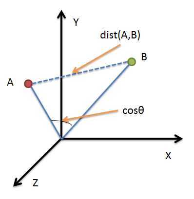
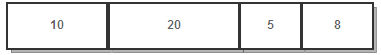

# 简介
K-means的目标是要将数据点划分为k个cluster，找到这每个cluster的中心未知，使最小化函数
$$
\arg min\sum_{i=1}^k\sum_{x_{j}\in S_{i}}||x_{j} - \mu_{i}||^2
$$

其中$\mu_{i}$就是第i个cluster的中心。上式就是要求每个数据点要与它们所属cluster的中心尽量接近。

基本思想使初始随机给定K个簇中心，按照最邻近原则把待分类样本点分到各个簇。然后按平均法重新计算各个簇的质心。一直迭代，直到簇心得移动距离小于某个给定的值。

# 1、算法思想
设定K取2，即设定有两个类别，现在有一个未聚类的初始点集：
1. 随机选取两个点作为聚类中心；
2. 计算每个点到聚类中心的距离，并聚类到离该点最近的聚类中去；
3. 计算每个聚类中所有点的坐标平均值，并将这个平均值作为新的聚类中心；
4. 重复2，计算每个点到聚类中心的距离，并聚类到离该点最近的聚类中去；
5. 重复3，计算每个聚类中的所有点的坐标平均值，并将这个平均值作为新的聚类中心。

KMEANS结束条件：直到类中心不再进行大范围移动或者聚类迭代次数达到要求为止。

# 2、距离公式
## 2.1、欧氏距离
欧几里德距离，这个距离就是平时我们理解的距离，如果是两个平面上的点，也就是（X1，Y1），和（X2，Y2），那这俩点距离就是
$$
d = \sqrt{(x_{1} - x_{2})^2 + (y_{1} - y_{2})^2}
$$

该公式可以拓展到高纬度的距离计算（后面一样的计算模式）。

可以看出，欧几里德距离真的是数学加减乘除算出来的距离，因此这就是只能用于**连续型变量**的原因。

## 2.2、余弦相似度
余弦相似度，余弦相似度用向量空间中两个向量**夹角的余弦值**作为衡量两个个体间差异的大小。

相比距离度量，余弦相似度更加注重两个向量在**方向上**的差异，而非距离或长度上。

下图表示余弦相似度的余弦是哪个角的余弦，A，B是三维空间中的两个向量，这两个点与三维空间原点连线形成的角，如果角度越小，说明这两个向量在方向上越接近，在聚类时就归成一类：



从上图可以看出：

* 欧氏距离衡量的是空间各点的绝对距离，跟各个点所在的**位置坐标**直接相关；而余弦距离衡量的是空间向量的夹角，更加体现在**方向上**的差异，而不是位置。如果保持A点位置不变，B点朝原方向远离坐标轴原点，那么这个时候余弦距离是保持不变的（因为夹角没有发生变化），而A、B两点的距离显然在发生改变，这就是欧氏距离和余弦距离之间的不同之处。
* 欧氏距离和余弦距离各自有不同的计算方式和衡量特征，因此它们适用于不同的数据分析模型：
  * 欧氏距离能够体现个体数值特征的绝对差异，所以更多的用于需要从维度的数值大小中体现差异的分析，如使用用户行为指标分析用户价值的相似度或差异。
  * 余弦距离更多的是从方向上区分差异，而对数值不敏感，更多的用于使用用户对内容评分来区分兴趣的相似度和差异，同时修正了用户间可能存在的度量标准不统一的问题（因为余弦距离对绝对数值不敏感）。

# 3、K的取值
没有确定的算法可循。

分几类主要取决于个人的经验与感觉，通常的做法是多尝试几个K值，看分成几类的结果更好解释，更符合分析目的等。或者可以把各种K值算出的SSE做比较，取最小的SSE的K值。

如果有业务专家可以进行分析，或者可以使用层次聚类先进行比较粗粒度的聚类。

# 4、K的初始位置
k-means++算法选择初始位置的基本思想就是：初始的聚类中心之间的相互距离要尽可能的远。
1. 从输入的数据点集合中随机选择一个点作为第一个聚类中心
2. 对于数据集中的每一个点x，计算它与最近聚类中心(指已选择的聚类中心)的距离D(x)
3. 选择一个新的数据点作为新的聚类中心，选择的原则是：D(x)较大的点，被选取作为聚类中心的概率较大
4. 重复2和3直到k个聚类中心被选出来
5. 利用这k个初始的聚类中心来运行标准的k-means算法

从上面的算法描述上可以看到，算法的关键是第3步，如何将D(x)反映到点被选择的概率上，一种算法如下：
1. 先从我们的数据库随机挑个随机点当“种子点”
2. 对于每个点，我们都计算其和最近的一个“种子点”的距离D(x)并保存在一个数组里，然后把这些距离加起来得到Sum(D(x))。
3. 然后，再取一个随机值，用权重的方式来取计算下一个“种子点”。这个算法的实现是，先取一个能落在Sum(D(x))中的随机值Random，然后用Random -= D(x)，直到其<=0，此时的点就是下一个“种子点”。
4. 重复2和3直到k个聚类中心被选出来
5. 利用这k个初始的聚类中心来运行标准的k-means算法

可以看到算法的第三步选取新中心的方法，这样就能保证距离D(x)较大的点，会被选出来作为聚类中心了。至于为什么原因比较简单，如下图所示：  

假设A、B、C、D的D(x)如上图所示，当算法取值Sum(D(x))*random时，该值会以较大的概率落入D(x)较大的区间内，所以对应的点会以较大的概率被选中作为新的聚类中心。



# 5、Spark MLib实现
训练数据集如下：
```
0 1:1 2:2 3:6 4:0 5:2 6:3 7:1 8:1 9:0 10:0 11:3
1 1:1 2:3 3:0 4:1 5:3 6:0 7:0 8:2 9:0 10:0 11:1
2 1:1 2:4 3:1 4:0 5:0 6:4 7:9 8:0 9:1 10:2 11:0
3 1:2 2:1 3:0 4:3 5:0 6:0 7:5 8:0 9:2 10:3 11:9
4 1:3 2:1 3:1 4:9 5:3 6:0 7:2 8:0 9:0 10:1 11:3
5 1:4 2:2 3:0 4:3 5:4 6:5 7:1 8:1 9:1 10:4 11:0
6 1:2 2:1 3:0 4:3 5:0 6:0 7:5 8:0 9:2 10:2 11:9
7 1:1 2:1 3:1 4:9 5:2 6:1 7:2 8:0 9:0 10:1 11:3
8 1:4 2:4 3:0 4:3 5:4 6:2 7:1 8:3 9:0 10:0 11:0
9 1:2 2:8 3:2 4:0 5:3 6:0 7:2 8:0 9:2 10:7 11:2
10 1:1 2:1 3:1 4:9 5:0 6:2 7:2 8:0 9:0 10:3 11:3
11 1:4 2:1 3:0 4:0 5:4 6:5 7:1 8:3 9:0 10:1 11:0
```

```java
package com.zhaoyi;

import org.apache.spark.SparkConf;
import org.apache.spark.ml.clustering.LDA;
import org.apache.spark.ml.clustering.LDAModel;
import org.apache.spark.sql.Dataset;
import org.apache.spark.sql.Row;
import org.apache.spark.sql.SparkSession;

public class LDATest {
    public static void main(String[] args) {
        SparkConf sparkConf = new SparkConf().setMaster("local[*]")
                .set("spark.testing.memory","4120000000")
                .setAppName("Test");
        SparkSession spark = SparkSession.builder().config(sparkConf).getOrCreate();
        // Loads data.
        Dataset<Row> dataset = spark.read().format("libsvm")
                .load("sample_lda_libsvm_data.txt");

        // 训练LDA模型
        // 聚集树设置为10个，迭代次数为10次
        LDA lda = new LDA().setK(10).setMaxIter(10);
        LDAModel model = lda.fit(dataset);

        double ll = model.logLikelihood(dataset);
        double lp = model.logPerplexity(dataset);
        System.out.println("The lower bound on the log likelihood of the entire corpus: " + ll);
        System.out.println("The upper bound on perplexity: " + lp);

        // Describe topics.
        Dataset<Row> topics = model.describeTopics(3);
        System.out.println("The topics described by their top-weighted terms:");
        topics.show(false);

        // Shows the result.
        Dataset<Row> transformed = model.transform(dataset);
        transformed.show(false);
    }
}

```

输出如下：
```
The lower bound on the log likelihood of the entire corpus: -788.3752801566864
The upper bound on perplexity: 3.0322126159872553
The topics described by their top-weighted terms:
+-----+-----------+---------------------------------------------------------------+
|topic|termIndices|termWeights                                                    |
+-----+-----------+---------------------------------------------------------------+
|0    |[2, 5, 7]  |[0.10596582700827585, 0.10560579109860191, 0.10421656683012902]|
|1    |[1, 6, 2]  |[0.10177934362911985, 0.09812186737848058, 0.09628916613024666]|
|2    |[1, 9, 4]  |[0.10587329435318685, 0.09746396510036567, 0.09650800754627996]|
|3    |[5, 4, 0]  |[0.16140487918106045, 0.13157416711460962, 0.12125555977641359]|
|4    |[9, 6, 4]  |[0.10444172332018084, 0.1040635944390557, 0.10097465247362353] |
|5    |[10, 6, 3] |[0.18500622562463034, 0.16489028958649327, 0.15527004414864845]|
|6    |[3, 7, 4]  |[0.11621765255437844, 0.0989645753475578, 0.09790795515141672] |
|7    |[4, 0, 2]  |[0.10844113271172434, 0.10326267091975808, 0.10028860890038724]|
|8    |[0, 7, 8]  |[0.10995536322709686, 0.09914310583037018, 0.09806206271783646]|
|9    |[9, 6, 8]  |[0.1009940937221744, 0.10007205188894182, 0.0976478953418414]  |
+-----+-----------+---------------------------------------------------------------+

+-----+---------------------------------------------------------------+-----------------------------------------------------------------------------------------------------------------------------------------------------------------------------------------------------------------------+
|label|features                                                       |topicDistribution                                                                                                                                                                                                      |
+-----+---------------------------------------------------------------+-----------------------------------------------------------------------------------------------------------------------------------------------------------------------------------------------------------------------+
|0.0  |(11,[0,1,2,4,5,6,7,10],[1.0,2.0,6.0,2.0,3.0,1.0,1.0,3.0])      |[0.5723426763635155,0.004718483130830683,0.004718450742236422,0.004763541870710917,0.004718430333333529,0.38986459916517646,0.004718463139056288,0.004718515172805939,0.004718405203642835,0.004718434878691383]       |
|1.0  |(11,[0,1,3,4,7,10],[1.0,3.0,1.0,3.0,2.0,1.0])                  |[0.007873891622472356,0.007873839486280614,0.007873845809872567,0.6112976067837596,0.007873729244989513,0.32571162041105534,0.007873909537675118,0.007873880011496946,0.007873880111429003,0.007873796980969152]       |
|2.0  |(11,[0,1,2,5,6,8,9],[1.0,4.0,1.0,4.0,9.0,1.0,2.0])             |[0.0041018874252990245,0.004101904584785285,0.0041018534773541795,0.004141203698327917,0.004101848599245701,0.9630439540203343,0.004101845017373267,0.0041018406269066774,0.0041017935181023426,0.004101869032271354]  |
|3.0  |(11,[0,1,3,6,8,9,10],[2.0,1.0,3.0,5.0,2.0,3.0,9.0])            |[0.003627676735432619,0.003627703117211277,0.003627691621698036,0.003662194950831967,0.0036277358318877293,0.9673161657381287,0.0036276980008500145,0.0036276902859086655,0.003627727377925284,0.0036277163401256607]  |
|4.0  |(11,[0,1,2,3,4,6,9,10],[3.0,1.0,1.0,9.0,3.0,2.0,1.0,3.0])      |[0.003930548550612836,0.003930563857951308,0.003930555966672738,0.003968076791319329,0.00393060527350085,0.9645873561876829,0.003930607416802987,0.0039305805398848525,0.003930573656859711,0.003930531758712462]      |
|5.0  |(11,[0,1,3,4,5,6,7,8,9],[4.0,2.0,3.0,4.0,5.0,1.0,1.0,1.0,4.0]) |[0.00362784714888672,0.0036278675468024535,0.003627854765597872,0.966582594613702,0.003627887099482383,0.004394503288149649,0.0036278646270114677,0.0036278591992113256,0.0036278660057611476,0.0036278557053951153]   |
|6.0  |(11,[0,1,3,6,8,9,10],[2.0,1.0,3.0,5.0,2.0,2.0,9.0])            |[0.0037729970134766887,0.0037730280698905602,0.0037730133751711407,0.003808895882870158,0.0037730554797685396,0.9660068823034165,0.003773025420409463,0.0037730123854933535,0.003773051444545962,0.0037730386249576003]|
|7.0  |(11,[0,1,2,3,4,5,6,9,10],[1.0,1.0,1.0,9.0,2.0,1.0,2.0,1.0,3.0])|[0.00428851266024724,0.004288514196285454,0.004288506419552216,0.004329655752728948,0.004288534819196415,0.9613622256766292,0.004288566820732985,0.004288505770646994,0.004288492646001776,0.004288485237978912]       |
|8.0  |(11,[0,1,3,4,5,6,7],[4.0,4.0,3.0,4.0,2.0,1.0,3.0])             |[0.0042886326167820045,0.004288676612403013,0.004288645169221629,0.9604945888404591,0.004288629186766056,0.0051962179105533,0.004288687085711846,0.004288638406021238,0.004288649883974505,0.00428863428810715]        |
|9.0  |(11,[0,1,2,4,6,8,9,10],[2.0,8.0,2.0,3.0,2.0,2.0,7.0,2.0])      |[0.0032520801131182726,0.003252090913880627,0.003252095276531188,0.0032830728466451326,0.0032521039198444165,0.9707002569773919,0.0032520452126818056,0.0032520970965730675,0.003252075280525668,0.0032520823628079043]|
|10.0 |(11,[0,1,2,3,5,6,9,10],[1.0,1.0,1.0,9.0,2.0,2.0,3.0,3.0])      |[0.004101763372052216,0.004101757774104518,0.004101742171192773,0.004141311776179531,0.0041017558460981615,0.9630446922311932,0.00410178446967213,0.004101722371482223,0.004101724300807365,0.0041017456872178126]     |
|11.0 |(11,[0,1,4,5,6,7,9],[4.0,1.0,4.0,5.0,1.0,3.0,1.0])             |[0.004718255017533086,0.004718238470596867,0.004718199315403049,0.956541060299016,0.004718226628489562,0.005713039887647934,0.004718240040481532,0.004718274918897788,0.004718253036719102,0.004718212385215053]       |
+-----+---------------------------------------------------------------+-----------------------------------------------------------------------------------------------------------------------------------------------------------------------------------------------------------------------+
```