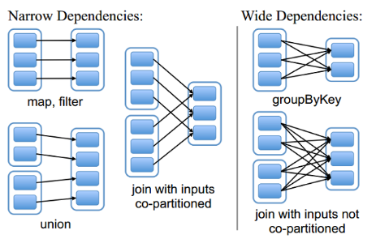
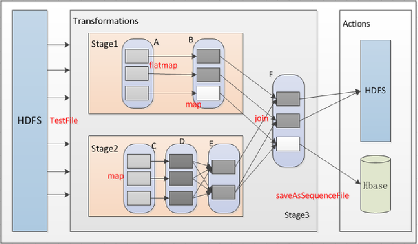
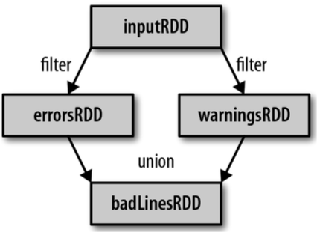

# 简介
RDD和它依赖的父RDD（s）的关系有两种不同的类型，即窄依赖（narrow dependency）和宽依赖（wide dependency）。



# 1、窄依赖
窄依赖指的是每一个父RDD的Partition最多被子RDD的一个Partition使用。如简介的图中的map，filter等操作。
> 窄依赖我们形象的比喻为独生子女。

# 2、宽依赖
宽依赖指的是多个子RDD的Partition会依赖同一个父RDD的Partition，会引起shuffle（网络混洗）。如图中右半部分的groupBy等操作。

> 总结：宽依赖我们形象的比喻多子女家庭。

# 3、DAG有向图
可以看到，RDD的操作过程也是一个行程类似于家族谱系的有向无环图。

DAG(Directed Acyclic Graph)叫做有向无环图，原始的RDD通过一系列的转换就就形成了DAG，根据RDD之间的依赖关系的不同将DAG划分成不同的Stage，对于窄依赖，partition的转换处理在Stage中完成计算。

对于宽依赖，由于有Shuffle的存在，只能在parent RDD处理完成后，才能开始接下来的计算，因此宽依赖是划分Stage的依据。

接下来我们来看看一个比较普遍的过程。



要观察详细的信息，可以访问sparkUI地址查看，进入任务处理的详细日志页面stage.
```
http://192.168.102.131:4000/
```
点击首页的已完成的任务(APP ID)，然后进入stage选项卡即可查看。

> 联系有向无环图和依赖的分类，我们很明显可以看到，窄依赖的父节点出度都为1，而宽依赖的父节点的出度是大于1的。

# 4、Lineage
RDD只支持粗粒度转换，即在大量记录上执行的单个操作。将创建RDD的一系列Lineage（即血统）记录下来，以便恢复丢失的分区。RDD的Lineage会记录RDD的元数据信息和转换行为，当该RDD的部分分区数据丢失时，它可以根据这些信息来重新运算和恢复丢失的数据分区。



# 总结
1. RDD的依赖分为宽依赖和窄依赖；
2. 窄依赖是说父RDD的每一个分区最多被一个子RDD的分区应用，也就说，他的出度为1；
3. 宽依赖是说父RDD的每一个分区被多个子RDD的分区来应用，也就是他的出度大于等于2；
4. 应用在整个过程中，RDD之间形成的关系，叫做血统关系。
5. 应用在执行过程中，是分为多个stage来进行的，划分stage的依据就是判断是否存在宽依赖。从Action往前去推断整个stage的划分。
6. RDD在没有持久化的时候默认是不保存的，如果需要就要根据血统来重新推演。
