# 简介
该工具是邮件分析工具的零散功能集合，用于一些比较紧迫的分析任务，后续会按需集成到标准软件包中。

# 1、安装
1、解压文件

2、进行解压目录，从windows Shell进入。

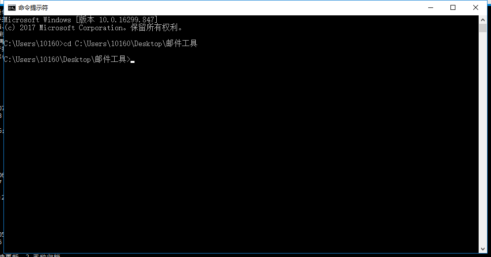

在小爱窗口输入cmd会弹出该界面。同时，如果解压的目录位于C盘下，您可以直接使用命令 `cd 目录`前往目录，如果在另外的盘，例如D盘，则可以先直接切换盘符，输入目录`D:`，然后在使用`cd 目录`即可。


3、进行命令行界面，执行
```
java -jar etool-0.0.1-SNAPSHOT.jar
```
等待日志输出结束，直到显示：
```
...
2019-03-22 17:23:16.462  INFO 18044 --- [           main] o.s.b.w.embedded.tomcat.TomcatWebServer  : Tomcat started on port(s): 9898 (http) with context path 
...
2019-03-22 17:23:29.941  INFO 18044 --- [nio-9898-exec-1] o.s.web.servlet.DispatcherServlet        : Completed initialization in 15 ms
```

> 如果没有启动成功，查看是否端口占用，这时候使用命令`java -jar etool-0.0.1-SNAPSHOT.jar --server-port=你想要的端口` 来重新执行命令。不过，之后的访问地址请使用这里修改的端口号，例如修改为8086，那么访问地址就是127.0.0.1:8086。

保持该窗口不要关闭，现在您的电脑已经启动了一个web服务。

4、访问127.0.0.1:8085端口，即可来到服务页面。


# 2、功能
## 2.1、简单工具
简单工具都位于顶部菜单栏中的 **邮箱工具** 中。
### 2.1.1、提货单号提取
1、点击 **邮箱工具** 菜单栏的第一个子菜单 **提单号提取** 选项卡，来到配置页面。

2、输入配置信息，具体如下图所示：

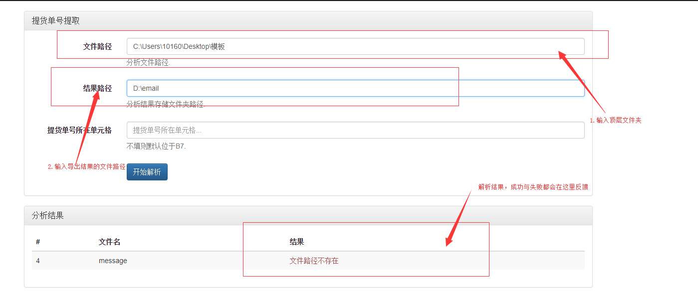

该配置指示所有文件的顶层目录为`C:\Users\10160\Desktop\模板`下，没有配置结果文件的路径；您可以选择不填写，若该路径不填写，则会在当前目录，即您执行命令出生成最终文件delivery_number.xls。


最后一个配置无需填写，因为我们已经确定目标列为位于B7了。如果以后有新的位置，可以在此处进行配置。

7、最终，会在配置的`D:\`下生成结果文件，名为`delivery_number.xls`，示例输出如下：

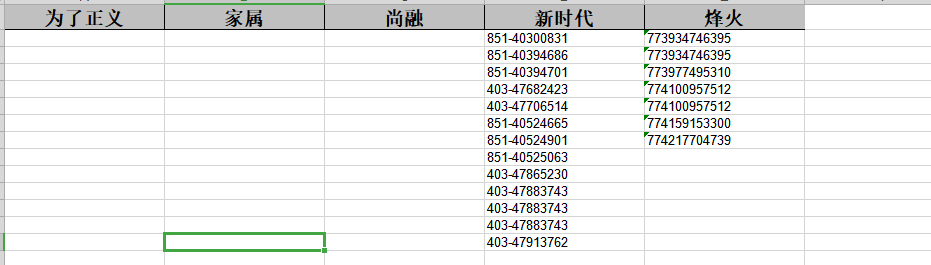


> 注意多次执行的时候请不要占用·`delivery_number.xls`*文件（占用是指打开该文件没有关闭）。

### 2.1.2、邮箱文件分组
该功能可用于解析邮件信息，将邮件中出现过的所有地址提取出来，并生成一个个文件夹，内部存放相关联的邮箱源文件。

1、点击 **邮箱工具** 菜单栏的第二个子菜单 **邮箱文件分组** 选项卡，来到配置页面。

2、输入配置信息，具体如下图所示：

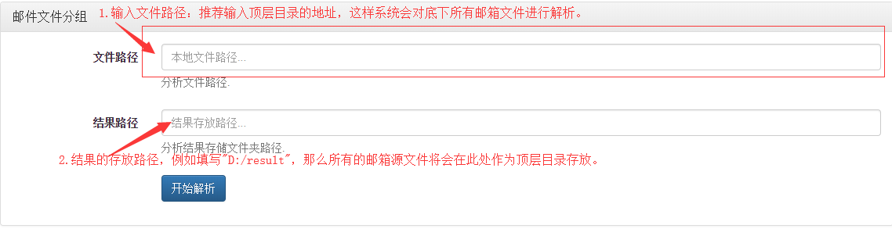

3、填写相关配置之后，点击开始分析按钮。如果邮件数量过大，请稍等片刻，您可以通过控制台查看解析的日志信息。

4、解析完毕之后，会在配置下方的表格区打印出分析的结果，从分析结果中可以看到解析完毕之后的相关信息，以及目标邮件存放在何处。例如，下图是配置了分析目标地址为`D:/r2`之后解析的一个结果案例。

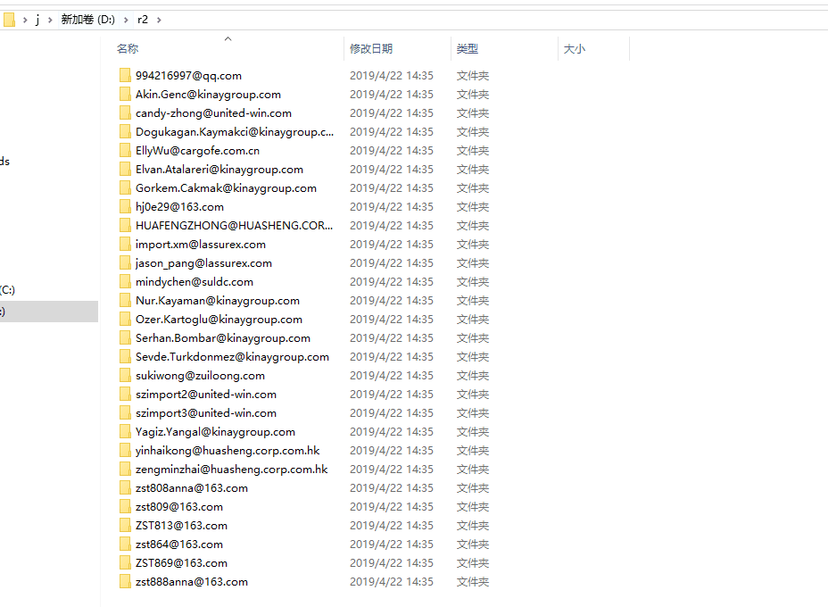

### 2.1.3、提货单号文件分组
该功能可用于将目标路径中的所有文件名中含有提单号的文件提取出来，每个提单号可能对应了多个文件，需要按照提单号分类，每个提单号一个文件夹。
提单号格式（*为数字）：
```
***-********
***-**** ****
***-****-****
***********
```
同时会在目标路径下生成名为`处理结果报表.xls`的文件，统计分析出的提货单号以及相对应的出现次数（也可以理解为对应的文件数）。

1、点击 **邮箱工具** 菜单栏的第三个子菜单 **提货单号文件分组** 选项卡，来到配置页面。

2、输入配置信息，具体如下图所示：

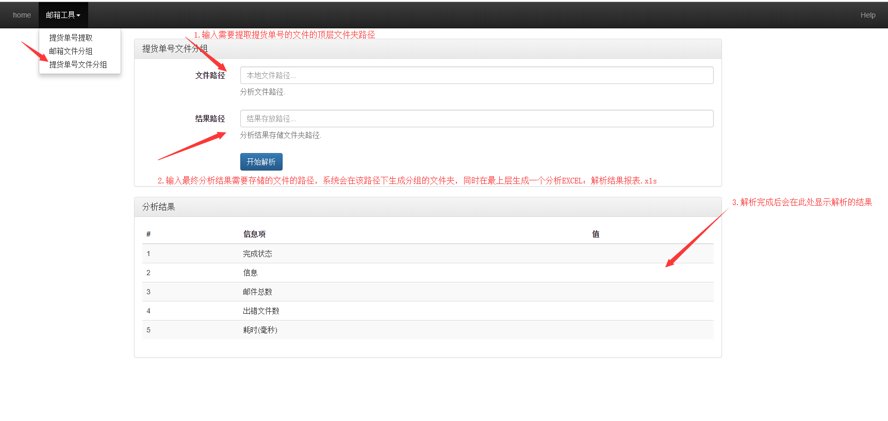

3、填写相关配置之后，点击开始分析按钮。如果文件数量过大，请稍等片刻，您可以通过控制台查看解析的日志信息。

4、解析完毕之后，会在配置下方的表格区打印出分析的结果，从分析结果中可以看到解析完毕之后的相关信息，以及目标文件存放在何处。

例如，下图是配置了分析目标地址为`C:\Users\10160\Desktop\tttt`之后解析的一个结果案例。

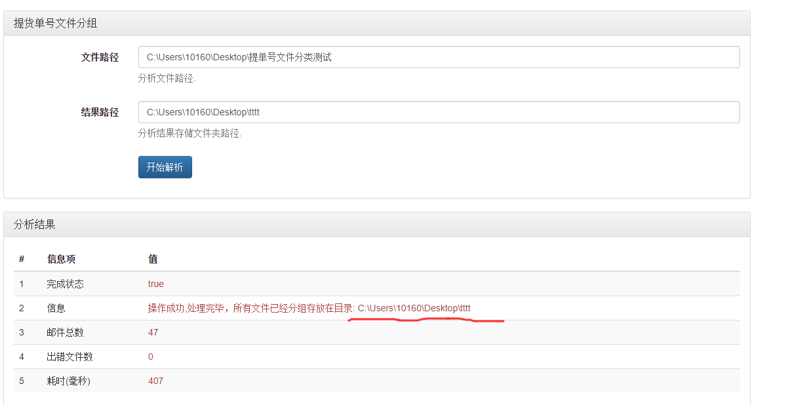

5.最后，在分析结果的路径下还有一个报表文件`处理结果报表.xls`，您可以从里面得到提货单号的报表以及其出现的次数（文件数）。

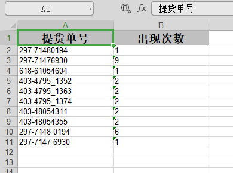

### 2.1.4、附件提取
该功能可用于将目标路径中邮件中指定类型的附件提取到目标目录。

1、点击 **邮箱工具** 菜单栏的第四个子菜单 **附件提取** 选项卡，来到配置页面。

2、输入配置信息，具体如下图所示：

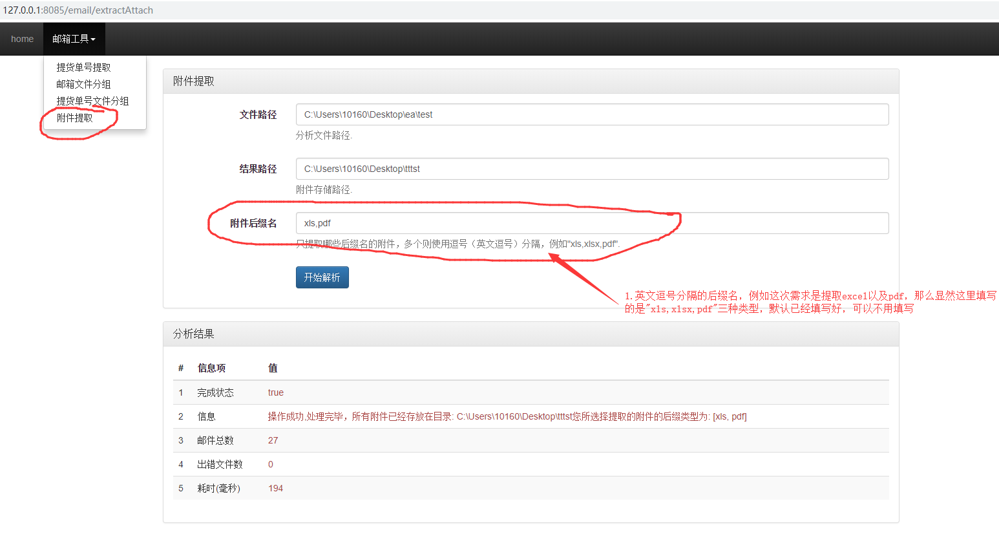

3、填写相关配置之后，点击开始分析按钮。如果文件数量过大，请稍等片刻，您可以通过控制台查看解析的日志信息。

4、解析完毕之后，会在配置下方的表格区打印出分析的结果，从分析结果中可以看到解析完毕之后的相关信息，以及目标文件存放在何处。

例如，下图是配置了分析目标地址为`C:\Users\10160\Desktop\tttst`、附件类型为`'xls,pdf'`之后解析的一个结果案例。

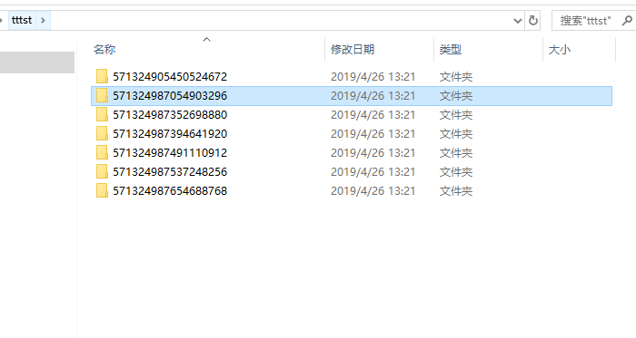

最外层是每个包含该类型附件的邮件的ID（为了避免重名附件出现才限制一层文件夹）。里面一层就是满足需求的附件：

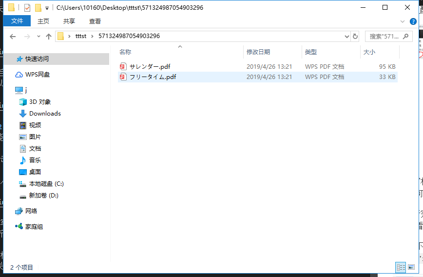

如果要联和功能四作分析，那么只需将本次的输出路径作为`2.1.3、提货单号文件分组`的输入路径即可。

## 2.2、Excel操作
### 2.2.1、清单合并
该功能可用于将目录下的所有Excel中sheet名称为“清单的表格合并为一个”，最终存储在结果目录下一个名为“总清单.xlsx”的文件中。

1、点击 **Excel处理工具** 菜单栏的第一个子菜单 **清单合并** 选项卡，来到配置页面。

2、输入配置信息，具体如下图所示：

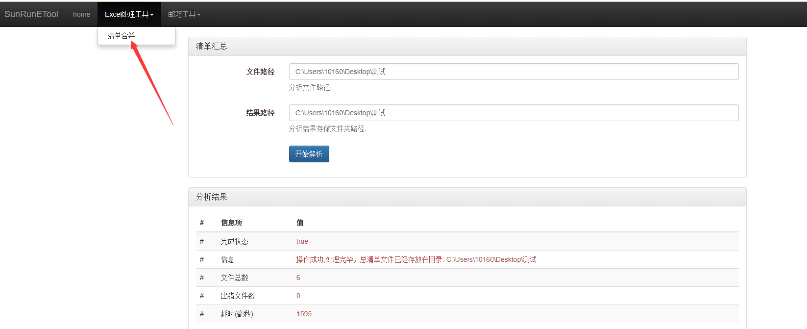

3、填写相关配置之后，点击开始分析按钮。如果文件数量过大，请稍等片刻，您可以通过控制台查看解析的日志信息。

4、解析完毕之后，会在配置下方的表格区打印出分析的结果，从分析结果中可以看到解析完毕之后的相关信息，以及目标文件存放在何处。例如下图是分析路径和结果路径都在`C:\Users\10160\Desktop\测试`下的结果截图：
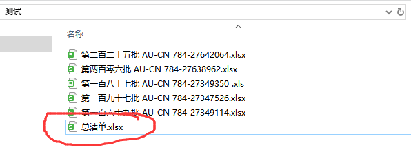


# 版本
**ver.1.0**

* 基本的功能。

**ver.1.1**
* 对重复的单号进行去重处理；
* 只提取单号信息，不提取B7单元格信息；
* 过滤错误的提取信息；

**ver.1.2**
* 新增功能：邮箱文件分组

**ver.1.3**
* 新增功能：提货单号文件分组

**ver.1.4**
* 新增功能：附件提取批量邮件中的指定类型的附件；

**ver.1.5**
* 修复功能：提货单号文件分组新增12位连续数字的识别模式；
* 新增功能：提货单号提取过程中对信息相同的货单文件的去重；

**ver.1.6**
* 新增功能：Excel工具模块，清单合并；