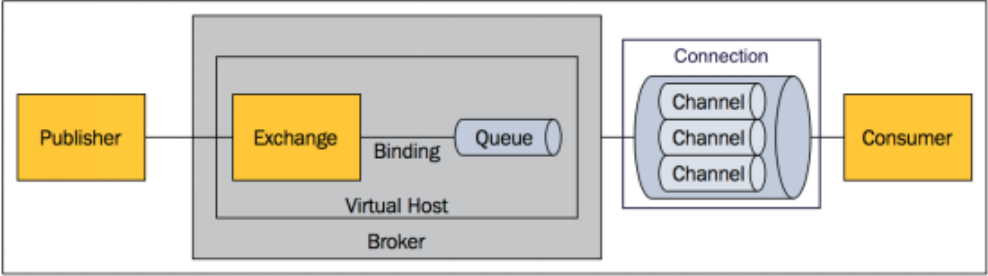
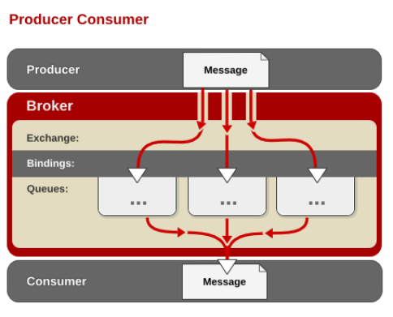
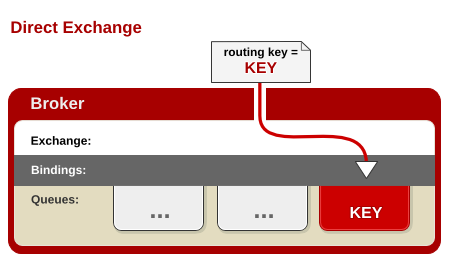
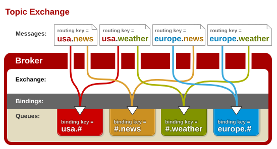
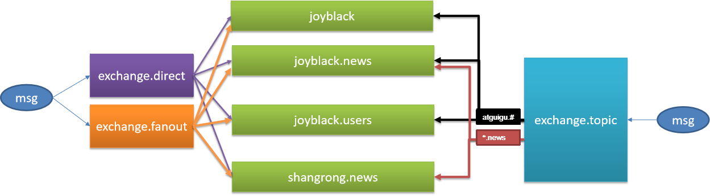

# 消息服务简介
1. 大多应用中，可通过消息服务中间件来提升系统异步通信、扩展解耦能力
具体而言，主要的应用模式有：
* 异步处理
* 应用解耦
* 流量削峰（例如：京东秒杀）
  
2. 消息服务中两个重要概念
* 消息代理（message broker）
* 目的地（destination）

当消息发送者发送消息以后，将由消息代理接管，消息代理保证消息传递到指定目的地。

3. 消息通信机制

消息队列主要有两种形式的目的地
* 队列（queue）：点对点消息通信（point-to-point）
* 主题（topic）：发布（publish）/订阅（subscribe）消息通信
  
（1）点对点式
- 消息发送者发送消息，消息代理将其放入一个队列中，消息接收者从队列中获取消息内容，消息读取后被移出队列。也就是说，消息一旦被消费，那么立马删除。
- 消息只有唯一的发送者和接受者，但并不是说只能有一个接收者

（2）发布订阅式
- 发送者（发布者）发送消息到主题，多个接收者（订阅者）监听（订阅）这个主题，那么就会在消息到达时同时收到消息。

4. 消息服务规范
* JMS（Java Message Service）JAVA消息服务：
    - 基于JVM消息代理的规范。ActiveMQ、HornetMQ是JMS实现
* AMQP（Advanced Message Queuing Protocol）
    * 高级消息队列协议，也是一个消息代理的规范，兼容JMS
    * RabbitMQ是AMQP的实现（高级消息队列）

||||
|-|-|-|
||JMS |AMQP|
|定义| Java api |网络线级协议跨语言 |否 |
|是跨平台 |否 |是|
|Model| 提供两种消息模型：（1）Peer-2-Peer （2）Pub/sub |提供了五种消息模型：（1）direct exchange （2）fanout exchange （3）topic change （4）headers exchange （5）system exchange本质来讲，后四种和JMS的pub/sub模型没有太大差别，仅是在路由机制上做了更详细的划分；|
|支持消息类型 |多种消息类型：TextMessage MapMessage BytesMessage StreamMessage ObjectMessage Message（只有消息头和属性）|byte[]当实际应用时，有复杂的消息，可以将消息序列化后发送。|
|综合评价 |JMS 定义了JAVA API层面的标准；在java体系中，多个client均可以通过JMS进行交互，不需要应用修改代码，但是其对跨平台的支持较差；|AMQP定义了wire-level层的协议标准；天然具有跨平台、跨语言特|

5. 不管我们使用哪种通信规范，Spring底层都是支持的：
   * spring-jms提供了对JMS的支持
   * spring-rabbit提供了对AMQP的支持
   * 需要ConnectionFactory的实现来连接消息代理
   * 提供JmsTemplate、RabbitTemplate来发送消息
   * @JmsListener（JMS）、@RabbitListener（AMQP）注解在方法上监听消息代理发布的消息
   * @EnableJms、@EnableRabbit开启支持

6. Spring Boot也提供了对应的自动配置类
   * JmsAutoConfiguration
   * RabbitAutoConfiguration

# 2 RabbitMQ
## 简介
RabbitMQ是一个由erlang开发的AMQP(Advanved Message Queue Protocol)的开源实现。
## 核心概念
1. Message
消息，消息是不具名的，它由消息头和消息体组成。消息体是不透明的，而消息头则由一系列的可选属性组
成，这些属性包括routing-key（路由键：消息发给谁？）、priority（相对于其他消息的优先权）、delivery-mode（指出该消息可能需要持久性存储）等。
2. Publisher 消息的生产者，也是一个向交换器发布消息的客户端应用程序。
3. Exchange 交换器，用来接收生产者发送的消息并将这些消息路由给服务器中的队列（通过路由键）。Exchange有4种类型，不同类型的Exchange转发消息的策略有所区别。
   * direct(默认)
   * fanout
   * topic
   * headers
4. Queue 消息队列，用来保存消息直到发送给消费者。它是消息的容器，也是消息的终点。一个消息可投入一个或多个队列。消息一直在队列里面，等待消费者连接到这个队列将其取走。
5. Binding 绑定，用于消息队列和交换器之间的关联。一个绑定就是基于路由键将交换器和消息队列连接起来的路由规则，所以可以将交换器理解成一个由绑定构成的路由表。Exchange 和Queue的绑定可以是多对多的关系。
6. Connection 网络连接，比如一个TCP连接。
7. Channel 信道，多路复用连接中的一条独立的双向数据流通道。信道是建立在真实的TCP连接内的虚拟连接，AMQP命令都是通过信道发出去的，不管是发布消息、订阅队列还是接收消息，这些动作都是通过信道完成。因为对于操作系统来说建立和销毁TCP都是非常昂贵的开销，所以引入了信道的概念，以复用一条TCP连接。
8. Consumer
消息的消费者，表示一个从消息队列中取得消息的客户端应用程序。
9. Virtual Host
虚拟主机，表示一批交换器、消息队列和相关对象。虚拟主机是共享相同的身份认证和加密环境的独立服务器域。每个vhost本质上就是一个 mini 版的 RabbitMQ服务器，拥有自己的队列、交换器、绑定和权限机制。vhost是AMQP概念的基础，必须在连接时指定，RabbitMQ默认的vhost是`/`。
10. Broker
表示消息队列服务器实体。

以上核心的关系图可以如下所示：


## 运行机制
1. AMQP中的消息路由
- AMQP中消息的路由过程和Java开发者熟悉的JMS存在一些差别，AMQP中增加了Exchange和Binding的角色。生产者把消息发布到Exchange上，消息最终到达队列并被消费者接收，而Binding决定交换器的消息应该发送到那个队列。

- Exchange分发消息时根据类型的不同分发策略有区别目前共四种类型：direct、fanout、topic、headers。headers匹配AMQP消息的header而不是路由键，headers交换器和direct交换器完全一致，但性能差很多，目前几乎用不到了，所以直接看另外三种类型：
    * direct 消息中的路由键（routing key）如果和 Binding 中的 binding key 一致， 交换器就将消息发到对应的队列中。路由键与队列名完全匹配，如果一个队列绑定到交换机要求路由键为“dog”，则只转发 routing key 标记为“dog”的消息，不会转发“dog.puppy”，也不会转发“dog.guard”等等。它是完全匹配、单播的模式。—— `有选择性的单播`。
    

    * fanout(分列) 每个发到fanout类型交换器的消息都会分到所有绑定的队列上去。fanout交换器不处理路由键，只是简单的将队列绑定到交换器上，每个发送到交换器的消息都会被转发到与该交换器绑定的所有队列上。很像子网广播，每台子网内的主机都获得了一份复制的消息。fanout类型转发消息是最快的。—— `广播模式`。
    

    * topic topic交换器通过模式匹配分配消息的路由键属性，将路由键和某个模式进行匹配，此时队列需要绑定到一个模式上。它将路由键和绑定键的字符串切分成单词，这些单词之间用点隔开。它同样也会识别两个通配符：符号“#”和符号“*”。#匹配0个或多个单词，*匹配一个单词。—— `有选择性的选择广播`。
    


# RabbitMQ安装与简单测试
我们前面的章节已经讲过关于RabbitMQ的docker安装方法。
``` shell
# docker run -d --hostname my-rabbit --name rabbit -p 15672:15672 -p 5672:5672 rabbitmq:3-management
```
其中5678是RabbitMQ服务的服务端口，而15672是web管理网站的服务端口。

> 有management标志的docker镜像有web管理界面，推荐安装这种版本的。

> 登录ipaddress:15672，由于这里没有指定登录账户和密码，则使用默认的guest:guest。

## 基本环境搭建
接下来我们将根据下图的模式搭建一个基本的测试环境：


1. 创建交换器
进入管理界面的交换器(exchanges)管理项，添加图示3种类型的交换器（header类型的已经不常用了，我们只测试其他3种常用类型），名称都为:`exchange.交换器类型`
*  direct
*  fanout
*  topic
> 注意在Type选项卡选择对应的类型以及其他选项默认即可。（例如持久化）

2. 创建消息队列

进入管理界面的消息队列(Queues)管理项，添加图示的4个消息队列
* joyblack
* joyblack.news
* joyblack.users
* shangrong.news

> 名称对应填写，其他的保持默认设置。

> 饮水思源。原教程这里的命名是带有教程作者的自己的相关信息的，这里也帮忙广告一下，joyblack是我的英文名，教程的原名是guigu，是教程网站尚硅谷的拼音；shangrong是我目前所在的公司名尚融，原名是guilixueyuan，即谷粒学院，这个我不太清楚，应该也是作者的教育机构的相关学院名称。

> 英文学习 `idle`(空闲的; 无意义的; 懒惰的; 无根据的;) 

3. 给交换器绑定队列

接下来我们为我们创建的交换器绑定刚刚创建的队列，其规则可以参考我们的参考图（其实是全绑定）。

点击exchanges选项卡，分别选择我们创建的每一个交换器`exchange.xxx`，进入详细配置界面，点击详细管理界面中的`bindings`，添加绑定：

(1) exchange.direct
*  选择 to queue: 每一个queue的名字，例如joyblack;
*  Routing key：和绑定的queue的名字保持一致，例如如果上面填写的队列是joyblack，此处就填写joyblack;
*  Arguments 不填，保持默认

(2) exchange.fanout
*  选择 to queue: 每一个queue的名字，例如joyblack;
*  Routing key：和绑定的queue的名字保持一致，例如如果上面填写的队列是joyblack，此处就填写joyblack;聪明的你还记得fanout的特点吗？如果记得的话你就会发现这个选项没有填写的必要。
*  Arguments 不填，保持默认

(3) exchange.topic

这里我们需要注意一下，遵循图中所示，`joyblack.#`绑定前3个queue，而`*.news`绑定以news结尾的两个queue，因此我们应该要创建5个绑定规则在exchange.topic交换器中:
*  选择 to queue: 分别前3个以及第二第四个;
*  Routing key：`joyblack.#`或者`*.news`。
*  Arguments 不填，保持默认

> 这五个绑定规则大致是（to queue -> Routing key）`joyblack->joyblack.# joyblack.news->*.news joyblack.news->joyblack.#	 joyblack.users->joyblack.# shangrong.news->*.news`

这样，我们基本的环境就搭建好了，接下来，我们从该管理网站上进行一些简单的消息测试。
## 环境内部消息测试
1. 针对exchange.direct发送消息

我们先对交换器exchange.direct中发送一条消息，点击exchange选项卡，点击exchange.direct进入详细信息页面。

往下拉，点击publish message选项卡，配置发送消息：
* Routing key: joyblack
* payload: this is message 1.
* 其他配置内容保持默认。

点击publish message按钮发送消息。

前面提到，exchange.direct类型的交换器只会进行精确匹配，也就是点对点的单播模式。因此我们可以确定，只有绑定规则中Routing key为joyblack（我们刚刚发送消息时指定的Rongting key）匹配规则，绑定规则中指定的消息队列(joyblack)会收到此消息，其他的绑定规则中对应的queue不符合此规则，也就不会收到此消息。

接下里我们来验证结果。点击Queues->joyblack->Get Message->点击GetMessage按钮，就可以查看到我们刚刚发送的消息`"this is message 1"`，同时留意一下其他的queue，他们是没有接收到任何消息的，点击get message会得到提示`"Queue is empty"`。

2. 针对exchange.fanout发送消息
进入exchange.fanout详细界面，发送消息的流程和exchange.direct一模一样，不过无需指定Routing key（如果你在exchange.direct中这样做会收到警告`"Message published, but not routed. "`，因为direct必须指定一个Routing key以进行精确匹配，不然没有任何路由规则可以选择），发送的消息为`"this is message 2"`。

前面提到，exchange.fanout类型的交换器不进行任何匹配，会将其接收的消息推到自己所绑定的所有消息队列，也就是多对多的广播模式（这也是我们之前提到的，没有必要指定Routing key的原因）。因此我们可以确定，所有的queue应该都会接收到此消息。

点击queue选项卡，可以看到列表中每一个队列都新收到了一条消息。分别进入每一个queue中，可以发现，点击Get Message选项卡中的Get Message按钮均可以收到消息`"this is message 2"`（注意，如果你想接收到更多的消息，在点击Get Message之前设置messages的数量为2，否则只能收到最旧的一条消息）。

3. 针对exchange.topic发送消息
进入exchange.topic详细界面，发送消息的流程和exchange.direct一模一样，指定Routing key为`joyblack.news`（如果不指定会收到警告`"Message published, but not routed. "`，因为topic类型的交换器必须指定一个Routing key以进行模糊匹配，不然没有任何路由规则可以选择），发送的消息为`"this is message 3"`。

前面提到，exchange.topic类型的交换器会进行模糊匹配。因此我们可以确定，只有绑定规则中Routing key匹配模式符合`joyblack.#`和`*.news`的queue都会收到消息，查询我们绑定规则会发现，我们绑定的四个queue都会收到消息。

点击queue选项卡，可以看到列表中每一个队列都新收到了一条消息(total + 1 )。分别进入每一个queue中，可以发现，点击Get Message选项卡中的Get Message按钮均可以收到消息`"this is message 3"`（注意，如果你想接收到更多的消息，在点击Get Message之前设置messages的数量为3）。

为了测试匹配规则，我们可以尝试指定不同的其他的Routing key来测试某些Queue的绑定规则不适用的情况，看看是否符合预期（例如Rongting key指定为joyblack.hello，显然只有前3个队列可以收到消息，进入Queue中发现前3的total + 1）。

通过上面的学习，我们差不多了解了MQ的运行模式。接下来的内容，我们将会在springboot中整合RabbitMQ。

# RabbitMQ整合
## 创建工程
模块选择: web RabbitMQ(位于integrationx选项卡中)，查看pom文件我们可以发现，引入RabbitMQ组件只需引入其场景启动器即可：
##### pom.xml
``` xml
 <dependency>
    <groupId>org.springframework.boot</groupId>
    <artifactId>spring-boot-starter-amqp</artifactId>
</dependency>
```
> 注意，我用的还是spring boot 2.x版本。

进入启动器的内部pom文件，可以查看其引入的一些基本组件信息:
##### amqp.pom
``` xml
<dependencies>
    <dependency>
      <groupId>org.springframework.boot</groupId>
      <artifactId>spring-boot-starter</artifactId>
      <version>2.1.1.RELEASE</version>
      <scope>compile</scope>
    </dependency>
    <dependency>
      <groupId>org.springframework</groupId>
      <artifactId>spring-messaging</artifactId>
      <version>5.1.3.RELEASE</version>
      <scope>compile</scope>
    </dependency>
    <dependency>
      <groupId>org.springframework.amqp</groupId>
      <artifactId>spring-rabbit</artifactId>
      <version>2.1.2.RELEASE</version>
      <scope>compile</scope>
      <exclusions>
        <exclusion>
          <artifactId>http-client</artifactId>
          <groupId>com.rabbitmq</groupId>
        </exclusion>
      </exclusions>
    </dependency>
  </dependencies>
```
## 自动配置原理
直接看RabbitAutoConfiguration，:
##### org.springframework.boot.autoconfigure.amqp.RabbitProperties
``` java
...
@Configuration
@ConditionalOnClass({ RabbitTemplate.class, Channel.class })
@EnableConfigurationProperties(RabbitProperties.class)
@Import(RabbitAnnotationDrivenConfiguration.class)
public class RabbitAutoConfiguration {

	@Configuration
	@ConditionalOnMissingBean(ConnectionFactory.class)
	protected static class RabbitConnectionFactoryCreator {

		@Bean
		public CachingConnectionFactory rabbitConnectionFactory(
				RabbitProperties properties,
				ObjectProvider<ConnectionNameStrategy> connectionNameStrategy)
				throws Exception {
			PropertyMapper map = PropertyMapper.get();
			CachingConnectionFactory factory = new CachingConnectionFactory(
					getRabbitConnectionFactoryBean(properties).getObject());
			map.from(properties::determineAddresses).to(factory::setAddresses);
			map.from(properties::isPublisherConfirms).to(factory::setPublisherConfirms);
			map.from(properties::isPublisherReturns).to(factory::setPublisherReturns);
			RabbitProperties.Cache.Channel channel = properties.getCache().getChannel();
			map.from(channel::getSize).whenNonNull().to(factory::setChannelCacheSize);
			map.from(channel::getCheckoutTimeout).whenNonNull().as(Duration::toMillis)
					.to(factory::setChannelCheckoutTimeout);
			RabbitProperties.Cache.Connection connection = properties.getCache()
					.getConnection();
			map.from(connection::getMode).whenNonNull().to(factory::setCacheMode);
			map.from(connection::getSize).whenNonNull()
					.to(factory::setConnectionCacheSize);
			map.from(connectionNameStrategy::getIfUnique).whenNonNull()
					.to(factory::setConnectionNameStrategy);
			return factory;
		}

		private RabbitConnectionFactoryBean getRabbitConnectionFactoryBean(
				RabbitProperties properties) throws Exception {
			PropertyMapper map = PropertyMapper.get();
			RabbitConnectionFactoryBean factory = new RabbitConnectionFactoryBean();
			map.from(properties::determineHost).whenNonNull().to(factory::setHost);
			map.from(properties::determinePort).to(factory::setPort);
			map.from(properties::determineUsername).whenNonNull()
					.to(factory::setUsername);
			map.from(properties::determinePassword).whenNonNull()
					.to(factory::setPassword);
			map.from(properties::determineVirtualHost).whenNonNull()
					.to(factory::setVirtualHost);
			map.from(properties::getRequestedHeartbeat).whenNonNull()
					.asInt(Duration::getSeconds).to(factory::setRequestedHeartbeat);
			RabbitProperties.Ssl ssl = properties.getSsl();
			if (ssl.isEnabled()) {
				factory.setUseSSL(true);
				map.from(ssl::getAlgorithm).whenNonNull().to(factory::setSslAlgorithm);
				map.from(ssl::getKeyStoreType).to(factory::setKeyStoreType);
				map.from(ssl::getKeyStore).to(factory::setKeyStore);
				map.from(ssl::getKeyStorePassword).to(factory::setKeyStorePassphrase);
				map.from(ssl::getTrustStoreType).to(factory::setTrustStoreType);
				map.from(ssl::getTrustStore).to(factory::setTrustStore);
				map.from(ssl::getTrustStorePassword).to(factory::setTrustStorePassphrase);
				map.from(ssl::isValidateServerCertificate).to((validate) -> factory
						.setSkipServerCertificateValidation(!validate));
				map.from(ssl::getVerifyHostname)
						.to(factory::setEnableHostnameVerification);
			}
			map.from(properties::getConnectionTimeout).whenNonNull()
					.asInt(Duration::toMillis).to(factory::setConnectionTimeout);
			factory.afterPropertiesSet();
			return factory;
		}

	}

	@Configuration
	@Import(RabbitConnectionFactoryCreator.class)
	protected static class RabbitTemplateConfiguration {

		private final RabbitProperties properties;

		private final ObjectProvider<MessageConverter> messageConverter;

		private final ObjectProvider<RabbitRetryTemplateCustomizer> retryTemplateCustomizers;

		public RabbitTemplateConfiguration(RabbitProperties properties,
				ObjectProvider<MessageConverter> messageConverter,
				ObjectProvider<RabbitRetryTemplateCustomizer> retryTemplateCustomizers) {
			this.properties = properties;
			this.messageConverter = messageConverter;
			this.retryTemplateCustomizers = retryTemplateCustomizers;
		}

		@Bean
		@ConditionalOnSingleCandidate(ConnectionFactory.class)
		@ConditionalOnMissingBean
		public RabbitTemplate rabbitTemplate(ConnectionFactory connectionFactory) {
			PropertyMapper map = PropertyMapper.get();
			RabbitTemplate template = new RabbitTemplate(connectionFactory);
			MessageConverter messageConverter = this.messageConverter.getIfUnique();
			if (messageConverter != null) {
				template.setMessageConverter(messageConverter);
			}
			template.setMandatory(determineMandatoryFlag());
			RabbitProperties.Template properties = this.properties.getTemplate();
			if (properties.getRetry().isEnabled()) {
				template.setRetryTemplate(new RetryTemplateFactory(
						this.retryTemplateCustomizers.orderedStream()
								.collect(Collectors.toList())).createRetryTemplate(
										properties.getRetry(),
										RabbitRetryTemplateCustomizer.Target.SENDER));
			}
			map.from(properties::getReceiveTimeout).whenNonNull().as(Duration::toMillis)
					.to(template::setReceiveTimeout);
			map.from(properties::getReplyTimeout).whenNonNull().as(Duration::toMillis)
					.to(template::setReplyTimeout);
			map.from(properties::getExchange).to(template::setExchange);
			map.from(properties::getRoutingKey).to(template::setRoutingKey);
			map.from(properties::getDefaultReceiveQueue).whenNonNull()
					.to(template::setDefaultReceiveQueue);
			return template;
		}

		private boolean determineMandatoryFlag() {
			Boolean mandatory = this.properties.getTemplate().getMandatory();
			return (mandatory != null) ? mandatory : this.properties.isPublisherReturns();
		}

		@Bean
		@ConditionalOnSingleCandidate(ConnectionFactory.class)
		@ConditionalOnProperty(prefix = "spring.rabbitmq", name = "dynamic", matchIfMissing = true)
		@ConditionalOnMissingBean
		public AmqpAdmin amqpAdmin(ConnectionFactory connectionFactory) {
			return new RabbitAdmin(connectionFactory);
		}

	}

	@Configuration
	@ConditionalOnClass(RabbitMessagingTemplate.class)
	@ConditionalOnMissingBean(RabbitMessagingTemplate.class)
	@Import(RabbitTemplateConfiguration.class)
	protected static class MessagingTemplateConfiguration {

		@Bean
		@ConditionalOnSingleCandidate(RabbitTemplate.class)
		public RabbitMessagingTemplate rabbitMessagingTemplate(
				RabbitTemplate rabbitTemplate) {
			return new RabbitMessagingTemplate(rabbitTemplate);
		}

	}

}

```
主要留意其中为我们提供的`RabbitTemplate`以及`AmqpAdmin`两个组件即可，他们一个用于我们常规操作MQ以及操作管理MQ。

同时查看封装的Rabbit的配置属性类（代码量太大就不列出了）.
##### org.springframework.boot.autoconfigure.amqp.RabbitProperties
``` java
@ConfigurationProperties(prefix = "spring.rabbitmq")
public class RabbitProperties {

	/**
	 * RabbitMQ host.
	 */
	private String host = "localhost";

	/**
	 * RabbitMQ port.
	 */
	private int port = 5672;

	/**
	 * Login user to authenticate to the broker.
	 */
	private String username = "guest";

	/**
	 * Login to authenticate against the broker.
	 */
	private String password = "guest";
...
```
由此可以总结出我们可以配置的属性以及Rabbit自动配置类为我们提供的可用组件等。

## 配置Rabbit
通过配置文件配置MQ配置.
##### application.yml
``` yml
spring:
  rabbitmq:
    addresses: 10.21.1.47
    port: 5672
    username: guest
    password: guest
    virtual-host: /
```

其中，除了addresss属性，其他的都可以不用配置，默认就是我们指定的这些值。例如`virtual-host`，查看源码的取值处：
##### org.springframework.boot.autoconfigure.amqp.RabbitProperties
``` java
public void setVirtualHost(String virtualHost) {
		this.virtualHost = "".equals(virtualHost) ? "/" : virtualHost;
	}
```

> 这里2.x版本和1.x版本的配置些许不同，请留意一下。

## 测试操作RabbitMQ
### 测试单播
###### test/BwebApplicationTests.class
``` java
package com.zhaoyi.bweb;

import org.junit.Test;
import org.junit.runner.RunWith;
import org.springframework.amqp.rabbit.core.RabbitTemplate;
import org.springframework.beans.factory.annotation.Autowired;
import org.springframework.boot.test.context.SpringBootTest;
import org.springframework.test.context.junit4.SpringRunner;

import java.util.HashMap;

@RunWith(SpringRunner.class)
@SpringBootTest
public class BwebApplicationTests {

    @Autowired
    RabbitTemplate rabbitTemplate;

    // test the direct send.
    @Test
    public void directSendTest() {
        // send mode
        // send object
        HashMap<String, Object> data = new HashMap<>();
        data.put("result", true);
        data.put("data", "it is a direct message");
        data.put("array", Arrays.asList("array1","array2"));
        rabbitTemplate.convertAndSend("exchange.direct", "joyblack", "This is a direct message test.");
        rabbitTemplate.convertAndSend("exchange.direct", "joyblack", data);
    }

}
```
发送消息的方式有很多方法可以使用，每一种类的方法又有很多重载方法，可以按自己的需求去选择具体的某一种，这里我选择的是`convertAndSend`的重载方法
``` java
public void convertAndSend(String exchange, String routingKey, Object object)
```
即提供交换器、路由键以及发送的数据，而且使用默认的序列化器将数据进行序列化。

我们往exchange.direct交换器发送了一条路由键为`joybalck`的消息，消息内容为`"This is a direct message test."`，查看joyblack消息队列，我们可以获取到查询到刚发送的消息，如果您发送的是一个HashMap等复杂类型，消息的内容一般会是序列化的数据，这里我发送的是字符串，可以看到原来的样子，而另一个HashMap类型的数据在查看的时候则序列化（`content_type:	application/x-java-serialized-object
`）。

接下来我们测试接收消息队列中的数据：
###### test/BwebApplicationTests.class
``` java
    @Test
    public void receiveTest() {
        Object data = rabbitTemplate.receiveAndConvert("joyblack");
        System.out.println(data.getClass());
        System.out.println(data);
    }
```
我们可以看出，每次读取一条队列信息，获取方式是FIFO，因此可以将我们之前设置在`joyblack`队列中的消息一条条的取出来。

> 消息被读取之后就会从队列中移除。

> receiveAndConvert以及receive方法等也同样具有很多重载方法。

> 若消息队列中没有消息则获取到的结果是空，注意空指针异常，不过您如果用java8很多新特性之后，可以忽略这一点。

## 装配消息转化器
我们如果发送复杂对象，则会被默认的SimpleConvert对象序列化成难以阅读的信息，同以前redis组件一样，我们希望定制自己的消息转换器，通过观察源码，我们可以发现，可以通过自定义一个类型为`org.springframework.amqp.support.converter.MessageConverter`的消息转换器：

##### config/MyRmqpConfig.class
``` java
package com.zhaoyi.bweb.config;

import org.springframework.amqp.support.converter.Jackson2JsonMessageConverter;
import org.springframework.amqp.support.converter.MessageConverter;
import org.springframework.context.annotation.Bean;
import org.springframework.context.annotation.Configuration;

@Configuration
class MyAmqpConfig {
    @Bean
    public MessageConverter messageConverter(){
        return new Jackson2JsonMessageConverter();
    }
}
```

我们使用`Jackson2JsonMessageConverter`作为消息转化器。

接下来，再发送一次我们之前发送过的HashMap类型的数据，就可以在RabbitMQ管理网站看到数据已经不再是序列化的，而是json字符串:
##### RabbitMQ->Queues->joyblack->getMessage
``` json
{"result":true,"data":"it is a direct message","array":["array1","array2"]}

```
同时留意消息头的变化。

我们还可以自定义一个对象，例如User，来测试一下MQ对数据的存储:
###### test/BwebApplicationTests.class
``` java
    // test the direct send.
    @Test
    public void directSend2Test() {
        User user = new User();
        user.setId(1);
        user.setLoginName("joyblack");
        user.setUserName("黑杰克");
        rabbitTemplate.convertAndSend("exchange.direct", "joyblack", user);
    }
```
> 用户实体类就由您自己去定义了。

``` json
{"id":1,"loginName":"joyblack","userName":"黑杰克"}
```

接受的数据会为我们转化为User类型的对象，不再做多演示。

### 测试广播
测试广播我们就使用交换器exchange.fanout即可，同时无需指定路由键。例如:
###### test/BwebApplicationTests.class
``` java
rabbitTemplate.convertAndSend("exchange.fanout", "", new Book("西游记","吴承恩","今年下半年...."));
``` 

> `convertAndSend`并没有提供`convertAndSend(String exchangeName, Object data)`这样的重载方法，只有`convertAndSend(String routingKey, Object data)`。也就是说，我们还是得提供第二个参数即routingKey，设置为空串或者其他的都行（虽然值没有意义，但还是得提供，这个估计以后API会更改）。
