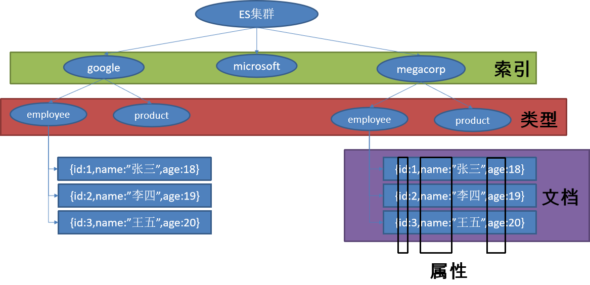

# 简介
目前对于检索功能比较有名的服务是我们常见的elasticsearch，所以我们这一节的重点，也是针对elasticsearch的使用。

应用程序经常需要添加检索功能，开源的 ElasticSearch 是目前全文搜索引擎的首选。他可以快速的存储、搜索和分析海量数据。Spring Boot通过整合Spring Data ElasticSearch为我们提供了非常便捷的检索功能支持；

Elasticsearch是一个分布式搜索服务，提供Restful API，底层基于*Lucene*，采用多shard（分片）的方式保证数据安全，并且提供自动resharding的功能，维基百科、github等大型的站点也是采用了ElasticSearch作为其搜索服务。

## 概念
以员工文档形式存储为例：一个文档代表一个员工数据。存储数据到ElasticSearch的行为叫做索引，但在索引一个文档之前，需要确定将文档存储在哪里。

一个ElasticSearch集群可以包含多个索引，相应的每个索引可以包含多个类型。这些不同的类型存储着多个文档，每个文档又有多个属性。我们可以将其和我们常用的关系数据库概念进行类比：
* 索引-数据库
* 类型-表
* 文档-表中的记录
* 属性-列




> 有关ES更多的信息请参考官方文档，一定要先了解其内容，才能更好的使用ES。


# 安装基本环境

1、拉取镜像

``` shell
docker pull registry.docker-cn.com/library/elasticsearch
```
2、限制内存启动（如果你的内存不够大的话）
``` shell
docker run -e ES_JAVA_OPTS="-Xms256m -Xmx256m" -d -p 9200:9200 -p 9300:9300 --name es01 镜像id
```

> ES是使用java编写的服务，默认启动下会占用2G的内存，如果你的服务器配置不太够的话，推荐使用自定义配置：-Xms是初始的堆内存大小，-Xms是最大使用的堆内存大小。

> -d代表后台运行 -p代表端口映射，ES默认使用两个端口9200和9300，镜像id可以通过docker images命令查看。

> 真正在运用中关于elasticsearch服务肯定需要特殊的维护的，一般不会这么随意。当然，我们这里只是测试，但是如果您要将其运用到实际的生产环境中，还要多去了解一些相关的知识。

运行命令后，我们访问浏览器:服务器IP:9200，能够得到ES的返回数据说明启动成功了。
``` json
{
  "name" : "jAQflp4",
  "cluster_name" : "docker-cluster",
  "cluster_uuid" : "d9_vBcTfSS-2CBrL9DdCpw",
  "version" : {
    "number" : "6.5.3",
    "build_flavor" : "default",
    "build_type" : "tar",
    "build_hash" : "159a78a",
    "build_date" : "2018-12-06T20:11:28.826501Z",
    "build_snapshot" : false,
    "lucene_version" : "7.5.0",
    "minimum_wire_compatibility_version" : "5.6.0",
    "minimum_index_compatibility_version" : "5.0.0"
  },
  "tagline" : "You Know, for Search"
}
```

# SpringBoot集成elasticsearch
## 创建项目
同样适用springbootinitializer创建项目，选择web模块以及NoSql的elasticsearch模块，完成创建，可以看见，springboot为我们引入的elasticsearch启动器pom如下：
##### pom.xml
``` xml
        <dependency>
            <groupId>org.springframework.boot</groupId>
            <artifactId>spring-boot-starter-data-elasticsearch</artifactId>
        </dependency>
```
spring boot默认使用spring-data-elasticsearch来进行操作的。

## 自动配置原理
通过查看源码我们可以知道，springboot默认使用两种技术来和ES交互：
* jest 默认情况下不生效，需要导入jest的工具包io.searchbox.client.JestClien，生效之后可以使用JestClient进行ES交互；
* springData elasticsearch
我们还是看springData elasticsearch的方式。
先看他的自动配置类
##### org.springframework.boot.autoconfigure.data.elasticsearch
``` java 
package org.springframework.boot.autoconfigure.data.elasticsearch;

import java.util.Properties;

import org.elasticsearch.client.Client;
import org.elasticsearch.client.transport.TransportClient;

import org.springframework.boot.autoconfigure.condition.ConditionalOnClass;
import org.springframework.boot.autoconfigure.condition.ConditionalOnMissingBean;
import org.springframework.boot.autoconfigure.condition.ConditionalOnProperty;
import org.springframework.boot.context.properties.EnableConfigurationProperties;
import org.springframework.context.annotation.Bean;
import org.springframework.context.annotation.Configuration;
import org.springframework.data.elasticsearch.client.TransportClientFactoryBean;

/**
 * {@link org.springframework.boot.autoconfigure.EnableAutoConfiguration
 * Auto-configuration} for Elasticsearch.
 *
 * @author Artur Konczak
 * @author Mohsin Husen
 * @author Andy Wilkinson
 * @since 1.1.0
 */
@Configuration
@ConditionalOnClass({ Client.class, TransportClientFactoryBean.class })
@ConditionalOnProperty(prefix = "spring.data.elasticsearch", name = "cluster-nodes", matchIfMissing = false)
@EnableConfigurationProperties(ElasticsearchProperties.class)
public class ElasticsearchAutoConfiguration {

	private final ElasticsearchProperties properties;

	public ElasticsearchAutoConfiguration(ElasticsearchProperties properties) {
		this.properties = properties;
	}

	@Bean
	@ConditionalOnMissingBean
	public TransportClient elasticsearchClient() throws Exception {
		TransportClientFactoryBean factory = new TransportClientFactoryBean();
		factory.setClusterNodes(this.properties.getClusterNodes());
		factory.setProperties(createProperties());
		factory.afterPropertiesSet();
		return factory.getObject();
	}

	private Properties createProperties() {
		Properties properties = new Properties();
		properties.put("cluster.name", this.properties.getClusterName());
		properties.putAll(this.properties.getProperties());
		return properties;
	}

}

```

再来看其配置属性类:
##### org.springframework.boot.autoconfigure.data.ElasticsearchProperties
``` java
/*
 * Copyright 2012-2017 the original author or authors.
 *
 * Licensed under the Apache License, Version 2.0 (the "License");
 * you may not use this file except in compliance with the License.
 * You may obtain a copy of the License at
 *
 *      http://www.apache.org/licenses/LICENSE-2.0
 *
 * Unless required by applicable law or agreed to in writing, software
 * distributed under the License is distributed on an "AS IS" BASIS,
 * WITHOUT WARRANTIES OR CONDITIONS OF ANY KIND, either express or implied.
 * See the License for the specific language governing permissions and
 * limitations under the License.
 */

package org.springframework.boot.autoconfigure.data.elasticsearch;

import java.util.HashMap;
import java.util.Map;

import org.springframework.boot.context.properties.ConfigurationProperties;

/**
 * Configuration properties for Elasticsearch.
 *
 * @author Artur Konczak
 * @author Mohsin Husen
 * @since 1.1.0
 */
@ConfigurationProperties(prefix = "spring.data.elasticsearch")
public class ElasticsearchProperties {

	/**
	 * Elasticsearch cluster name.
	 */
	private String clusterName = "elasticsearch";

	/**
	 * Comma-separated list of cluster node addresses.
	 */
	private String clusterNodes;

	/**
	 * Additional properties used to configure the client.
	 */
	private Map<String, String> properties = new HashMap<>();

	public String getClusterName() {
		return this.clusterName;
	}

	public void setClusterName(String clusterName) {
		this.clusterName = clusterName;
	}

	public String getClusterNodes() {
		return this.clusterNodes;
	}

	public void setClusterNodes(String clusterNodes) {
		this.clusterNodes = clusterNodes;
	}

	public Map<String, String> getProperties() {
		return this.properties;
	}

	public void setProperties(Map<String, String> properties) {
		this.properties = properties;
	}
}
```
我们可以得出：
1. 需要配置clusterName、clusterNodes；
2. 通过ElasticsearchTemplate操作ES
3. ElasticsearchRepositoriesRegistrar类似JPA的结构一样的操作ES的方式；

# 测试Jest方式操作ES
1. 导入jest关联包 

前面提到，要操作ES的话需要预先导入JEST包，去到maven网站查看jest包有很多版本，我们可以通过访问自己的ES网站查看ES的大版本号，例如我的系统安装的ES，访问IP:9200得到如下的反馈:
``` json
{
  "name" : "jAQflp4",
  "cluster_name" : "docker-cluster",
  "cluster_uuid" : "d9_vBcTfSS-2CBrL9DdCpw",
  "version" : {
    "number" : "6.5.3",
    "build_flavor" : "default",
    "build_type" : "tar",
    "build_hash" : "159a78a",
    "build_date" : "2018-12-06T20:11:28.826501Z",
    "build_snapshot" : false,
    "lucene_version" : "7.5.0",
    "minimum_wire_compatibility_version" : "5.6.0",
    "minimum_index_compatibility_version" : "5.0.0"
  },
  "tagline" : "You Know, for Search"
}
```
version.number为6.5.3，因此我们下载6.x版本的jest，导入pom如下:
##### pom.xml
``` xml
<!-- https://mvnrepository.com/artifact/io.searchbox/jest -->
<dependency>
    <groupId>io.searchbox</groupId>
    <artifactId>jest</artifactId>
    <version>6.3.1</version>
</dependency>
```

2. 查看jest自动配置类
注意jest是位于elasticsearch自动配置包中


##### org.springframework.boot.autoconfigure.elasticsearch.jest.JestProperties
``` java
/*
 * Copyright 2012-2017 the original author or authors.
 *
 * Licensed under the Apache License, Version 2.0 (the "License");
 * you may not use this file except in compliance with the License.
 * You may obtain a copy of the License at
 *
 *      http://www.apache.org/licenses/LICENSE-2.0
 *
 * Unless required by applicable law or agreed to in writing, software
 * distributed under the License is distributed on an "AS IS" BASIS,
 * WITHOUT WARRANTIES OR CONDITIONS OF ANY KIND, either express or implied.
 * See the License for the specific language governing permissions and
 * limitations under the License.
 */

package org.springframework.boot.autoconfigure.elasticsearch.jest;

import java.time.Duration;
import java.util.ArrayList;
import java.util.Collections;
import java.util.List;

import org.springframework.boot.context.properties.ConfigurationProperties;

/**
 * Configuration properties for Jest.
 *
 * @author Stephane Nicoll
 * @since 1.4.0
 */
@ConfigurationProperties(prefix = "spring.elasticsearch.jest")
public class JestProperties {

	/**
	 * Comma-separated list of the Elasticsearch instances to use.
	 */
	private List<String> uris = new ArrayList<>(
			Collections.singletonList("http://localhost:9200"));

	/**
	 * Login username.
	 */
	private String username;

	/**
	 * Login password.
	 */
	private String password;

	/**
	 * Whether to enable connection requests from multiple execution threads.
	 */
	private boolean multiThreaded = true;

	/**
	 * Connection timeout.
	 */
	private Duration connectionTimeout = Duration.ofSeconds(3);

	/**
	 * Read timeout.
	 */
	private Duration readTimeout = Duration.ofSeconds(3);

	/**
	 * Proxy settings.
	 */
	private final Proxy proxy = new Proxy();

	public List<String> getUris() {
		return this.uris;
	}

	public void setUris(List<String> uris) {
		this.uris = uris;
	}

	public String getUsername() {
		return this.username;
	}

	public void setUsername(String username) {
		this.username = username;
	}

	public String getPassword() {
		return this.password;
	}

	public void setPassword(String password) {
		this.password = password;
	}

	public boolean isMultiThreaded() {
		return this.multiThreaded;
	}

	public void setMultiThreaded(boolean multiThreaded) {
		this.multiThreaded = multiThreaded;
	}

	public Duration getConnectionTimeout() {
		return this.connectionTimeout;
	}

	public void setConnectionTimeout(Duration connectionTimeout) {
		this.connectionTimeout = connectionTimeout;
	}

	public Duration getReadTimeout() {
		return this.readTimeout;
	}

	public void setReadTimeout(Duration readTimeout) {
		this.readTimeout = readTimeout;
	}

	public Proxy getProxy() {
		return this.proxy;
	}

	public static class Proxy {

		/**
		 * Proxy host the HTTP client should use.
		 */
		private String host;

		/**
		 * Proxy port the HTTP client should use.
		 */
		private Integer port;

		public String getHost() {
			return this.host;
		}

		public void setHost(String host) {
			this.host = host;
		}

		public Integer getPort() {
			return this.port;
		}

		public void setPort(Integer port) {
			this.port = port;
		}

	}

}
```
可以获取到我们可以配置的内容。

3. 配置JEST相关参数
##### application.yml
``` yml
spring:
  elasticsearch:
    jest:
      uris: http://10.21.1.47:9200
```

4. 插入文档

先创建一个bean来辅助测试
##### bean/Article.class
``` java
package com.zhaoyi.elastic.bean;

import io.searchbox.annotations.JestId;

public class Article {
    @JestId
    private Integer id;
    private String author;
    private String title;
    private String content;

    public Integer getId() {
        return id;
    }

    public void setId(Integer id) {
        this.id = id;
    }

    public String getAuthor() {
        return author;
    }

    public void setAuthor(String author) {
        this.author = author;
    }

    public String getTitle() {
        return title;
    }

    public void setTitle(String title) {
        this.title = title;
    }

    public String getContent() {
        return content;
    }

    public void setContent(String content) {
        this.content = content;
    }
}
```
一个传统的javabean，同时别忘了为其id字段标准@JestId注解。

接下来我们编写测试类，测试与ES之间的交互。
##### Test.class
``` java

    @Autowired
    private JestClient jestClient;

    @Test
    public void jestIndexTest() {
        // 在ES中保存一个文档
        Article article = new Article(1, "渡航", "我的青春恋爱物语果然有问题", "是轻小说家渡航著作...");
        // 构建一个索引功能
        Index build = new Index.Builder(article).index("joyblack").type("article").build();
        try {
            // 执行操作
            jestClient.execute(build);
        } catch (IOException e) {
            e.printStackTrace();
        }
    }

```

我们在postman或者浏览器中输入地址：
IP:9200/joyblack/article/1，就可以查看到新插入的文档信息：

``` json
{
    "_index": "joyblack",
    "_type": "article",
    "_id": "1",
    "_version": 1,
    "found": true,
    "_source": {
        "id": 1,
        "author": "渡航",
        "title": "我的青春恋爱物语果然有问题",
        "content": "是轻小说家渡航著作..."
    }
}
```

我们可以修改插入article的信息，多插入几条article数据到ES中，方便我们解析来测试查询操作


5. 查找文档

现在查看我们的索引joyblack的文档类型article中，有如下3条数据：
``` json
{
    "took": 4,
    "timed_out": false,
    "_shards": {
        "total": 5,
        "successful": 5,
        "skipped": 0,
        "failed": 0
    },
    "hits": {
        "total": 3,
        "max_score": 1,
        "hits": [
            {
                "_index": "joyblack",
                "_type": "article",
                "_id": "2",
                "_score": 1,
                "_source": {
                    "id": 2,
                    "author": "伏见司",
                    "title": "我的妹妹哪有这么可爱",
                    "content": "是日本轻小说家伏见司创作..."
                }
            },
            {
                "_index": "joyblack",
                "_type": "article",
                "_id": "1",
                "_score": 1,
                "_source": {
                    "id": 1,
                    "author": "渡航",
                    "title": "我的青春恋爱物语果然有问题",
                    "content": "是轻小说家渡航著作..."
                }
            },
            {
                "_index": "joyblack",
                "_type": "article",
                "_id": "3",
                "_score": 1,
                "_source": {
                    "id": 3,
                    "author": "南怀瑾",
                    "title": "论语别裁",
                    "content": "是2005年复旦大学出版社出版书籍，作者南怀瑾..."
                }
            }
        ]
    }
}
```

我们来搜索作为为杜航的文档信息:

``` java
@Test
package com.zhaoyi.elastic;

import com.zhaoyi.elastic.bean.Article;
import io.searchbox.client.JestClient;
import io.searchbox.core.Index;
import io.searchbox.core.Search;
import io.searchbox.core.SearchResult;
import org.junit.Test;
import org.junit.runner.RunWith;
import org.springframework.beans.factory.annotation.Autowired;
import org.springframework.boot.test.context.SpringBootTest;
import org.springframework.test.context.junit4.SpringRunner;

import java.io.IOException;

@RunWith(SpringRunner.class)
@SpringBootTest
public class ElasticApplicationTests {

    private static String index = "joyblack";
    private static String type = "article";
    @Autowired
    private JestClient jestClient;

    @Test
    public void jestIndexTest() {
        // 在ES中保存一个文档
        Article article = new Article(4, "hawking", "时间简史", "是英国物理学家斯蒂芬·威廉·霍金创作的科学著作...");
        // 构建一个索引功能
        Index build = new Index.Builder(article).index(index).type(type).build();
        try {
            // 执行操作
            jestClient.execute(build);
        } catch (IOException e) {
            e.printStackTrace();
        }
    }

    @Test
    public void jestSearchTest(){
        String query = "{\n" +
                "\t\"query\":{\n" +
                "\t\t\"match\":{\n" +
                "\t\t\t\"author\": \"杜航\"\n" +
                "\t\t}\n" +
                "\t}\n" +
                "\t\n" +
                "}";

        // 构建搜索功能
        Search build = new Search.Builder(query).addIndex(index).addType(type).build();

        try {
            SearchResult result = jestClient.execute(build);
            System.out.println(result.getJsonString());
        } catch (IOException e) {
            e.printStackTrace();
        }
    }

}

```
可以得到输出结果:
``` json
{"took":4,"timed_out":false,"_shards":{"total":5,"successful":5,"skipped":0,"failed":0},"hits":{"total":1,"max_score":0.2876821,"hits":[{"_index":"joyblack","_type":"article","_id":"1","_score":0.2876821,"_source":{"id":1,"author":"渡航","title":"我的青春恋爱物语果然有问题","content":"是轻小说家渡航著作..."}}]}}
```

> 如果你使用term方式查询的话，请注意“杜航”这样的汉语在索引内部是分为两部分的“杜”和“航”，所以会查询不到。


其他的操作方式可以参考：[GitHub Jest项目地址](https://github.com/joyblack/Jest)

# SpringData方式操作ES
先复习一下我们之间总结的关于使用springdata方式操作ES的内容：
1. 需要配置clusterName、clusterNodes；
2. 通过ElasticsearchTemplate操作ES
3. ElasticsearchRepositoriesRegistrar类似JPA的结构一样的操作ES的方式；

因此，我们开始学习使用springdata操作ES。访问9200获取ES服务的信息:
``` json
{
  "name" : "jAQflp4",
  "cluster_name" : "docker-cluster",
  "cluster_uuid" : "d9_vBcTfSS-2CBrL9DdCpw",
  "version" : {
    "number" : "6.5.3",
    "build_flavor" : "default",
    "build_type" : "tar",
    "build_hash" : "159a78a",
    "build_date" : "2018-12-06T20:11:28.826501Z",
    "build_snapshot" : false,
    "lucene_version" : "7.5.0",
    "minimum_wire_compatibility_version" : "5.6.0",
    "minimum_index_compatibility_version" : "5.0.0"
  },
  "tagline" : "You Know, for Search"
}
```
1. 根据返回信息配置springdata相关信息
##### application.yml
``` yml
spring:
  data:
    elasticsearch:
      cluster-name: docker-cluster
      cluster-nodes: 10.21.1.47:9300
```

> 如果使用docker安装的ES，则集群名字默认为docker-cluster，如果使用linux直接安装ES，默认为ES，这些都可以通过ES的配置文件进行修改。

如果你配置之后运行提示超时错误，请查看springboot为我们引入的elasticsearch组件的版本号和你所安装的es服务的版本是否适配，适配表格如下（可以从官方查找到）[查询网址](https://github.com/spring-projects/spring-data-elasticsearch)
|||
|-|-|
|spring data elasticsearch|	elasticsearch|
|3.2.x|	6.5.0|
|3.1.x	|6.2.2|
|3.0.x|	5.5.0|
|2.1.x|	2.4.0|
|2.0.x|	2.2.0|
|1.3.x	|1.5.2|
|||
参考该版本关系修改您的适配关系。

> 我使用的是2.x版本的springboot版本，没有遇到上述问题，1.x版本需要做一些调整：升级springboot版本或者安装低版本的elasticsearch版本

> 注意使用spring data使用的是9300端口。9300是tcp通讯端口，集群间和TCPClient使用该端口；9200是http协议的RESTful接口，我们前面使用的jest使用的就是9200。


2. 编写bean对象Book

##### bean/Book.class
``` java
package com.zhaoyi.elastic.bean;


import org.springframework.data.elasticsearch.annotations.Document;

@Document(indexName = "joyblack", type = "book")
public class Book {
    private Integer id;
    private String author;
    private String title;
    private String content;


    public Book() {
    }

    public Book(Integer id, String author, String title, String content) {
        this.id = id;
        this.author = author;
        this.title = title;
        this.content = content;
    }

    public Integer getId() {
        return id;
    }

    public void setId(Integer id) {
        this.id = id;
    }

    public String getAuthor() {
        return author;
    }

    public void setAuthor(String author) {
        this.author = author;
    }

    public String getTitle() {
        return title;
    }

    public void setTitle(String title) {
        this.title = title;
    }

    public String getContent() {
        return content;
    }

    public void setContent(String content) {
        this.content = content;
    }

    @Override
    public String toString() {
        return "Book{" +
                "id=" + id +
                ", author='" + author + '\'' +
                ", title='" + title + '\'' +
                ", content='" + content + '\'' +
                '}';
    }
}
```

> 可以看到我们这里用了joyblack做索引，并且使用book作为type，如果你之前在joyblack里做了其他的类型，请预先删除，因此高版本的ES只允许index type一对一存在，否则会报Rejecting mapping update to [索引] as the final mapping would have more than 1 type: [原type, 多余的type].

> 要么删除之前的index，要么复用之前的index.注意高版本不支持删除type，只允许删除index。
##### 删除索引
``` java
    @Autowired
    ElasticsearchTemplate elasticsearchTemplate;

    @Test
    public void deleteTest(){
        elasticsearchTemplate.deleteIndex("joyblack");
    }
```

创建一个repository对象
##### repository/BookRepository.class
``` java
package com.zhaoyi.elastic.repository;

import com.zhaoyi.elastic.bean.Book;
import org.springframework.data.elasticsearch.repository.ElasticsearchRepository;
public interface BookRepository extends ElasticsearchRepository<Book, Integer> {
}

```
其基本理念和我们之前讲springdata的时候已经说明过，现在就不在阐述，我们直接进行测试：

3. 测试插入数据
``` java
    @Autowired
    BookRepository bookRepository;
    @Test
    public void insertTest(){
        Book book = new Book(4, "弗洛伊德", "梦的解析", "是弗洛伊德创作的哲学著作...");
        bookRepository.index(book);
    }
```
可以看到，ES中已经按需插入了数据
``` json
{
    "took": 2,
    "timed_out": false,
    "_shards": {
        "total": 5,
        "successful": 5,
        "skipped": 0,
        "failed": 0
    },
    "hits": {
        "total": 1,
        "max_score": 1,
        "hits": [
            {
                "_index": "joyblack",
                "_type": "book",
                "_id": "4",
                "_score": 1,
                "_source": {
                    "id": 4,
                    "author": "弗洛伊德",
                    "title": "梦的解析",
                    "content": "是弗洛伊德创作的哲学著作..."
                }
            }
        ]
    }
}
```

4. 批量插入
我们多将几本书的数据批量插入到ES中:
``` java
    @Autowired
    BookRepository bookRepository;
   @Test
    public void testInsertBatch(){
        List<Book> books = Arrays.asList(
                new Book(1, "十文字青", "灰与幻想的格林姆迦尔", "为日本轻小说作家十文字青著作..."),
                new Book(2, "长月达平", "Re：从零开始的异世界生活", "是弗洛伊德创作的哲学著作..."),
                new Book(3, "贵志祐介", "来自新世界", "根据贵志祐介原作同名小说改编的动画作品...")
        );
        books.parallelStream().forEach(b -> bookRepository.index(b));
    }
```

> 这只是业务代码层面的批量，更多的批量研究请慎入了解哦。

5. 查询数据
[参考资料](https://docs.spring.io/spring-data/elasticsearch/docs/current/reference/html/#elasticsearch.repositories)
有一个对应表格。

我们先自定义一个查询方法:
##### repository
``` java
package com.zhaoyi.elastic.repository;

import com.zhaoyi.elastic.bean.Book;
import org.springframework.data.elasticsearch.repository.ElasticsearchRepository;

import java.util.List;


public interface BookRepository extends ElasticsearchRepository<Book, Integer> {
    List<Book> findBookByTitle(String name);
}
```

接下里使用该查询方法查询title包含来自新世界的书籍信息:
##### Test.class
``` java
@Test
    public void searchTest(){
        System.out.println(bookRepository.findBookByTitle("来自新世界"));
    }
```
得到反馈:
```
[Book{id=3, author='贵志祐介', title='来自新世界', content='根据贵志祐介原作同名小说改编的动画作品...'}]
```

当然，我们也可以使用注解的方式来自定义查询方法，具体的用法有些许不同，就需要我们自己去查阅官方文档慢慢理解了。


