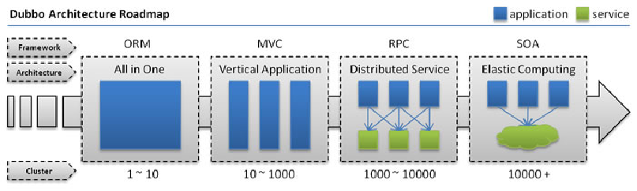
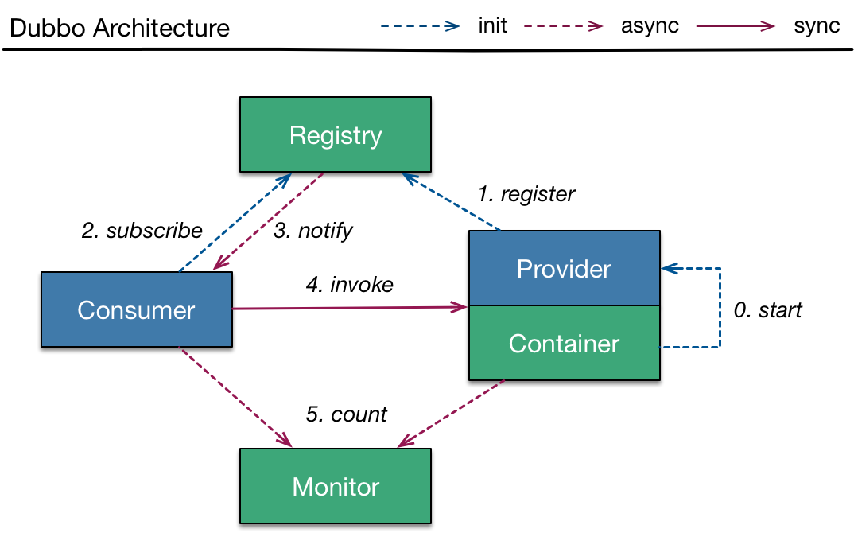

# 简介

在本章节你可以学习到：
1. dubbo和zookeeper的基本特性
2. 一个简单的集成项目
3. zookeeper可视化工具和dubbo可视化工具
4. 分布式和集群的特点

分布式系统（distributed system）是建立在网络之上的软件系统。正是因为软件的特性，所以分布式系统具有高度的内聚性和透明性。因此，网络和分布式系统之间的区别更多的在于高层软件（特别是操作系统），而不是硬件。

在分布式系统中，国内常用zookeeper+dubbo组合，而Spring Boot推荐使用全栈的Spring，Spring Boot+Spring Cloud。

分布式系统可以用下图直观的表示



> 分布式系统是若干独立计算机的集合，这计算机对用户来说就像单个相关系统。

* 单一应用架构

当网站流量很小时，只需一个应用，将所有功能都部署在一起，以减少部署节点和成本。此时，用于简化增删改查工作量的数据访问框架(ORM)是关键。
* 垂直应用架构

当访问量逐渐增大，单一应用增加机器带来的加速度越来越小，将应用拆成互不相干的几个应用，以提升效率。此时，用于加速前端页面开发的Web框架(MVC)是关键。
* 分布式服务架构

当垂直应用越来越多，应用之间交互不可避免，将核心业务抽取出来，作为独立的服务，逐渐形成稳定的服务中心，使前端应用能更快速的响应多变的市场需求。此时，用于提高业务复用及整合的分布式服务框架(RPC)是关键。
* 流动计算架构

当服务越来越多，容量的评估，小服务资源的浪费等问题逐渐显现，此时需增加一个调度中心基于访问压力实时管理集群容量，提高集群利用率。此时，用于提高机器利用率的资源调度和治理中心(SOA)是关键。

## 分布式和集群的区别 
* 集群是解决高可用的，而分布式是解决高性能、高并发的。
* 集群是个物理形态，分布式是个工作方式。
* 只要是一堆机器，就可以叫集群，他们是不是一起协作着干活，这个谁也不知道；一个程序或系统，只要运行在不同的机器上，就可以叫分布式。
* 集群一般是物理集中、统一管理的，而分布式系统则不强调这一点。

# Zookeeper和Dubbo
## ZooKeeper（注册中心）
ZooKeeper 是一个分布式的，开放源码的分布式应用程序协调服务。它是一个为分布式应用提供一致性服务的软件，提供的功能包括：配置维护、域名服务、分布式同步、组服务等。
## Dubbo(分布式服务的调用框架)
Dubbo是Alibaba开源的分布式服务框架，它最大的特点是按照分层的方式来架构，使用这种方式可以使各个层之间解耦合（或者最大限度地松耦合）。从服务模型的角度来看，Dubbo采用的是一种非常简单的模型，要么是提供方提供服务，要么是消费方消费服务，所以基于这一点可以抽象出服务提供方（Provider）和服务消费方（Consumer）两个角色。
 
### Duboo工作图



# 安装Zookeeper
1. ` docker pull zookeeper`
2. 启动zookeeper。我们只开放2181端口即可，不做集群，也不做选举，因此另外2个端口不予映射
```
docker run --name zk01 -p 2181:2181 --restart always -d d6f23d89fbee
```

> d6f23d89fbee是zookeeper的镜像ID，通过docker images查看你自己的镜像id。

# 集成Zookeeper、Duboo

## 注册服务（provider）
注册应用的过程大致如下：
1. 引入duboo和zookeeper的相关依赖
``` xml
<dependency>
            <groupId>org.apache.curator</groupId>
            <artifactId>curator-framework</artifactId>
            <version>2.12.0</version>
        </dependency>

        <dependency>
            <groupId>com.alibaba.boot</groupId>
            <artifactId>dubbo-spring-boot-starter</artifactId>
            <version>0.2.1-SNAPSHOT</version>
        </dependency>

        <dependency>
            <groupId>com.zhaoyi</groupId>
            <artifactId>provider-ticket</artifactId>
            <version>0.0.1-SNAPSHOT</version>
        </dependency>

        <!-- Dubbo -->
        <dependency>
            <groupId>com.alibaba</groupId>
            <artifactId>dubbo</artifactId>
            <version>2.6.5</version>
        </dependency>
        <!-- Spring Context Extras -->
        <dependency>
            <groupId>com.alibaba.spring</groupId>
            <artifactId>spring-context-support</artifactId>
            <version>1.0.2</version>
        </dependency>

        <!-- https://mvnrepository.com/artifact/com.101tec/zkclient -->
        <dependency>
            <groupId>com.101tec</groupId>
            <artifactId>zkclient</artifactId>
            <version>0.10</version>
        </dependency>
```
> 注意，zkclient请根据zookeeper版本进行适配，当前有0.11版本，但我使用之后经常会出现连接中断的情况，即`connnectionLoss`，如果您也遇到类似的问题，不妨换0.10版本的zkclient.

> curator-framework是高版本的dubbo需要的一个依赖。


2. 配置dubood的扫描包和中心地址，注意消费者模块也会配置应用id，不要与此处相同即可。
``` application.properties
# 当前应用的名字
dubbo.application.name=provider-ticket
# 注册中心的地址
dubbo.registry.address=zookeeper://10.21.1.47:2181
# 哪个包
dubbo.scan.base-packages=com.zhaoyi.providerticket.service
```
> dubbo也提供了默认的注册服务，我们这样做会覆盖到默认的服务，详情参考github官方文档。

3. 使用@service发布服务
``` java
// 接口类
package com.zhaoyi.providerticket.service;

public interface TicketService {
    public String getTicket();
}

```
``` java
// 服务类
package com.zhaoyi.providerticket.service;

import com.alibaba.dubbo.config.annotation.Service;
import org.springframework.stereotype.Component;

@Service
@Component
// 将服务发布出去
public class TicketServiceImpl implements TicketService {
    @Override
    public String getTicket(){
        return "《sword art online!》";
    }
}
```

> 注意此处的`@service`是dubbo包的注解，而不是spring的。


## 消费服务(consumer)
1. 引入相关依赖
``` xml
<dependency>
            <groupId>org.apache.curator</groupId>
            <artifactId>curator-framework</artifactId>
            <version>2.12.0</version>
        </dependency>

        <dependency>
            <groupId>com.alibaba.boot</groupId>
            <artifactId>dubbo-spring-boot-starter</artifactId>
            <version>0.2.1-SNAPSHOT</version>
        </dependency>

        <dependency>
            <groupId>com.zhaoyi</groupId>
            <artifactId>provider-ticket</artifactId>
            <version>0.0.1-SNAPSHOT</version>
        </dependency>

        <!-- Dubbo -->
        <dependency>
            <groupId>com.alibaba</groupId>
            <artifactId>dubbo</artifactId>
            <version>2.6.5</version>
        </dependency>
        <!-- Spring Context Extras -->
        <dependency>
            <groupId>com.alibaba.spring</groupId>
            <artifactId>spring-context-support</artifactId>
            <version>1.0.2</version>
        </dependency>

        <!-- https://mvnrepository.com/artifact/com.101tec/zkclient -->
        <dependency>
            <groupId>com.101tec</groupId>
            <artifactId>zkclient</artifactId>
            <version>0.10</version>
        </dependency>
        <!-- 引入服务类坐标 -->
           <dependency>
            <groupId>com.zhaoyi</groupId>
            <artifactId>provider-ticket</artifactId>
            <version>0.0.1-SNAPSHOT</version>
        </dependency>
```
> 相信您学过maven 的相关知识，这两个模块的公共部分你也可以抽取到parent中编写。

> 这里，我们引入provider的坐标，这样就可以直接使用其服务类提供的便利了。


2. 配置zookeeper注册中心地址
``` 
dubbo.application.name=consumer-user
dubbo.registry.address=zookeeper://10.21.1.47:2181
```
3. 编写一个服务类service/UserService，我们在其中引用远程服务
``` java
package com.zhaoyi.consumeruser.service;

import com.alibaba.dubbo.config.annotation.Reference;
import com.zhaoyi.providerticket.service.TicketService;
import org.springframework.stereotype.Service;

@Service
public class UserService {
    @Reference
    TicketService ticketService;

    public String buy(){
        return ticketService.getTicket();
    }
}

```

> Reference不做任何配置的情况下，引用的是对应类路径下的服务信息。

接下来我们编写一个controller，可视化我们的服务返回结果
``` java
package com.zhaoyi.consumeruser.controller;

import com.zhaoyi.consumeruser.service.UserService;
import org.springframework.beans.factory.annotation.Autowired;
import org.springframework.web.bind.annotation.GetMapping;
import org.springframework.web.bind.annotation.RestController;

@RestController
public class HelloController {

    @Autowired
    UserService userService;

    @GetMapping("/")
    public String a(){
        return userService.buy();
    }
}

```

启动消费者服务，请确保provicer项目目前处于运行状态，访问首页，我们便可以看到返回
```
《sword art online!》
```
注册成功！

# 可视化zookeeper
很多情况下，我们需要查看我们提供的服务有哪些，比如我们测试用例中，除了查看控制台日志，我们根本无法获知，注册中心是否已经知晓或者真正的注册了provicer提供的服务信息，这时候，我们需要一个可视化服务。我们来看看比较简答的zkclient.

## zkclient
安装zkclient很简单，他其实就是一个监听zookeeper服务端口的一个网站项目，我们下面列出linux的安装步骤，在执行安装之前，确保你的Linux服务器上安装了git以及maven服务。

1. 从git克隆zkclient项目
```
git clone https://github.com/DeemOpen/zkui.git
```
2. 通过maven工具打包
```
mvn clean install
```
3. 复制根目录文件到打包目录
```
cp config.cfg target/
```
4. 修改配置信息，如果您安装zkclient的服务器和zookeeper在同一台服务器，并且zookeeper使用的服务端口是默认的2181，则无需修改:
```
vi config.cfg
```
5. 后台启动网站(zkclient)
```
nohup java -jar zkui-2.0-SNAPSHOT-jar-with-dependencies.jar > /dev/null &
```
6. 通过IP:9090（默认，你也可以从配置文件中修改此端口号）就可以访问到zkclient服务网站了。

## dubbo-admin
相比较dubbo-admin，zkclient做的就比较简陋了。dubbo 2.6版本以后不在支持，查看官方文档是否变为Dubbo ops了

## Dubbo ops
Dubbo ops应该是dubbo-admin的后浪，我们来看看其安装方式。
1. 从git克隆zkclient项目
```
git clone https://github.com/apache/incubator-dubbo-ops.git
```
2. 通过maven工具打包
```
mvn clean install
```
> 该项目需要maven 3.1以上才可以编译成功。
3. 启动网站
```
mvn --projects dubbo-admin-backend spring-boot:run
```
访问地址：http://localhost:8080
