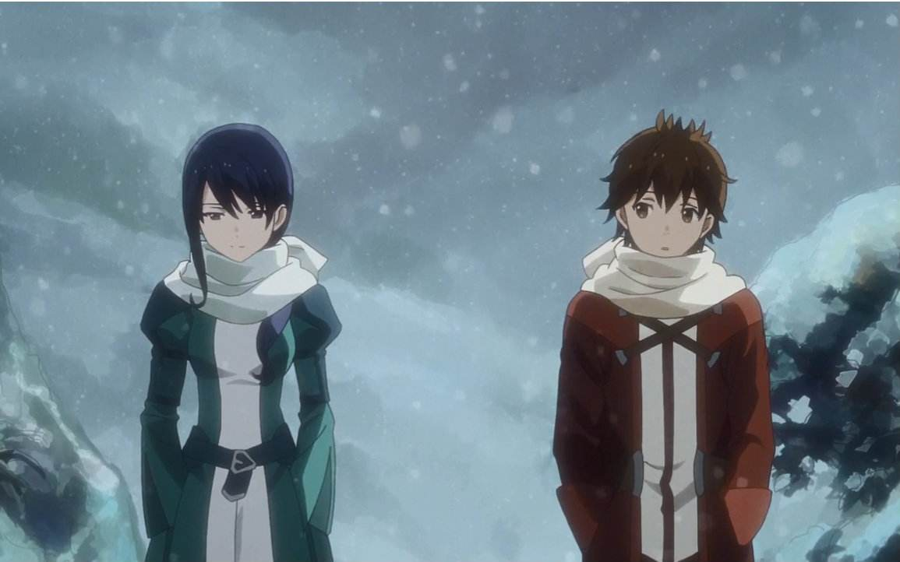

# 简介
电视动画《灰与幻想的格林姆迦尔》改编自日本轻小说家十文字青原作白井锐利插画的同名轻小说，由A-1 Pictures制作。2015年10月16日，动画官网开通，发表了其TV动画化的决定。电视动画于2016年1月10日开始播出。中国大陆由bilibili和爱奇艺于2018年06月20日正版发布。
动漫大致走了原小说两卷的剧情，作为满心期待第二季的小小看客，很可惜时隔两年了依然没有音讯。究其原因，据说是由于BD销量比较差强人意，虽然不至于很惨淡，却也没有像一颗深水炸弹般获得反响，也许是其风格并不符合当前有关”异世界“类型作品的热潮吧。

# 剧情
身为男主角之一的哈尔希洛从一片黑暗中醒来，周围是数名与自己境遇相同的男女。他们一同从黑暗中踏出，前方展开的是未曾见过的，名为「格林姆迦尔」的世界。记忆、金钱、特别的力量——什么都没有的的现实里，他们渐渐认识到：生存，并不简单。

很明显，这是一个关于异世界穿越、剑与魔法类型的作品。但是请注意，在这里，你可能看不到拥有开挂天赋、大杀四方的男主，你所看到的，将是一个同样有着众多人性缺点（猜忌、逃避以及推卸责任）、差点被残酷的现实（金钱、人心险恶）所打垮的男主。他畏首畏尾，所以将所有的包袱推在了名为马纳多的同伴身上；他不想承担责任，所以遇到过错，却不检讨自己，像个不成熟的孩子一样去排挤、念叨蓝德；相似的缺点，数不胜数，这就是本作品的男主角，性格虽然不糟糕，但是确实一个真真切切的、我们可以在现实中随处可见的一个人。

其他的同伴也有各种各样的毛病，从设定背景看来，他们是“精英挑选之后剩下的废柴”。所以，这行人在求生过程中将会有多艰苦、困难，可想而知。

短短的一季动漫，却将这脆弱的一行人如何成长的故事表现的淋漓精致，而且，还是慢格调，清晰、自然。

# 精彩点评
## 金钱观
异世界有金钱观吗？有，作为同类型的代表作，《为美好的世界献上祝福》《刀剑神域》《哥布林杀手》等都几乎涵盖了金钱相关的机制，甚至着重描写。在本作品中，这个概念所代表的意义则让人感到更加的深刻，你可以和主角产生这样的共鸣：如果能用钱买到装备、能生活在更好一点的地方那就好了的那种渴望。不禁让人心酸，Gars观看时甚至多次哭红了眼（该作品对氛围的烘托的真的很好，戴上耳机，沉浸其中，感受颇多），以至于不止一次的祈祷：作者帮帮男主们吧，哪怕，让他们生活在更好一点的地方也好，不要太虐了。

如果对金钱的描写仅仅是这样，那本作品也只能说在这方面可圈可点而已。但是，请观看以下男主在剧情小高潮部分的一段旁白：
> 火葬场费用为五十卡帕，墓地费也是五十卡帕，埋葬费用共计一锡巴。一个人的死，只价值少少的一锡巴。

> 没有在小丘顶埋葬马纳多，而是在半山腰处找个空位挖了个洞，埋入了裹着白布的尸骨，接着在上面摆了一块抱得动的石头。在石头上刻上名字后，再雕饰上代表义勇兵的新月纹饰，涂上红色颜料。即便只是见习者，但义勇兵就是义勇兵，马纳多的墓碑上一样刻上了红色的新月。仔细一看，四处散落的墓碑上都能见到新月符号，有的鲜红眩目，有的色泽斑剥。大量的义勇兵正沉眠在这座小丘上。耸立在小丘顶端的高塔，此时看来莫名地可恨。

读者可曾知道，这一段的独白，是在一个破破烂烂、漏洞百出的队伍失去唯一一个靠谱的马纳多之后的感怀。

他们面临着的，是失去心灵支柱后的感伤、囊中羞涩时埋葬友人的困苦以及队伍分崩离析时所要做出的觉悟，这一段话，从各个层面，将剧情带到了一定的高度，为接下来的主角成长埋下了伏笔，相信以后主角遇到困难时，也会以此来警示自己吧?事实上，的确如此。

## 现实主义
日本前几年的同类作品产出，包括这2018年的作品其实数不胜数，但似乎受到国内主流网文小说的影响，总是喜欢给主角套上特殊的光环，具备特殊的天赋能力，让其“大杀四方”，仅有的示弱，也是扮猪吃老虎的标准预兆。比如……，想了想还是不点名列举了。其实我并不认为，这些作品有什么不妥之处，甚至他们大部分在灰尔心里堪称精品，至少他们把友情、爱情以及各种价值观正向或者逆向的输出到观众群体，达到了艺术作品该有的功用。更有甚者，掺入了宗教哲学，让作品上升了不少档次。但是，请记住，物以稀为贵，正是由于这种剑与魔法标准剧情模式的泛滥，这一类的动漫题材，其实，前景并不被人看好。观众们需要新鲜的血液注入，渴望着新的模式推出，让人耳目一新。于是，另辟蹊径，未尝不是一个绝佳的解决办法，也就是打破这种陈旧的模式。如果这样做，也许并不需要费多大力气，多半会在每季新番中成为黑马，声名鹊起，独占鳌头。比如，2018年10月番《哥布林杀手》便是此例，这部动漫告诉了我们，异世界没有魔法，有的只是异常残忍的弱肉强食，没有花与剑的美丽，有的只是血与泪的昏暗——这就是现实，现实就是残酷的，可谓是对当前诸多作品的当头棒喝，加上剧情作画也堪称精品，岂有不火之理？有关此动漫，等完结之后写一篇观后感。

## 慢节奏
如果您是一个比较浮躁的人、或者喜欢慢格调的生活，那么这部番剧非常的适合您。对于前者，他是您的一剂静心良药，对于后者，他是为您精心打造的糕点。

这部动画的节奏很慢、很细，有着独一无二的写实气质，柴米油盐中的艰辛、人性之中丑陋不堪的一面等都白纸黑字的搬上了台面，丝毫不加粉饰。

如此压抑的气氛，就是为了衬托出主角走出黑暗的那一刻，若要形容那种感觉的话，我想，那无异于雨后天晴、终于考完了试或者终于完成了项目那样一般的安详。

# 音乐
GarS（愚者自称）是一个比较喜欢听音乐的人，没有专业知识，自成一派。但是对于音乐的专业知识一概不通的好处是，你可以天马行空的对其进行自以为是的评注，无需拘谨，酣畅淋漓一吐为快，不用被专业的概念束缚手脚，大可随心所欲。如果与君的想法刚好不谋而合，那只能大笑相见恨晚了！歌单请见：[灰与幻想的格林姆迦尔音乐精选歌单](https://music.163.com/#/playlist?id=995418632)

## sun will rise
sun will rise是由NIKIIE小姐演唱的插曲，对，没错，只是插曲，却是该番剧中热度最高的一首。不仅由于其婉转动听，更由于歌手那犹如暖阳般的声调，让人沐浴其中，十分的惬意。该歌曲出现的在哪里呢？贯穿了第九集的大半剧情，第九集几乎由这首歌加上幻灯片式的过场方式组成。对，你没听错，几乎！也正是由于这个原因，该番剧饱受诟病，说其制作质量不行，甚至偷工减料，借此滥竽充数，但见仁见智，在我看来，这一段无可或缺，甚至是该番剧另辟蹊径的一大成功之处。这就得联系剧情和歌曲本身的意义来阐述了，受尽千辛万苦之后，终于获得了哪怕是微不足道、却足以令众人开心的报酬，抛下了将哥布林杀死时颤抖与震撼（记住，“杀死”——在现实意义上，是一个非常沉重的词），终于可以好好的吃上一顿的满足感，在令人心酸的同时，也为后文的悲剧埋下伏笔。对于这首歌，我觉得网易云音乐的用户`见习义勇兵漫长的一天` 的评论作为结尾即可：
> 想起这样一个画面， 战士莫古索卸下铠甲在午睡 ，魔法师席赫露在桥上喂着鸟儿，暗黑骑士蓝德在小泛舟上躺着钓鱼，然后突然发现猎人梦儿攀岩的身影，盗贼的哈尔忘了自己放假的时候是怎么度过的于是随意在小镇走动到了遇到了神官的梅丽在阳台闲聊喝着咖啡

# 结语
《灰与幻想的格林姆迦尔》是一部GarS评价极高的动漫，慢节奏之上，剧情既虐人，又治愈。如果您是一位喜欢异世界题材、心思细腻特别是反感龙傲天式剧情的朋友，不妨看看此番，必然是人生一大遗憾。若是能从中获得一份安宁、一份感悟，也是一场弥足珍贵的造化。

*梅丽真美！！*
